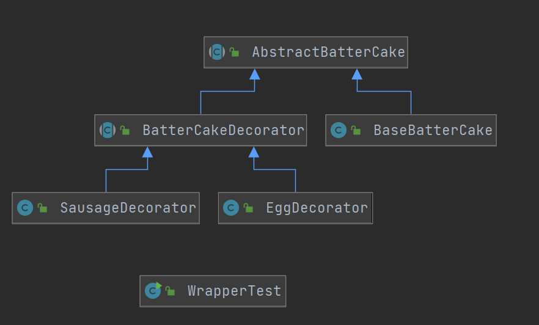

指在不改变原有对象的基础上，将功能附加到对象上，比继承更加灵活。

适用场景：

（1）扩展一个类的功能或给一个类添加附加职责；

（2）动态给一个对象添加功能，这些功能可以再动态的撤销；

在生活中，给煎饼加鸡蛋、蛋糕加水果、房子装修等都是在为对象扩展一些额外的职责。

煎饼加蛋加肠计算最终金额的案例分析：

BatterCake： 普通煎饼

```java
public class BatterCake {
    protected String getMsg() {
        return "煎饼";
    }

    public int getPrice() {
        return 5;
    }
}
```

BatterCakeWithEgg：煎饼加蛋

```java
public class BatterCakeWithEgg extends BatterCake {
    @Override
    protected String getMsg() {
        return super.getMsg() + "+1个鸡蛋";
    }

    @Override
    public int getPrice() {
        return super.getPrice() + 2;
    }
}
```

BatterCakeWithEggWithSausage：煎饼加蛋加肠

```java
public class BatterCakeWithEggWithSausage extends BatterCakeWithEgg {
    @Override
    protected String getMsg() {
        return super.getMsg() + "+1香肠";
    }

    @Override
    public int getPrice() {
        return super.getPrice() + 3;
    }
}
```

Test 测试类

```java
public class BatterCakeTest {
    public static void main(String[] args) {
        BatterCake batterCake = new BatterCake();
        System.out.println(batterCake.getMsg() + " -> 价格：" + batterCake.getPrice());

        BatterCakeWithEgg batterCakeWithEgg = new BatterCakeWithEgg();
        System.out.println(batterCakeWithEgg.getMsg() + " -> 价格：" + batterCakeWithEgg.getPrice());

        BatterCakeWithEggWithSausage batterCakeWithEggWithSausage = new BatterCakeWithEggWithSausage();
        System.out.println(batterCakeWithEggWithSausage.getMsg() + " -> 价格：" + batterCakeWithEggWithSausage.getPrice());
    }
}
```

运行结果：

```
煎饼 -> 价格：5
煎饼+1个鸡蛋 -> 价格：7
煎饼+1个鸡蛋+1香肠 -> 价格：10
```

​		结果虽然没有问题，但是如果用户需要加两个蛋一根肠的煎饼，那么是无法计算出价格的，除非在重新写一个类，如果需求再变那是不合理的。下面使用装饰者模式来解决这个问题。

AbstractBatterCake：煎饼行为抽象类

```java
public abstract class AbstractBatterCake {
    protected abstract String getMsg();
    protected abstract int getPrice();
}
```

BatterCakeDecorator：煎饼装饰者类

```java
public abstract class BatterCakeDecorator extends AbstractBatterCake{
    private AbstractBatterCake batterCake;

    public BatterCakeDecorator(AbstractBatterCake batterCake) {
        this.batterCake = batterCake;
    }

    protected abstract void doSomething();

    @Override
    protected String getMsg() {
        return this.batterCake.getMsg();
    }

    @Override
    protected int getPrice() {
        return this.batterCake.getPrice();
    }
}
```

EggDecorator：鸡蛋装饰者类

```java
public class EggDecorator extends BatterCakeDecorator {

    public EggDecorator(AbstractBatterCake batterCake) {
        super(batterCake);
    }

    @Override
    protected void doSomething() {}

    @Override
    protected String getMsg() {
        return super.getMsg() + "+1个鸡蛋";
    }

    @Override
    protected int getPrice() {
        return super.getPrice() + 2;
    }
}
```

SausageDecorator：香肠装饰者类

```java
public class SausageDecorator extends BatterCakeDecorator {
    public SausageDecorator(AbstractBatterCake batterCake) {
        super(batterCake);
    }

    @Override
    protected void doSomething() {}

    @Override
    protected String getMsg() {
        return super.getMsg() + "+1根肠";
    }

    @Override
    protected int getPrice() {
        return super.getPrice() + 3;
    }
}
```

BaseBatterCake：煎饼的基础套餐

```java
public class BaseBatterCake extends AbstractBatterCake{
    @Override
    protected String getMsg() {
        return "煎饼";
    }

    @Override
    protected int getPrice() {
        return 5;
    }
}
```

测试类

```java
public class WrapperTest {
    public static void main(String[] args) {
        AbstractBatterCake batterCake;
        // 买一个素煎饼
        batterCake = new BaseBatterCake();
        // 加个蛋
        batterCake = new EggDecorator(batterCake);
        // 加根肠
        batterCake = new SausageDecorator(batterCake);
        // 再加一个蛋
        batterCake = new EggDecorator(batterCake);
        System.out.println(batterCake.getMsg() + " -> 价格" + batterCake.getPrice());
    }
}
```

UML类图：



运行结果

```
煎饼+1个鸡蛋+1根肠+1个鸡蛋 -> 价格12
```

总结一下：

装饰者模式就像打包一个快递：

（1）主体：陶瓷、衣服

（2）包装：塑料袋、泡沫、纸板

首先分析主体和包装的公共行为，比如都具备名称和价格，那么一个行为抽象接口类；主体继承这个行为抽象类，在抽象出一个主体抽象类；主体的基类和所有的包装全部都单独继承这个主体抽象类做自己的实现。在此之后，这个主体要包怎么样的包装，使用附加的方式加上去（通过构造函数传递行为抽象类的对象实现递归），而不是通过继承来加。

