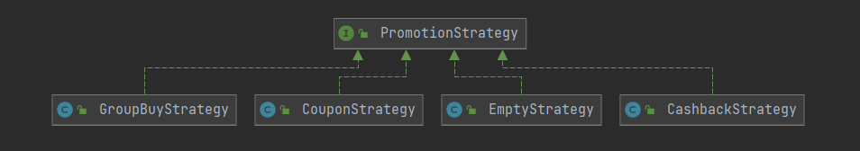

## 适用场景

1. 针对同一类型的问题有多种处理方式，仅仅是具体的行为有差别时。
2. 需要安全的封装多种同一类型的操作时。
3. 出现同一抽象类的多个子类，而又需要使用if-else来选择子类时。

## 用策略模式实现选择支付方式的业务场景

在商城系统中，常常存在多种策略的优惠活动，比如拼团、返现促销、优惠券抵扣。下面是一个模拟这个场景的demo：

促销策略的接口 PromotionStrategy：

```java
public interface PromotionStrategy {
    void doPromotion();
}
```

优惠券抵扣策略 CouponStrategy：

```java
public class CouponStrategy implements PromotionStrategy {
    @Override
    public void doPromotion() {
        System.out.println("领取优惠券，课程价格直接抵扣优惠券面值");
    }
}
```

返现促销策略 CashbackStrategy：

```java
public class CashbackStrategy implements PromotionStrategy {
    @Override
    public void doPromotion() {
        System.out.println("返现促销，返回现金到支付宝账户");
    }
}
```

拼团策略 GroupBuyStrategy：

```java
public class GroupBuyStrategy implements PromotionStrategy {
    @Override
    public void doPromotion() {
        System.out.println("拼团，满20人，全团享受团价");
    }
}
```

当然还有一个无优惠活动策略 EmptyStrategy：

```java
public class EmptyStrategy implements PromotionStrategy {
    @Override
    public void doPromotion() {
        System.out.println("无促销活动");
    }
}
```

促销活动方案类 PromotionActivity：

```java
public class PromotionActivity {
    private PromotionStrategy promotionStrategy;

    public PromotionActivity(PromotionStrategy promotionStrategy) {
        this.promotionStrategy = promotionStrategy;
    }

    public void execute() {
        promotionStrategy.doPromotion();
    }
}
```

测试类：

```java
public class PromotionTest {
    public static void main(String[] args) {
        PromotionActivity activity618 = new PromotionActivity(new CashbackStrategy());
        PromotionActivity activity1111 = new PromotionActivity(new CouponStrategy());
        activity618.execute();
        activity1111.execute();
    }
}
```

类结构



从测试类来看，一次开启了多项优惠活动，但我们通常并不会一次性执行多种优惠，所以进行改造：

```java
public class PromotionTest {
    public static void main(String[] args) {
        PromotionActivity activity = null;
        String promotionKey = "COUPON";
        if ("COUPON".equals(promotionKey)) {
            activity = new PromotionActivity(new CouponStrategy());
        } else if ("CASHBACK".equals(promotionKey)) {
            activity = new PromotionActivity(new CashbackStrategy());
        } else {
            activity = new PromotionActivity(new EmptyStrategy());
        }
        activity.execute();
    }
}
```

这样就满足了业务需求，但是随着优惠活动的增多，判断逻辑越来越复杂，编写好活动代码后需要重复测试，会大大增加工作量。那么我们可以结合工厂模式和单例模式来对此进行优化：

新增活动策略工厂类 PromotionStrategyFactory ：

```java
public class PromotionStrategyFactory {
    private static final Map<String, PromotionStrategy> PROMOTION_STRATEGY_MAP = new HashMap<>();

    private static final PromotionStrategy NON_PROMOTION = new EmptyStrategy();

    static {
        PROMOTION_STRATEGY_MAP.put(PromotionKey.COUPON, new CouponStrategy());
        PROMOTION_STRATEGY_MAP.put(PromotionKey.CASHBACK, new CashbackStrategy());
        PROMOTION_STRATEGY_MAP.put(PromotionKey.GROUPBUY, new GroupBuyStrategy());
    }

    private interface PromotionKey {
        String COUPON = "COUPON";
        String CASHBACK = "CASHBACK";
        String GROUPBUY = "GROUPBUY";
    }

    public PromotionStrategyFactory() {
    }

    public static PromotionStrategy getPromotionStrategy(String promotionKey) {
        PromotionStrategy promotionStrategy = PROMOTION_STRATEGY_MAP.get(promotionKey);
        return promotionStrategy == null ? NON_PROMOTION : promotionStrategy;
    }
}
```

测试类

```java
public class PromotionTest {
    public static void main(String[] args) {
        String promotionKey = "COUPON";
        PromotionStrategy strategy = PromotionStrategyFactory.getPromotionStrategy(promotionKey);
        PromotionActivity activity = new PromotionActivity(strategy);
        activity.execute();
    }
}
```

如此一优化，直接删除了逻辑判断，每次新增活动时都会轻松很多。再举一个支付的案例，如果对接过银联、百度收银台、京东、QQ、支付宝、微信等支付的朋友看了下面这个案例，绝对深有体会。

## 支付案例

所有的支付方式都有 名称、支付、查询余额等行为，抽取成一个支付方式的抽象类 Payment：

```java
public abstract class Payment {

    public abstract String getName();

    //通用逻辑放到抽象类里面实现
    public R pay(String uid, double amount) {
        //余额是否足够
        if (queryBalance(uid) < amount) {
            return new R(500, "支付失败", "余额不足");
        }
        return new R(200, "支付成功", "支付金额" + amount);
    }

    protected abstract double queryBalance(String uid);
}
```

R 是一个统一返回类

```java
public class R {
    private int code;
    private Object data;
    private String msg;

    public R(int code, String msg, Object data) {
        this.code = code;
        this.data = data;
        this.msg = msg;
    }

    @Override
    public String toString() {
        return "{" +
                "code=" + code +
                ", data=" + data +
                ", msg='" + msg + '\'' +
                '}';
    }
}
```

AliPay

```java
public class AliPay extends Payment {
    public String getName() {
        return "支付宝";
    }

    protected double queryBalance(String uid) {
        return 900;
    }
}
```
JDPay

```java
public class JDPay extends Payment {
    public String getName() {
        return "京东白条";
    }
    protected double queryBalance(String uid) {
        return 500;
    }
}
```
UnionPay

```java
public class UnionPay extends Payment {
    @Override
    public String getName() {
        return "银联支付";
    }
    @Override
    protected double queryBalance(String uid) {
        return 120;
    }
}
```
WeChatPay

```java
public class WeChatPay extends Payment {
    @Override
    public String getName() {
        return "微信支付";
    }
    @Override
    protected double queryBalance(String uid) {
        return 263;
    }
}
```
订单类 Order
```java
public class Order {
    private String uid;
    private String orderId;
    private double amount;

    public Order(String uid, String orderId, double amount) {
        this.uid = uid;
        this.orderId = orderId;
        this.amount = amount;
    }

    public R pay() {
        return pay(PayStrategy.DEFAULT_PAY);
    }

    // 完美解决 if...else 或者 switch
    public R pay(String payKey) {
        Payment payment = PayStrategy.get(payKey);
        System.out.println("欢迎使用" + payment.getName());
        System.out.println("本次交易金额为" + amount + "，开始扣款");
        return payment.pay(uid, amount);
    }
}
```

PayStrategy

```java
import java.util.HashMap;
import java.util.Map;

public class PayStrategy {
    public static final String ALI_PAY = "AliPay";
    public static final String JD_PAY = "JdPay";
    public static final String WECHAT_PAY = "WeChatPay";
    public static final String UNION_PAY = "UnionPay";
    public static final String DEFAULT_PAY = ALI_PAY;

    private static Map<String, Payment> strategy = new HashMap<String, Payment>();

    static {
        strategy.put(ALI_PAY, new AliPay());
        strategy.put(JD_PAY, new JDPay());
        strategy.put(WECHAT_PAY, new WeChatPay());
        strategy.put(UNION_PAY, new UnionPay());
    }

    public static Payment get(String payKey) {
        if (!strategy.containsKey(payKey)) {
            return strategy.get(DEFAULT_PAY);
        }
        return strategy.get(payKey);
    }
}
```

测试类 Test

```java
public class PayTest {
    public static void main(String[] args) {
        Order order = new Order("1", "123456789123", 325);
        R result = order.pay(PayStrategy.ALI_PAY);

        System.out.println(result);
    }
}
```

## 优缺点

优点：

1、策略模式符合开闭原则。

2、避免使用多重条件转移语句，如if...else...语句、switch 语句

3、使用策略模式可以提高算法的保密性和安全性。

缺点：

1、客户端必须知道所有的策略，并且自行决定使用哪一个策略类。

2、代码中会产生非常多策略类，增加维护难度。

## 简单实现Spring中的 DispatcherServlet

我们常用的两种两种架构风格：REST和RPC，REST API 的每个URI对应的都是某一份资源，在我们通过Spring的Controller的URI进行访问资源时，会经过DispatchServlet分发给对应的Servlet。在J2EE的标准中，每一个URL对应一个Servlet。

**会员控制器**

```java
public class MemberController {
    public Object getMemberById(int id) {
        return null;
    }
}
```
**订单控制器：**

	public class OrderController {
	    public Object getOrderById(int id) {
	        return null;
	    }
	}
**DispatcherServlet**

```java
/**
 * SpringMVC的委派模式就是通过DispatcherServlet将请求的URI转为不同的java代码
 */
public class DispatcherServlet extends HttpServlet {

    private List<Handler> handlerMapping = new LinkedList<>();

    @Override
    public void init() throws ServletException {
        try {
            handlerMapping.add(new Handler().setUri("/web/getMemberById").setController(MemberController.class.newInstance()).setMethod(MemberController.class.getMethod("getMemberById", int.class)));
            handlerMapping.add(new Handler().setUri("/web/getOrderById").setController(OrderController.class.newInstance()).setMethod(OrderController.class.getMethod("getOrderById", int.class)));
        } catch (Exception e) {
            e.printStackTrace();
        }
    }

    @Override
    protected void service(HttpServletRequest req, HttpServletResponse resp) throws ServletException, IOException {
        doDispatcher(req, resp);
    }

    /**
     * 使用策略模式去掉多个if-else判断
     */
    private void doDispatcher(HttpServletRequest req, HttpServletResponse resp) {
        String requestURI = req.getRequestURI();
        Handler h = null;
        for (Handler handler : handlerMapping) {
            if (Objects.equals(handler.getUri(), requestURI)) {
                h = handler;
                break;
            }
        }
        try {
            h.getMethod().invoke(h.getController(), Integer.parseInt(req.getParameter("mid")));
        } catch (IllegalAccessException e) {
            e.printStackTrace();
        } catch (InvocationTargetException e) {
            e.printStackTrace();
        }
    }

    class Handler {
        String uri;
        Object controller;
        Method method;

        public String getUri() {
            return uri;
        }
		
        // 返回this是函数式编程中的链式
        public Handler setUri(String uri) {
            this.uri = uri;
            return this;
        }

        public Object getController() {
            return controller;
        }

        public Handler setController(Object controller) {
            this.controller = controller;
            return this;
        }

        public Method getMethod() {
            return method;
        }

        public Handler setMethod(Method method) {
            this.method = method;
            return this;
        }
    }
}
```
