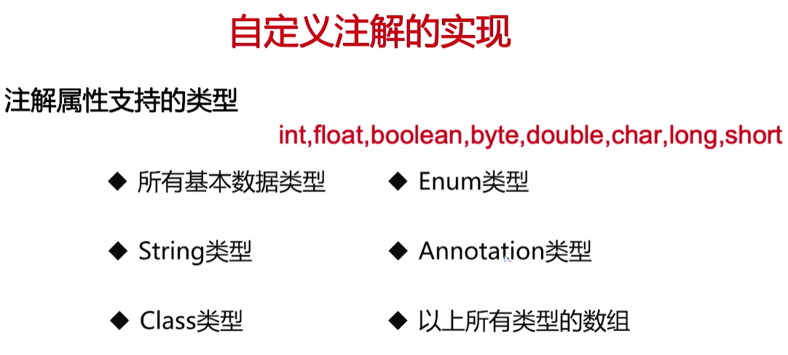

注解是JDK5.0 引入的一种注释机制，核心包是 java.lang.annotation ，下面有一个 Annotation接口，是所有注解都默认继承的（Javap .class可以看到继承关系）。

提供一种为程序元素设置元数据的方法：

- 元数据是添加到程序元素如方法、字段、类和包.上的额外信息
- 注解是一种分散式的元数据设置方式, XML是集中式的设置方式
- 注解不能直接干扰程序代码的运行

## 注解的功能

- 作为特定的标记,用于告诉编译器一些信息
- 编译时动态处理,如动态生成代码
- 运行时动态处理,作为额外信息的载体,如获取注解信息

## 注解的分类

- 标准注解: Override、Deprecated、 SuppressWarnings
- 元注解: @Retention、@ Target、@Inherited、 @Documented
- 自定义注解

## 元注解

用于修饰注解的注解,通常用在注解的定义上

@Target :注解的作用目标

@Retention :注解的生命周期

@Documented :注解是否应当被包含在JavaDoc文档中

@Inherited: 是否允许子类继承该注解

### 元注解@Target

描述所修饰的注解的使用范围

- packages、types( 类、接口、枚举、Annotation类型 )
- 类型成员(方法、构造方法、成员变量、枚举值)
- 方法参数和本地变量(如循环变量、catch参数 )

### ElementType

```java
public enum ElementType {
    ...
    /** 可作用于本地局部变量上 */
    LOCAL_VARIABLE,

    /** 可作用于注解上（元注解） */
    ANNOTATION_TYPE,
    
    /**
     * Type parameter declaration
     * 可作用于泛型类的实参上
     * 例如：public class Demo <@TypeParamterAnnotation T>{}
     * 在 Spring中的 @RequestParam 就是使用的该类型
     * @since 1.8
     */
    TYPE_PARAMETER,

    /**
     * Use of a type
     * 能作用在任何类型之上
     * @since 1.8
     */
    TYPE_USE
}
```

### 元注解@Retention

- 标注注解被保留时间的长短
- 用于定义注解的生命周期

```java
@Documented
@Retention(RetentionPolicy.RUNTIME)
@Target(ElementType.ANNOTATION_TYPE)
public @interface Retention {
    RetentionPolicy value();
}
```

```java
public enum RetentionPolicy {
    /**
     * 保留在源代码，不保留在编译后的字节码文件中
     * Annotations are to be discarded by the compiler.
     */
    SOURCE,

    /**
     * 字节码文件中也保留注解
     * Annotations are to be recorded in the class file by the compiler
     * but need not be retained by the VM at run time.  This is the default
     * behavior.
     */
    CLASS,

    /**
     * 在运行时保留注解，如Spring中的@Autowired，可以通过反射来获取
     * Annotations are to be recorded in the class file by the compiler and
     * retained by the VM at run time, so they may be read reflectively.
     *
     * @see java.lang.reflect.AnnotatedElement
     */
    RUNTIME
}
```

## 自定义注解

自定义注解不允许以类的形式实现或继承接口，属性的访问修饰符只能定义成public类型。



创建一个注解，定义可作用于类、方法、字段上。

```java
@Target({ElementType.TYPE, ElementType.FIELD, ElementType.METHOD})
@Retention(RetentionPolicy.RUNTIME)
public @interface TestAnnotation {
    public String name();

    public String desc();

    public int age() default 18;

    public String[] language();
}
```

使用该注解：

```java
@Data
@TestAnnotation(name = "用户bo", desc = "用户的实体类描述信息", language = {"Java", "C++", "Go"})
public class User {
    private Integer id;

    @TestAnnotation(name = "用户名", desc = "用户可用于登录认证的账号", language = "Java")
    private String username;
    private String password;
}
```

使用反射完成进行运行时动态处理：

- 在Class类中，Class类实现了AnnotatedElement 接口，提供了获取注解的一系列信息

```java
public static void parseTypeAnnotation() throws ClassNotFoundException {
    Class clazz = Class.forName("com.demo.hello.entity.bo.User");
    // 获取类上的TestAnnotation注解
    Annotation[] annotations = clazz.getAnnotations();
    for (Annotation annotation : annotations) {
        TestAnnotation testAnnotation = (TestAnnotation) annotation;
        System.out.println(testAnnotation);
    }
    // 获取字段上的TestAnnotation注解
    Field[] fields = clazz.getDeclaredFields();
    for (Field field : fields) {
        // 获取字段上是否有TestAnnotation注解
        boolean present = field.isAnnotationPresent(TestAnnotation.class);
        if (present){
            TestAnnotation testAnnotation = field.getAnnotation(TestAnnotation.class);
            System.out.println(testAnnotation);
        }
    }
}
```

编译时，添加参数 -Djdk.proxy.proxyGenerator.saveGeneratedFiles=true 用于查看动态代理的中间代理的对象。

在追加 -XX:+traceClassLoading 跟踪类加载。

## 注解的工作原理

1、通过键值对的形式为注解属性赋值。

2、编译器检查注解的使用范围,将注解信息写入元素属性表。

3、运行时JVM将（单个类中的）RUNTIME的所有注解属性取出并最终存入map里。

4、创建AnnotationInvocationHandler实例并传入前面的map。

5、JVM使用JDK动态代理为注解生成代理类,并初始化处理器。

6、调用invoke方法,通过传入方法名返回注解对应的属性值。
