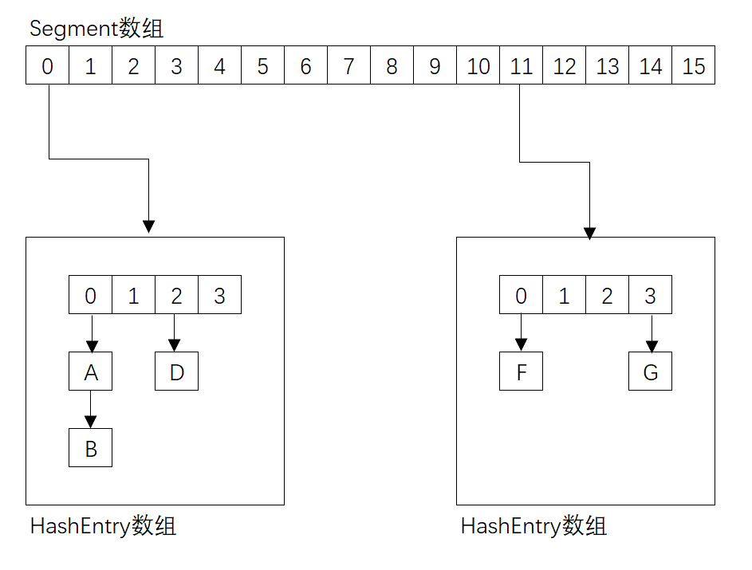

### Java中有哪些容器（集合类）？

Java中的集合类主要由Collection和Map这两个接口派生而出，其中Collection接口又派生出三个子接口，分别是Set、List、Queue。所有的Java集合类，都是Set、List、Queue、Map这四个接口的实现类，这四个接口将集合分成了四大类，其中

- Set代表无序的，元素不可重复的集合；
- List代表有序的，元素可以重复的集合；
- Queue代表先进先出（FIFO）的队列；
- Map代表具有映射关系（key-value）的集合。

这些接口拥有众多的实现类，其中最常用的实现类有HashSet、TreeSet、ArrayList、LinkedList、ArrayDeque、HashMap、TreeMap等。

**扩展阅读**

Collection体系的继承树：

Map体系的继承树：

*注：紫色框体代表接口，其中加粗的是代表四类集合的接口。蓝色框体代表实现类，其中有阴影的是常用实现类。*

### Java中的容器，线程安全和线程不安全的分别有哪些？

java.util包下的集合类大部分都是线程不安全的，例如我们常用的HashSet、TreeSet、ArrayList、LinkedList、ArrayDeque、HashMap、TreeMap，这些都是线程不安全的集合类，但是它们的优点是性能好。如果需要使用线程安全的集合类，则可以使用Collections工具类提供的synchronizedXxx()方法，将这些集合类包装成线程安全的集合类。

java.util包下也有线程安全的集合类，例如Vector、Hashtable。这些集合类都是比较古老的API，虽然实现了线程安全，但是性能很差。所以即便是需要使用线程安全的集合类，也建议将线程不安全的集合类包装成线程安全集合类的方式，而不是直接使用这些古老的API。

从Java5开始，Java在java.util.concurrent包下提供了大量支持高效并发访问的集合类，它们既能包装良好的访问性能，有能包装线程安全。这些集合类可以分为两部分，它们的特征如下：

- 以Concurrent开头的集合类：

  以Concurrent开头的集合类代表了支持并发访问的集合，它们可以支持多个线程并发写入访问，这些写入线程的所有操作都是线程安全的，但读取操作不必锁定。以Concurrent开头的集合类采用了更复杂的算法来保证永远不会锁住整个集合，因此在并发写入时有较好的性能。

- 以CopyOnWrite开头的集合类：

  以CopyOnWrite开头的集合类采用复制底层数组的方式来实现写操作。当线程对此类集合执行读取操作时，线程将会直接读取集合本身，无须加锁与阻塞。当线程对此类集合执行写入操作时，集合会在底层复制一份新的数组，接下来对新的数组执行写入操作。由于对集合的写入操作都是对数组的副本执行操作，因此它是线程安全的。

**扩展阅读**

java.util.concurrent包下线程安全的集合类的体系结构：

### Map接口有哪些实现类？

Map接口有很多实现类，其中比较常用的有HashMap、LinkedHashMap、TreeMap、ConcurrentHashMap。

对于不需要排序的场景，优先考虑使用HashMap，因为它是性能最好的Map实现。如果需要保证线程安全，则可以使用ConcurrentHashMap。它的性能好于Hashtable，因为它在put时采用分段锁/CAS的加锁机制，而不是像Hashtable那样，无论是put还是get都做同步处理。

对于需要排序的场景，如果需要按插入顺序排序则可以使用LinkedHashMap，如果需要将key按自然顺序排列甚至是自定义顺序排列，则可以选择TreeMap。如果需要保证线程安全，则可以使用Collections工具类将上述实现类包装成线程安全的Map。

### 描述一下Map put的过程

HashMap是最经典的Map实现，下面以它的视角介绍put的过程：

1. 首次扩容：

   先判断数组是否为空，若数组为空则进行第一次扩容（resize）；

2. 计算索引：

   通过hash算法，计算键值对在数组中的索引；

3. 插入数据：

   - 如果当前位置元素为空，则直接插入数据；
   - 如果当前位置元素非空，且key已存在，则直接覆盖其value；
   - 如果当前位置元素非空，且key不存在，则将数据链到链表末端；
   - 若链表长度达到8，则将链表转换成红黑树，并将数据插入树中；

4. 再次扩容

   如果数组中元素个数（size）超过threshold，则再次进行扩容操作。

**扩展阅读**

HashMap添加数据的详细过程，如下图：

### 如何得到一个线程安全的Map？

1. 使用Collections工具类，将线程不安全的Map包装成线程安全的Map；
2. 使用java.util.concurrent包下的Map，如ConcurrentHashMap；
3. 不建议使用Hashtable，虽然Hashtable是线程安全的，但是性能较差。

### HashMap有什么特点？

1. HashMap是线程不安全的实现；
2. HashMap可以使用null作为key或value。

### JDK7和JDK8中的HashMap有什么区别？

JDK7中的HashMap，是基于数组+链表来实现的，它的底层维护一个Entry数组。它会根据计算的hashCode将对应的KV键值对存储到该数组中，一旦发生hashCode冲突，那么就会将该KV键值对放到对应的已有元素的后面， 此时便形成了一个链表式的存储结构。

JDK7中HashMap的实现方案有一个明显的缺点，即当Hash冲突严重时，在桶上形成的链表会变得越来越长，这样在查询时的效率就会越来越低，其时间复杂度为O(N)。

JDK8中的HashMap，是基于数组+链表+红黑树来实现的，它的底层维护一个Node数组。当链表的存储的数据个数大于等于8的时候，不再采用链表存储，而采用了红黑树存储结构。这么做主要是在查询的时间复杂度上进行优化，链表为O(N)，而红黑树一直是O(logN)，可以大大的提高查找性能。

### 介绍一下HashMap底层的实现原理

它基于hash算法，通过put方法和get方法存储和获取对象。

存储对象时，我们将K/V传给put方法时，它调用K的hashCode计算hash从而得到bucket位置，进一步存储，HashMap会根据当前bucket的占用情况自动调整容量(超过Load Facotr则resize为原来的2倍)。获取对象时，我们将K传给get，它调用hashCode计算hash从而得到bucket位置，并进一步调用equals()方法确定键值对。

如果发生碰撞的时候，HashMap通过链表将产生碰撞冲突的元素组织起来。在Java 8中，如果一个bucket中碰撞冲突的元素超过某个限制(默认是8)，则使用红黑树来替换链表，从而提高速度。

### 介绍一下HashMap的扩容机制

1. 数组的初始容量为16，而容量是以2的次方扩充的，一是为了提高性能使用足够大的数组，二是为了能使用位运算代替取模预算(据说提升了5~8倍)。
2. 数组是否需要扩充是通过负载因子判断的，如果当前元素个数为数组容量的0.75时，就会扩充数组。这个0.75就是默认的负载因子，可由构造器传入。我们也可以设置大于1的负载因子，这样数组就不会扩充，牺牲性能，节省内存。
3. 为了解决碰撞，数组中的元素是单向链表类型。当链表长度到达一个阈值时（7或8），会将链表转换成红黑树提高性能。而当链表长度缩小到另一个阈值时（6），又会将红黑树转换回单向链表提高性能。
4. 对于第三点补充说明，检查链表长度转换成红黑树之前，还会先检测当前数组数组是否到达一个阈值（64），如果没有到达这个容量，会放弃转换，先去扩充数组。所以上面也说了链表长度的阈值是7或8，因为会有一次放弃转换的操作。

**扩展阅读**

例如我们从16扩展为32时，具体的变化如下所示：

因此元素在重新计算hash之后，因为n变为2倍，那么n-1的mask范围在高位多1bit(红色)，因此新的index就会发生这样的变化：

因此，我们在扩充HashMap的时候，不需要重新计算hash，只需要看看原来的hash值新增的那个bit是1还是0就好了，是0的话索引没变，是1的话索引变成“原索引+oldCap”。可以看看下图为16扩充为32的resize示意图：

这个设计确实非常的巧妙，既省去了重新计算hash值的时间，而且同时，由于新增的1bit是0还是1可以认为是随机的，因此resize的过程，均匀的把之前的冲突的节点分散到新的bucket了。

### HashMap中的循环链表是如何产生的？

在多线程的情况下，当重新调整HashMap大小的时候，就会存在条件竞争，因为如果两个线程都发现HashMap需要重新调整大小了，它们会同时试着调整大小。在调整大小的过程中，存储在链表中的元素的次序会反过来，因为移动到新的bucket位置的时候，HashMap并不会将元素放在链表的尾部，而是放在头部，这是为了避免尾部遍历。如果条件竞争发生了，那么就会产生死循环了。

### HashMap为什么用红黑树而不用B树？

B/B+树多用于外存上时，B/B+也被成为一个磁盘友好的数据结构。

HashMap本来是数组+链表的形式，链表由于其查找慢的特点，所以需要被查找效率更高的树结构来替换。如果用B/B+树的话，在数据量不是很多的情况下，数据都会“挤在”一个结点里面，这个时候遍历效率就退化成了链表。

### HashMap为什么线程不安全？

HashMap在并发执行put操作时，可能会导致形成循环链表，从而引起死循环。

### HashMap如何实现线程安全？

1. 直接使用Hashtable类；
2. 直接使用ConcurrentHashMap；
3. 使用Collections将HashMap包装成线程安全的Map。

### HashMap是如何解决哈希冲突的？

为了解决碰撞，数组中的元素是单向链表类型。当链表长度到达一个阈值时，会将链表转换成红黑树提高性能。而当链表长度缩小到另一个阈值时，又会将红黑树转换回单向链表提高性能。

### 说一说HashMap和HashTable的区别

1. Hashtable是一个线程安全的Map实现，但HashMap是线程不安全的实现，所以HashMap比Hashtable的性能高一点。
2. Hashtable不允许使用null作为key和value，如果试图把null值放进Hashtable中，将会引发空指针异常，但HashMap可以使用null作为key或value。

**扩展阅读**

从Hashtable的类名上就可以看出它是一个古老的类，它的命名甚至没有遵守Java的命名规范：每个单词的首字母都应该大写。也许当初开发Hashtable的工程师也没有注意到这一点，后来大量Java程序中使用了Hashtable类，所以这个类名也就不能改为HashTable了，否则将导致大量程序需要改写。

与Vector类似的是，尽量少用Hashtable实现类，即使需要创建线程安全的Map实现类，也无须使用Hashtable实现类，可以通过Collections工具类把HashMap变成线程安全的Map。

### HashMap与ConcurrentHashMap有什么区别？

HashMap是非线程安全的，这意味着不应该在多线程中对这些Map进行修改操作，否则会产生数据不一致的问题，甚至还会因为并发插入元素而导致链表成环，这样在查找时就会发生死循环，影响到整个应用程序。

Collections工具类可以将一个Map转换成线程安全的实现，其实也就是通过一个包装类，然后把所有功能都委托给传入的Map，而包装类是基于synchronized关键字来保证线程安全的（Hashtable也是基于synchronized关键字），底层使用的是互斥锁，性能与吞吐量比较低。

ConcurrentHashMap的实现细节远没有这么简单，因此性能也要高上许多。它没有使用一个全局锁来锁住自己，而是采用了减少锁粒度的方法，尽量减少因为竞争锁而导致的阻塞与冲突，而且ConcurrentHashMap的检索操作是不需要锁的。

### 介绍一下ConcurrentHashMap是怎么实现的？

JDK 1.7中的实现：

在 jdk 1.7 中，ConcurrentHashMap 是由 Segment 数据结构和 HashEntry 数组结构构成，采取分段锁来保证安全性。Segment 是 ReentrantLock 重入锁，在 ConcurrentHashMap 中扮演锁的角色，HashEntry 则用于存储键值对数据。一个 ConcurrentHashMap 里包含一个 Segment 数组，一个 Segment 里包含一个 HashEntry 数组，Segment 的结构和 HashMap 类似，是一个数组和链表结构。

JDK 1.8中的实现：

JDK1.8 的实现已经摒弃了 Segment 的概念，而是直接用 Node 数组+链表+红黑树的数据结构来实现，并发控制使用 Synchronized 和 CAS 来操作，整个看起来就像是优化过且线程安全的 HashMap，虽然在 JDK1.8 中还能看到 Segment 的数据结构，但是已经简化了属性，只是为了兼容旧版本。

### ConcurrentHashMap是怎么分段分组的？

get操作：

Segment的get操作实现非常简单和高效，先经过一次再散列，然后使用这个散列值通过散列运算定位到 Segment，再通过散列算法定位到元素。get操作的高效之处在于整个get过程都不需要加锁，除非读到空的值才会加锁重读。原因就是将使用的共享变量定义成 volatile 类型。

put操作：

当执行put操作时，会经历两个步骤：

1. 判断是否需要扩容；
2. 定位到添加元素的位置，将其放入 HashEntry 数组中。

插入过程会进行第一次 key 的 hash 来定位 Segment 的位置，如果该 Segment 还没有初始化，即通过 CAS 操作进行赋值，然后进行第二次 hash 操作，找到相应的 HashEntry 的位置，这里会利用继承过来的锁的特性，在将数据插入指定的 HashEntry 位置时（尾插法），会通过继承 ReentrantLock 的 tryLock() 方法尝试去获取锁，如果获取成功就直接插入相应的位置，如果已经有线程获取该Segment的锁，那当前线程会以自旋的方式去继续的调用 tryLock() 方法去获取锁，超过指定次数就挂起，等待唤醒。

### 说一说你对LinkedHashMap的理解

LinkedHashMap使用双向链表来维护key-value对的顺序（其实只需要考虑key的顺序），该链表负责维护Map的迭代顺序，迭代顺序与key-value对的插入顺序保持一致。

LinkedHashMap可以避免对HashMap、Hashtable里的key-value对进行排序（只要插入key-value对时保持顺序即可），同时又可避免使用TreeMap所增加的成本。

LinkedHashMap需要维护元素的插入顺序，因此性能略低于HashMap的性能。但因为它以链表来维护内部顺序，所以在迭代访问Map里的全部元素时将有较好的性能。

### 请介绍LinkedHashMap的底层原理

**LinkedHashMap继承于HashMap，它在HashMap的基础上，通过维护一条双向链表，解决了HashMap不能随时保持遍历顺序和插入顺序一致的问题。在实现上，LinkedHashMap很多方法直接继承自HashMap，仅为维护双向链表重写了部分方法。

如下图，淡蓝色的箭头表示前驱引用，红色箭头表示后继引用。每当有新的键值对节点插入时，新节点最终会接在tail引用指向的节点后面。而tail引用则会移动到新的节点上，这样一个双向链表就建立起来了。

