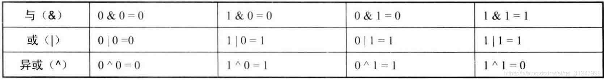
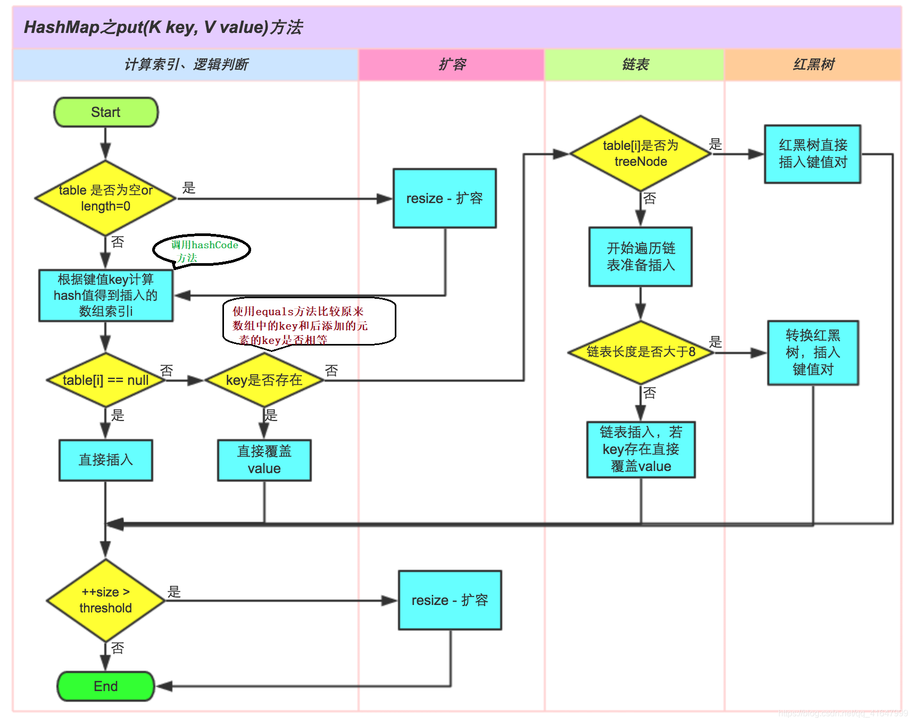
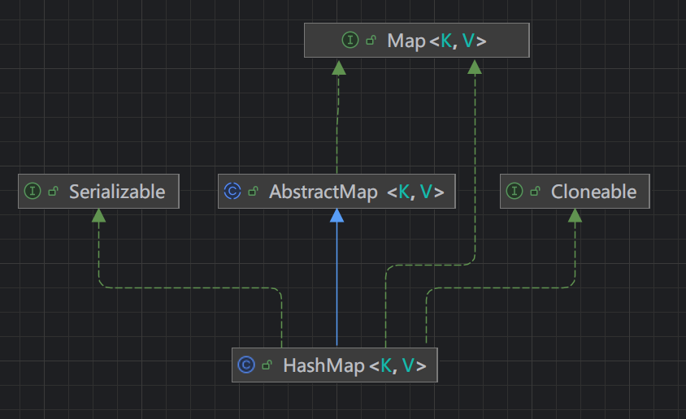
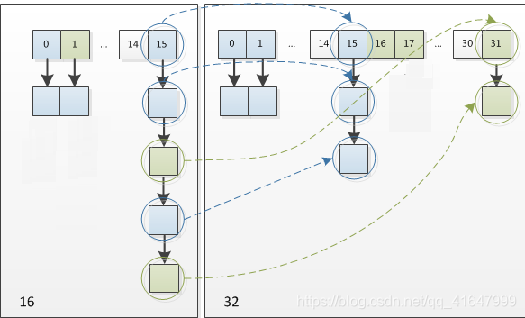

## 复习预热

### 十进制转二进制的快速计算方式

17 的二进制：17=16+1 所以在下面 16和1 的位置为1，其它都为0，值为 0001 0001。

37 的二进制：37=32+4+1 所以下面32和4和1的位上都为1，其它都为0，值为 0010 0101。

```
    0      0      0      0        0    0    0      0
    128   64     32     16        8    4    2      1
计算示例：    
17： 0     0      0      1        0    0    0      1
37： 0     0      1      0        0    1    0      1 
```

### 与、或、异或运算

& 又叫做and（与运算），例：3 & 5 = 1 (000011 & 000101 = 000001)。3的二进制和5的二进制位相对应，一一比较，都为1的位上才为1。

| 也叫做or，例：3 | 5 = 7 (0000011 | 00000101 = 0000111)。

^ 也叫xor (以后做题会遇到xor,就是异或)，两个比较的二进制的位上相同为0，不同为1。例：3^5 = 6(0000 0011 ^ 0000 0101=0000 0110)。特别的任意数 ^ 0 = 任意数。

取反运算符(~)，二进制位0变为1,1变为0

### "<<" 和 ">>" 运算符

箭头向左叫左移，向右叫右移。

两个箭头的代表带符号移位，三个箭头（“<<<”和“>>>”）不带符号移位。

例如，17的二进制为：0001 0001，运算 17 << 1，表示为17的二进制向左移1位，0010 0010 转成10进制的值为34。

### JDK1.7 最高位计算

其中有一个用于寻找2的n次方小于i 的这个数的方法：

```java
public static int highestOneBit(int i) {
    // 示例 i=17 时, 计算 i|= i |= (i >> 1) 的结果 
    // 0 0 0 1   0 0 0 1      17的二进制
    // 0 0 0 0   1 0 0 0      17向右移一位
    // 0 0 0 1   1 0 0 1      右移一位之后和17或运算
    //       16  8     1      结果为：16+8+1=25
    i |= (i >> 1);
    i |= (i >> 2);
    i |= (i >> 4);  // 当i=17时，假如此处运算的结果为num
    i |= (i >> 8);  // 实际上到8这里运算结果 0000 0000在与 num 或运算，num的值就不会在发生改变了
    i |= (i >> 16); 
    return i - (i >>> 1);
}

```

计算多次是为了把 i 的最高位变成 0。

JDK 1.8之前的HashMap由 **数组+链表** 组成的，JDK1.8中HashMap由**链表+数组+红黑树**组成（当链表节点即阈值大于8，数组长度大于64后转化为红黑数，高效的查询；当阈值大于8，数组长度小于64的时候，会扩容）。

HashMap 基于哈希表的 Map 接口的实现，key和value都允许为null，无序的。

链表则是主要为了解决哈希冲突（两个对象例如Aa和BB调用的 hashCode方法计算的哈希码值一致导致计算的数组索引值相同）。

## HashMap存储数据的过程

​		在JDK8以前，当创建HashMap集合对象的时候，构造方法中创建一个长度为16的Entry[ ] table 存储键值对数据；

​		在JDK8之后，不在构造方法中创建数组了，而是在第一次调用 put 方法时创建 Node[ ] table（实际上只是Entry换了个名字，底层还是Map.Entry）。

> #### 哈希表的底层是如何计算哈希值的？还有哪些算法可以计算出哈希值？

​		底层采用 key的哈希值（hashCode方法的计算值），结合数组长度进行无符号右移(>>>)、异或（^）运算、与运算（^）计算出数组的索引下标。

除了哈希算法外，还可以采用平方取中法、取余数、伪随机数法，但为什么采用哈希算法？

​		向哈希表中存储一个 key - value 数据，假设 key 计算出的哈希值结合数组长度计算出的索引值为3，当数组空间不为null时，会与索引为3的桶（数组中为3的元素）比较，如果没有匹配到相同哈希值的key，那么从这个桶内划出一个节点来存储当前的key-value，这种方法称为**拉链法**。如果匹配到了一个哈希值相等的key，此时发生**哈希碰撞**，那么会调用String.equals()方法比较两个值的引用地址是否相等，相等则返回并覆盖之前的value，反之划出一个节点存储key-value。 如果链表节点数大于阈值8，并且数组长度大于64，则将链表转为红黑树。

> #### 什么是哈希碰撞？何时发生？如何解决？

只要两个key通过hashCode方法计算出的哈希值相等就是哈希碰撞，JDK8使用链表解决哈希碰撞，JDK8之后使用链表+红黑树解决哈希碰撞。

> #### 如果两个key的哈希值相同，如何存储键值对？

哈希值相同的两个 key ，通过 equals 比较内容是否相同，如果相同则新的value覆盖旧value并返回旧value。

> #### 为什么 JDK1.8 要使用红黑树？为什么阈值大于8才换成红黑树？

在JDK1.8之前的HashMap中，数据结构是数组+链表，即使哈希函数取得再好，也很难达到元素百分百均匀分布。当HashMap中以后大量的元素都存放在同一个桶中时，这个桶有一条很多节点的链表，此时的HashMap就相当于一个单链表，加入链表有n个节点，则查询的时间复杂度为O(n)。针对这一情况，JDK1.8引入了红黑树（查找的时间复杂度为O(logn））。

当链表很小时，遍历速度也会非常快，但是当链表节点多了以后，查询性能受影响，所以换成树的结构来增加查询性能。

1、计算出当前插入Entry（键值对)key的 hashCode，再通过**某种算法**计算出插入的下标 i。

2、如果 table[ i ] == null，则直接插入；如果不等于null，则通过equals 比较 key 和 table[i] 中的key是否相等，如果相等，则新value直接覆盖并返回旧value，如果不相等，则判断当前 table[i] 是否为红黑树节点，如果是红黑树，则直接插入Entry 到叶子节点，如果是链表则先判断链表的节点长度是否小于8且数组长度是否小于64，满足条件则遍历key比对后划出一个新的节点连接上链表。

3、size 表示HashMap中K-V的实时数量，不等于数组的长度。

4、threshold（临界值）= capacity（数组容量） * loadFactor（负载因子）。这个值是当前已占用数组长度的最大值。size 超过这个临界值就重新 resize，扩容后 容量是之前容量的两倍。（HashMap数组的空间是很难每个空间都存满数据的，所以乘以一个负载因子）

## HashMap的继承关系



```java
public class HashMap<K,V> extends AbstractMap<K,V>
    implements Map<K,V>, Cloneable, Serializable {...}

public abstract class AbstractMap<K,V> implements Map<K,V> {...}
```

**Cloneable：** 实现该接口表示可以克隆。

**Serializable**：表示HashMap对象可以被序列化和反序列化。

## 成员变量

```java
/**
 * The default initial capacity - MUST be a power of two.
 * 默认的初始化容量必须是2的n次幂
 */
static final int DEFAULT_INITIAL_CAPACITY = 1 << 4; // aka 16  = 1*2^4
```

> #### 为什么初始值必须是2的n次幂？不是2的n次幂会怎样？

HashMap 在 put 进一个元素的时候，需要通过 key 的哈希值来计算出存储在数组中的索引下标，HashMap 为了存取高效、尽量减少碰撞，就需要尽量把数据分配均匀，每个链表的长度大致相同，这个实现就在把数据存到哪个链表中的算法。这个算法实际上就是**取模运算**（hash%length），计算机中直接求余效率不如位移运算，所以HashMap对此做了优化使用 **hash&length-1**，而实际 hash%length 等于 hash&(length-1) 的**前提是length是2的n次幂**。

> #### 为什么通过取模运算（hash&length-1）能够均匀分布减少碰撞呢？为什么是2的n次幂？

2^n 的二进制实际上就是100...00，2^n - 1 的二进制实际上就是 111...11。所以length-1实际上就是 2^n-1，因为hash值太大了，所以需要通过取模来让计算结果缩小在length大小的范围内。

如果数组长度不是2的n次幂，通过 hash&length-1 的下标很容易相同，**易产生哈希碰撞**，导致数组的空间很大程度上并没有存储数据，**浪费数组空间**，导致单个桶的**链表或红黑树过长**，效率降低。

**如果数组的长度是2的n次幂**

 ```
例如当前hash值为3，数组长度为8（则 length-1=7）
3的二进制：0 0 0 0 0 0 1 1
7的二进制：0 0 0 0 0 1 1 1
与运算结果：0 0 0 0 0 0 1 1 十进制为：3 （下标）

例如当前hash值为2，数组长度为8（则 length-1=7）
2的二进制：0 0 0 0 0 0 1 0
7的二进制：0 0 0 0 0 1 1 1
&运算结果：0 0 0 0 0 0 1 0 十进制为：2 （下标）
 ```

**如果数组的长度不是2的n次幂**

```
例如当前hash值为3，数组长度为9（则 length-1=8）
3的二进制：0 0 0 0 0 0 1 1
8的二进制：0 0 0 0 1 0 0 0
与运算结果：0 0 0 0 0 0 0 0 十进制为：0 （下标）

例如当前hash值为2，数组长度为9（则 length-1=8）
2的二进制：0 0 0 0 0 0 1 0
7的二进制：0 0 0 0 0 1 1 1
&运算结果：0 0 0 0 0 0 1 0 十进制为：0 （下标）
```

发现一个问题：如果不是2的n次幂很容易导致存储到数组的下标为0。

> #### 如果在初始 HashMap 时，传入一个初始容量不为 2 的 n 次幂会怎么样？

会找一个比你传入这个值大的一个2的n次幂，例如传入7，则默认初始容量为8；传入10，则初始容量为16。

```java
// 当 cap 传入 10 时
static final int tableSizeFor(int cap) {
    // cap-1 是为了避免传入的值就是2的n次幂
    int n = cap - 1; // n=9，9的二进制：0000 1001
     // 9向右移1位：0 0 0 0 0 1 0 0 再和n进行或运算 0000 1101
    n |= n >>> 1; // n=13
    n |= n >>> 2; // n=15
    n |= n >>> 4; // n=15，此时在往后运算已经没作用了
    n |= n >>> 8; // n=15
    n |= n >>> 16;// n=15
    // n<0=false  n>2^30=false，所以走n+1 =15+1 结果为 16
    return (n < 0) ? 1 : (n >= 1 << 30) ? 1 << 30 : ;
}
```

其实到这里发现规律了，在想办法让各个位上的值变成1，印证了规律： 2^n - 1 的二进制实际上就是 111...11，在最后在加个1就变成了2的n次幂。

### 负载因子

```java
/**
  * 默认的负载因子大小为 0.75f
  */
static final float DEFAULT_LOAD_FACTOR = 0.75f;
```

当数组的的大小超过临界值是就会扩容，threshold（临界值）= capacity（当前容量） * loadFactor（负载因子）。

### 链表树化的最小节点数

```java
/**
 * 当链表的节点数超过 8 后，链表转红黑树
 */
static final int TREEIFY_THRESHOLD = 8;
/**
 * 当链表节点数小于 6 时，树转链表
 */
static final int UNTREEIFY_THRESHOLD = 6;
```

> #### 为什么桶里面的节点数（链表节点数）超过8后才转为红黑树？
>
> 换个提问姿势：HashMap的树化门槛为什么是8？

**从设计者思想考虑**

出于对空间和时间的权衡，因为树节点的大小约是普通节点的两倍，所以我们只在包含了足够多节点的桶里使用树节点。当它们变得太小的时候，就会被转换为普通的链表。在使用分布良好的hashCode时，很少会使用树节点。理想状态下，在随机哈希码下，箱子中节点的频率服从泊松分布。

**从查询效率考虑**

红黑树的平均查找长度是log(n)，如果长度为8，平均查找长度为log(8)=3，链表的平均查找长度为n/2，当长度为8时，平均查找长度为8/2=4，红黑树的查找效率更高，这才有转换成树的必要；
链表长度如果是小于等于6，6/2=3，而log(6)=2.6，虽然速度也很快的，但是转化为树结构和生成树的时间并不会太短。

（当n=6时，6/2=3 > log(6)满足转成红黑树要求，但是如果转为红黑树后，删除一个节点，红黑树需要一系列操作来保持平衡，效率反而更低了）

### 链表树化数组的最小容量

```java
/**
 * The smallest table capacity for which bins may be treeified.
 * (Otherwise the table is resized if too many nodes in a bin.)
 * Should be at least 4 * TREEIFY_THRESHOLD to avoid conflicts
 * between resizing and treeification thresholds.
 * 当数组的长度大于64后才会树化
 */
static final int MIN_TREEIFY_CAPACITY = 64;
```

链表树化的两个条件：单个桶内的链表节点数大于8并且数组容量大于64；

## 属性

```java
/**
 * HashMap的数组
 */
transient Node<K,V>[] table;
/**
 * 用于缓存具体元素的集合
 */
transient Set<Map.Entry<K,V>> entrySet;
/**
 * The number of key-value mappings contained in this map.
 * HashMap中的实时容量，非数组长度
 */
transient int size;
/**
 * 每次扩容和更改Map结构的计数器
 */
transient int modCount;
/**
 * 阈值（临界值），当实际大小（数组容量*负载因子）超过临界值时，会进行扩容
 * 默认初始化 size=16(DEFAULT_INITIAL_CAPACITY)*0.75(DEFAULT_LOAD_FACTOR)=12
 */
int threshold;
/**
 * 负载因子。0到1范围取值，用于衡量HashMap满的程度，值越小HashMap越稀疏，影响Hash操作到
 * 一个数组位置的概率，计算 HashMap 的实时加载因子的方法为：size（实时Entry大小）/capacity（桶的容量），而不是占用桶的数量去除以capacity
 */
final float loadFactor;
```

强调一下非常重要的属性 loadFactor。

loadFactor 太大会导致查找效率低，太小又会导致数组利用率低，存放的数据会很分散，loadFactor默认的0.75f 是官方经过大量实验给出的一个比较好的临界值。当数组的长度达到75%时，表示HashMap太挤了，需要扩容，而扩容需要 rehash、复制数据等操作，非常消耗性能。所以开发中尽量减少扩容次数，可以通过创建HashMap时指定初始容量来尽量避免。

> 为什么 loadFactor = 0.75f 不建议修改？

threshold（阈值） = capacity * 0.75，默认初始化后阈值为12。

当初始loadFactor太小，如 loadFactor=0.4时，那么计算出的阈值 16*0.4=6，此时的数组长度为16，达到6个容量后就会扩容，导致另外的10个空间浪费、扩容重新计算hash和复制数据。

当初始loadFactor太大，如loadFactor=0.9时，那么计算出阈值为14，让数组的空间充分利用是很难的，阈值过大会导致增大每个桶里节点非常多的概率，当数组长度大于64节点长度大于8之后树化，红黑树不断进行保持平衡的操作，导致效率反而更低。

## 构造方法

**HashMap()**

```java
public HashMap() {
   // 将默认的负载因子0.75赋值给loadFactor，并没有创建数组
   this.loadFactor = DEFAULT_LOAD_FACTOR;
}
```

**HashMap(int initialCapacity, float loadFactor)**

构造一个具有指定的初始容量和默认负载因子（0.75）HashMap 。

```java
public HashMap(int initialCapacity, float loadFactor) {
    if (initialCapacity < 0)
        throw new IllegalArgumentException("Illegal initial capacity: " +
                                           initialCapacity);
    if (initialCapacity > MAXIMUM_CAPACITY)
        initialCapacity = MAXIMUM_CAPACITY;
    if (loadFactor <= 0 || Float.isNaN(loadFactor))
        throw new IllegalArgumentException("Illegal load factor: " +
                                           loadFactor);
    this.loadFactor = loadFactor;
    // 下面这行按理应该是 threshold=tableSizeFor(initialCapacity)*loadFactor
    // 但这不是BUG，在 put 方法中会对阈值进行修改
    this.threshold = tableSizeFor(initialCapacity);
}
```

**HashMap(Map<? extends K, ? extends V> m)**

包含另一个 Map 的构造函数

```java
// 构造一个映射关系与指定 Map 相同的新 HashMap
public HashMap(Map<? extends K, ? extends V> m) {
    this.loadFactor = DEFAULT_LOAD_FACTOR;
    putMapEntries(m, false);
}

final void putMapEntries(Map<? extends K, ? extends V> m, boolean evict) {
    int s = m.size();
    if (s > 0) {
        if (table == null) {
            // 下面单独讲这一行
            float ft = ((float)s / loadFactor) + 1.0F;
            int t = ((ft < (float)MAXIMUM_CAPACITY) ?
                     (int)ft : MAXIMUM_CAPACITY);
            // threshold=0
            if (t > threshold)
                // 初始阈值(threshold)
                threshold = tableSizeFor(t);
        }
        else if (s > threshold)
            resize();
        for (Map.Entry<? extends K, ? extends V> e : m.entrySet()) {
            K key = e.getKey();
            V value = e.getValue();
            putVal(hash(key), key, value, false, evict);
        }
    }
}
```

```java
// 为什么要加 1.0F？
float ft = ((float)s / loadFactor) + 1.0F;
```

s/loadFactor 的结果是小数，加 1.0F 与 (int)ft 相当于是对小数做一个向上取整以尽可能的保证更大容量，更大的容量能够减少 resize 的调用次数。所以 + 1.0F 是为了获取更大的容量。

例如：原来集合的元素个数是 6 个，那么 ft = 6/0.75=8，是 2 的n次幂，那么新数组大小就是 8 了。然后原来数组的数据就会存储到长度是 8 的新数组中，这样会导致在存储元素的时候，容量不够，还得继续扩容，那么性能降低了，而如果 +1 呢，数组长度直接变为16了，这样可以减少数组的扩容。

## 成员方法

 **put()**

实现步骤：

1、先通过 hash 值计算出 key 映射到哪个桶；

2、如果桶上没有碰撞冲突，则直接插入；

3、如果出现碰撞冲突了，则需要处理冲突：

- a 如果该桶使用红黑树处理冲突，则调用红黑树的方法插入数据；

- b 否则采用传统的链式方法插入。如果链的长度达到临界值，则把链转变为红黑树；

4、如果桶中存在重复的键，则为该键替换新值 value；

5、如果 size 大于阈值 threshold，则进行扩容；

```java
public V put(K key, V value) {
	return putVal(hash(key), key, value, false, true);
}

// 在HashMap中，key 和 value 是允许为 null 的
static final int hash(Object key) {
    int h;
    /** 如果key为null，则返回hash值为0
     * 如果不为null，首先计算出key的hashCode赋值给h，
     * 然后与h无符号右移16位（为了删除高位，保证任何哈希值都能变小）后的二进制进行按位异或得到最后的hash值
     **/
    return (key == null) ? 0 : (h = key.hashCode()) ^ (h >>> 16);
}
```

```java
/**
 * Implements Map.put and related methods
 *
 * @param hash hash for key
 * @param key the key
 * @param value the value to put
 * @param onlyIfAbsent if true, don't change existing value
 * @param evict if false, the table is in creation mode.
 * @return previous value, or null if none
 */
final V putVal(int hash, K key, V value, boolean onlyIfAbsent,
               boolean evict) {
    Node<K,V>[] tab; Node<K,V> p; int n, i;
    // 初次调用putVal方法时this.table是null，在resize方法中初始化阈值，返回重新创建的数组
    if ((tab = table) == null || (n = tab.length) == 0)
        n = (tab = resize()).length;
    // 通过i = (n - 1) & hash 计算出放入数组的下标，把 table[i] 的桶赋值给 p
    // 如果数组中在i的位置是否为空
    if ((p = tab[i = (n - 1) & hash]) == null)
        tab[i] = newNode(hash, key, value, null);
    // 如果在table[i]的位置上桶里有节点
    else {
        Node<K,V> e; K k;
        // p就是数组上第i个桶(p=table[i])，然后比较两个key的哈希值和引用地址是否相同
        // 这里的多个判断是为了避免哈希值一样，key不一样的情况
        if (p.hash == hash &&
            ((k = p.key) == key || (key != null && key.equals(k))))
            e = p;
        // 如果两个key不相同，则判断当前桶中是不是树
        else if (p instanceof TreeNode) 
            e = ((TreeNode<K,V>)p).putTreeVal(this, tab, hash, key, value);
        // 两个key不相同，不是树，那么桶里就是链表
        else {
            // binCount 表示是当前链表中的第binCount个节点
            for (int binCount = 0; ; ++binCount) {
                // 判断当前节点是不是最后一个节点，如果是的话，直接划出一个新的节点
                if ((e = p.next) == null) {
                    p.next = newNode(hash, key, value, null);
                    // 树化的第一要求：链表节点数是否到达树化阈值
                    if (binCount >= TREEIFY_THRESHOLD - 1) // -1 for 1st
                        treeifyBin(tab, hash);
                    break;
                }
  		       // 这里的判断是为了判断key是否和当前第 binCount 个节点的key相同，
                // 如果插入的key和p的这个key相同，则退出循环，说明已经找到了重复的值，
                // 没必要在接着往下遍历完所有的节点
                if (e.hash == hash &&
                    ((k = e.key) == key || (key != null && key.equals(k))))
                    break;
                // 向下一个节点移动指针
                p = e;
            }
        }
        // 当插入key和桶中的一个key相同后，e 就是退出循环之前最后指向的那个节点
        if (e != null) { // existing mapping for key
            V oldValue = e.value;
            if (!onlyIfAbsent || oldValue == null)
                e.value = value;
            afterNodeAccess(e);
            return oldValue;
        }
    }
    ++modCount;
    if (++size > threshold)
        resize();
    afterNodeInsertion(evict);
    return null;
}

```

> #### 为什么要通过 (n - 1) & hash 得到下标？

注意这里的n是数组的容量大小，此处的 n-1 相当于 2的n次幂-1，二进制就是n个1，与hash进行与运算，可以保证计算出来的下标在数组大小的范围内。

```
假设存储的key是k1，k1.hashCode()=3366，通过hash()计算出hash=3366
如果n减去1：(n - 1) & hash
0000 0000 0000 0000 0000 0000 0000 1111   15
0000 0000 0000 0000 0000 1101 0010 0110   15&3366
0000 0000 0000 0000 0000 0000 0000 0110   6  下标
```

如果 n 不减 1，首先n是2的n次幂，二进制是一个1后面n个0，与hash进行与运算，很大概率会造成计算出来的下标都是0。

```
如果n不减1：n & hash
0000 0000 0000 0000 | 0000 0000 0001 0000  16
0000 0000 0000 0000 | 0000 1101 0010 0110  16&3366
0000 0000 0000 0000 | 0000 0000 0000 0000  0   下标
```

## 链表树化

```java
final void treeifyBin(Node<K,V>[] tab, int hash) {
    int n, index; Node<K,V> e;
    // 树化的第二个要求：数组长度是否达到64。
    if (tab == null || (n = tab.length) < MIN_TREEIFY_CAPACITY)
         // 节点数大于8，但是数组长度没有达到64进行扩容（容量扩大两倍）
        resize();
    // e 是 table[i] 这个桶
    else if ((e = tab[index = (n - 1) & hash]) != null) {
        // 老外命名：hd是head，tl是tail
        TreeNode<K,V> hd = null, tl = null;
         // do while 把链表节点处理成树节点然后连起来
        do {
            TreeNode<K,V> p = replacementTreeNode(e, null);
            if (tl == null)
                hd = p;
            else {
                p.prev = tl;
                tl.next = p;
            }
            tl = p;
        } while ((e = e.next) != null);
        if ((tab[index] = hd) != null)
            // 让树平衡
            hd.treeify(tab);
    }
}
```

## 扩容

> #### 什么时候扩容？

当HashMap中元素个数超过阈值（threshold=capacity（数组容量）*loadFactor（默认0.75）时扩容，capacity 扩大到2x16=32。

扩容是一个非常耗性能的操作，所以如果我们能预知 HashMap中元素的个数，那么预知元素的个数能够有效地提高HashMap的性能。

> #### HashMap的扩容机制是什么？

进行扩容，会伴随着一次重新计算 hash 和插入的下标，并且会遍历 hash 表中所有的元素，是非常耗时的。在编写程序中，要尽量避免 resize。

HashMap 在进行扩容时，使用的 rehash 方式非常巧妙，因为每次扩容都是翻倍，与原来计算的 (n - 1) & hash 的结果相比，只是多了一个 bit 位，所以新节点要么就在原来的位置，要么就被分配到 “原位置 + 旧容量” 这个位置。

通过 (n-1)&hash 计算出下标，n是数组的容量大小（2的n次幂），n-1等于2的n次幂-1，二进制就是n个1。HashMap 每次扩容是在原来的容量上x2，扩容后的数组容量大小为2的n+1次幂，n-1就等于2的n+1次幂-1，二进制上就相当于比2的n次幂就多了一个bit位。计算出下标的二进制要么不变，要么多一个bit位。


		因此，在扩容的时候，不需要重新计算 hash，只需要看看原来的 hash 值新增的那个 bit 是 1 还是 0 就可以了，是 0 的话索引没变，是 1 的话索引变成 **“原位置 + 旧容量”** 。可以看看下图为 16 扩充为 32 的 resize 示意图：


		正是因为这样巧妙的 rehash 方式，既省去了重新计算 hash 值的时间，而且同时，由于新增的 1 bit 是 0 还是 1 可以认为是随机的，在 resize 的过程中保证了 rehash 之后每个桶上的结点数一定小于等于原来桶上的结点数，保证了 rehash 之后不会出现更严重的 hash 冲突，均匀的把之前的冲突的结点分散到新的桶中了。

```java
final Node<K,V>[] resize() {
    Node<K,V>[] oldTab = table;
    int oldCap = (oldTab == null) ? 0 : oldTab.length;
    int oldThr = threshold;
    // 新容量 新阈值
    int newCap, newThr = 0;
    //======== if...elseif...else...只是为了初始化新容量和新阈值 =========
    if (oldCap > 0) {
        // 最大容量是2的30次方
        if (oldCap >= MAXIMUM_CAPACITY) {
            threshold = Integer.MAX_VALUE;
            return oldTab;
        }
        // 新容量等于扩容前的容量左移一位（相当于X2）
        else if ((newCap = oldCap << 1) < MAXIMUM_CAPACITY &&
                 oldCap >= DEFAULT_INITIAL_CAPACITY)
            // 新阈值也扩大X2
            newThr = oldThr << 1; // double threshold
    }
    // 如果旧容量为0，旧阈值大于0，则新容量就等于阈值
    else if (oldThr > 0) // initial capacity was placed in threshold
        newCap = oldThr;
    // 旧容量为0，阈值为0
    else {               // zero initial threshold signifies using defaults
        newCap = DEFAULT_INITIAL_CAPACITY;
        newThr = (int)(DEFAULT_LOAD_FACTOR * DEFAULT_INITIAL_CAPACITY);
    }
    // 如果默认的加载因子为0或初始容量为0
    if (newThr == 0) {
        // 计算新阈值
        float ft = (float)newCap * loadFactor;
        newThr = (newCap < MAXIMUM_CAPACITY && ft < (float)MAXIMUM_CAPACITY ?
                  (int)ft : Integer.MAX_VALUE);
    }
    threshold = newThr;
    @SuppressWarnings({"rawtypes","unchecked"})
    Node<K,V>[] newTab = (Node<K,V>[])new Node[newCap];
    table = newTab;
    if (oldTab != null) {
        // 遍历取出旧数组中的每一个桶
        for (int j = 0; j < oldCap; ++j) {
            Node<K,V> e;
            // 把第j个桶赋值给e
            if ((e = oldTab[j]) != null) {
                oldTab[j] = null;
                // 只有一个节点
                if (e.next == null)
                    newTab[e.hash & (newCap - 1)] = e;
                // 是树
                else if (e instanceof TreeNode)
                    ((TreeNode<K,V>)e).split(this, newTab, j, oldCap);
                // 是链表
                else { // preserve order
                    Node<K,V> loHead = null, loTail = null;
                    Node<K,V> hiHead = null, hiTail = null;
                    Node<K,V> next;
                    do {
                        next = e.next;
                        // 使用&（与运算）来计算最高位是0还是1
                        if ((e.hash & oldCap) == 0) {
                      		// 这里的if...else...用于节点的移动操作
                            if (loTail == null)
                                loHead = e;
                            else
                                loTail.next = e;
                            // 如果是0，把当前桶赋值给loTail
                            loTail = e;
                        }
                        else {
                            if (hiTail == null)
                                hiHead = e;
                            else
                                hiTail.next = e;
                            // 如果是1，把当前桶赋值给 hiTail
                            hiTail = e;
                        }
                    } while ((e = next) != null);
                    // 如果是0，放回原位置不动
                    if (loTail != null) {
                        loTail.next = null;
                        newTab[j] = loHead;
                    }
                    // 如果是1，新的下标为：旧下标+旧容量
                    if (hiTail != null) {
                        hiTail.next = null;
                        newTab[j + oldCap] = hiHead;
                    }
                }
            }
        }
    }
    return newTab;
}
```

## 删除

找到元素所在数组上的位置，遍历桶，找到元素就停止遍历；如果是树，删除之后判断当前桶的节点是否小于6，小于就转链表。

```java
public V remove(Object key) {
    Node<K,V> e;
    // 计算key的hash值
    // 如果找到了就返回删除key的value，否则返回null
    return (e = removeNode(hash(key), key, null, false, true)) == null ?
        null : e.value;
}
```

```java
/**
 * Implements Map.remove and related methods
 *
 * @param hash hash for key
 * @param key the key
 * @param value the value to match if matchValue, else ignored 如果值
 * @param matchValue if true only remove if value is equal 是否值相等才删除
 * @param movable if false do not move other nodes while removing
 * @return the node, or null if none
 */
final Node<K,V> removeNode(int hash, Object key, Object value,
                           boolean matchValue, boolean movable) {
    Node<K,V>[] tab; Node<K,V> p; int n, index;
    if ((tab = table) != null && (n = tab.length) > 0 &&
        // 通过删除key计算的下标i，在数组中去找i这个位置
        (p = tab[index = (n - 1) & hash]) != null) {
        Node<K,V> node = null, e; K k; V v;
        // 比较两个key是否完全相同（值、引用地址）
        if (p.hash == hash &&
            ((k = p.key) == key || (key != null && key.equals(k))))
            // 找到这个元素之后把这个元素赋值给node
            node = p;
        // 如果还有节点，那么需要判断是树还是链表在接着遍历
        else if ((e = p.next) != null) {
            if (p instanceof TreeNode)
                node = ((TreeNode<K,V>)p).getTreeNode(hash, key);
            else {
                do {
                    // 找到元素就退出循环
                    if (e.hash == hash &&
                        ((k = e.key) == key ||
                         (key != null && key.equals(k)))) {
                        node = e;
                        break;
                    }
                    // 向下一个节点移动，直到下一个节点为null
                    p = e;
                } while ((e = e.next) != null);
            }
        }
        // 找到了
        if (node != null && (!matchValue || (v = node.value) == value ||
                             (value != null && value.equals(v)))) {
            if (node instanceof TreeNode)
                // 红黑树的删除方法
                ((TreeNode<K,V>)node).removeTreeNode(this, tab, movable);
            else if (node == p)
                tab[index] = node.next;
            else
                p.next = node.next;
            ++modCount;
            --size;
            afterNodeRemoval(node);
            return node;
        }
    }
    return null;
}
```

## 查找

```java
public V get(Object key) {
    Node<K,V> e;
    // 计算key的hash值
    return (e = getNode(hash(key), key)) == null ? null : e.value;
}
```

```java
final Node<K,V> getNode(int hash, Object key) {
    Node<K,V>[] tab; Node<K,V> first, e; int n; K k;
    // 通过key计算的下标i，判断在数组的第i个位置是否为空
    if ((tab = table) != null && (n = tab.length) > 0 &&
        (first = tab[(n - 1) & hash]) != null) {
        // 比较key和第一个节点的key是否完全相同
        if (first.hash == hash && // always check first node
            ((k = first.key) == key || (key != null && key.equals(k))))
            return first;
        // 找下一个节点，判断下一个节点是树还是链表，再接着遍历其它节点
        if ((e = first.next) != null) {
            if (first instanceof TreeNode)
                return ((TreeNode<K,V>)first).getTreeNode(hash, key);
            do {
                if (e.hash == hash &&
                    ((k = e.key) == key || (key != null && key.equals(k))))
                    return e;
            } while ((e = e.next) != null);
        }
    }
    return null;
}
```

红黑树的折半递归查找方法

```java
final TreeNode<K,V> getTreeNode(int h, Object k) {
    return ((parent != null) ? root() : this).find(h, k, null);
}
/**
 * h 查找key的hash值
 * kc 关键字key的比较器类型
 */
final TreeNode<K,V> find(int h, Object k, Class<?> kc) {
    TreeNode<K,V> p = this;
    do {
        // ph 当前节点的hash值，pk 当前节点的key
        int ph, dir; K pk;
        TreeNode<K,V> pl = p.left, pr = p.right, q;
        // 当前的节点的hash值是否大于传入key的hash值
        if ((ph = p.hash) > h)
            p = pl;
        // 如果小于，则从右节点赋值给p
        else if (ph < h)
            p = pr;
        // 如果相等，则比较是否完全相等（值、引用地址）
        else if ((pk = p.key) == k || (k != null && k.equals(pk)))
            return p;
        // 如果左节点为空，把右节点赋值给p
        else if (pl == null)
            p = pr;
        // 如果右节点为空，把左节点赋值给p
        else if (pr == null)
            p = pl;
        // 如果不按哈希值排序，而是按照比较器排序，则通过比较器返回值决定进入左右结点
        else if ((kc != null ||
                  (kc = comparableClassFor(k)) != null) &&
                 (dir = compareComparables(kc, k, pk)) != 0)
            p = (dir < 0) ? pl : pr;
        // 递归重新查找
        else if ((q = pr.find(h, k, kc)) != null)
            return q;
        else
            p = pl;
    } while (p != null);
    return null;
}
```

红黑树的查找的时间复杂度为：O(logn)

链表查找的时间复杂度为：O(n)

O(logn)<O(n) ，所以红黑树效率比链表高。

---------------------------

到这里为止，HashMap的原理就算完了，下面回顾一下遍历的四种方式：

## HashMap的遍历

1. 分别遍历 key 和 value

```java
for (String key : map.keySet()) {
	System.out.println(key);
}
for (Object vlaue : map.values() {
	System.out.println(value);
}
```

2. 使用 Iterator 迭代器迭代

```java
Iterator<Map.Entry<String, Object>> iterator = map.entrySet().iterator();
while (iterator.hasNext()) {
    Map.Entry<String, Object> mapEntry = iterator.next();
    System.out.println(mapEntry.getKey() + "---" + mapEntry.getValue());
}
```

3. 通过 get 方式（不建议使用）

```java
Set<String> keySet = map.keySet();
for (String str : keySet) {
	System.out.println(str + "---" + map.get(str));
}
```

根据阿里开发手册，不建议使用这种方式，因为迭代两次。keySet 获取 Iterator一次，还有通过 get 又迭代一次，降低性能。

4. jdk8 以后使用 Map.foreach((k,v)->{ System.out.println(key + "---" + value); })

```java
HashMap<String,String> map = new HashMap();
map.put("k1", "v1");
map.put("k2", "v2");
map.forEach((key, value) -> {
    System.out.println(key + "---" + value);
});
```

## 《阿里巴巴Java开发手册》的建议

可以使用 Guava 的 Maps.newHashMapWithExpectedSize(实际用量)来创建一个合理的HashMap。 

关于设置 HashMap 的初始化容量：

我们上面介绍过，HashMap 的扩容机制，就是当达到扩容条件时会进行扩容。HashMap 的扩容条件就是当 HashMap 中的元素个数（size）超过临界值（threshold）时就会自动扩容。所以，如果我们没有设置初始容量大小，随着元素的不断增加，HashMap 会有可能发生多次扩容，而 HashMap 中的扩容机制决定了每次扩容都需要重建 hash 表，是非常影响性能的。

但是设置初始化容量，设置的数值不同也会影响性能，那么当我们已知 HashMap 中即将存放的 KV 个数的时候，容量设置成多少为好呢？

关于设置 HashMap 的初始化容量大小：

可以认为，当我们明确知道 HashMap 中元素的个数的时候，把默认容量设置成 initialCapacity/ 0.75F + 1.0F 是一个在性能上相对好的选择，但是，同时也会牺牲些内存。

而 Jdk 并不会直接拿用户传进来的数字当做默认容量，而是会进行一番运算，最终得到一个 2 的幂。

