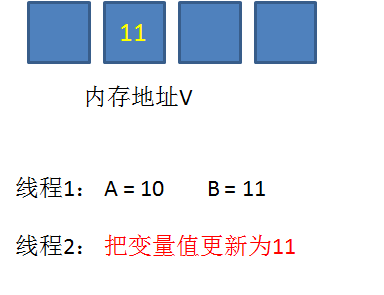
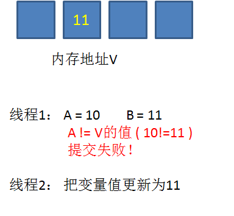
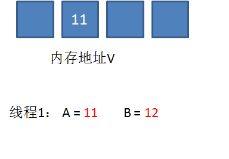
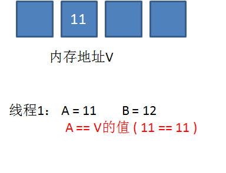
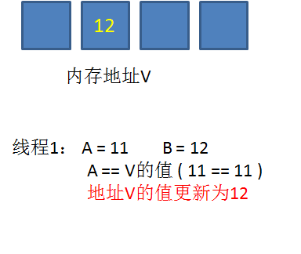

线程的三大特性：原子性、有序性、可见性。

- 原子性：一个或多个操作的程序执行视作一个整体，不可被分割，不可被中断，不可被外界干扰，也就是说同一时刻只能有一个线程来执行这些操作。

- 有序性：程序按一定规则进行顺序的执行。

- 可见性：当多个线程访问同一个变量时，一个线程修改了这个变量的值，其他线程能够立即看的到修改的值。

## 什么是CAS？

CAS在Java出现，在Java中称为自旋锁。CAS类似于synchronized锁的功能，但两者原理不同。

CAS机制当中使用了3个基本操作数：内存地址V，旧的预期值A，要修改的新值B。更新一个变量的时候，只有当变量的预期值A和内存地址V当中的实际值相同时，才会将内存地址V对应的值修改为B。这样说或许有些抽象，我们来看一个例子：

1. 在内存地址V当中，存储着值为10的变量。


2. 此时线程1想要把变量的值增加1。对线程1来说，旧的预期值A=10，要修改的新值B=11。


3. 在线程1要提交更新之前，另一个线程2抢先一步，把内存地址V中的变量值率先更新成了11。



4. 线程1开始提交更新，首先进行**A和地址V的实际值比较（Compare）**，发现A不等于V的实际值，提交失败。



5. 线程1重新获取内存地址V的当前值，并重新计算想要修改的新值。此时对线程1来说，A=11，B=12。这个重新尝试的过程被称为**自旋**。



6. 这一次比较幸运，没有其他线程改变地址V的值。线程1进行**Compare**，发现A和地址V的实际值是相等的。



7. 线程1进行**SWAP**，把地址V的值替换为B，也就是12。



从思想上来说，Synchronized属于**悲观锁**，悲观地认为程序中的并发情况严重，所以严防死守。CAS属于**乐观锁**，乐观地认为程序中的并发情况不那么严重，所以让线程不断去尝试更新。

## JDK中的CAS应用实例

在JDK的 java.util.concurrent.atomic 包下，一系列以Atomic开头的包装类。如AtomicBoolean，AtomicInteger，AtomicLong。它们分别用于Boolean，Integer，Long类型的原子性操作。

compareAndSet利用JNI来完成CPU指令的操作。

```java
public final boolean compareAndSet(int expect, int update) {   
    return unsafe.compareAndSwapInt(this, valueOffset, expect, update);
}
```


## CAS的优点

### 提升吞吐量

线程一直处于活跃状态（非阻塞），不需要CPU进行频繁调度。

### 可避免死锁

不用 synchronized 或 Lock 当然就可以避免死锁。

## CAS的弊端

### ABA问题

在并发环境下会出现的ABA问题是CAS机制中的一个严重弊端。

> 什么是ABA问题？

假设现在有一份资源初始值为A，此时有三个线程对这份资源进行CAS操作：

- 线程1，期望值为A，欲更新值为B
- 线程2，期望值为A，欲更新值为B
- 线程3，期望值为B，欲更新值为A

线程1率先抢到CPU时间片，线程2因为某些原因阻塞了；线程1取值与A比较，发现相等后将值改为B；此时线程3出现，线程3取值与B比较，发现相等后改为A；此时线程2从阻塞中恢复开始执行，线程2的取值与A对比相等，最终改为B。

在这个过程中，线程2虽然完成了操作，但线程2并不知道该值经过了`A->B->A`的这个变化过程。

看到这里可能对这个ABA问题还是没有感觉，再举个现实中的栗子：

小明从他的巨额账户中已有的100元中取走50元，那他取走50后还剩50，假设提款机的代码有BUG，后台开了两个线程去扣款：

- 线程1：获取当前值100，期望更新为50；
- 线程2：获取当前值100，期望更新为50；
- 线程1：执行成功，线程2某种原因阻塞了，此时某人给小明转账50，开一个线程3去处理转账。
- 线程3：获取当前值50，期望更新为100，此时线程3执行成功，余额变为100。
- 线程2：从阻塞中恢复，获取到的也是100，compare之后，继续更新余额为50！！！（小明哭唧唧）

此时可以看到，正常情况下，小明从100元取走50还剩50，有人转账50过来，那最终小明的存款为100元。在这个案例中被这个提款机的ABA问题引发的BUG给弄掉了50块钱。

ABA问题的实例代码：

```java
static AtomicInteger DATA = new AtomicInteger(100);
public static void main(String[] args) {
    new Thread(() -> {
        // 抢到CPU时间片，开始工作
        boolean b = DATA.compareAndSet(100, 50);
        System.out.println(Thread.currentThread().getName() + "是否成功将DATA的值修改为50：" + b);
        try { Thread.sleep(1000); } catch (InterruptedException ignored) {}
    }, "线程1").start();

    new Thread(() -> {
        // 因某些原因阻塞了
        try { Thread.sleep(3000); } catch (InterruptedException ignored) {}
        // 阻塞后恢复工作
        boolean b = DATA.compareAndSet(100, 50);
        System.out.println(Thread.currentThread().getName() + "是否成功将DATA的值修改为50：" + b);
    }, "线程2").start();

    new Thread(() -> {
        try { Thread.sleep(2000); } catch (InterruptedException ignored) {}
        boolean b = DATA.compareAndSet(50, 100);
        System.out.println(Thread.currentThread().getName() + "是否成功将DATA的值修改为100：" + b);
    }, "线程3").start();

    //等待其他线程完成，为什么是2，因为一个是main线程，一个是后台的GC线程
    while (Thread.activeCount() > 2) {
        Thread.yield();
    }
    System.out.println("DATA最终的值为：" + DATA.get());
}
```

执行结果：

```tex
线程1是否成功将DATA的值修改为50：true
线程3是否成功将DATA的值修改为100：true
线程2是否成功将DATA的值修改为50：true
DATA最终的值为：50
```

> ABA问题的解决方案

这个问题就像是：有张三、李四两个单身狗，张三在某个时间段内找到女朋友但是又分手了，但没告诉李四，此时李四还是会在张三是单身狗的情况下带他去洗脚。解决方案就是：张三每次交女朋友都喜欢晒朋友圈，张三是李四的特别关心，每次张三发朋友圈都会提醒李四看。

CAS是乐观锁，还记得MySQL中也有个乐观锁吗？MySQL中的乐观锁是每次修改完数据后，留下一个版本号，在每次被更新之后版本号会+1，即 `A->B->A` 就变成了 `1A->2B->3A` 。

补充一点：

Integer 的源码（IntegerCache） 里面用了缓存，会缓存[-128, 127] 区间的值，在使用 AtomicInteger 需要格外注意！很有可能值被修改成功后，下一次被get时，会因为缓存，而取到上一次的值。

### CPU开销大

在并发量比较高的情况下，如果许多线程反复尝试更新某一个变量，却又一直更新不成功，循环往复，会给CPU带来很大的压力。

### 只能保证一个共享变量的原子操作

CAS机制所保证的只是一个变量的原子性操作，而不能保证**整个代码块**的原子性。比如需要保证3个变量共同进行原子性的更新，就不得不使用Synchronized或Lock了。

