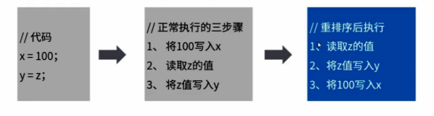

为了提高程序运行的性能，现代CPU在很多方面对程序进行了优化。例如：CPU高速缓存。尽可能的避免处理器访问主存的时间开销，处理器大多会利用缓存来提高性能。

## 多级缓存

### 等级划分

CPU的缓存分为三个级别，离CPU越远等级越大：

- L1 Cache(一级缓存)是CPU第一层高速缓存，分为**数据缓存**和**指令缓存**。一般服务器CPU的L1缓存容量通常在 32-4096KB（实在是太小了）。
- L2 Cache(二级缓存) 由于L1级高速缓存容量的限制，为了再次提高CPU的运算速度，在CPU外部放置一个高速存储器（由于在外部，有延迟导致速度还是不够快）。
- L3 现在的都是内置的。L3缓存的应用可以进一步降低内存延迟，同时提升大数据量计算时的处理器性能。具有较大L3缓存的处理器提供更有效的文件系统缓存行为，及较短消息和处理器队列长度。一般是多核共享一个L3缓存。

### 缓存的同步协议

多CPU读取同样的数据进行缓存，进行不同的运算之后，最终写入主内存，那么以哪个CPU为准？

这些 CPU 厂商就制定了一个缓存一致性的协议，就是 MESI协议，规定每条缓存有一个状态位，同时定义了四个状态：

- 修改态(Modified) ：此cache行已被修改过(脏行)，内容已不同于主存，为此cache专有

- 专有态(Exclusive)：此cache行内容同于主存，但不出现于其他cache中；

- 共享态(Shared)：此cache行内容同于主存，但也出现于其他cache中；

- 无效态(Invalid)：此cache行内容无效(空行)；

多处理器时，单个CPU对缓存中数据进行了改动，需通知给其他CPU。也就是说，CPU处理要控制自己的读写操作，还要监听其他CPU发出的通知，从而保证数据的**最终一致**。

缓存中的数据与主存的数据并不是实时同步的，各CPU核心间的缓存数据也不是实时同步的。在同一时间点，各个CPU所看到同一内存地址的数据可能是不一致的，就会存在线程安全问题。

## 指令重排

当CPU**写缓存时**发现缓存区块正被其他CPU占用，为了提高CPU处理性能，可能将后面的**读缓存命令优先执行**。

**重排需要遵循 as-if-serial 语义**：不管怎么重排序(编译器和处理器为了提高并行度)，(单线程)程序的执行结果不能被改变。编译器，runtime 和处理器都必须遵守 as-if-serial 语义。也就是说：编译器和处理器**不会对存在数据依赖关系的操作做重排序**。

`as-if-serial语义`把单线程程序保护了起来，换句话说：`as-if-serial语义`仅在单CPU单线程的情况下能保证结果正确。多核多线程中，指令逻辑无法分辨因果关系，可能会出现**乱序执行**，导致程序运行结果错误，就会存在线程安全问题。

## 内存屏障

不论是缓存同步还是指令重排，都是线程不安全的。

处理器提供了两个内存屏障指令(Memory Barrier)用于解决缓存同步和指令重排的问题。 

- 读内存屏障(Load Memory Barrier)：在指令前插入Load Barrier，可以让高速缓存中的数据失效，强制重新从主内存加载数据。强制读取主内存内容，让CPU缓存与主内存保持一致，避免了缓存导致的一致性问题。

- 写内存屏障(Store Memory Barrier)：在指令后插入Store Barrier，能让写入缓存中的最新数据更新写入主内存，让其他线程可见。强制写入主内存，这种显示调用，CPU就不会因为性能考虑而去对指令重排。

