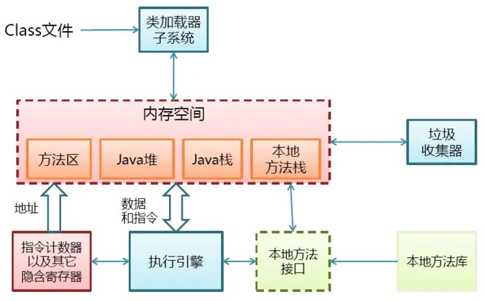
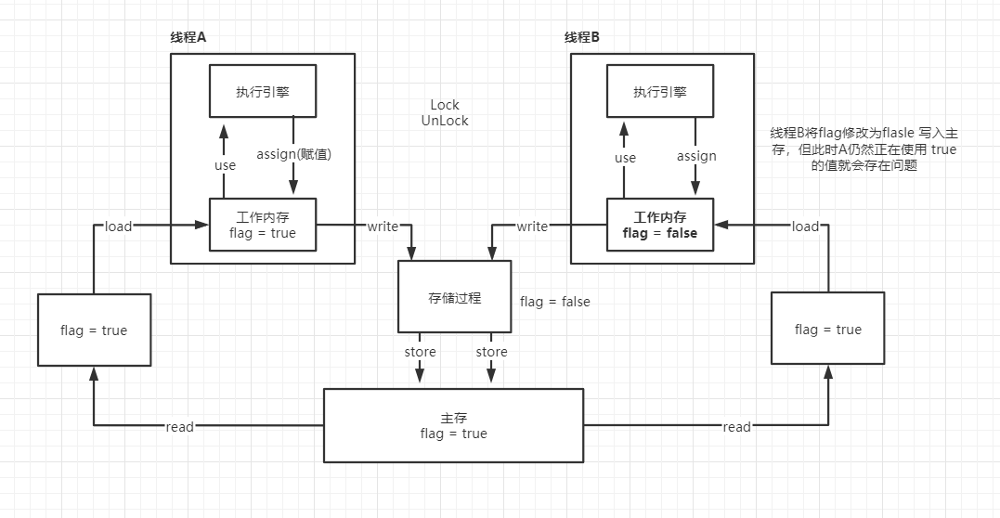
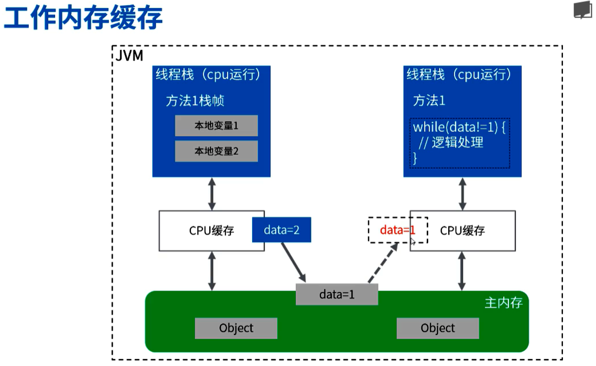
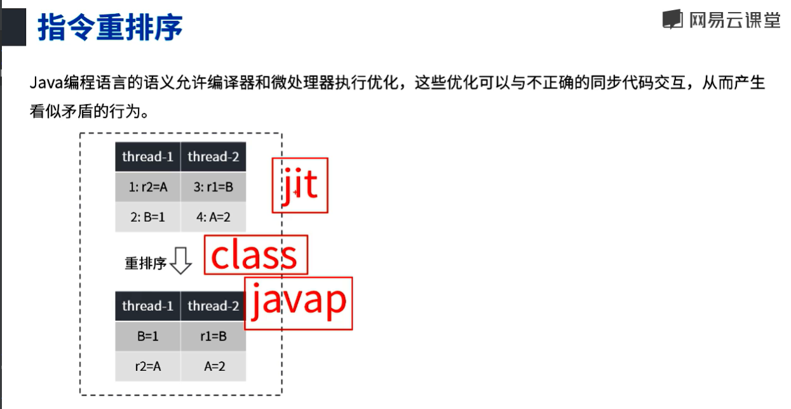
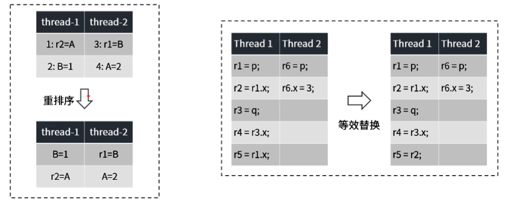

JMM全称Java Memory Model，Java内存模型是JSR133里指出了JMM是用来定义一个**一致的、跨平台**的内存模型，是缓存一致性协议，用于屏蔽掉各种硬件和操作系统的内存访问差异，让Java程序在各种平台下都能达到一致的并发效果。

## 区分开内存结构

内存结构和内存模型完全是两个东西，内存结构是下图中的这些



## 什么是内存模型

在多CPU的系统中，每个CPU都有多级缓存，一般分为L1、L2、L3缓存。因为这些缓存的存在，提升了吞吐量，减轻了数据总线上数据传输的压力，同时也带来了很多新的挑战，比如两个CPU同时去操作同一个内存地址，会发生什么？在什么条件下，它们可以看到相同的结果？这些都是需要解决的。

所以在CPU的层面，内存模型定义了一个充分必要条件，保证其它CPU的写入动作对该CPU是可见的，而且该CPU的写入动作对其它CPU也是可见的，那这种可见性，应该如何实现呢？

有些处理器提供了强内存模型，从硬件层面上支持所有CPU在任何时候都能看到内存中任意位置相同的值。大多数处理器提供的是弱内存模型，需要执行一些特殊指令（`Memory Barriers`内存屏障），刷新CPU缓存的数据到内存中，保证这个写操作能够被其它CPU可见，或者将CPU缓存的数据设置为无效状态，保证其它CPU的写操作对当前CPU可见。

内存屏障除了实现CPU之前的数据可见性之外，还有一个重要的职责是**禁止指令的重排序**。重排序可以发生在好几个地方：编译器、运行时、JIT等，通过内存屏障的功能，可以禁止一些不必要、或者会带来负面影响的重排序优化，在内存模型的范围内，实现更高的性能，同时保证程序的正确性。

## Java中的内存模型

- 在Java内存模型（JMM）中，描述了在多线程代码中哪些行为是规范正确的，以及多线程之间如何进行通信，代码中变量的读写行为如何反应到内存、CPU缓存的底层细节。Java内存模型中定义了它们的行为，确保正确同步的Java代码在所有的处理器架构上都能正确执行。
- 在Java中包含了几个关键字：volatile、final 和 synchronized，帮助程序员把代码中的并发需求描述给编译器、解释器，再转成机器指令下达给处理器。

### 内存可见性

不同线程拥有各自的私有**工作内存**，当线程需要读取或修改某个变量时，不能直接去操作**主内存**中的变量，而是需要将这个变量读取到线程的**工作内存**的**变量副本**中，当该线程修改其变量副本的值后，**其它线程并不能立刻读取到新值**，需要将修改后的值**刷新到主内存中**，其它线程才能**从主内存读取到修改后的值**。



线程A从主存中读到值flag=true，加载到自己的工作内存中（堆区），由执行引擎处理后将值再赋值给工作内存，写入存储过程（存储过程就是把store操作从工作内存中得到的变量放入主存中的操作）。

lock 作用于主内存的变量，把一个变量标识为线程独占状态，unlock 也是作用于主内存的变量，将被锁定的变量释放出来，释放后才能被其它线程锁定。

> 多线程操作线程共享的变量时，变量被其中一个线程修改后，并不能去实时修改其它线程正在使用该变量的值，怎么解决这个问题？

在下面这个实例中，线程A从主内存中读取到n=0，加载到自己的工作内存，一秒钟后，main线程把n的值改为1后写回主内存，此时A还没有拿到最新的值。所以线程A是不会停止执行的。

```java
public static int n = 0;
public void test() throws InterruptedException {
    new Thread(() -> {
        while (n == 0) {
        }
    }, "A").start();
	
    // 休眠 1s 后修改n=1，能否停止线程A？
    Thread.sleep(1000);
    n = 1;
    System.out.println("线程停止了吗？");
}
```

解决：当主存中的值发生修改后，应该通知所有操作主存变量的线程。在Java中我们可以使用 volatile 关键字来解决这个问题。

下面继续对线程可见性问题进行剖析。

### 线程访问数据的可见性问题

缓存引起的可见性问题。当主存中的data发生改变后，其他线程栈中的使用的 data 是不能够及时修改的。



#### 指令重排序引起的可见性问题

在Java层面，指令重排序不能够通过 javap 查看出class文件中的重排序，而是发生在运行时的编译器（JIT - Just In Time），将字节码进行重排序编译机器语言（汇编）。

> 什么是Just In Time编译器?

Java程序一开始是通过解释器（Interpreter）进行解释执行的。当JVM发现某个方法或代码块运行特别频繁时，就会把这些代码认定为“热点代码（Hot Spot Code）”，然后JVM会把这些代码编译成与本地平台相关的机器码，并进行各种层次的优化，完成这个任务的编译器称为：即时编译器（Just In Time Compiler，JIT）。
JIT编译器是“动态编译器”的一种，相对的“静态编译器”则是指的比如：C/C++的编译器。
注意：
JIT并不是JVM的必须部分，JVM规范并没有规定JIT必须存在，更没有限定和指导JIT。但是，JIT性能的好坏、代码优化程度的高低却是衡量一款JVM是否优秀的最关键指标之一，也是虚拟机中最核心且最能体现虚拟机技术水平的部分。



还可能发生等效替换。



将上面这些代码java.exe 编译成class字节码加载到JVM之后，通过运行时编译器JIT将class字节码转成汇编指令后进行重排序或等效替换。 

在运行时，JVM会根据代码的调用情况进行判断：如果 n=0，那么while(n==0) 就相当于是一个死循环成为热点代码，那么JIT就会认为可以执行成为 if(n==0){while(true){}} 这样的优化，就不会再回去读取 n 的值，相当于执行了一次Java层面的重排序。

```java
int n = 0;
while (n == 0) {}  被JIT编译器指令重排序为 if(n==0){while(true){}}
```

如果代码改为加锁的方式，虚拟机对于这种关键的代码段就不会进行优化处理了。

```java
new Thread(() -> {
    while (n == 0) {
        synchronized(this){
            add();
        }
    }
}, "A").start();
```

JMM 可以通过 happens-before 模型向程序员提供跨线程的内存可见性保证。

#### happen-before原则

从JDK1.5开始，引入了一个 happens-before 的概念来阐述多个线程操作共享变量的可见性问题。所以可以认为在JMM中，如果一个操作执行的结果需要对另一个操作可见，那么这两个操作必须满足 happens-before 原则。

1. 程序顺序规则：一个线程内，按照程序代码顺序，书写在前面的操作先行发生与书写在后面的操作。

2. 监视器锁规则：一个unlock操作先行发生与后面对同一个锁的lock操作者，这里必须指同一个锁，后面指的是时间上的先后顺序。

3. volatile变量规则：对一个volatile变量的写操作先行发生于后面对这个变量的读操作，这里的后面同样指时间上的先后顺序。

4. 线程启动规则：Thread 对象的 start() 方法先行发生于此线程的任意动作。

5. 线程终止规则：线程中的所有操作都先行发生于对此线程的终止检测，我们可以通过thread.join方法结束，thread.isAlive的返回值等手段检测到线程已经终止执行。

6. 线程中断规则：对线程interrupt方法的调用先行发生于被中断线程的代码监测到中断时间的发生，可以通过interrupt方法检测到是否又中断发生。

7. 对象终结规则：一个对象的初始化完成，先行发生于它的finalize方法的开始。

8. 传递性：如果A先行发生于B，B先行发生于C，则A先行发生于C。

### 关键字 `final` 在JMM中的处理

在下面这个实例中，在read() 方法中，一个变量加了final修饰，一个没加。

在多线程的情况下未加final修饰符变量的值，有可能为0，不保证值为构造函数中的赋值。

```java
class A {
    final int x;
    int y;
    static A a;

    public A() {
        x=3;
        y=4;
    }

    static void write(){
        a = new A();
    }

    static void read(){
        if(f!=null){
            int i = a.x; // 肯定是3
            int j = a.y; // 可能是0
        }
    }
}
```

读取该共享对象的final成员变量之前，先要读取共享的对象。伪代码示例：r = new A()；k = r.a 这两个操作不能重排序。

