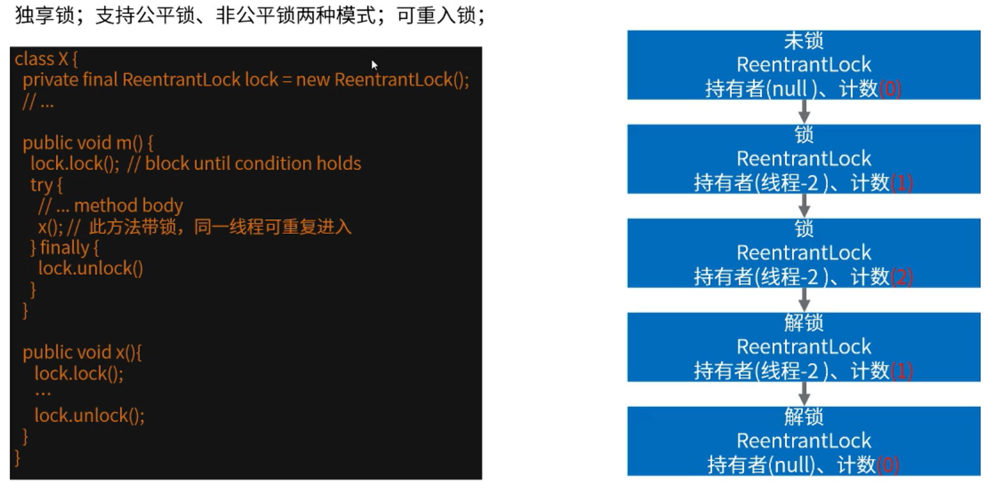
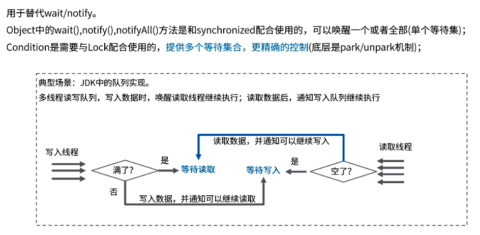

主要有读写锁和可重入锁两个重要的实现。

```java
public interface Lock {
    void lock();
    // 在获取锁的过程中可以中断当前线程
    void lockInterruptibly() throws InterruptedException;
    // 尝试非阻塞地获取锁，立即返回
    boolean tryLock();
    boolean tryLock(long time, TimeUnit unit) throws InterruptedException;
    void unlock();
    Condition newCondition();
}
```

## ReentrantLock

**ReentrantLock** 实现了 **Lock**接口，**Lock**接口中定义了 **lock**与 **unlock**相关操作，并且还存在 **newCondition**方法，表示生成一个条件。

```java
// AQS 核心代码
abstract static class Sync extends AbstractQueuedSynchronizer {
     private static final long serialVersionUID = -5179523762034025860L;
     
     // 获取锁
     abstract void lock();
     
     // 非公平方式获取
     final boolean nonfairTryAcquire(int acquires) {
         // 当前线程
         final Thread current = Thread.currentThread();
         // 获取状态
         int c = getState();
         if (c == 0) { // 表示没有线程正在竞争该锁
             if (compareAndSetState(0, acquires)) { // 比较并设置状态成功，状态0表示锁没有被占用
                 // 设置当前线程独占
                 setExclusiveOwnerThread(current); 
                 return true; // 成功
             }
         }
         else if (current == getExclusiveOwnerThread()) { // 当前线程拥有该锁
             int nextc = c + acquires; // 增加重入次数
             if (nextc < 0) // overflow
                 throw new Error("Maximum lock count exceeded");
             // 设置状态
             setState(nextc); 
             // 成功
             return true; 
         }
         // 失败
         return false;
     }
     
     // 试图在共享模式下获取对象状态，此方法应该查询是否允许它在共享模式下获取对象状态，如果允许，则获取它
     protected final boolean tryRelease(int releases) {
         int c = getState() - releases;
         if (Thread.currentThread() != getExclusiveOwnerThread()) // 当前线程不为独占线程
             throw new IllegalMonitorStateException(); // 抛出异常
         // 释放标识
         boolean free = false; 
         if (c == 0) {
             free = true;
             // 已经释放，清空独占
             setExclusiveOwnerThread(null); 
         }
         // 设置标识
         setState(c); 
         return free; 
     }
     
     // 判断资源是否被当前线程占有
     protected final boolean isHeldExclusively() {
         return getExclusiveOwnerThread() == Thread.currentThread();
     }
 
     // 新生一个条件
     final ConditionObject newCondition() {
         return new ConditionObject();
     }
 
     // 返回资源的占用线程
     final Thread getOwner() {        
         return getState() == 0 ? null : getExclusiveOwnerThread();
     }
     // 返回状态
     final int getHoldCount() {            
         return isHeldExclusively() ? getState() : 0;
     }
 
     // 资源是否被占用
     final boolean isLocked() {        
         return getState() != 0;
     }
 
     // 自定义反序列化逻辑
     private void readObject(java.io.ObjectInputStream s)
         throws java.io.IOException, ClassNotFoundException {
         s.defaultReadObject();
         setState(0); // reset to unlocked state
     }
 }
```

独享锁、支持公平锁和非公平锁两种模式，可重入锁。



初始时持有者为null，计数是当前调用lock()方法加锁的次数，unlock()会将计数减1，当计数为0时，则表示当前锁被释放。（获取当前锁的次数 getHoldCount()）

可重入锁的话，做了一次加锁就一定要有对应的一次解锁，否则产生死锁。	

## ReadWriteLock（注：不是Lock锁的子类）

维护一对关联锁，一个用于只读操作，一个用于写入;读锁可以由多个读线程同时持有，写锁是排他的。

读锁拒绝其他线程获得写锁，读锁不拒绝其他线程获得读锁，多个上了读锁的线程可以并发读不会阻塞。多个读锁同时作用期间，其他想上写锁的线程都处在等待状态，当最后一个读锁释放后，才有可能上锁。

适合读取线程比写入线程多的场景，改进互斥锁的性能，示例场景:缓存组件、集合的并发线程安全性改造。

```java
// 读写锁案例
public class LockDemo2 {
    ReadWriteLock lock = new ReentrantReadWriteLock();

    public static void main(String[] args) {
        LockDemo2 lockDemo2 = new LockDemo2();

        for (int i = 0; i < 2; i++) {
            new Thread(() -> {
                lockDemo2.read(Thread.currentThread());
            }, "A" + i).start();
        }

        new Thread(() -> {
            lockDemo2.write(Thread.currentThread());
        }, "C").start();
    }

    // 多线程读，共享锁
    public void read(Thread t) {
        lock.readLock().lock();
        try {
            long start = System.currentTimeMillis();
            while (System.currentTimeMillis() - start <= 1) {
                System.out.println(t.getName() + "正在【读】操作");
            }
            System.out.println(t.getName() + "【读】操作完成");
        } finally {
            lock.readLock().unlock();
        }
    }

    // 独享锁
    public void write(Thread t) {
        lock.writeLock().lock();
        try {
            long start = System.currentTimeMillis();
            while (System.currentTimeMillis() - start <= 1) {
                System.out.println(t.getName() + "正在【写】操作");
            }
            System.out.println(t.getName() + "【写】操作完成");
        } finally {
            lock.writeLock().unlock();
        }
    }
}
```

## ReadWriteLock锁降级

锁降级指的是写锁降级成为读锁。把持住当前拥有的写锁的同时，再获取到读锁,随后释放写锁的过程。

写锁是线程独占，读锁是共享，所以写->读是升级。(读~>写, 是不能实现的)

```java
/**
 * 一个缓存demo，读写锁例子，实现读和写互斥、写和写互斥，但有可以多个并发的读，可提高系统性能
 * ReentrantReadWriteLock的应用场景中，使用写锁可能没有注意到缓存问题（击穿、雪崩、穿透）
 *
 * @author DengJun 2021/4/29
 */
public class LockDemo3 {
    // 数据
    private Map<String, Object> cache = new HashMap<>();
    // 读写锁
    private ReadWriteLock rwl = new ReentrantReadWriteLock();

    public Object getData(String key) {
        // 上读锁，多个读时可以并发，不会造成对数据的破坏
        rwl.readLock().lock();
        Object value = null;
        try {
            value = cache.get(key);
            // 如果数据为空
            if (value == null) {
                // 释放读锁上写锁，上写锁后，数据不能被读
                rwl.readLock().unlock();
                rwl.writeLock().lock();
                try {
                    // 此处判断是为防止多个线程同时进入到这里时，多个线程对数据进行重复写
                    if (value == null) {
                        // 如果没有数据，则去查DB获取数据
                        value = "XXX";
                    }
                } finally {
                    // 读取数据后释放写锁
                    rwl.writeLock().unlock();
                }
                // 获取完数据后，恢复读锁，重新读取数据
                rwl.readLock().lock();
            }
        } finally {
            // 重新读取数据释放读锁
            value = cache.get(key);
            rwl.readLock().unlock();
        }
        return value;
    }
}
```

## Condition



