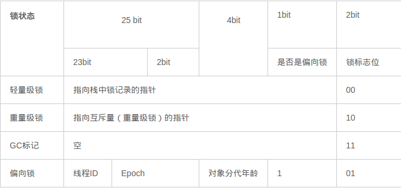
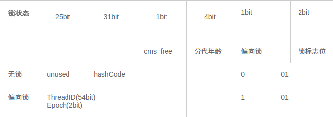
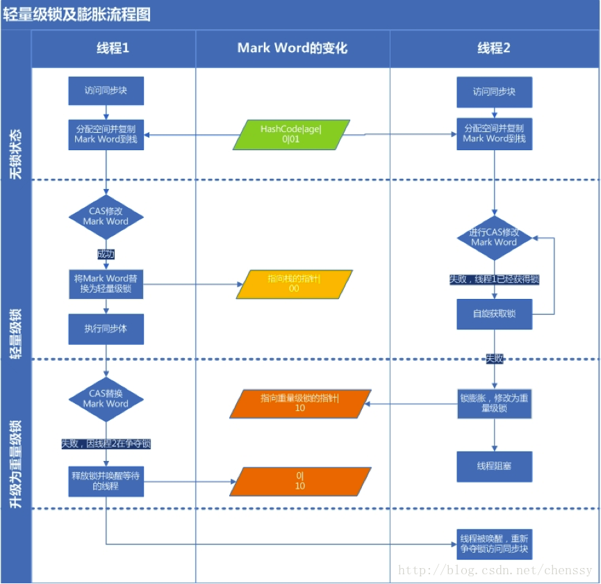
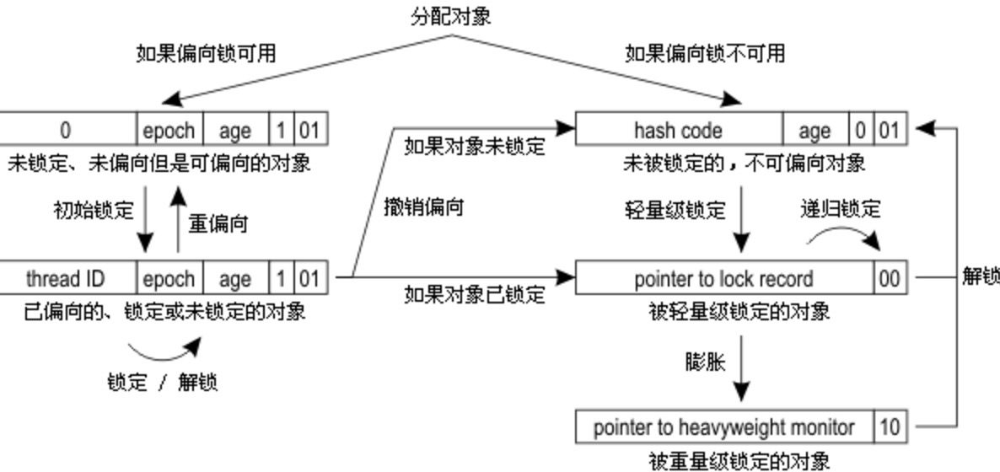

## synchronized的作用

synchronized（悲观锁又叫独享锁） 用于保障原子性、可见性、有序性。

1. 原子性：确保线程互斥的访问同步代码；
2. 可见性：保证共享变量的修改能够及时可见，其实是通过Java内存模型中的 “**对一个变量unlock操作之前，必须要同步到主内存中；如果对一个变量进行lock操作，则将会清空工作内存中此变量的值，在执行引擎使用此变量前，需要重新从主内存中load操作或assign操作初始化变量值**” 来保证的；
3. 有序性：有效解决重排序问题，即 “一个unlock操作先行发生(happen-before)于后面对同一个锁的lock操作”；

从语法上讲，Synchronized可以把任何一个非null对象作为"锁"，在HotSpot JVM实现中，锁有个专门的名字：**对象监视器（Object Monitor）**。Java中每个对象都与一个监视器相关联，一次只有一个线程可以对监视器进行加锁或解锁，试图锁定该监视器的其它线程都会被阻塞，直到它们可以获得该监视器上的锁定为止。什么是对象监视器？

## 监视器（Monitor）

大学有一门课叫操作系统，学过的同学应该都记得，监视器（Monitor）是操作系统实现同步的重要基础概念。监视器可以看做是一个只有一个服务台的银行门店，一次只能服务一个消费者。当有人正在服务台时，其他人必须在大厅等待。服务台空闲时，保安会从大厅选择下一个消费者去服务台，如果被选中的消费者正在门口接电话，那么保安会在他打完电话之后被重新选择去服务台办理业务。

在这个场景中，服务台看做是数据和代码，保安看做是监视器。监视器监视线程访问数据，确保同一时间只有一个线程能够访问数据和代码。

在Java的设计中，**每一个Java对象自打娘胎里出来就带了一把看不见的锁，它叫做监视器锁（monitor）**。对象监视器实际上就是与每个对象关联的Monitor对象，对象在内存中由对象头、实例数据、对齐填充三块区域组成，对象头包含Mark Word、Klass point、Monitor。

- Mark World：存储对象的HashCode、分代年龄、锁的标志位信息。
- Klass point：对象指向它的类元数据的指针，虚拟机通过这个指针来确定此对象是哪个类的实例。
- Monitor：Monitor中有Owner和计数器，Owner指向持有 Monitor 的线程，计数器从 0 开始记录进入数；另外还有 EntryList、WaitSet 两个队列，用来存放进入及等待获取锁的线程。

synchronized 相关的字节码指令：ACC_SYNCHRONIZED 修饰方法、monitorenter+monitorexit 修饰代码块。


进入 synchronized 同步块时，执行 monitorenter 指令，尝试获取当前对象 Monitor 的锁。对象监视器是对象锁，锁的是对象而非引用变量，作用粒度是对象 ，可以用来实现对临界资源的同步互斥（Mutex）访问。

在Java虚拟机（HotSpot）中，Monitor是由ObjectMonitor实现的，其主要数据结构如下（位于HotSpot虚拟机源码ObjectMonitor.hpp文件，C++实现的）：

```c++
ObjectMonitor() {
    _header       = NULL;
    _count        = 0; // 记录个数
    _waiters      = 0,
    _recursions   = 0;
    _object       = NULL;
    _owner        = NULL;
    _WaitSet      = NULL; // 处于wait状态的线程，会被加入到_WaitSet
    _WaitSetLock  = 0 ;
    _Responsible  = NULL ;
    _succ         = NULL ;
    _cxq          = NULL ;
    FreeNext      = NULL ;
    _EntryList    = NULL ; // 处于等待锁block状态的线程，会被加入到该列表
    _SpinFreq     = 0 ;
    _SpinClock    = 0 ;
    OwnerIsThread = 0 ;
}
```

ObjectMonitor中有两个队列，\_WaitSet 和 \_EntryList，用来保存ObjectWaiter对象列表（ 每个等待锁的线程都会被封装成ObjectWaiter对象 ），_owner指向持有ObjectMonitor对象的线程，当多个线程同时访问一段同步代码时：

> 1. 先会进入 _EntryList 集合，当线程获取到对象的monitor后，进入 _Owner区域并把monitor中的owner变量设置为当前线程，同时monitor中的计数器count加1；
> 2. 若线程调用 wait() 方法，将释放当前持有的monitor，owner变量恢复为null，count自减1，同时该线程进入 WaitSet集合中等待被唤醒；
> 3. 若当前线程执行完毕，也将释放monitor（锁）并复位count的值，以便其他线程进入获取monitor(锁)；

同时**，Monitor对象存在于每个Java对象的对象头Mark Word中（存储的指针的指向），Synchronized锁便是通过这种方式获取锁的，也是为什么Java中任意对象可以作为锁的原因，同时notify/notifyAll/wait等方法会使用到Monitor锁对象，所以必须在同步代码块中使用。**

监视器Monitor有两种同步方式：互斥与协作。多线程环境下线程之间如果需要共享数据，需要解决互斥访问数据的问题，监视器可以确保监视器上的数据在同一时刻只会有一个线程在访问。

什么时候需要协作？ 比如：

> 一个线程向缓冲区写数据，另一个线程从缓冲区读数据，如果读线程发现缓冲区为空就会等待，当写线程向缓冲区写入数据，就会唤醒读线程，这里读线程和写线程就是一个合作关系。JVM通过Object类的wait方法来使自己等待，在调用wait方法后，该线程会释放它持有的监视器，直到其他线程通知它才有执行的机会。一个线程调用notify方法通知在等待的线程，这个等待的线程并不会马上执行，而是要通知线程释放监视器后，它重新获取监视器才有执行的机会。如果刚好唤醒的这个线程需要的监视器被其他线程抢占，那么这个线程会继续等待。Object类中的notifyAll方法可以解决这个问题，它可以唤醒所有等待的线程，总有一个线程执行。


如上图所示，一个线程通过1号门进入Entry Set(入口区)，如果在入口区没有线程等待，那么这个线程就会获取监视器成为监视器的Owner，然后执行监视区域的代码。如果在入口区中有其它线程在等待，那么新来的线程也会和这些线程一起等待。线程在持有监视器的过程中，有两个选择，一个是正常执行监视器区域的代码，释放监视器，通过5号门退出监视器；还有可能等待某个条件的出现，于是它会通过3号门到Wait Set（等待区）休息，直到相应的条件满足后再通过4号门进入重新获取监视器再执行。

注意：

> 当一个线程释放监视器时，在入口区和等待区的等待线程都会去竞争监视器，如果入口区的线程赢了，会从2号门进入；如果等待区的线程赢了会从4号门进入。只有通过3号门才能进入等待区，在等待区中的线程只有通过4号门才能退出等待区，也就是说一个线程只有在持有监视器时才能执行wait操作，处于等待的线程只有再次获得监视器才能退出等待状态。

## synchronized的基本使用

总共就三种用法：修饰代码块、修饰实例方法、修饰静态方法。

1. 修饰代码块时，监视器锁是括号中的那个对象。
1. 修饰实例方法时，监视器锁是对象实例（this）
1. 修饰静态方法时，监视器锁是对象的Class实例，因为Class数据存在于永久代，因此静态方法锁相当于该类的一个全局锁；

## 同步原理

synchronized在软件层面依赖JVM，而 j.u.c.Lock 在硬件层面依赖特殊的CPU指令。

### 修饰代码块的原理

当一个线程访问同步代码块时，首先是需要得到锁才能执行同步代码，当退出或者抛出异常时必须要释放锁，那么它是如何来实现这个机制的呢？我们先看一段简单的代码：

```java
public class SynchronizedDemo {
    public void method() {
        synchronized (this) {
            System.out.println("Method 1 start");
        }
    }
}
```

利用jclasslib插件查看编译后的字节码


#### monitorenter

每个对象都是一个监视器锁（monitor）。当monitor被占用时就会处于锁定状态，线程执行monitorenter指令时尝试获取monitor的所有权，过程如下：

- 如果monitor的进入数为0，则该线程进入monitor，然后将进入数设置为1，该线程即为monitor的所有者；
- 如果线程已经占有该monitor，只是再次进入，则进入monitor的进入数 +1；
- 如果其他线程已经占用了monitor，则该线程进入阻塞状态，直到monitor的进入数为0，再重新尝试获取monitor的所有权；

#### monitorexit

执行monitorexit的线程必须是objectref所对应的monitor的所有者。指令执行时，monitor的进入数减1，如果减1后进入数为0，那线程退出monitor，不再是这个monitor的所有者。其他被这个monitor阻塞的线程可以尝试去获取这个 monitor 的所有权。

注意观察图上出现了两次monitorexit，第1次是同步正常退出释放锁，第2次是发生异步退出释放锁；

### 修饰实例方法的原理

```java
    public synchronized void method() {
        System.out.println("javer");
    }
```

通过`javap -v` 命令查看字节码中的附加信息。


方法的同步并没有通过指令 `monitorenter` 和 `monitorexit` 来完成（理论上其实也可以通过这两条指令来实现），不过相对于普通方法，其常量池中多了 `ACC_SYNCHRONIZED` 标示符。JVM就是根据该标示符来实现方法的同步的：

> 当方法调用时，调用指令将会检查方法的 ACC_SYNCHRONIZED 访问标志是否被设置，如果设置了，执行线程将先获取monitor，获取成功之后才能执行方法体，方法执行完后再释放monitor。**在方法执行期间，其他任何线程都无法再获得同一个monitor对象。**

### 总结

两种同步方式本质上没有区别，只是方法的同步是一种隐式的方式来实现，无需通过字节码来完成。两个指令的执行是JVM通过调用操作系统的互斥原语mutex来实现，被阻塞的线程会被挂起、等待重新调度，会导致“用户态和内核态”两个态之间来回切换，对性能有较大影响。

Synchronized的语义底层是通过一个monitor的对象来完成，其实wait/notify等方法也依赖于monitor对象，这就是为什么只有在同步的块或者方法中才能调用wait/notify等方法，否则会抛出`java.lang.IllegalMonitorStateException`的异常的原因。

注意：

- 在Java 中，只有将对象作为锁这种说法，没有锁方法这种说法。
- 在Java中，锁就是对象，对象可以映射成锁，哪个线程拿到这把锁，哪个线程就可以执行这个对象中的 synchronized 同步方法。
- 如果在某对象中使用了 synchronized 关键字声明非静态方法，那么这个对象就被当成锁。

> 这里存在一个误区：synchronized修饰方法时，如果该方法没有static关键字不是静态方法，则锁的只是这个对象，也就是说在另一个线程中新创建一个这个类的对象，两个线程操作不是同一把锁是不会产生竞态条件的。如果该方法上使用了静态关键字，则当前锁锁的是这个对象的类，使用该类重新创建对象多个线程的操作该对象都会产生静态条件。

## 同步概念

### Java对象的结构组成

在JVM中，**对象在内存中的布局分为三块区域：对象头、实例数据和对齐填充。**如下图所示：


1. 实例数据：存放类的属性数据信息，包括父类的属性信息；
2. 对齐填充：填充数据不是必须存在的，仅仅是为了字节对齐，由于虚拟机要求对象起始地址必须是8字节的整数倍。
3. 对象头：**Java对象头一般占有2个机器码（在32位虚拟机中，1个机器码等于4字节，也就是32bit，在64位虚拟机中，1个机器码是8个字节，也就是64bit），但是如果对象是数组类型，则需要3个机器码，因为JVM虚拟机可以通过Java对象的元数据信息确定Java对象的大小，但是无法从数组的元数据来确认数组的大小，所以用一块来记录数组长度。**

### Java对象头的结构组成

[原文链接](https://openjdk.java.net/groups/hotspot/docs/HotSpotGlossary.html)

Mark World：存储对象的hashCode、锁信息、GC分代年龄、锁状态标志、线程持有的锁、偏向线程 ID、偏向时间戳等。

Class Metadata Address：存储到对象类型数据的指针。

Array Length：数组的长度（如果当前对象是数组）。

下图是Java对象头 无锁状态下Mark Word部分的存储结构（32位虚拟机）：


对象头信息是与对象自身定义的数据无关的额外存储成本，但是考虑到虚拟机的空间效率，Mark Word 被设计成一个非固定的数据结构以便在极小的空间内存存储尽量多的数据，它会根据对象的状态复用自己的存储空间，也就是说，Mark Word会随着程序的运行发生变化，可能变化为存储以下4种数据：



Mark Word可能存储4种数据。在64位虚拟机下，Mark Word是64bit大小的，其存储结构如下：



64位Mark Word存储结构。对象头的最后两位存储了锁的标志位，01是初始状态，未加锁，其对象头里存储的是对象本身的哈希码，随着锁级别的不同，对象头里会存储不同的内容。偏向锁存储的是当前占用此对象的线程ID；而轻量级则存储指向线程栈中锁记录的指针。从这里我们可以看到，“锁”这个东西，可能是个锁记录+对象头里的引用指针（判断线程是否拥有锁时将线程的锁记录地址和对象头里的指针地址比较)，也可能是对象头里的线程ID（判断线程是否拥有锁时将线程的ID和对象头里存储的线程ID比较）。 


## 对象头中Mark Word与线程中Lock Record

Lock Record ：用于轻量级锁优化，在线程进入同步代码块的时候，如果此同步对象没有被锁定，即它的锁标志位是01，则虚拟机首先在当前线程的栈中创建 Lock Record 的空间，用于存储锁对象的Mark Word的拷贝，官方把这个拷贝称为Displaced Mark Word。在拷贝完成后，首先会挂起持有偏向锁的线程，因为要进行尝试修改锁记录指针，MarkWord会有变化，所有线程会利用CAS尝试将MarkWord的锁记录指针改为指向自己(线程)的锁记录，然后 lock record的owner指向对象的markword，修改成功的线程将获得轻量级锁。失败则线程升级为重量级锁。释放时会检查markword中的lockrecord指针是否指向自己(获得锁的线程lockrecord)，使用原子的CAS将Displaced Mark Word替换回对象头，如果成功，则表示没有竞争发生，如果替换失败则升级为重量级锁。整个过程中，LockRecord是一个线程内独享的存储，每一个线程都有一个可用`Monitor Record`列表。

源码如下：

```c++
CASE(_monitorenter): {
    oop lockee = STACK_OBJECT(-1);
    // derefing's lockee ought to provoke implicit null check
    CHECK_NULL(lockee);
    // find a free monitor or one already allocated for this object
    // if we find a matching object then we need a new monitor
    // since this is recursive enter
    BasicObjectLock* limit = istate->monitor_base();
    BasicObjectLock* most_recent = (BasicObjectLock*) istate->stack_base();
    BasicObjectLock* entry = NULL;
    while (most_recent != limit ) {
        if (most_recent->obj() == NULL) entry = most_recent;
        else if (most_recent->obj() == lockee) break;
        most_recent++;
    }
    if (entry != NULL) {
        entry->set_obj(lockee);
        int success = false;
        uintptr_t epoch_mask_in_place = (uintptr_t)markOopDesc::epoch_mask_in_place;

        markOop mark = lockee->mark();
        intptr_t hash = (intptr_t) markOopDesc::no_hash;
        // implies UseBiasedLocking
        if (mark->has_bias_pattern()) {
            uintptr_t thread_ident;
            uintptr_t anticipated_bias_locking_value;
            thread_ident = (uintptr_t)istate->thread();
            anticipated_bias_locking_value =
                (((uintptr_t)lockee->klass()->prototype_header() | thread_ident) ^ (uintptr_t)mark) &
                ~((uintptr_t) markOopDesc::age_mask_in_place);

            if  (anticipated_bias_locking_value == 0) {
                // already biased towards this thread, nothing to do
                if (PrintBiasedLockingStatistics) {
                    (* BiasedLocking::biased_lock_entry_count_addr())++;
                }
                success = true;
            }
            else if ((anticipated_bias_locking_value & markOopDesc::biased_lock_mask_in_place) != 0) {
                // try revoke bias
                markOop header = lockee->klass()->prototype_header();
                if (hash != markOopDesc::no_hash) {
                    header = header->copy_set_hash(hash);
                }
                if (lockee->cas_set_mark(header, mark) == mark) {
                    if (PrintBiasedLockingStatistics)
                        (*BiasedLocking::revoked_lock_entry_count_addr())++;
                }
            }
            else if ((anticipated_bias_locking_value & epoch_mask_in_place) !=0) {
                // try rebias
                markOop new_header = (markOop) ( (intptr_t) lockee->klass()->prototype_header() | thread_ident);
                if (hash != markOopDesc::no_hash) {
                    new_header = new_header->copy_set_hash(hash);
                }
                if (lockee->cas_set_mark(new_header, mark) == mark) {
                    if (PrintBiasedLockingStatistics)
                        (* BiasedLocking::rebiased_lock_entry_count_addr())++;
                }
                else {
                    CALL_VM(InterpreterRuntime::monitorenter(THREAD, entry), handle_exception);
                }
                success = true;
            }
            else {
                // try to bias towards thread in case object is anonymously biased
                markOop header = (markOop) ((uintptr_t) mark & ((uintptr_t)markOopDesc::biased_lock_mask_in_place |
                                                                (uintptr_t)markOopDesc::age_mask_in_place |
                                                                epoch_mask_in_place));
                if (hash != markOopDesc::no_hash) {
                    header = header->copy_set_hash(hash);
                }
                markOop new_header = (markOop) ((uintptr_t) header | thread_ident);
                // debugging hint
                DEBUG_ONLY(entry->lock()->set_displaced_header((markOop) (uintptr_t) 0xdeaddead);)
                    if (lockee->cas_set_mark(new_header, header) == header) {
                        if (PrintBiasedLockingStatistics)
                            (* BiasedLocking::anonymously_biased_lock_entry_count_addr())++;
                    }
                else {
                    CALL_VM(InterpreterRuntime::monitorenter(THREAD, entry), handle_exception);
                }
                success = true;
            }
        }

        // traditional lightweight locking
        if (!success) {
            markOop displaced = lockee->mark()->set_unlocked();
            entry->lock()->set_displaced_header(displaced);
            bool call_vm = UseHeavyMonitors;
            if (call_vm || lockee->cas_set_mark((markOop)entry, displaced) != displaced) {
                // Is it simple recursive case?
                if (!call_vm && THREAD->is_lock_owned((address) displaced->clear_lock_bits())) {
                    entry->lock()->set_displaced_header(NULL);
                } else {
                    CALL_VM(InterpreterRuntime::monitorenter(THREAD, entry), handle_exception);
                }
            }
        }
        UPDATE_PC_AND_TOS_AND_CONTINUE(1, -1);
    } else {
        istate->set_msg(more_monitors);
        UPDATE_PC_AND_RETURN(0); // Re-execute
    }
}
```

**Lock Record是线程私有的数据结构**，每一个线程都有一个可用Lock Record列表，同时还有一个全局的可用列表。每一个被锁住的对象Mark Word都会和一个Lock Record关联（对象头的MarkWord中的Lock Word指向Lock Record的起始地址），同时 Lock Record 中有一个 Owner 字段存放拥有该锁的线程的唯一标识（或者`object mark word`），表示该锁被这个线程占用。如下图所示为Lock Record的内部结构：

| Lock Record | 描述                                                         |
| ----------- | ------------------------------------------------------------ |
| Owner       | 初始时为NULL表示当前没有任何线程拥有该monitor record，当线程成功拥有该锁后保存线程唯一标识，当锁被释放时又设置为NULL； |
| EntryQ      | 关联一个系统互斥锁（semaphore），阻塞所有试图锁住monitor record失败的线程； |
| RcThis      | 表示blocked或waiting在该monitor record上的所有线程的个数；   |
| Nest        | 用来实现 重入锁的计数；                                      |
| HashCode    | 保存从对象头拷贝过来的HashCode值（可能还包含GC age）。       |
| Candidate   | 用来避免不必要的阻塞或等待线程唤醒，因为每一次只有一个线程能够成功拥有锁，如果每次前一个释放锁的线程唤醒所有正在阻塞或等待的线程，会引起不必要的上下文切换（从阻塞到就绪然后因为竞争锁失败又被阻塞）从而导致性能严重下降。Candidate只有两种可能的值0表示没有需要唤醒的线程1表示要唤醒一个继任线程来竞争锁。 |

## synchronized 锁重入

### 问题导入

> 如果一个线程调用了一个对象的同步方法，那么他还能不能在调用这个对象的另外一个同步方法呢？

synchronized 锁拥有重入锁的功能，当一个线程得到对象锁之后，再次请求此对象锁时是可以获取到该对象锁的，也就可以在一个 synchronized 方法 （块）的内部调用本类的其它加锁的方法（块），是可以直接得到锁的。

下面是一个synchronized可重入性验证的示例代码：

```java
public class Service{
    public synchronized  void fun1(){
        System.out.println("一号同步方法");
        fun2();
    }

    public synchronized void fun2(){
        System.out.println("二号同步方法");
        fun3();
    }

    public synchronized void fun3(){
        System.out.println("三号同步方法");
    }
}
```

```java
public class MyThread extends Thread {
    private Service service;
    
    public SynThreadText(Service service){
        this.service=service;
    }
    
    @Override
    public void run(){
        service.fun1();
    }

    public static void main(String[] args) {
        Service service = new Service();
        MyThread myThread = new MyThread(service);
        myThread.start();
    }
}
```

执行结果：

```
一号同步方法
二号同步方法
三号同步方法
```

### 定义

可重入锁又名递归锁，是指在同一个线程在外层方法获取锁的时候，再次进入该线程的内层方法会自动获取锁（前提锁对象得是同一个对象或者 class），不会因为之前已经获取过还没释放而阻塞。可重入锁的一个优点是可一定程度避免死锁。

### 原理

在object monitor 的源码中有一个 \_count 变量，当获取了该锁的线程再次获取锁时发现锁拥有者是自己，就会把 \_count＋1, 当释放锁后  \_count－1。当计数器值为 0 时，锁里面的线程标示被重置为 null，这时候被阻塞的线程会被唤醒来竞争获取该锁。

###  锁重入支持父类继承

既然 synchronized 支持对象的方法重入，那么他是否也支持子类继承父类的同步方法重入？

```java
public class SubClass extends SuperClass implements Runnable {
    @Override
    public void run(){
        this.subFun();
    }
	
    public synchronized  void subFun(){
        System.out.println("子类的同步方法");
        this.superSynFun();
    }
	
    public static void main(String[] args) {
        SubClass sub = new SubClass();
        Thread t = new Thread(sub);
        t.start();
    }

}

class SuperClass{
    public synchronized void superSynFun(){
        System.out.println("父类的同步方法");
    }
}
```

执行结果：

```
子类的同步方法
父类的同步方法
```

如果被重写的方法有synchronized关键字，在所重写方法如果不加 synchronized  修饰，那就是非同步方法。

## 锁的优化

### 自旋锁

**线程的阻塞和唤醒需要CPU从用户态转为核心态**，频繁的阻塞和唤醒对CPU来说是一件负担很重的工作，势必会给系统的并发性能带来很大的压力。同时我们发现在许多应用上面，对象锁的锁状态只会持续很短一段时间，为了这一段很短的时间频繁地阻塞和唤醒线程是非常不值得的。

所以引入自旋锁，何谓自旋锁？ 

所谓自旋锁就是指当一个线程尝试获取某个锁时，如果该锁已被其他线程占用，就一直循环检测锁是否被释放，而不是进入线程挂起或睡眠状态。

自旋锁适用于锁保护的临界区很小的情况，临界区很小的话，锁占用的时间就很短。自旋等待不能替代阻塞，虽然它可以避免线程切换带来的开销，但是它占用了CPU处理器的时间。如果持有锁的线程很快就释放了锁，那么自旋的效率就非常好，反之，自旋的线程就会白白消耗掉处理的资源，它不会做任何有意义的工作，典型的占着茅坑不拉屎，这样反而会带来性能上的浪费。所以说，自旋等待的时间（自旋的次数）必须要有一个限度，如果自旋超过了定义的时间仍然没有获取到锁，则应该被挂起。

自旋锁在JDK 1.4.2中引入，默认关闭，但是可以使用-XX:+UseSpinning开开启，在JDK1.6中默认开启。同时自旋的默认次数为10次，可以通过参数-XX:PreBlockSpin来调整。如果通过参数-XX:PreBlockSpin来调整自旋锁的自旋次数，会带来诸多不便。假如将参数调整为10，但是系统很多线程都是等你刚刚退出的时候就释放了锁（假如多自旋一两次就可以获取锁），是不是很尴尬。于是JDK1.6引入自适应的自旋锁，让虚拟机会变得越来越聪明。

### 适应性自旋锁

JDK 1.6引入了更加聪明的自旋锁，即自适应自旋锁。所谓自适应就意味着自旋的次数不再是固定的，它是由前一次在同一个锁上的自旋时间及锁的拥有者的状态来决定。那它如何进行适应性自旋呢？ 

**线程如果自旋成功了，那么下次自旋的次数会更加多，因为虚拟机认为既然上次成功了，那么此次自旋也很有可能会再次成功，那么它就会允许自旋等待持续的次数更多。反之，如果对于某个锁，很少有自旋能够成功，那么在以后要或者这个锁的时候自旋的次数会减少甚至省略掉自旋过程，以免浪费处理器资源。**

有了自适应自旋锁，随着程序运行和性能监控信息的不断完善，虚拟机对程序锁的状况预测会越来越准确，虚拟机会变得越来越聪明。

### 锁粗化

可通过JITWatch查看运行的过程。锁粗话概念比较好理解，就是将多个连续的加锁、解锁操作连接在一起，扩展成一个范围更大的锁。StringBuffer中的append方法上有synchronized同步关键字。每次append的时候都需要加锁操作，**JVM检测到对同一个对象连续加锁、解锁操作，会合并一个更大范围的加锁、解锁操作，即加锁解锁操作会移到for循环之外。**

```java
public void test() {
    StringBuffer sb = new StringBuffer();
    for (int i=0; i<100000; i++){
        sb.append(i+"");
    }
    // 优化后
    synchronized(this) {
        for (int i=0; i<100000; i++){
            // append的synchronized关键字会被消除
            sb.append(i+"");
        }
    }
}
```

### 锁消除

为了保证数据的完整性，在进行操作时需要对这部分操作进行同步控制，但是在有些情况下，JVM检测到不可能存在共享数据竞争，这是JVM会对这些同步锁进行锁消除。例如，StringBuffer类的append() 方法使用了 synchronized 关键字，是线程安全的，但是仅用在线程封闭的环境中，则锁会浪费资源，JIT就会对锁进行消除。

> 锁消除的依据是逃逸分析的数据支持

逃逸分析：当一个对象的指针被多个方法或线程引用时，我们称这个指针发生了逃逸，会发生逃逸的三个场景是全局变量赋值、方法返回值、实例引用传递。

```java
class A {  
    public static B b;  

    public void globalVariablePointerEscape() { // 给全局变量赋值，发生逃逸  
        b = new B();  
    }  

    public B methodPointerEscape() { // 方法返回值，发生逃逸  
        return new B();  
    }  

    public void instancePassPointerEscape() {  
        methodPointerEscape().printClassName(this); // 实例引用传递，发生逃逸  
    }  
}  

class B {  
    public void printClassName(A a) {  
        System.out.println(a.class.getName());  
    }  
}  
```

如果不存在竞争，为什么还需要加锁呢？所以锁消除可以节省毫无意义的请求锁的时间。变量是否逃逸，对于虚拟机来说需要使用数据流分析来确定，但是对于程序员来说这还不清楚么？

数据流：例如在方法中，将变量A的值赋值给了变量B，代码A=B的这个赋值过程粗略的称为数据流。

在明明知道不存在数据竞争的代码块前加上同步吗？但是有时候程序并不是我们所想的那样？虽然没有显示使用锁，但是在使用一些JDK的内置API时，如StringBuffer、Vector、HashTable等，这个时候会存在隐形的加锁操作。比如StringBuffer的append()方法，Vector的add()方法：

```java
public void vectorTest(){
    Vector<String> vector = new Vector<String>();
    for(int i = 0 ; i < 10 ; i++){
        vector.add(i + "");
    }
    System.out.println(vector);
}
```

在运行这段代码时，JVM可以明显检测到变量vector没有逃逸出方法vectorTest()之外，所以JVM可以大胆地将vector内部的加锁操作消除。

### 偏向锁

偏向锁是JDK6中的重要引进，因为HotSpot作者经过研究实践发现，在大多数情况下，锁不仅不存在多线程竞争，而且总是由同一线程多次获得，为了让线程获得锁的代价更低，引进了偏向锁。

偏向锁是在单线程执行代码块时使用的机制，如果在多线程并发的环境下（即线程A尚未执行完同步代码块，线程B发起了申请锁的申请），则一定会转化为轻量级锁或者重量级锁。

在JDK5中偏向锁默认是关闭的，而到了JDK6中偏向锁已经默认开启。如果并发数较大同时同步代码块执行时间较长，则被多个线程同时访问的概率就很大，就可以使用参数-XX:-UseBiasedLocking来禁止偏向锁(但这是个JVM参数，不能针对某个对象锁来单独设置)。

引入偏向锁主要目的是：为了在没有多线程竞争的情况下尽量减少不必要的轻量级锁执行路径。因为轻量级锁的加锁解锁操作是需要依赖多次CAS原子指令的，而偏向锁只需要在置换ThreadID的时候依赖一次CAS原子指令（由于一旦出现多线程竞争的情况就必须撤销偏向锁，所以偏向锁的撤销操作的性能损耗也必须小于节省下来的CAS原子指令的性能消耗）。

> 轻量级锁是为了在线程交替执行同步块时提高性能，而偏向锁则是在只有一个线程执行同步块时进一步提高性能。

那么偏向锁是如何来减少不必要的CAS操作呢？首先我们看下无竞争下锁存在什么问题：

> **现在几乎所有的锁都是可重入的，即已经获得锁的线程可以多次锁住/解锁监视对象，按照之前的HotSpot设计，每次加锁/解锁都会涉及到一些CAS操作（比如对等待队列的CAS操作），CAS操作会延迟本地调用，因此偏向锁的想法是 一旦线程第一次获得了监视对象，之后让监视对象“偏向”这个线程，之后的多次调用则可以避免CAS操作，说白了就是置个变量，如果发现为true则无需再走各种加锁/解锁流程。**

CAS为什么会引入本地延迟？这要从SMP（对称多处理器）架构说起，下图大概表明了SMP的结构：


SMP（对称多处理器）架构

> 其意思是 所有的CPU会共享一条系统总线（BUS），靠此总线连接主存。每个核都有自己的一级缓存，各核相对于BUS对称分布，因此这种结构称为“对称多处理器”。

而CAS的全称为Compare-And-Swap，是一条CPU的原子指令，其作用是让CPU比较后原子地更新某个位置的值，经过调查发现，其实现方式是基于硬件平台的汇编指令，就是说CAS是靠硬件实现的，JVM只是封装了汇编调用，那些AtomicInteger类便是使用了这些封装后的接口。

例如：Core1和Core2可能会同时把主存中某个位置的值Load到自己的L1 Cache中，当Core1在自己的L1 Cache中修改这个位置的值时，会通过总线，使Core2中L1 Cache对应的值“失效”，而Core2一旦发现自己L1 Cache中的值失效（称为Cache命中缺失）则会通过总线从内存中加载该地址最新的值，大家通过总线的来回通信称为“Cache一致性流量”，因为总线被设计为固定的“通信能力”，如果Cache一致性流量过大，总线将成为瓶颈。而当Core1和Core2中的值再次一致时，称为“Cache一致性”，从这个层面来说，锁设计的终极目标便是减少Cache一致性流量。

而CAS恰好会导致Cache一致性流量，如果有很多线程都共享同一个对象，当某个Core CAS成功时必然会引起总线风暴，这就是所谓的本地延迟，本质上偏向锁就是为了消除CAS，降低Cache一致性流量。

*Cache一致性：*

> 上面提到Cache一致性，其实是有协议支持的，现在通用的协议是MESI（最早由Intel开始支持），具体参考：http://en.wikipedia.org/wiki/MESI_protocol。

*Cache一致性流量的例外情况：*

> 其实也不是所有的CAS都会导致总线风暴，这跟Cache一致性协议有关，具体参考：http://blogs.oracle.com/dave/entry/biased_locking_in_hotspot

*NUMA(Non Uniform Memory Access Achitecture）架构：*

> 与SMP对应还有非对称多处理器架构，现在主要应用在一些高端处理器上，主要特点是没有总线，没有公用主存，每个Core有自己的内存，针对这种结构此处不做讨论。

所以，当一个线程访问同步块并获取锁时，会在对象头和栈帧中的锁记录里存储锁偏向的线程ID，以后该线程进入和退出同步块时不需要花费CAS操作来争夺锁资源，只需要检查是否为偏向锁、锁标识为以及ThreadID即可，处理流程如下：

> 1. 检测Mark Word是否为可偏向状态，即是否为偏向锁1，锁标识位为01；
> 2. 若为可偏向状态，则测试线程ID是否为当前线程ID，如果是，则执行步骤（5），否则执行步骤（3）；
> 3. 如果测试线程ID不为当前线程ID，则通过CAS操作竞争锁，竞争成功，则将Mark Word的线程ID替换为当前线程ID，否则执行线程（4）；
> 4. 通过CAS竞争锁失败，证明当前存在多线程竞争情况，当到达全局安全点，获得偏向锁的线程被挂起，偏向锁升级为轻量级锁，然后被阻塞在安全点的线程继续往下执行同步代码块；
> 5. 执行同步代码块；

偏向锁的释放采用了 一种只有竞争才会释放锁的机制，线程是不会主动去释放偏向锁，需要等待其他线程来竞争。偏向锁的撤销需要 等待全局安全点（这个时间点是上没有正在执行的代码）。其步骤如下：

> 1. 暂停拥有偏向锁的线程；
> 2. 判断锁对象是否还处于被锁定状态，否，则恢复到无锁状态（01），以允许其余线程竞争。是，则挂起持有锁的当前线程，并将指向当前线程的锁记录地址的指针放入对象头Mark Word，升级为轻量级锁状态（00），然后恢复持有锁的当前线程，进入轻量级锁的竞争模式；
>
> 注意：此处将 当前线程挂起再恢复的过程中并没有发生锁的转移，仍然在当前线程手中，只是穿插了个 “将对象头中的线程ID变更为指向锁记录地址的指针” 这么个事。

偏向锁的获取和释放过程：


### 轻量级锁

引入轻量级锁的主要目的是 在没有多线程竞争的前提下，减少传统的重量级锁使用操作系统互斥量产生的性能消耗。当关闭偏向锁功能或者多个线程竞争偏向锁导致偏向锁升级为轻量级锁，则会尝试获取轻量级锁，其步骤如下：

1. 在线程进入同步块时，如果同步对象锁状态为无锁状态（锁标志位为“01”状态，是否为偏向锁为“0”），虚拟机首先将在当前线程的栈帧中建立一个名为锁记录（Lock Record）的空间，用于存储锁对象目前的Mark Word的拷贝，官方称之为 Displaced Mark Word。此时线程堆栈与对象头的状态如下图所示：


1. 轻量级锁CAS操作之前线程堆栈与对象的状态
2. 拷贝对象头中的Mark Word复制到锁记录（Lock Record）中；
3. 拷贝成功后，虚拟机将使用CAS操作尝试将对象Mark Word中的Lock Word更新为指向当前线程Lock Record的指针，并将Lock record里的owner指针指向object mark word。如果更新成功，则执行步骤（4），否则执行步骤（5）；
4. 如果这个更新动作成功了，那么当前线程就拥有了该对象的锁，并且对象Mark Word的锁标志位设置为“00”，即表示此对象处于轻量级锁定状态，此时线程堆栈与对象头的状态如下图所示：


1. 轻量级锁CAS操作之后线程堆栈与对象的状态
2. 如果这个更新操作失败了，虚拟机首先会检查对象Mark Word中的Lock Word是否指向当前线程的栈帧，如果是，就说明当前线程已经拥有了这个对象的锁，那就可以直接进入同步块继续执行。否则说明多个线程竞争锁，进入自旋执行（3），若自旋结束时仍未获得锁，轻量级锁就要膨胀为重量级锁，锁标志的状态值变为“10”，Mark Word中存储的就是指向重量级锁（互斥量）的指针，当前线程以及后面等待锁的线程也要进入阻塞状态。

轻量级锁的释放也是通过CAS操作来进行的，主要步骤如下：

> 1. 通过CAS操作尝试把线程中复制的Displaced Mark Word对象替换当前的Mark Word；
> 2. 如果替换成功，整个同步过程就完成了，恢复到无锁状态（01）；
> 3. 如果替换失败，说明有其他线程尝试过获取该锁（此时锁已膨胀），那就要在释放锁的同时，唤醒被挂起的线程；

对于轻量级锁，其性能提升的依据是 “对于绝大部分的锁，在整个生命周期内都是不会存在竞争的”，如果打破这个依据则除了互斥的开销外，还有额外的CAS操作，因此在有多线程竞争的情况下，轻量级锁比重量级锁更慢。



轻量级锁的获取和释放过程

1. 为什么升级为轻量锁时要把对象头里的Mark Word复制到线程栈的锁记录中呢？

   > 因为在申请对象锁时 需要以该值作为CAS的比较条件，同时在升级到重量级锁的时候，能通过这个比较判定是否在持有锁的过程中此锁被其他线程申请过，如果被其他线程申请了，则在释放锁的时候要唤醒被挂起的线程。

2. 为什么会尝试CAS不成功以及什么情况下会不成功？

   > CAS本身是不带锁机制的，其是通过比较而来。假设如下场景：线程A和线程B都在对象头里的锁标识为无锁状态进入，那么如线程A先更新对象头为其锁记录指针成功之后，线程B再用CAS去更新，就会发现此时的对象头已经不是其操作前的对象HashCode了，所以CAS会失败。也就是说，只有两个线程并发申请锁的时候会发生CAS失败。
   >
   > 然后线程B进行CAS自旋，等待对象头的锁标识重新变回无锁状态或对象头内容等于对象HashCode（因为这是线程B做CAS操作前的值），这也就意味着线程A执行结束（参见后面轻量级锁的撤销，只有线程A执行完毕撤销锁了才会重置对象头），此时线程B的CAS操作终于成功了，于是线程B获得了锁以及执行同步代码的权限。如果线程A的执行时间较长，线程B经过若干次CAS时钟没有成功，则锁膨胀为重量级锁，即线程B被挂起阻塞、等待重新调度。

此处，如何理解“轻量级”？“轻量级”是相对于使用操作系统互斥量来实现的传统锁而言的。但是，首先需要强调一点的是，轻量级锁并不是用来代替重量级锁的，它的本意是在没有多线程竞争的前提下，减少传统的重量级锁使用产生的性能消耗。

> 轻量级锁所适应的场景是线程交替执行同步块的情况，如果存在同一时间访问同一锁的情况，必然就会导致轻量级锁膨胀为重量级锁。

### 重量级锁

Synchronized是通过对象内部的一个叫做 监视器锁（Monitor）来实现的。但是监视器锁本质又是依赖于底层的操作系统的Mutex Lock来实现的。而操作系统实现线程之间的切换这就需要从用户态转换到核心态，这个成本非常高，状态之间的转换需要相对比较长的时间，这就是为什么Synchronized效率低的原因。因此，这种依赖于操作系统Mutex Lock所实现的锁我们称之为 “重量级锁”。

### 锁升级



Synchronized偏向锁、轻量级锁及重量级锁转换流程：


## 锁的优劣

各种锁并不是相互代替的，而是在不同场景下的不同选择，绝对不是说重量级锁就是不合适的。每种锁是只能升级，不能降级，即由偏向锁->轻量级锁->重量级锁，而这个过程就是开销逐渐加大的过程。

> 1. 如果是单线程使用，那偏向锁毫无疑问代价最小，并且它就能解决问题，连CAS都不用做，仅仅在内存中比较下对象头就可以了；
> 2. 如果出现了其他线程竞争，则偏向锁就会升级为轻量级锁；
> 3. 如果其他线程通过一定次数的CAS尝试没有成功，则进入重量级锁；

在第3种情况下进入同步代码块就 要做偏向锁建立、偏向锁撤销、轻量级锁建立、升级到重量级锁，最终还是得靠重量级锁来解决问题，那这样的代价就比直接用重量级锁要大不少了。所以使用哪种技术，一定要看其所处的环境及场景，在绝大多数的情况下，偏向锁是有效的，这是基于HotSpot作者发现的“大多数锁只会由同一线程并发申请”的经验规律。


