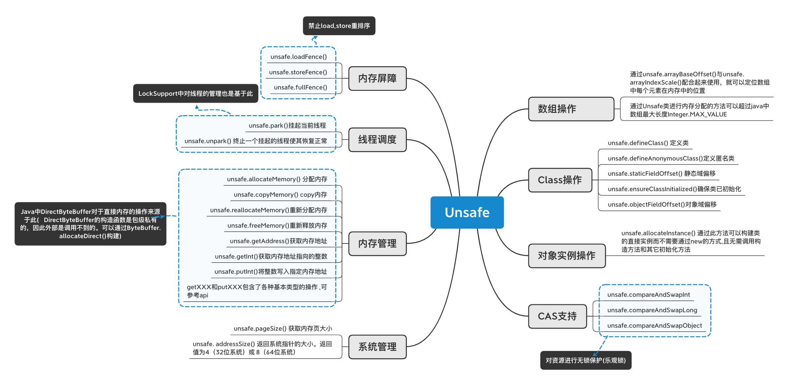

主要提供一些用于执行低级别、不安全操作的方法，如直接访问系统内存资源、自主管理内存资源等。Java 无法直接操作内存，Unsafe类相当于Java的后门，可以通过C++来操作内存。

JDK并不建议直接使用Unsafe类，“Unsafe” 类名的由来：在程序中过度、不正确使用Unsafe类会使得程序出错的概率变大，使得Java这种安全的语言变得不再“安全”。而且JDK底层有很多针对不同平台运行的代码，使用Unsafe类可能会造成一些跨平台的问题。

> Unsafe类提供了哪些功能？

DirectByteBuffer：在该类中使用Unsafe对内存进行管理，是Java用于实现堆外内存(直接内存)的一个重要类，通常用在通信过程中做缓冲池，如在Netty、MINA等NIO框架中应用广泛。DirectByteBuffer对于堆外内存的创建、使用、销毁等逻辑均由Unsafe提供的堆外内存API来实现。

LockSupport：线程调度。

AtomicIntegerArray：数组操作，通过计算内存地址的偏移量来确定每个元素所在的位置。

StampedLock：内存屏障。

java.nio.Bits：系统管理， 计算待申请内存所需内存页数量的静态方法，其依赖于Unsafe中pageSize方法获取系统内存页大小实现后续计算逻辑,该类在私包中，无法正常初始化。



在 `java.util.concurrent.atomic` 包下绝大多数类的源码中都使用到了Unsafe这个类。例如`AtomicInteger`：

```java
public class AtomicInteger extends Number implements java.io.Serializable {
    // setup to use Unsafe.compareAndSwapInt for updates
    private static final Unsafe unsafe = Unsafe.getUnsafe();
    private static final long valueOffset;

    static {
        try {
            valueOffset = unsafe.objectFieldOffset
                (AtomicInteger.class.getDeclaredField("value"));
        } catch (Exception ex) { throw new Error(ex); }
    }
    ...
}
```

在Unsafe类中有以下三个方法：

```java
/**
 * @param var1 操作的对象
 * @param var2 操作对象的属性偏移量，用于获取该属性在内存中的具体地址
 * @param var4 期望值，读取传入对象o在内存中偏移量为offset位置的值与期望值expected作比较
 *             相等就把x值赋值给offset位置的值。方法返回true
 * @param var5 目标值
 * @return 与目标的期望值不相等返回false
 */
public final native boolean compareAndSwapObject(Object var1, long var2, Object var4, Object var5);

public final native boolean compareAndSwapInt(Object var1, long var2, int var4, int var5);

public final native boolean compareAndSwapLong(Object var1, long var2, long var4, long var6);
```

使用Unsafe类的方法对线程不安全的add()方法进行修改：

```java
private int value = 0;
/**
 * 获取并使用 Unsafe 对象：
 * Java 无法直接操作内存，但可以通过C++来操作内存，
 * Unsafe类相当于Java的后门，可以通过这个类来操作内存、修改对象、数组内存
 */
private static Unsafe unsafe;
/**
 * 获取到value属性偏移量，用于定义value属性在内存中的具体地址
 */
private static long valueOffset;

static {
    try {
        // 通过反射获取Unsafe对象
        Field field = Unsafe.class.getDeclaredField("theUnsafe");
        field.setAccessible(true);
        // 获取Unsafe实例
        unsafe = (Unsafe) field.get(null);
        valueOffset = unsafe.objectFieldOffset(CASDemo.class.getDeclaredField("value"));
    } catch (Exception e) {
        e.printStackTrace();
    }
}

/**
 * 该方法经过以下问题不断改进
 */
public void add() {
    // 1、三个步骤
    // value++;
    // 2、可能会失败，不能每次都成功
    // unsafe.compareAndSwapInt(this, valueOffset, value, value + 1);
    // 3、CAS+死循环重试，确保每一次都能操作成功
    int current, target;
    do {
        // 当前值可能被其它线程改了，每一次循环都重新获取一次值
        current = unsafe.getIntVolatile(this, valueOffset);
        target = current + 1;
        // current 是期望值，如果比较的期望值相同则修改为值为target，并返回true
    } while (!unsafe.compareAndSwapInt(this, valueOffset, current, target));
}

public void test2() throws InterruptedException {
    for (int i = 0; i < 2; i++) {
        new Thread(() -> {
            for (int j = 0; j < 1000; j++) {
                add();
            }
        }).start();
    }

    TimeUnit.SECONDS.sleep(2);
    System.out.println(value);
}
```

