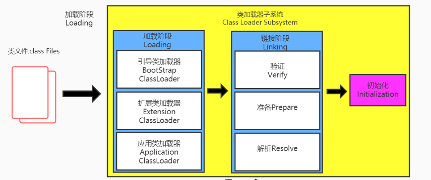
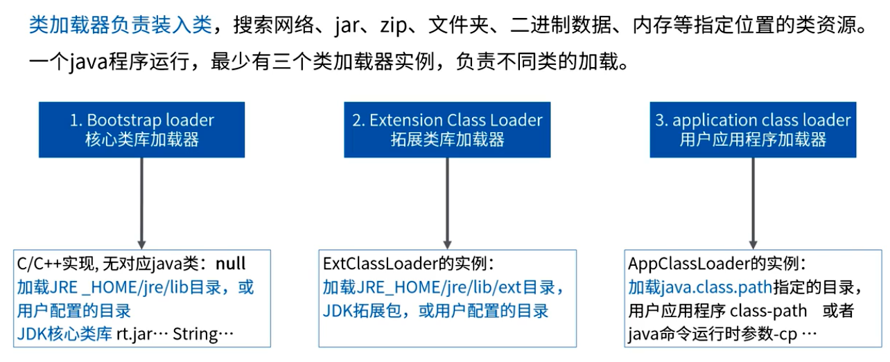
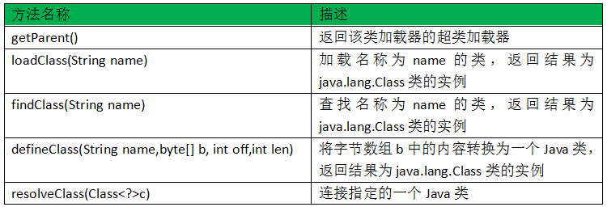
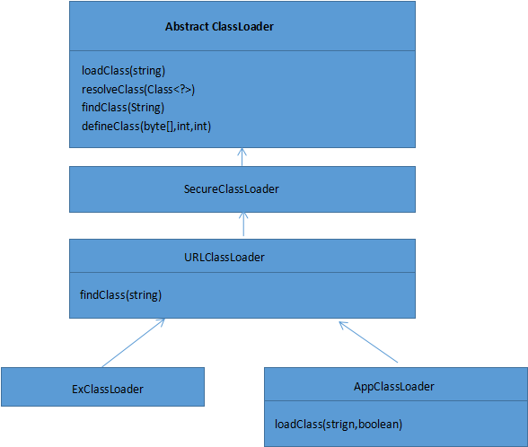
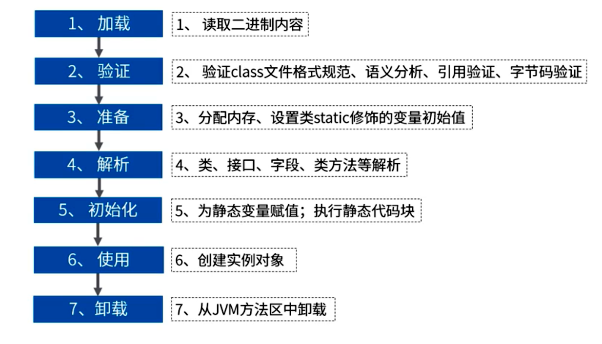
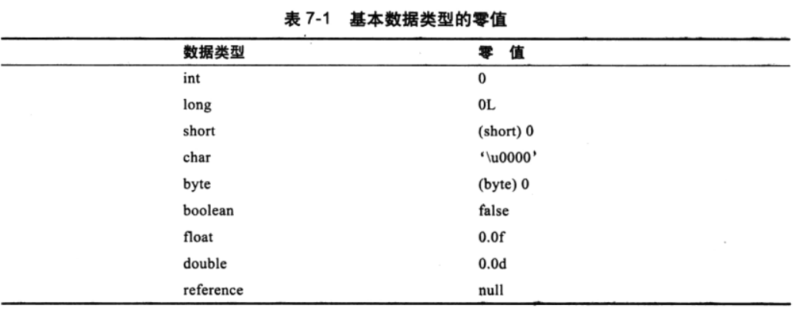

## 类加载器

类加载子系统将 *.class 文件加载到内存中，类的加载分为加载阶段、链接阶段、初始化阶段三个阶段。

- 类加载器子系统负责从文件系统或者网络中加载Class文件，class文件在文件开头有特定的文件标识。

- ClassLoader只负责class文件的加载，至于它是否可以运行，则由Execution Engine决定。

- 加载的类信息存放于一块称为方法区的内存空间。除了类的信息外，方法区中还会存放运行时常量池信息，可能还包括字符串字面量和数字常量(这部分常量信息是Class文件中常量池部分的内存映射)

## 类加载器的分类

- JVM支持两种类型的类加载器，分别为引导类加载器（Bootstrap ClassLoader）和自定义类加载器（User-Defined ClassLoader）。

- 在Java虚拟机中，将所有派生于抽象类的ClassLoader的类加载器都划分为自定义类加载器。
- 无论类加载器的类型如何划分，在程序中我们最常见的类加载器始终只有3个。

在 sun.misc.Launcher类中，有AppClassLoader、ExtClassLoader 两个内部类，都间接的继承了ClassLoader，所以都属于自定义类加载器。

### Bootstrap ClassLoader

启动类加载器、引导类加载器。

（1）BootstrapClassLoader是使用C++实现的，嵌套在JVM的内部，所以其并不继承自 java.lang.ClassLoader，没有父加载器。

（2）它用来加载Java的核心库（\jre\lib\rt.jar、resources.jar或sun.boot.class.path路径下的内容），用于提供JVM自身需要的类。

（3）加载扩展类和应用程序类加载器，并指定他们的父类加载器。

（4）出于安全考虑，Bootstrap启动类加载器只加载包名为 java、javax、sun等开头的类。

### Extension ClassLoader

扩展类加载器。

（1）Java语言编写，由sun. misc. LauncherSExtClassLoader实现。

（2）派生于ClassLoader类。

（3）父类加载器是Bootstrap ClassLoader。

（4）从java.ext.dirs系统属性所指定的目录中加载类库，或从JDK的安装目录的 jre/lib/ext 子目录（扩展目录）加载类库。如果用户创建的 JAR 放在此目录下，也会自动由扩展类加载器加载。

### Application ClassLoader

应用程序类加载器、系统类加载器。

（1）Java 语言编写，由 sun. misc . Launcher$AppClassLoader 实现。

（2）派生于 ClassLoader 类。

（3）它负责加载环境变量classpath或系统属性 java. class.path 指定路径下的类库。

（4）该类加载是程序中默认的类加载器，一 般来说，Java应用的类都是由它来完成加载。

（5）通过ClassLoader #getSystemClassLoader ()方法可以获取到该类加载器。

### 用户自定义类加载器

在Java的日常应用程序开发中，类的加载几乎是由上述3种类加载器相互配合执行的，在必要时，我们还可以自定义类加载器，来定制类的加载方式。

自定义类加载器可以实现以下功能：

（1）隔离类加载器。例如，引入多个jar包时，可能会出现包名类名完全一致的情况，导致冲突。

（2）修改类加载的方式。例如，在需要某个类的时候，才主动加载这个类。

（3）扩展加载源。例如，从数据库加载。

（4）防止源码泄露。例如，对进行加密的字节码文件，使用自定义的类加载器进行解密后再加载到JVM。

## 关于ClassLoader

### ClassLoader类的定义

Classloader类，它是一个抽象类，其后所有的类加载器都继承自ClassLoader（不包括启动类加载器）。

### 继承关系

ClassLoader的继承关系如下，sun.misc.Launcher 是一个Java虚拟机的入口应用。

### 获取ClassLoader的途径

| 方式                            | 调用方法                                       |
| ------------------------------- | ---------------------------------------------- |
| 获取当前类的classLoader         | Clazz.getClassLoader()                         |
| 获取当前线程上下文的classLoader | Thread.currentThread().getContextClassLoader() |
| 获取系统的classLoader           | ClassLoader.getSystemClassloader()             |
| 获取调用者的classLoader         | DriverManager.getCallerClassLoader()           |

## 类的生命周期

> Java如何知道我们的类在哪里？

在JDK\bin目录有jps、jcmd两个命令，jps用于查看当前的Java进程的一些简单情况，jcmd可用于查看堆分析、系统properties内容、堆外内存信息等。

通过jcmd查看VM.system.properties即可查看到当前Java类的所在位置。

### Loading（加载阶段）

加载”阶段是“类加载”生命周期的第一个阶段，在加载阶段，JVM要完成下面三件事：

①、通过一个类的全限定名来获取定义此类的二进制字节流。

②、将这个字节流所代表的静态存储结构转化为方法区的运行时数据结构。

③、在Java堆中生成一个代表这个类的java.lang.Class对象，作为方法区这些数据的访问入口。

PS：加载 *.class 的方式有哪些？

- 从本地系统中直接加载
- 通过网络获取，如Web Applet
- 从 ZIP 包中读取，成为日后的 JAR、EAR、WAR 格式的基础
- 运行时计算生成，使用最多的是动态代理技术
- 从专有数据库中提取.class文件，比较少见
- 从加密文件中获取，典型的防class文件被反编译的保护措施

### Linking（链接阶段）

#### （1）Verify（验证）

- 目的在于确保 Class 文件的字节流中包含的信息符合当前虚拟机的要求，保证被加载类的正确性，并且不会危害虚拟机自身的安全。

- 主要包括四个方面的检查：文件格式验证、元数据验证、字节码验证、符号引用验证。

##### ①、文件格式验证

　　校验字节流是否符合Class文件格式的规范，并且能够被当前版本的虚拟机处理。

　　一、是否以魔数 0xCAFEBABE 开头。

　　二、主、次版本号是否是当前虚拟机处理范围之内。

　　三、常量池的常量中是否有不被支持的常量类型（检查常量tag标志）

　　四、指向常量的各种索引值中是否有指向不存在的常量或不符合类型的常量。

　　五、CONSTANT_Utf8_info 型的常量中是否有不符合 UTF8 编码的数据。

　　六、Class 文件中各个部分及文件本身是否有被删除的或附加的其他信息。

　　以上是一部分校验内容，当然远不止这些。经过这些校验后，字节流才会进入内存的方法区中存储，接下来后面的三个阶段校验都是基于方法区的存储结构进行的。

##### ②、元数据验证

　　第二个阶段主要是对字节码描述的信息进行语义分析，以保证其描述的信息符合Java语言规范要求。

　　一、这个类是否有父类（除了java.lang.Object 类之外，所有的类都应当有父类）。

　　二、这个类的父类是否继承了不允许被继承的类（被final修饰的类）。

　　三、如果这个类不是抽象类，是否实现了其父类或接口之中要求实现的所有普通方法。

　　四、类中的字段、方法是否与父类产生了矛盾（例如覆盖了父类的final字段、或者出现不符合规则的重载）

##### ③、字节码验证

　　第三个阶段字节码验证是整个验证阶段中最复杂的，主要是进行数据流和控制流分析。该阶段将对类的方法进行分析，保证被校验的方法在运行时不会做出危害虚拟机安全的行为。

　　一、保证任意时刻操作数栈中的数据类型与指令代码序列都能配合工作。例如不会出现在操作数栈中放置了一个 int 类型的数据，使用时却按照 long 类型来加载到本地变量表中。

　　二、保证跳转指令不会跳转到方法体以外的字节码指令中。

　　三、保证方法体中的类型转换是有效的。比如把一个子类对象赋值给父类数据类型，这是安全的。但是把父类对象赋值给子类数据类型，甚至赋值给完全不相干的类型，这就是不合法的。

##### ④、符号引用验证

　　符号引用验证主要是对类自身以外（常量池中的各种符号引用）的信息进行匹配性的校验，通常需要校验如下内容：

　　一、符号引用中通过字符串描述的全限定名是否能够找到相应的类。

　　二、在指定类中是否存在符合方法的字段描述符及简单名称所描述的方法和字段。

　　三、符号引用中的类、字段和方法的访问性（private、protected、public、default）是否可以被当前类访问。

#### （2）Prepare（准备）

- 准备阶段是正式为**类变量**分配内存并设置**类变量**初始值的阶段，这些内存是在方法区中进行分配。

- 这里不包含用 final 修饰的static，因为 final 在编译的时候就会分配了，准备阶段会显式初始化。
- 这里不会为实例变量分配初始化，类变量会分配在方法区中，而实例变量是会随着对象一起分配到Java堆中。

#### （3）Resolve（解析）

- 将常量池中的符号引用替换为直接引用的过程。
- 事实上，解析操作往往会伴随着JVM在执行完初始化之后在执行。
- 符号引用（Symbolic References）：符号引用以一组符号来描述所引用的目标，符号可以是任何形式的字面量，只要使用时能无歧义的定位到目标即可。符号引用与虚拟机实现的内存布局无关，引用的目标不一定已经加载到内存中。
- 直接引用（Direct References）：直接引用可以是直接指向目标的指针、相对偏移量或是一个能间接定位到目标的句柄。直接引用是与虚拟机实现内存布局相关的，同一个符号引用在不同虚拟机实例上翻译出来的直接引用一般不会相同。如果有了直接引用，那么引用的目标必定已经在内存中存在。
- 解析动作主要针对类或接口、字段、类方法、接口方法四类符号引用，分别对应于常量池的 CONSTANT_Class_info、CONSTANT_Fieldref_info、CONSTANT_Methodref_info、CONSTANTS_InterfaceMethodref_info 四种类型常量。

### Initialization（初始化阶段）

初始化阶段是类加载阶段的最后一步，到了初始化阶段，类变量已经被赋值过初始值了，开始真正执行类中定义的Java程序代码（或者说是字节码），换句话来说，**初始化阶段是执行类构造器\<clinit\>() 方法的过程**。

- 此方法不需定义，是javac编译器自动收集类中的所有类变量的赋值动作和静态代码块中的语句合并而来。
- 构造器方法中指令按语句在源文件中出现的顺序执行。
- \<clinit\>() 不同于类的构造器。它不需要显式的调用父类构造器，虚拟机会保证在子类的\<init\>()方法执行之前，父类的\<init\>()方法已经执行完毕。因此虚拟机中第一个被执行的\<init\>()方法的类肯定是 java.lang.Object。
- 虚拟机必须保证一个类的  \<clinit\>()  方法在多线程下被同步加锁。如果多个线程同时去初始化一个类，那么只会有一个线程去执行这个类的\<clinit\>() 方法，其他的线程都需要阻塞等待，直到活动线程执行\<clinit\>() 方法完毕。如果在一个类的\<clinit\>() 方法中有很耗时的操作，那么可能造成多个进程的阻塞。

## 类不会重复加载

## 类的卸载

满足两个条件就会被卸载：

1、该Class所有的实例都已经被GC；

2、加载该类的ClassLoader实例已经被GC；

验证方式：JVM启动中增加 `-verbose:class`参数，输出类加载和卸载的日志信息。
