class文件包含JAVA程序执行的字节码;数据严格按照格式紧凑排列在class文件中的二进制流，中间无任何分隔符;文件开头有一个0xcafebabe(16进制)特殊的一个标志。

存放有：JDK版本、访问标志、常量池、当前类、超级类、接口、字段、方法、属性，这些文件是有复杂格式的，专门给JVM读里面的内容，可以借助工具查看字节码文件。

## JVM分区

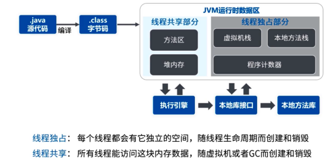

JDK1.8在方法区中有较大的改动：

- 移除了永久代（PermGen），替换为元空间（Metaspace）；
- 永久代中的 class metadata 转移到了 native memory（本地内存，而不是虚拟机）；
- 永久代中的 interned Strings 和 class static variables 转移到了 Java heap；
- 永久代参数 （PermSize MaxPermSize） -> 元空间参数（MetaspaceSize MaxMetaspaceSize）；

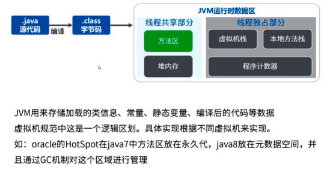

堆内存

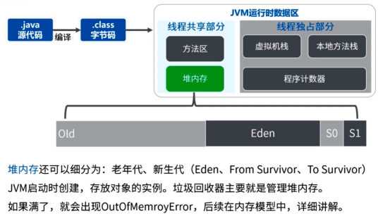

虚拟机栈

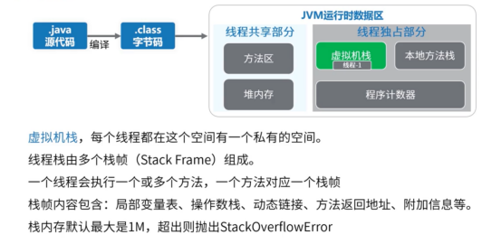

本地方法栈

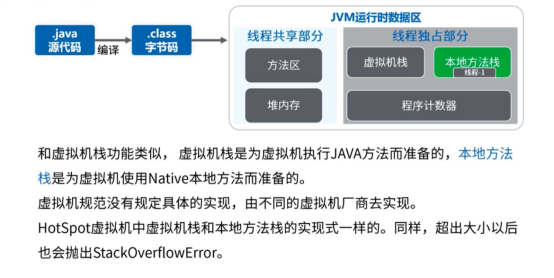

程序计数器

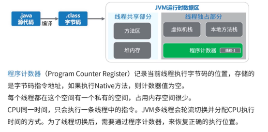

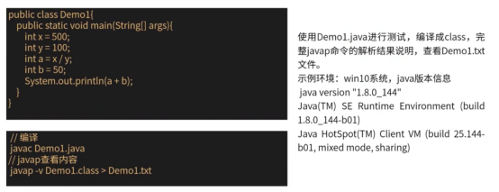

查看字节码文件内容（.class）：

1、Javap -v xxx.class 打印在控制台

2、Javap -v xxx.class > xxx.txt 输出到xxx.txt记事本中

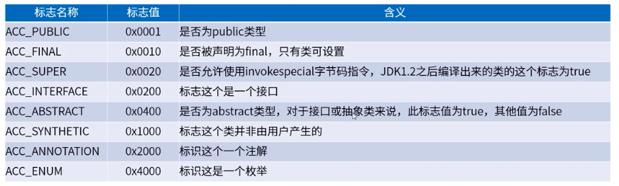

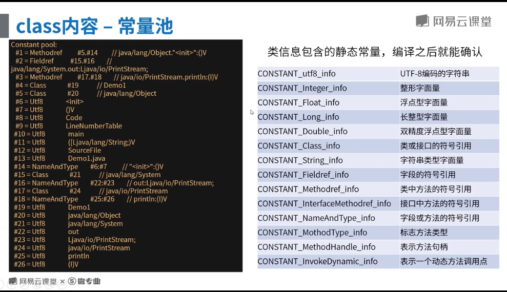

将 Demo1 类使用Java.exe编译成字节码文件（class）

```java
public class Demo1 {
    public static void main(String[] args) {
        int x = 500;
        int y = 200;
        int a = x / y;
        int b = 50;
        System.out.println(a + b);
    }
}
```

使用Javap查看字节码文件

```java
D:\jdk1.8\bin>javap.exe -v E:\demo\target\classes\cn\com\demo\test\Demo1.class
Classfile /E:\demo\target\classes\cn\com\demo\test\Demo1.class
  Last modified 2021-4-11; size 620 bytes
  MD5 checksum 71c6b97950ddc7fb31e028064d2763c0
  Compiled from "Demo1.java"
public class cn.com.demo.test.Demo1
  minor version: 0  // 次版本号
  major version: 52 // 主版本号：JDK5,6,7,8 对应49,50,51,52
  flags: ACC_PUBLIC, ACC_SUPER // 访问标志
Constant pool:
   #1 = Methodref          #5.#24         // java/lang/Object."<init>":()V
   #2 = Fieldref           #25.#26        // java/lang/System.out:Ljava/io/PrintStream;
   #3 = Methodref          #27.#28        // java/io/PrintStream.println:(I)V
   #4 = Class              #29            // cn/com/newdoone/test/Demo1
   #5 = Class              #30            // java/lang/Object
   #6 = Utf8               <init>
   #7 = Utf8               ()V
   #8 = Utf8               Code
   #9 = Utf8               LineNumberTable
  #10 = Utf8               LocalVariableTable
  #11 = Utf8               this
  #12 = Utf8               Lcn/com/newdoone/test/Demo1;
  #13 = Utf8               main
  #14 = Utf8               ([Ljava/lang/String;)V
  #15 = Utf8               args
  #16 = Utf8               [Ljava/lang/String;
  #17 = Utf8               x
  #18 = Utf8               I
  #19 = Utf8               y
  #20 = Utf8               a
  #21 = Utf8               b
  #22 = Utf8               SourceFile
  #23 = Utf8               Demo1.java
  #24 = NameAndType        #6:#7          // "<init>":()V
  #25 = Class              #31            // java/lang/System
  #26 = NameAndType        #32:#33        // out:Ljava/io/PrintStream;
  #27 = Class              #34            // java/io/PrintStream
  #28 = NameAndType        #35:#36        // println:(I)V
  #29 = Utf8               cn/com/newdoone/test/Demo1
  #30 = Utf8               java/lang/Object
  #31 = Utf8               java/lang/System
  #32 = Utf8               out
  #33 = Utf8               Ljava/io/PrintStream;
  #34 = Utf8               java/io/PrintStream
  #35 = Utf8               println
  #36 = Utf8               (I)V
{
  // 在类中没有写构造方法，但在此处有一个构造方法
  // 由此可见，没有定义构造函数时，会有隐式的无参构造函数。
  public cn.com.demo.test.Demo1();
    descriptor: ()V
    flags: ACC_PUBLIC
    Code:
      stack=1, locals=1, args_size=1
         0: aload_0
         1: invokespecial #1                  // Method java/lang/Object."<init>":()V
         4: return
      LineNumberTable:
        line 6: 0
      LocalVariableTable:
        Start  Length  Slot  Name   Signature
            0       5     0  this   Lcn/com/newdoone/test/Demo1;
 // 程序入口main方法
  public static void main(java.lang.String[]);
    descriptor: ([Ljava/lang/String;)V
    flags: ACC_PUBLIC, ACC_STATIC
    Code:
      // 本地变量数量、参数数量、方法对应栈帧中操作数栈的深度
      stack=3, locals=5, args_size=1 
       // 下面是一些JVM执行这些源码编译过后的指令码
       // javap 翻译出来是操作符，class文件内存储的是指令码
       // 前面的数字是偏移量（字节），JVM根据这个去区分不同的指令，详情见《JVM指令码表》，在本篇文章下面。
         0: sipush        500
         3: istore_1
         4: sipush        200
         7: istore_2
         8: iload_1
         9: iload_2
        10: idiv
        11: istore_3
        12: bipush        50
        14: istore        4
        16: getstatic     #2                  // Field java/lang/System.out:Ljava/io/PrintStream;
        19: iload_3
        20: iload         4
        22: iadd
        23: invokevirtual #3                  // Method java/io/PrintStream.println:(I)V
        26: return
      LineNumberTable:
        line 8: 0
        line 9: 4
        line 10: 8
        line 11: 12
        line 12: 16
        line 13: 26
      LocalVariableTable:
        Start  Length  Slot  Name   Signature
            0      27     0  args   [Ljava/lang/String;
            4      23     1     x   I
            8      19     2     y   I
           12      15     3     a   I
           16      11     4     b   I
}
SourceFile: "Demo1.java"
```

第一步，加载。将我们写的代码编译为字节码，将字节码加载到方法区，其中类信息加载到方法区，字符串常量加载到常量池。

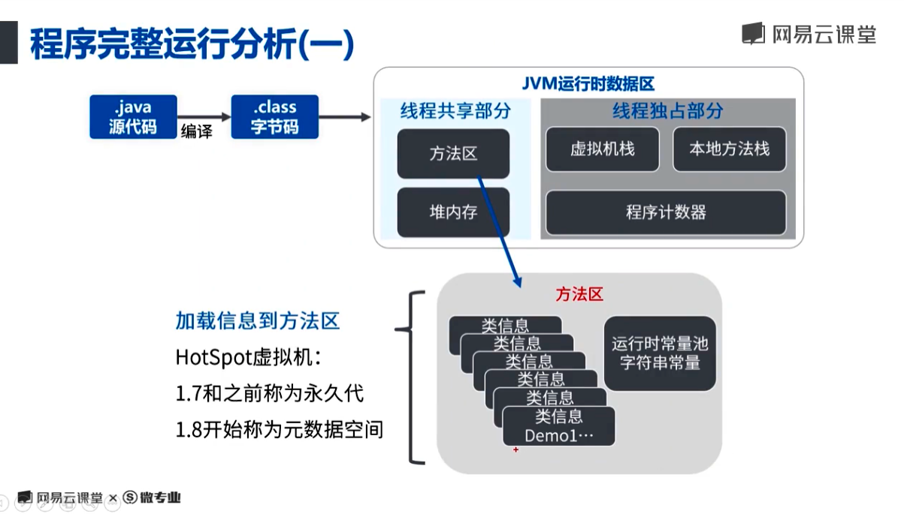

第二步，运行。JVM创建线程来执行代码，涉及到线程，那么虚拟机栈和程序计数器就会分配一个当前线程独占的空间，用来保存当前线程执行指令码的位置。

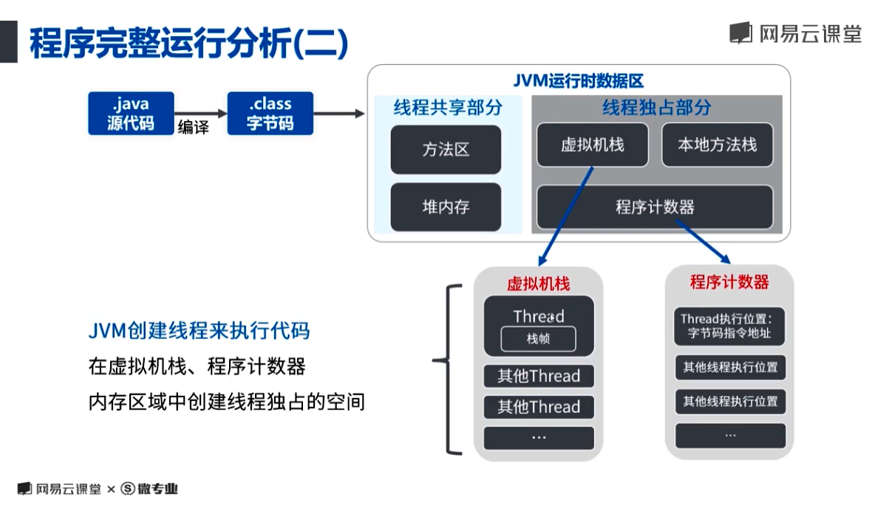

开始执行操作码（助记符），结合《JVM指令码表》来看。通过上面的字节码文件中可以得出，有5个本地变量，变量0是方法参数args。

执行 sipush 500 操作码，sipush的意思是(valuebyte1 << 8) | valuebyte2 值带符号扩展成int值入栈。也就是说将500压入操作数栈。

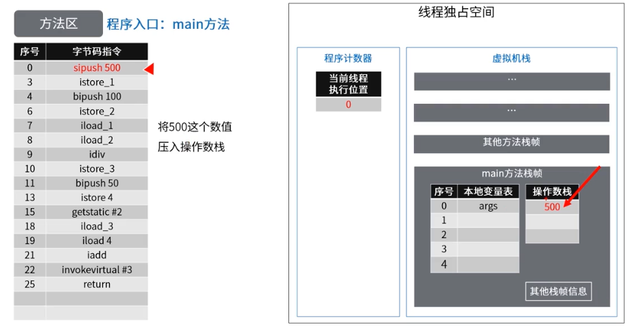

程序计数器保存的当前线程执行位置为3，istore_1 将操作数栈中的500保存到本地变量表序号为1的位置。

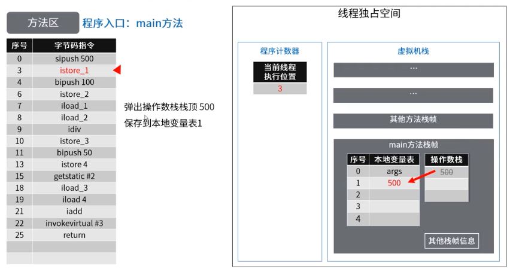

程序计数器保存的当前线程执行位置为4，bipush 100 将100压入操作数栈，bipush 的意思是 valuebyte值带符号扩展成int值入栈。

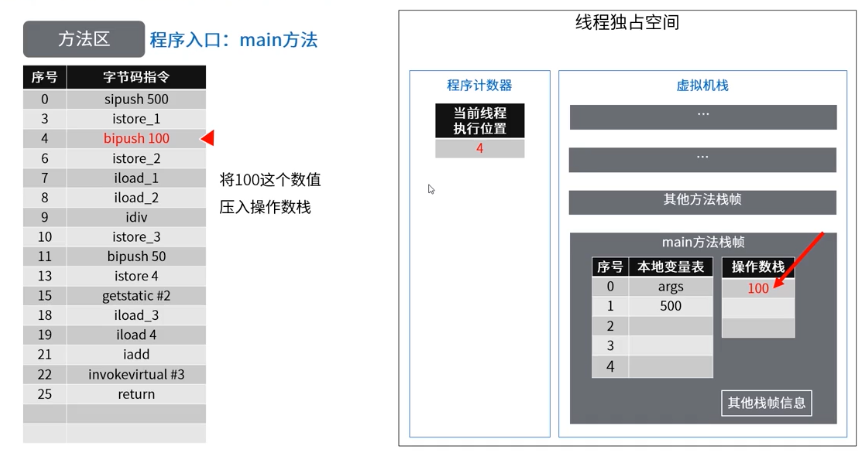

程序计数器保存的当前线程执行位置为6，istore_2 将操作数栈中的100压入本地变量表中序号为2的位置。

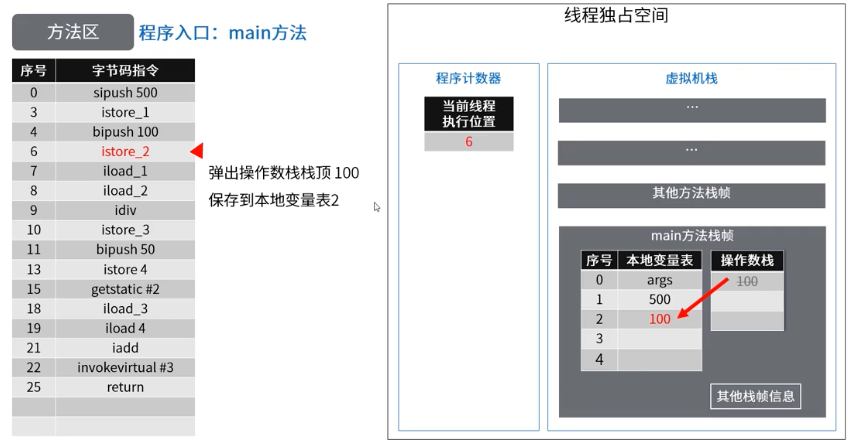

iload_1和iload_2 分别读取本地变量表中序号为1和2的值压入操作数栈，idiv 将栈顶的两个 int类型数相除，结果入栈 500/100 = 5，istore_3 保存在本地变量表中的3的位置。


bipush 50 将50压入栈中，istore_4 保存在本地变量表4的位置。

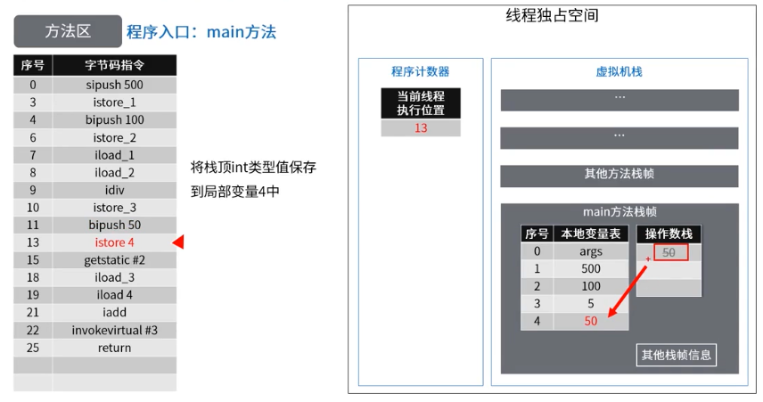

getstatic #2 表示获取常量池中第2个属性的引用，压入操作数栈。

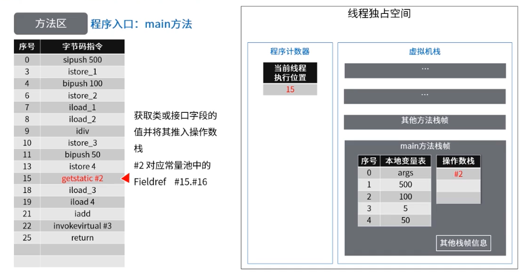

iload_3和 iload_4 取出本地变量表中第3和第4的值压入栈中。

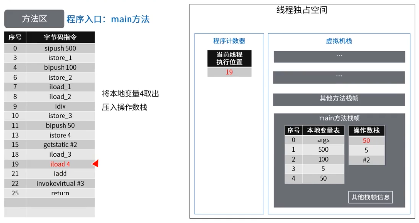

iadd 相加。

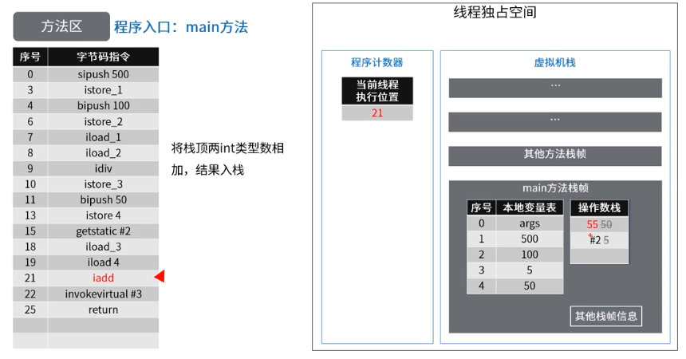

invokevirtual #3 ，原来的方法不接着执行了，程序计数器重新开始计数，执行其它方法完毕之后，在继续执行main方法对应的栈帧。

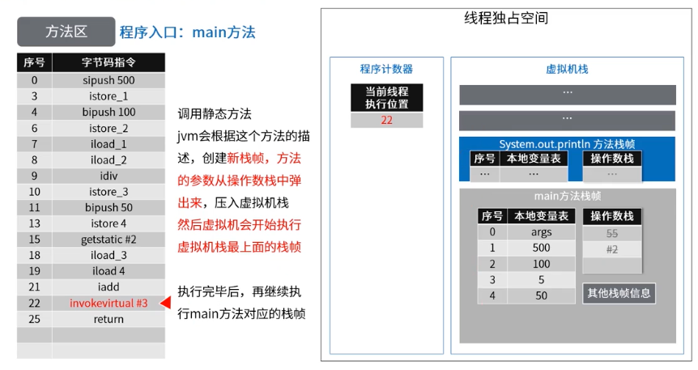

执行结束

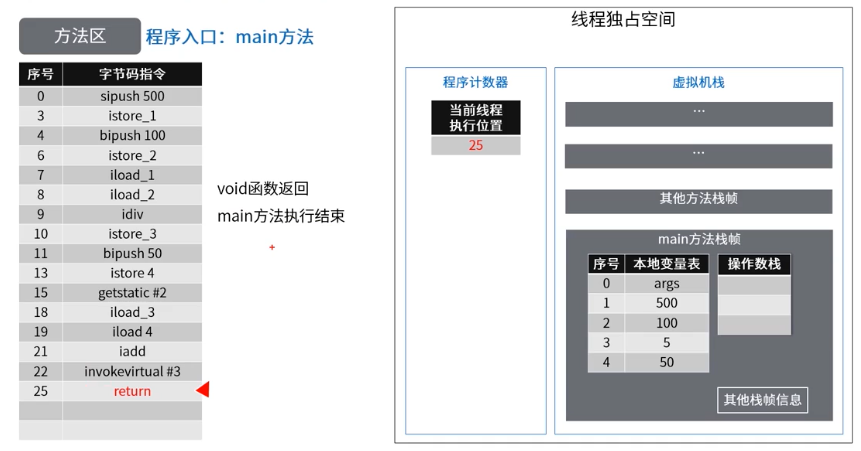

