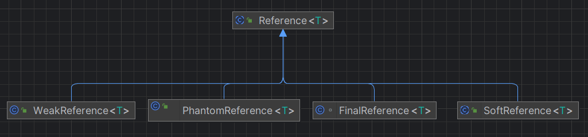
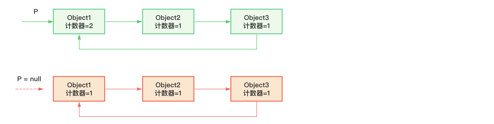
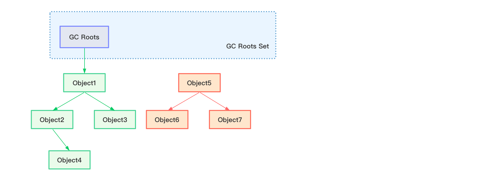
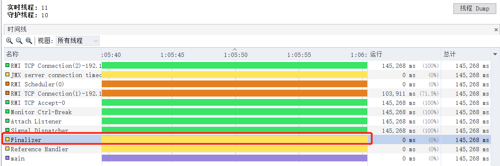
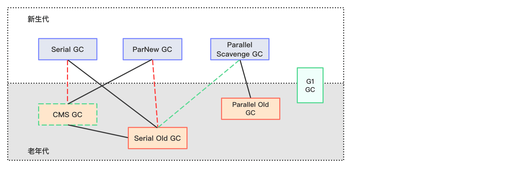
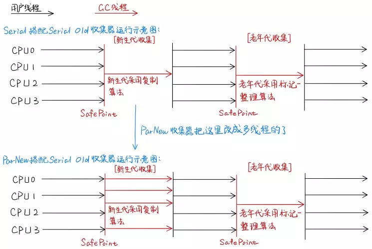
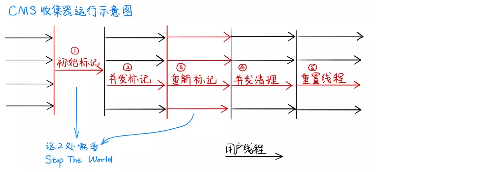
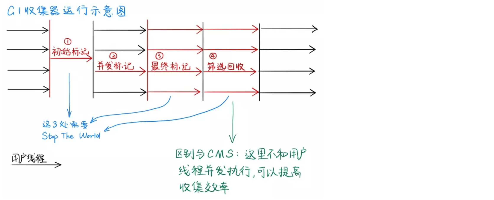
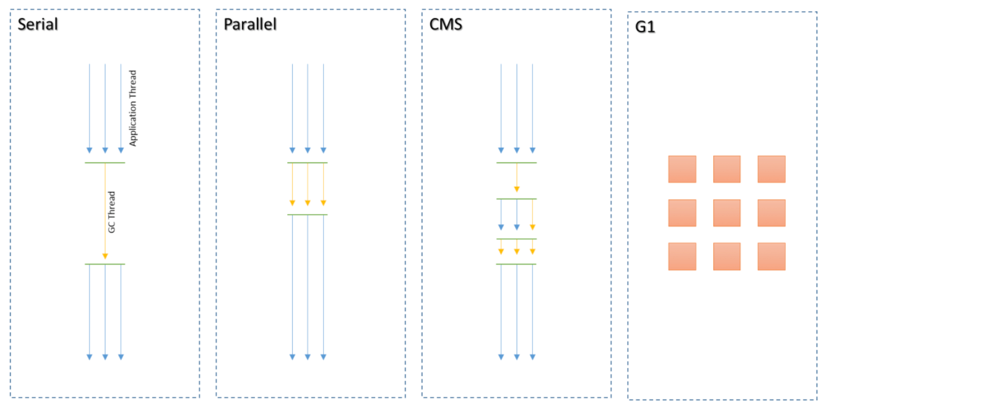

当Java程序运行时，没有任何指针指向的对象就是垃圾，JVM会对内存进行自动分配与回收，其中GC的主要作用就是清除这些垃圾，自动释放内存。

## 垃圾回收的相关概念

### FGC(FULL GC)

收集整个堆，包括新生代，老年代，永久代或元数据空间。

### System.gc()

调用`System.gc()`或者`Runtime.getRuntime().gc()`会显式触发fgc(Full GC)，但Java语言规范了，并不保证GC一定会执行。jvm有自己的gc策略，一般情况下，无需手动触发。

### 内存溢出

在程序运行过程中，给一个对象分配内存空间时，无法申请到足够的内存。对应的异常是OutOfMemoryError，简称OOM。

### 内存泄漏

不再使用的对象，持续占有内存得不到及时的释放（GC无法回收这些不再使用的对象），从而造成内存空间的浪费成为内存泄漏。

### STW(Stop The World)

GC事件发生过程中，会产生应用程序的停顿，整个应用程序都会被暂停。下面即将介绍的可达性分析算法会导致STW，因为：

1. 分析工作必须在一个能确保一致性的快照中进行；
2. 一致性指整个分析期间整个执行系统看起来像被冻结在某个时间点上；
3. 如果分析过程中对象引用关系还在不断变化，则分析结果的准确性无法保证。

GC完成之后，STW便随之结束。

## Java中的引用类型(Reference)

JDK1.2之后，Java对引用的概念进行了扩充，分为强引用（Strong Reference）、软引用（Soft Reference）、弱引用（Weak Reference）、虚引用（Phantom Reference）和终结器引用（Final Reference）：



### 强引用：不回收

最传统的引用定义，程序中普遍存在的引用赋值，类似`Object o = new Object()`这种引用关系。无论在任何情况下，只要强引用关系还在，垃圾回收器就永远不会回收掉被引用的对象。所以，**强引用是造成Java内存泄露的主要原因之一**。

### 软引用：内存不足即回收

软引用是用来描述一些还有用，但非必需的对象。只被软引用关联着的对象，在系统即将要发生内存溢出异常前，会被放入到Reference Queue，进行二次回收。简而言之就是内存不足时回收。

软引用常用来实现内存敏感的缓存，比如内存充足时，就是用缓存，内存不足时就清除缓存，避免程序OOM。

软引用例子：

```java
Object obj = new Object();
SoftReference<Object> softReference = new SoftReference<>(obj);
obj = null;
```

### 弱引用：发现即回收

弱引用关联的对象只能生存到下一次垃圾收集发生为止。在系统GC时，只要发生弱引用，不管系统堆空间是否充足，都会回收。简而言之就是发现即回收。

弱引用例子：

```java
Object obj = new Object();
WeakReference<Object> weakReference = new WeakReference<>(obj);
obj = null;
```

### 虚引用：对象回收跟踪

- 一个对象是否有虚引用的存在，完全不会决定对象的生命周期。如果一个对象仅存在虚引用，那么它和没有引用几乎是一样的，随时都可能被垃圾回收器回收。

- 虚引用不能单独使用，也无法通过虚引用来获取被引用的对象，当调用虚引用的get方法获取对象时，将返回null。
- 为一个对象设置虚引用关联的唯一目的在于跟踪垃圾回收过程。比如：能在这个对象被收集器回收时收到一个系统通知。

虚引用必须和引用队列一起使用：

```java
Object obj = new Object();
ReferenceQueue<Object> referenceQueue = new ReferenceQueue<>();
PhantomReference<Object> phantomReference = new PhantomReference<>(obj, referenceQueue);
obj = null;
phantomReference.get(); // null
```

虚引用对象被垃圾回收器回收后，会将这个虚引用加入引用队列，已通知应用程序对象回收情况。虚引用的唯一作用是用于跟踪垃圾回收过程（通过观察引用队列里是否有对应的虚引用）。

### 终结器引用

- 它用于实现对象的finalize（）方法，也可以称为终结器引用。
- 无需手动编码，**其内部配合引用队列使用。**
- 在GC时， 终结器引用入队。由Finalizer线程通过终结器引用找到被引用对象并调用它的finalize（）方法，第二次GC时才能回收被引用对象。

```java
package java.lang.ref;

/**
 * Final references, used to implement finalization
 */
class FinalReference<T> extends Reference<T> {
    public FinalReference(T referent, ReferenceQueue<? super T> q) {
        super(referent, q);
    }
}
```


## 垃圾回收算法

垃圾回收分为**标记阶段**（对象存活判断）和**清除阶段**（垃圾对象回收）。

1. 标记阶段

在堆中存放这几乎所有的Java对象实例，在GC执行垃圾回收之前，首先需要区分出内存中哪些是存活对象，哪些是已死亡对象。只有被标记为已经死亡的对象，GC才会进行回收。这个阶段的算法包括**引用计数法**和**可达性分析算法**；

2. 清除阶段

当成功分出存活和死亡对象之后，GC接下来的任务就是执行垃圾回收，释放内存。目前JVM中比较常见的三种垃圾算法分别是**标记清除算法**、**复制算法**、**标记压缩算法**。

### 引用计数算法

引用计数算法（Reference Counting）算法对每个对象保存一个整型的引用计数器属性，用于记录对象被引用的情况。对于一个对象Object，只要有任何一个对象引用了它，则它的引用计数器加1，引用失效时，引用计数器就减1。所以当一个对象的引用计数器值为0时，说明该对象不再被引用，可进行回收。

优点：实现简单，效率高，垃圾回收没有延迟；

缺点：

1. 计数器的存在增加了存储空间的开销；
2. 每次赋值都需要更新计数器，增加了程序时间开销；
3. 致命问题：无法处理循环引用的情况（正因为如此，Java压根没有使用该算法）。

举个循环引用的例子：



上面例子中，Object1的引用计数器值为1，但实际可能这三个对象都已经不再被使用，它们的引用计数器的值都不为0，无法被回收，这就导致了内存泄露。

### 可达性分析算法

可达性分析算法同样具备实现简单执行高效等特点，并且还解决了引用计数算法无法处理的循环引用问题，可达性分析算法也叫根搜索算法、追踪性垃圾收集算法。

#### 可达性分析算法的基本思路

1. 以根对象集合（GC Roots）为起点，从上至下搜索被根对象连接的目标对象是否可达，搜索走过的路径称为引用链；
2. 如果目标对象没有任何引用链相连，则是不可达的，意味着对象已经死亡属于垃圾；
3. 只有那些能够被根对象集合直接或者间接连接的对象才是存活对象。

如下图所示：



绿色对象为存活对象，它们直接或间接与GC Roots相连，橙色对象为可回收对象。

那么哪些对象可以作为GC Roots呢？Java中，GC Roots包括以下几类元素：

1. 虚拟机栈中引用的对象；
2. 本地方法栈内引用的对象；
3. 方法区中类静态属性引用的对象，如Java类的引用类型静态变量；
4. 方法区中常量引用的对象；
5. 所有被synchronized持有的对象；
6. Java虚拟机内部引用；
7. 反映Java虚拟机内部情况的JMXBean、JVMTI中注册的回调、本地代码缓存等。

在使用可达性分析算法判断内存是否可回收时，分析工作必须在一个能保障一致性的快照中进行。这点也是导致GC进行时必须STW的一个重要原因。

#### 对象复活演示

对象的finalization机制：当垃圾回收器回收一个垃圾对象之前，总会先调用这个对象的`finalize()`方法，用于在对象回收时进行资源释放。

```java
 protected void finalize() throws Throwable { }
```

`finalize()`方法为Object的一个非final方法，所以子类可以进行重写。

因为`finalize()`方法的存在，Java中一个对象可能处于三种状态：

1. 可触及的，从GC Roots开始可以到达该对象；
2. 可复活的，对象的所有引用都被释放，但对象可能在`finalize()`方法中复活；
3. 不可触及的，对象的`finalize()`方法被调用，并且没有复活。不可触及的对象不可能被复活，**因为`finalize()`方法只会被调用一次**。

判断一个对象是否可回收需要经历两次标记过程：

1. 如果对象到GC Roots没有引用链，那么进行第一次标记；
2. 对已经标记了的对象进行筛选，判断对象是否有必要执行`finalize()`方法：
   - 如果对象没有重写`finalize()`方法，或者`finalize()`方法已经被调用过，则该对象是不可触及的；
   - 如果重写了，但还没执行过，则该对象会被放入F-Queue队列；
   - GC对F-Queue队列中的对象进行遍历，如果对象在`finalize()`方法中与引用链上的任意一个对象建立了联系，那么该对象被复活，从F-Queue队列中移出。当该对象再次出现没有引用的情况时，`finalize()`方法不会再被调用，该对象直接被判定为不可触及。

`finalize()`方法执行是由虚拟机自动创建的低优先级的Finalizer线程触发，举个例子：

```java
public class Main {
    public static void main(String[] args) throws InterruptedException {
        TimeUnit.SECONDS.sleep(1200);
    }
}
```

启动main线程，让程序阻塞，然后用jvisualvm观察线程状态：



举个对象通过`finalize()`方法复活的例子：

```java

public class Main {

    /**
     * 静态类变量，属于GC Roots
     */
    public static Main obj;

    @Override
    protected void finalize() {
        System.out.println("finalize方法中不做任何事情");
    }

    public static void main(String[] args) {
        try {
            obj = new Main();
            // 移除对象引用链
            obj = null;
            System.gc();
            System.out.println("第一次GC");
            // 因为Finalizer线程优先级很低，让程序暂停2秒，确保finalize()方法调用
            TimeUnit.SECONDS.sleep(2);
            isAlive(obj);

            obj = null;
            System.gc();
            System.out.println("第二次GC");
            TimeUnit.SECONDS.sleep(2);
            isAlive(obj);
        } catch (Exception e) {
            e.printStackTrace();
        }
    }

    private static void isAlive(Object obj) {
        if (obj == null) {
            System.out.println("对象已死");
        } else {
            System.out.println("对象还活着");
        }
    }
}
```

上面代码中，Main类重写了finalize()方法，但方法内没有可以让对象复活的逻辑。程序输出如下：

```
finalize方法中不做任何事情
第一次GC
对象已死
第二次GC
对象已死
```

可以看到，将obj置为null后，第一次GC，该对象就已经被回收。

下面往`finalize()`方法中添加逻辑，让对象复活：

```java
@Override
protected void finalize() {
    System.out.println("复活obj");
    // 复活对象
    obj = this;
}
```

程序输出如下：

```
第一次GC
复活obj
对象还活着
第二次GC
对象已死
```

上面例子也证明了`finalize()`方法最多只被执行一次。

严禁主动调用某个对象的finalize()方法，应该交给垃圾回收机制调用，因为：

1. 在finalize()方法里可能导致对象复活； 
2. finalize()方法执行时间没有保障，如果对象不被回收，finalize()方法没有执行机会；
3. 一个糟糕的finalize()方法会严重影响GC性能。

### 标记清除算法

标记清除算法执行过程：当内存快被耗尽时，会停止整个程序（STW），进行两项工作：

- 标记：回收器从GC Roots开始遍历，标记所有可达对象（在对象头中进行标记）；
- 清除：回收器对堆内存进行从头到尾线性遍历，如果对象头中没有标记，则说明是不可达对象，进行回收（回收细节：JVM会维护一个空闲地址列表，把可回收对象的地址存放进来，这个时候对象并没有真正被删掉，下次新对象进行分配时候直接覆盖可回收对象）。

缺点：

1. 效率不是很高，因为要进行两次遍历工作；
2. STW会影响用户体验；
3. 这种方式整理出来的内存不是连续的，碎片化。

### 复制算法

为了解决标记清除算法的缺点，复制算法提出了新思路。

复制算法的基本思想：将内存一分为二，每次只使用其中一块。GC时，将存活的对象复制到另一块未使用的内存中，然后当前内存块的对象全部清除，两个内存块交互角色，如次循环反复（堆内存中的幸存者0区和1区就是这么搞的）。

优点：

1. 不需要进行两次遍历，效率更高；
2. 复制算法可以保证空间连续性，没有碎片问题。

当然也有缺点：

1. 内存只有一半是可用的，浪费了内存空间；
2. 对象复制后，地址肯定变了，那么栈中对象的引用地址也要改变，这就增加了时间开销；
3. 极端情况下，假如当前内存块中没有垃圾，那么需要将所有存活对象都复制到另一块内存，费力不讨好。

### 标记压缩算法

标记压缩算法是标记清除算法的改进版本，基本思路是：

- 标记：和标记清除算法的标记阶段一致；
- 压缩：将存活的对象压缩（移动）到内存的一端，按顺序排放，之后清理边界外的所有空间。

使用标记压缩算法后，我们就没必要维护一个内存空闲列表了，只需要记录内存使用的末端地址即可，有新对象需要分配内存时，只需要从这个末端地址开始继续往后排，然后更新这个末端地址即可（这种分配方式也称为指针碰撞）。

优点：

1. 没有碎片化问题；
2. 不会像复制算法那样，浪费一半的内存空间。

缺点：

1. 从效率上来看，因为多了压缩对象过程，所以不及标记清除算法；
2. 涉及到对象的移动，所以栈中的引用地址也要变，也会增加时间开销；
3. 压缩过程中，也需要STW。

### 算法比较与实际应用

可以看到，没有完美的垃圾回收算法，大家都有优缺点：

|          | 标记清除     | 标记压缩     | 复制         |
| :------- | :----------- | :----------- | :----------- |
| 速度     | 中等         | 最慢         | 最快         |
| 内存开销 | 少，但有碎片 | 少，没有碎片 | 多，没有碎片 |
| 移动对象 | 否           | 是           | 是           |

没有最完美的算法，只有最合适的算法。我们可以在堆内存中针对不同区域的特性使用不同的回收算法，取长补短（分代收集）：

- 新生代：该区域的对象大多朝生夕死，存活率低，回收频繁，所以复制算法非常适合用于该区域；
- 老年代：老年代内存区域较大，对象生命周期长，回收不那么频繁，所以这个区域一般使用标记清除或者标记压缩算法。

### 增量收集算法*

上述的三种垃圾回收算法都要进行STW，如果一次性将所有的垃圾进行处理，会造成系统长时间的停顿，为了改善这个问题，增量收集算法应运而生。

增量收集算法让垃圾收集线程和应用程序交替执行，每次垃圾收集线程只收集一小片区域的内存，接着切换到应用程序线程，以此反复，直到垃圾收集完成。但该算法的基础还是传统的标记清除算法和复制算法。

优点：没有长时间的STW；

缺点：线程切换会使得垃圾回收的总体成本上升，造成系统吞吐量下降。

## 垃圾回收器

### 垃圾回收器性能指标

- 吞吐量：程序运行时间占总运行时间（总运行时间=程序运行时间+垃圾回收时间）的比例，垃圾回收时间越少，吞吐量越高；
- 暂停时间：STW的时间；
- 内存占用：Java堆所占的大小。

以上三点构成不可能三角，即一款垃圾回收器不可能同时满足三点。随着硬件水平的提升，内存占用不再是我们关注的重点，评估垃圾回收器性能时，重点关注吞吐量和暂停时间。吞吐量和暂停时间是相互矛盾的，目前我们追求的效果是：在最大吞吐量优先的情况下，减小暂停时间。

### 垃圾回收器发展历史

- 1999年JDK 1.3.1 发布第一款串行方式的Serial GC，ParNew垃圾回收器是Serial回收器的多线程版本；
- 2002年2月26，Parallel GC和Concurrent Mark Sweep GC（CMS）跟随JDK 1.4.2一起发布；
- Parallel GC在JDK 1.6后称为HotSpot默认GC；
- 2012年，在JDK 1.7u4版本中，G1可用；
- 2017年，JDK 9中，G1成为默认垃圾回收器，CMS被标记为过时；
- 2018年3月，JDK 10中提升G1并行性；
- 2018年9月，JDK 11引入了Epsilon垃圾回收器，同时引入ZGC（实验版本）；
- 2019年3月，JDK 12发布，增强G1，并引入Shenandoah GC（实验版本）；
- 2019年9月，JDK 13发布，增强ZGC；
- 2020年3月，JDK 14发布，删除CMS，拓展ZGC在MAC和Windows上的应用。

### 垃圾回收器组合

7款经典垃圾回收器间的组合关系：



说明：

1. 两个回收器间有连线，说明它们可以搭配使用；
2. Serial Old作为CMS出现“Concurrent Mode Failure”失败的后备预案；
3. G1可用于新生代和老年代；
4. 红色虚线连线：JDK 8将这两组组合声明为废弃，并在JDK 9中完全移除；
5. 绿色虚线连线：JDK 14中，弃用了该组合；
6. 绿色虚线边框：JDK 14中，删除了CMS。

### 默认垃圾回收器查看

编写一段简单的java程序：

```java
public class Test {
    public static void main(String[] args) {
        System.out.println("hello");
    }
}
```

添加`-XX:+PrintCommandLineFlags`JVM参数配置，在JDK 8环境下程序输出：

```
-XX:InitialHeapSize=536870912 -XX:MaxHeapSize=8589934592 -XX:+PrintCommandLineFlags -XX:+UseCompressedClassPointers -XX:+UseCompressedOops -XX:+UseParallelGC 
hello
```

`-XX:+UseParallelGC`说明JDK 8默认的垃圾回收器为Parallel。

在JDK 9环境下输出：

```
-XX:G1ConcRefinementThreads=10 -XX:InitialHeapSize=536870912 -XX:MaxHeapSize=8589934592 -XX:+PrintCommandLineFlags -XX:ReservedCodeCacheSize=251658240 -XX:+SegmentedCodeCache -XX:+UseCompressedClassPointers -XX:+UseCompressedOops -XX:+UseG1GC 
hello
```

`-XX:+UseG1GC`说明JDK 9默认的垃圾回收器为G1。

### 经典垃圾回收器介绍

#### Serial、Serial Old回收器

Serial垃圾回收器是单线程**串行回收器**，作为HotSpot中Client模式下的默认新生代垃圾收集器。采用**复制算法**、**串行回收**和**STW机制**的方式执行内存回收。

Serial Old垃圾回收器为Serial提供的老年代垃圾回收器，采用**标记压缩算法**、**串行回收**和**STW机制**进行内存回收：

- Serial Old是运行在Client模式下默认的老年代垃圾回收器；

- Serial Old在Server模式下主要有两个用途：

  a. 与新生代的Parallel Scavenge配合使用；

  b. 作为老年代CMS回收器的后备垃圾收集方案。

Serial适用于运行在Client模式下的虚拟机或者内存不大（几十MB到一两百MB）的环境下，因为是串行的，有较长时间的STW，所以并不适用于要求快响应、交互较强的应用。

可以通过`XX:+UseSerialGC`参数启用Serial回收器，表示新生代使用Serial，老年代使用Serial Old。

#### ParNew回收器

ParNew是Parallel New两个词的简写，是Serial的多线程版本垃圾回收器。ParNew是很多JVM运行在Server模式下新生代的默认垃圾回收器，采用**复制算法**、**并行回收**和**STW机制**进行内存回收。

可以通过`XX:+UseParNewGC`参数启用ParNew回收器，表示新生代使用ParNew，老年代不受影响。

Serial、ParNew搭配Serial Old回收器示意图：



#### Parallel、Parallel Old回收器

Parallel Scavenge回收器也是作用于新生代，同样采用复制算法，并行回收和STW机制。

Parallel Scavenge和ParNew对比：

- Parallel Scavenge为吞吐量优先的垃圾回收器；
- Parallel Scavenge具有自适应调节策略。

JDK 1.6提供了用于老年代的并行垃圾回收器 —— Parallel Old回收器，用于替代Serial Old回收器。Parallel采用标记压缩、并行回收和STW机制。

可以通过`-XX:+UseParallelGC`指定新生代使用Parallel Scavenge回收器；`-XX:+UseParallelOldGC`指定老年代使用Parallel Old回收器，它们是成对存在的，开启一个另一个也会开启。

此外还可以通过`-XX:ParallelGCThreads=`设置并行回收器的线程数：

- 默认情况下，当CPU数量小于8个时，`-XX:ParallelGCThreads=`的值等于CPU数量；
- 当CPU数量大于8个，`-XX:ParallelGCThreads=`的值等于`3+5*CPU_COUNT/8`。

`-XX:+UseAdaptiveSizePolicy`开启Parallel Scavenge的自适应调节策略：

该模式下，年轻代大小、伊甸园区和幸存者区的比例、晋升老年代的对象年龄阈值都会自动调整，以达到在堆大小、吞吐量和停顿时间之间的平衡点。

#### CMS回收器

JDK 1.5 HotSpot推出了一款真正意义上的并发回收器 —— CMS（Concurrent-Mark-Sweep），第一次实现了让垃圾回收线程和用户线程同时工作。CMS的关注点在于尽可能缩短垃圾收集时用户线程停顿的时间。

CMS作为一款老年代的垃圾回收器，不能和新生代垃圾回收器Parallel Scavenge搭配使用，只能和ParNew或者Serial搭配使用。

CMS回收器示意图：



主要分为以下几个步骤：

1. 初始标记（Initial-Mark）：所有用户线程暂停（STW），这个阶段仅仅标记出GC Roots能直接关联到的对象，所以速度非常快，STW时间很短；
2. 并发标记（Concurrent-Mark）：该阶段从GC Roots直接关联对象开始遍历整个对象链，虽然这个过程耗时较长，但并不需要暂停用户线程，并发执行，没有STW；
3. 重新标记（Remark）：由于上一步用户线程也在执行，所以这一步用于修正因用户线程继续运行而导致标记发生变动的那一部分对象的标记记录。这个阶段会比初始标记阶段耗时长一点，但远比并发标记阶段低；
4. 并发清除（Concurrent-Sweep）：该阶段清理删除垃圾，回收空间。由于没有移动对象，所以该阶段也不需要STW。

CMS的优缺点都很明显：

优点：

- 并发收集；
- 低延迟。

缺点：

- 会产生碎片。因为清理阶段用户线线程还在执行，所以只能采用不移动对象的标记-清除算法，而该算法会产生碎片问题；
- 对CPU资源敏感。CPU资源除了用于用户线程外，还需分配一部分用于处理垃圾回收，降低了吞吐量；
- 无法处理浮动垃圾。并发标记阶段，用户线程并未停止，该阶段也会产生垃圾， CMS无法对这些垃圾进行标记，只能留到下次GC时处理。

此外，CMS在回收过程中，因为用户线程并没有中断，所以还需确保用户线程有足够的内存可用。换句话说，CMS回收器不能等老年代即将被填满时才去回收，而应当堆内存使用率到达一定阈值时，便开始进行回收。如果CMS运行期间预留内存不足，就会出现一次“Concurrent Mode Failure”失败，虚拟机会启动后备方案，临时启用Serial Old回收器来完成老年代的垃圾回收。

CMS回收器可设置参数：

- `-XX:+UseConcMarkSweepGC`，开启CMS GC，开启后，`-XX:+UseParNewGC`会自动打开；
- `-XX:CMSInitiatingOccupanyFraction=`，设置堆内存使用率阈值，一旦达到这个阈值，CMS开始进行回收（JDK5及之前，默认值为68，JDK6及以上版本默认值为92%）；
- `-XX:+UseCMSCompactAtFullCollection`，指定在CMS回收完老年代后，对内存空间进行压缩处理，以避免碎片化问题；
- `-XX:CMSFullGCsBeforeCompaction`，设置执行多少次CMS GC后，对内存空间进行压缩整理；
- `-XX:ParallelCMSThreads=`，设置CMS的线程数。默认启动的线程数为`(ParallelGCThreads+3)/4`。我们知道，当CPU个数小于8时，ParallelGCThreads的默认值为CPU个数，所以对于一个8核CPU，默认启动的CMS线程数为3，换句话说只有62.5%的CPU资源用于处理用户线程。所以CMS不适合吞吐量要求高的场景。

#### G1回收器

G1（Garbage First）回收器把堆内存分割成很多不相关的区域（region，物理上不连续），使用不同区域来表示伊甸园区，幸存者区和老年代。

G1会避免对整个Java堆进行垃圾收集，它会跟踪各个region里垃圾回收的价值大小（回收所获得的空间大小及所需时间的经验值），在后台维护一个优先列表，每次根据允许收集时间，优先回收价值最大的region。

**region的说明**


- E表示伊甸园区，S表示幸存者区、O表示老年代，空白表示未使用的内存区域；
- 一个region在同一时间内只能属于一种角色；
- G1新增了一个全新的内存区域——Humongous，主要用于存放大对象。

G1回收垃圾过程如下图所示：



1. **初始标记**：仅仅是标记GC Roots能直接关联的对象，需要STW，但这个过程非常快；
2. **并发标记**：从GC Roots出发，对堆中对象进行可达性分析，找出存活对象，该阶段耗时较长，但是可与用户线程并发执行；
3. **最终标记**：主要修正在并发标记阶段因为用户线程继续运行而导致标记记录产生变动的那一部分对象的标记记录，需要STW；
4. **筛选回收**：将各个region分区的回收价值和成本进行排序，根据用户所期望的停顿时间制定回收计划。这阶段停顿用户线程，STW。

G1回收器的优缺点：

优点：

- 并行与并发；
- 分代收集，可以采用不同的算法处理不同的对象；
- 空间整合，标记压缩算法意味着不会产生内存碎片；
- 可预测的停顿时间，能让使用者明确指定一个长度为M毫秒时间片段内，消耗在垃圾回收的时间不超过N毫秒（根据优先列表优先回收价值最大的region）。

缺点：

- 在小内存环境下和CMS相比没有优势，G1适合大的堆内存；
- 在用户程序运行过程中，G1无论是为了垃圾回收产生的内存占用，还是程序运行时的额外执行负载都要比CMS高。

G1回收器相关参数设置：

- `-XX:+UseG1GC`，开启G1 GC；
- `-XX:G1HeapRegionSize=`，设置region的大小。值为2的幂，范围是1MB到32MB之间，目标是根据最小堆内存大小划分出约2048个区域。所以如果这个值设置为2MB，那么堆最小内存大约为4GB；
- `-XX:MaxGCPauseMillis=`，设置期望达到的最大GC停顿时间指标（JVM会尽力实现，但不保证达到），默认值为200ms；
- `-XX:ParallelGCThread=`，设置STW时GC线程数值，最多设置为8；
- `-XX:ConcGCThreads=`，设置并发标记的线程数，推荐值为ParallelGCThread的1/4左右；
- `-XX:InitiatingHeapOccupancyPercent=`，设置触发并发GC周期的Java堆占用率阈值，超过这个值就触发GC，默认值为45。

#### 总结

上面这几款经典的垃圾回收器各有特点，具体使用的时候需要根据具体的情况选用不同的垃圾回收器：



| 垃圾回收器   | 分类       | 作用位置       | 使用算法               | 特点         | 适用场景                             |
| :----------- | :--------- | :------------- | :--------------------- | :----------- | :----------------------------------- |
| Serial       | 串行       | 新生代         | 复制算法               | 响应速度优先 | 适用于单CPU环境下的Client模式        |
| ParNew       | 并行       | 新生代         | 复制算法               | 响应速度优先 | 多CPU环境Server模式下与CMS配合使用   |
| Parallel     | 并行       | 新生代         | 复制算法               | 吞吐量优先   | 适用于后台运算而不需要太多交互的场景 |
| Serial Old   | 串行       | 老年代         | 标记-压缩算法          | 响应速度优先 | 单CPU环境下的Client模式              |
| Parallel Old | 并行       | 老年代         | 标记-压缩算法          | 吞吐量优先   | 适用于后台运算而不需要太多交互的场景 |
| CMS          | 并发       | 老年代         | 标记-压缩算法          | 响应速度优先 | 适用于互联网或B/S业务                |
| G1           | 并行与并发 | 新生代、老年代 | 复制算法 标记-压缩算法 | 响应速度优先 | 面向服务端应用                       |
