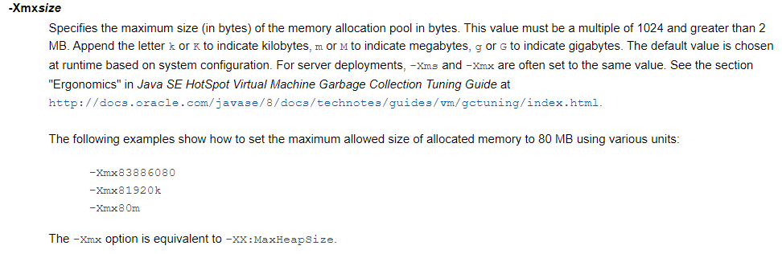

一个进程对应一个JVM的实例，进程可以理解为，一个正在执行的main方法就是一个JVM的实例。

## 堆的“核心”概述

- 一个 JVM 实例只存在一个堆内存，堆也是Java内存管理的核心区域。
- Java堆区在JVM启动的时候即被创建，其空间大小也就确定了。是JVM 管理的最大一块内存空间。堆内存的大小是可以调节的。
- 《Java虚拟机规范》规定，堆可以处于物理上不连续的内存空间中，但在逻辑上它应该被视为连续的。
- 所有的线程共享Java堆，在这里还可以划分线程私有的缓冲区(Thread Local Allocation Buffer， TLAB) 。所以说JVM的整块堆空间都是线程共享的，这是不正确的。
- 数组和对象可能永远不会存储在栈上，因为栈帧中保存引用，这个引用指向对象或者数组在堆中的位置。

- 在方法结束后，堆中的对象不会马上被移除，仅仅在垃圾收集器的时候才会被移除。
- 堆是GC（Garbage Collection）执行垃圾回收的重点区域。

## 堆的内存细分

现代垃圾收集器大部分基于**分代垃圾收集算法**。

JDK1.7 堆中有一块叫永久区，在JDK1.8之后就改为元数据区了。

Java 7及之前堆内存逻辑上分为：新生区+养老区+永久区

| 英文名                      | 中文名 |
| --------------------------- | ------ |
| Young/New Generation Space  | 新生区 |
| Old/Tenure generation space | 养老区 |
| Perm/Permanent Space        | 永久区 |

Java 8及之后堆内存逻辑分为：新生区+养老区+元数据区（元空间）

| 英文名                      | 中文名                           |
| --------------------------- | -------------------------------- |
| Young/New Generation Space  | 新生区，细分为Eden区和Survivor区 |
| Old/Tenure generation space | 养老区                           |
| Permanent Space             | 元空间                           |

> 如何查看分代信息

通过添加VM参数 `-XX:+PrintGCDetails` ，在程序执行时会打印出分代信息。

## 堆空间的大小与OOM

Java 堆区用于存储Java对象实例，那么堆的大小在JVM启动时就已经设定好了，可通过选项`-XMx` 和 `-Xms`来设置：

- `-Xms` 用于表示堆空间（年轻代+老年代）的起始内存，等价于 `-XX:InitialHeapSize`

- `-Xmx` 用于表示堆区的最大内存，等价于 `-XX:MaxHeapSize`

各参数含义，[点击前往官网](https://docs.oracle.com/javase/8/docs/technotes/tools/unix/java.html)：

- -X：JVM的运行参数。
- ms：memory start
- mx: memory max

如何使用参数



一旦堆区中的内存大小超过 `-Xmx` 所指定的最大内存时，就会抛出 OutOfMemoryError 异常（OOM）。

通常会将`-Xms` 和`-Xmx` 两个参数配置相同的值，其**目的是为了能够在Java垃圾回收机制清理完堆区后不需要重新分割计算堆的大小，从而提升性能。**

默认情况下，初始内存大小：物理内存大小 / 64，最大内存大小：物理电脑内存大小 / 4。

请看下方程序实例，本机是16G的运行内存：

```java
public class HeapSpaceInitial {
    public static void main(String[] args) {
        //返回Java虚拟机中的堆内存总量
        long initialMemory = Runtime.getRuntime().totalMemory() / 1024 / 1024;
        //返回Java虚拟机试图使用的最大堆内存量
        long maxMemory = Runtime.getRuntime().maxMemory() / 1024 / 1024;

        System.out.println("-Xms : " + initialMemory + "M");
        System.out.println("-Xmx : " + maxMemory + "M");

        System.out.println("系统内存大小为：" + initialMemory * 64.0 / 1024 + "G");
        System.out.println("系统内存大小为：" + maxMemory * 4.0 / 1024 + "G");
    }
}
```

执行结果

```bash
-Xms : 243M
-Xmx : 3596M
系统内存大小为：15.1875G
系统内存大小为：14.046875G
```

> 在开发中，建议 Xms 和 Xmx 设置为相同的大小，为什么？

例如，Xmx设置为1G，Xms设置为100M，当程序运行时内存不足了，就会不断的扩容；当用不到这些内存之后，就会不断的降低到初始值大小。在程序运行时，不断的调节堆内存的大小和GC，会给机器带来额外的压力。

现在给程序加上睡眠的代码并设置上VM参数 `-Xms100M -Xmx100M`

```java
TimeUnit.SECONDS.sleep(100);
```

运行结果：

```bash
-Xms : 96M
-Xmx : 96M
```

**其它的4M内存去哪了？**

借助`jps`查看Java程序的进程和`jstat`查看内存的使用情况

```bash
C:\Users\Administrator>jps
9008
3524 Jps
9076 RemoteMavenServer36
8968 HeapSpaceInitial
7356 Launcher
```

再输入 `jstat -gc 8968`命令：

```bash
C:\Users\Administrator>jstat -gc 8968
 S S0C    S1C    S0U    S1U      EC       EU        OC         OU       MC     MU    CCSC   CCSU   YGC     YGCT    FGC    FGCT     GCT
4044096.0 4096.0  0.0    0.0   25600.0   3603.8   68608.0      0.0     4480.0 769.7  384.0   75.8    0     0.000    0      0.000    0.000
```

这里的`OC`（Old Count）和`OU`（Old Used），新生代分为伊甸园区（E）、幸存者0区（S0）和幸存者1区（S1）。

堆内存=新生代+老年代 = S0C + S1C + EC + OC = 4096 + 4096 + 25600 + 68608 = 102400 / 1024 = 100 M

这里完整的内存计算出来，确实是100M，真正造成这 4M 没有打印出来的原因是：JVM存放对象的话，实际上是存放在E区以及S0区**或**S1区（S0和S1只能二选一的去用，主要原因和垃圾回收的算法有关），所以少加上一个Survive区就是真正初始化的内存大小的原因。

