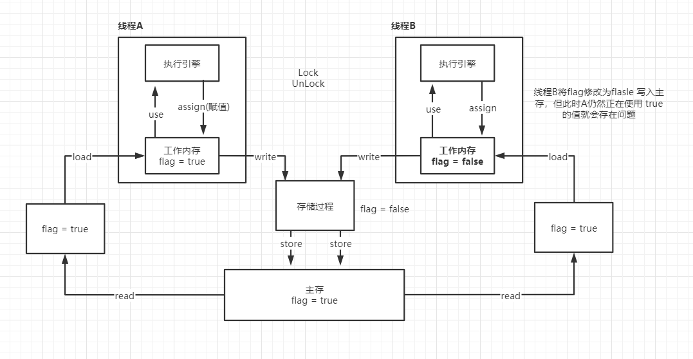

JMM全称Java Memory Model，Java内存模型是JSR133里指出了JMM是用来定义一个**一致的、跨平台**的内存模型，是缓存一致性协议，用于屏蔽掉各种硬件和操作系统的内存访问差异，让Java程序在各种平台下都能达到一致的并发效果。

## 区分开内存结构

内存结构和内存模型完全是两个东西，内存结构是下图中的这些

## 什么是内存模型

[在多CPU的系统中，每个CPU都有多级缓存，一般分为L1、L2、L3缓存](/ffba6cb8.html)。因为这些缓存的存在，提升了吞吐量，减轻了数据总线上数据传输的压力，同时也带来了很多新的挑战，比如两个CPU同时去操作同一个内存地址，会发生什么？在什么条件下，它们可以看到相同的结果？这些都是需要解决的。

所以在CPU的层面，内存模型定义了一个充分必要条件，保证其它CPU的写入动作对该CPU是可见的，而且该CPU的写入动作对其它CPU也是可见的，那这种可见性，应该如何实现呢？

有些处理器提供了强内存模型，从硬件层面上支持所有CPU在任何时候都能看到内存中任意位置相同的值。大多数处理器提供的是弱内存模型，需要执行一些特殊指令（`Memory Barriers`内存屏障），刷新CPU缓存的数据到内存中，保证这个写操作能够被其它CPU可见，或者将CPU缓存的数据设置为无效状态，保证其它CPU的写操作对当前CPU可见。

内存屏障除了实现CPU之前的数据可见性之外，还有一个重要的职责是**禁止指令的重排序**。重排序可以发生在好几个地方：编译器、运行时、JIT等，

在JVM中堆（heap）和方法区是线程共享区域，虚拟机栈、本地方法栈和程序计数器是线程独占部分。虚拟机栈中有多个线程，每个线程对应一个栈帧，每个栈帧中存放有局部变量表、操作数栈、方法返回地址等。线程与线程之间是不能够直接建立沟通的，需要借助于共享区域才来建立沟通。

内存模型的含义：Java编程语言内存模型通过检查执行跟踪中的每个读操作，并根据某些规则检查该读操作观察到的写操作是否有效来工作。只要程序的所有执行产生的结果都可以由内存模型预测。具体的实现者任意实现，包括操作的重新排序和删除不必要的同步。

JMM 内存模型是一种虚拟机的规范，描述程序的可能行为。

- 线程解锁前，必须把共享变量立刻刷回主存。

- 线程加锁前，必须读取主存中的最新值到工作内存中。

- 加锁和解锁是同一把锁。

线程A从主存中读到值flag=true，加载到自己的工作内存中（堆区），由执行引擎处理后将值再赋值给工作内存，写入存储过程（存储过程就是把store操作从工作内存中得到的变量放入主存中的操作）。

lock 作用于主内存的变量，把一个变量标识为线程独占状态，unlock 也是作用于主内存的变量，将被锁定的变量释放出来，释放后才能被其它线程锁定。

