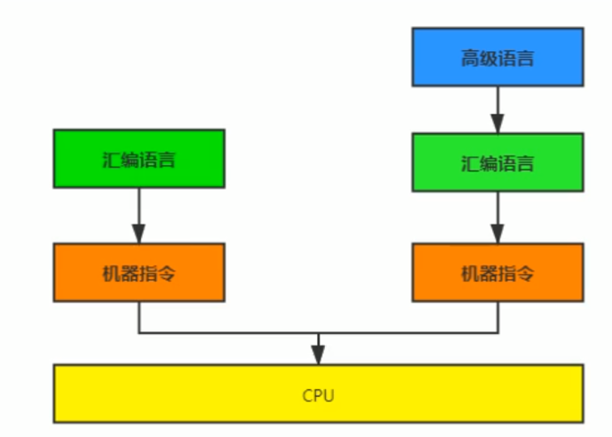
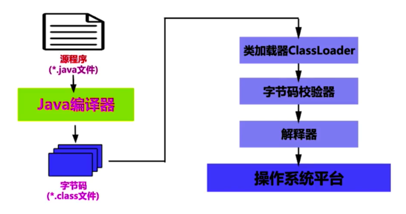
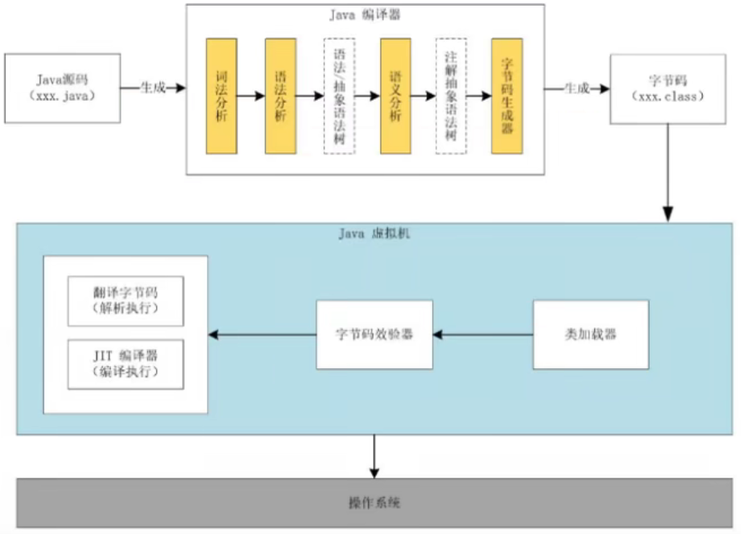
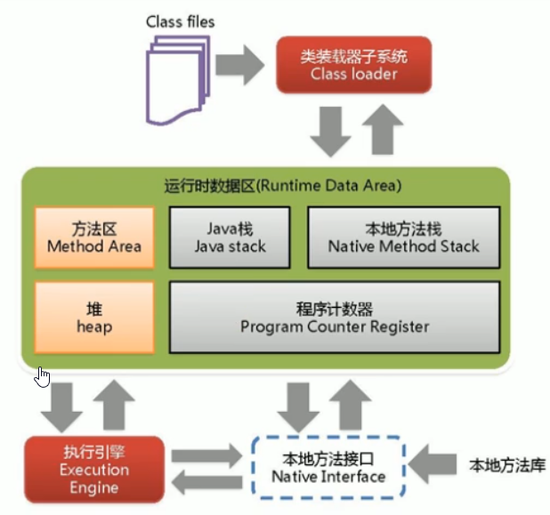
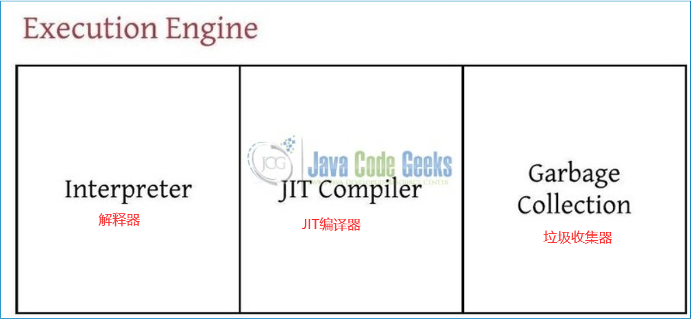

## Java程序运行流程

在计算机系统体系中并不认识高级语言，需要转成汇编，再由转机器指令。

*.java文件通过 javac 编译成 *.class文件，通过 ClassLoader 加载到JVM经过链接阶段（暂时不懂可略过）后，在运行时通过解释器解释执行。

## Java代码执行流程

我们编写的Java源码首先经过Java编译器（也称前端编译器），只要其中一个编译的环节出现了问题都不能正常生成字节码文件。

解释器（解释执行）和JIT编译器（编译执行）：

解释器：保证响应时间，运行时对字节码指令进行逐行解释执行。

JIT编译器：二次编译，将热点代码直接编译成机器指令，并把这些机器指令缓存起来。

## JVM的整体结构

HotSpot VM是目前市面上性能虚拟机的代表作之一，**解释器与即时编译器并存**。

## JVM的架构模型

java编译器输入指令流是**基于栈**的指令集架构，另外一种指令架构**基于寄存器**指令集架构。

**基于栈的指令集架构特点**

　　1.设计和实现更简单，适用于资源受限的系统；（栈的资源有限）

　　2.避开了寄存器的分配难题：使用的是零地址指令分配方式（零地址指令：只有操作数，没有地址指向操作数）

　　3.指令流中大部分指令是零地址指令，执行过程依赖于栈操作。

　　　　优点：指令集合小，编译器容易实现。

　　　　缺点：完成一项操作需要更多的指令完成（栈的原因导致），效率低。

　　4.不需要硬件的支持，可移植性好，利于跨平台（没有和硬件挂钩）

**基于寄存器指令集架构特点**

　　1.典型应用：传统pc以及android的Davlik虚拟机

　　2.指令集架构依赖于硬件，可移植性差

　　3.性能优秀，执行效率高（因为花费更少的指令去执行一个操作）

　　4.大部分情况下，寄存器指令集往往都是一地址指令、二地址指令和三地址指令为主（指令集合大）

## JVM的生命周期

JVM启动 -> 执行 -> 退出。

### 启动

Java 虚拟机的启动是通过引导类加载器（Bootstrap ClassLoader ）创建一个初始类（Initial Class）来完成的这个类是虚拟机的具体实现来指定的。

### 执行

- 一个运行中的Java虚拟机有着一个清晰的任务：执行Java程序
- 程序开始执行时它才运行，程序结束时它就停止。
- 执行一个Java程序的时候，真正在执行的是一个Java虚拟机的进程。

### 退出

有如下几种情况：

- 程序正常结束
- 程序在执行过程中遇到了异常或错误而异常终止。
- 由于操作系统出现错误而导致Java虚拟机进程终止。
- 某线程调用Runtime类或System类的exit方法，或Runtime类的halt方法，并且Java安全管理器也允许这次exit或halt操作。
- 除此之外，JNI（Java Native Interface）规范描述了用JNI Invocation API来加载或卸载 Java虚拟机时，Java虚拟机的退出。

## 执行引擎结构

