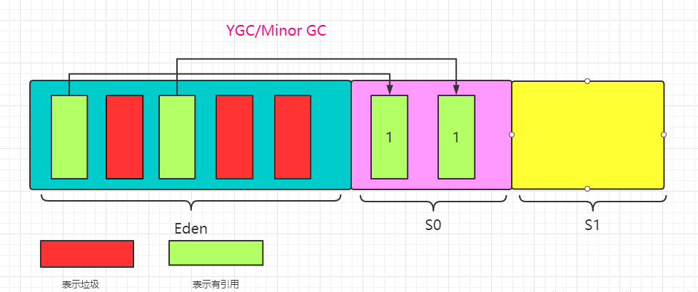
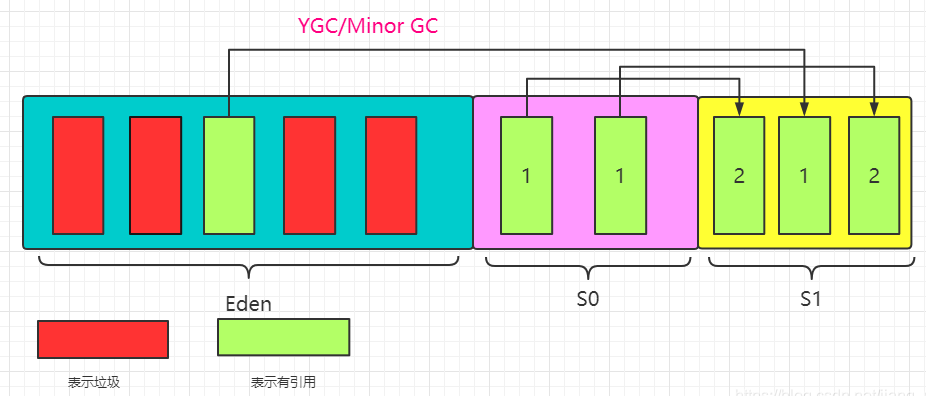
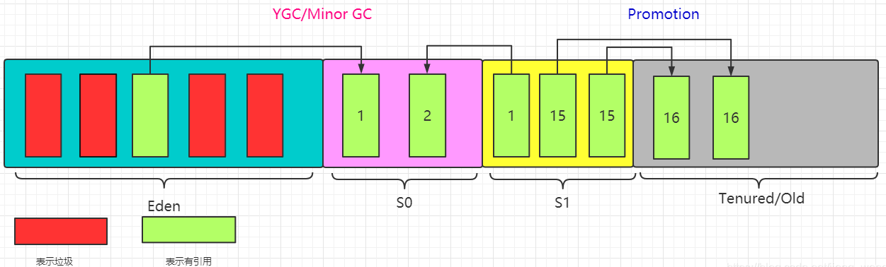
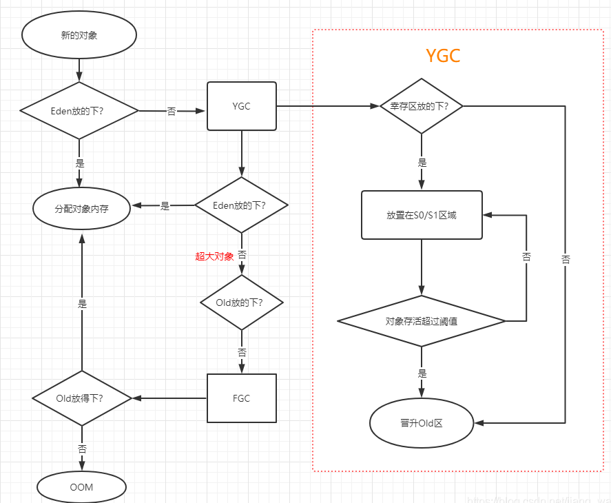

## MinorGC、YoungGC、MajorGC、FullGC的区别

实际上，MinorGC又称为 YoungGC，完全等价。YoungGC 的触发条件是 Eden 满了的时候，会一起回 Eden 和 S0或S1。注意：当幸存者区满了之后是不会触发YoungGC的。

MajorGC是针对老年代的垃圾回收。FullGC是将新生代、老年代、方法区一起回收。我们大部分时候回收的都是指新生代。

针对Hotspot Vm的实现，它里面的GC按照回收区域又分为两大类：部分收集（Partial GC）、整堆收集（Full GC）。

### 部分收集

- 新生代收集（Minor GC / Young GC）：只是新生代（Eden \ S0,S1)的垃圾收集器。
- 老年代收集（Major GC / Old GC）：只是老年代的垃圾收集。目前只有CMS GC会有单独收集老年代的行为，很多时候Major GC会和Full GC混淆使用，需要具体分辨是老年代回收还是整堆回收。
- 混合收集（Mixed GC）：收集整个新生代以及部分老年代的垃圾收集。目前只有G1 GC会有这种行为。

### 整堆收集

收集整个Java堆区、方法区的垃圾收集器。

### 老年代GC(Major GC/Full GC)触发机制

- 指发生在老年代的GC,对象从老年代消失时,我们说"Major GC"或"Full GC"发生了。
- 出现了Major GC,经常会伴随至少一次的Minor GC(但非绝对的,在Parallel Scavenge收集器的收集策略里就有直接进行Major GC的策略选择过程)。也就是在老年代空间不足时,会先尝试触发Minor GC。如果之后空间还不足,则触发Major GC。
- Major GC的速度一般会比Minor GC慢10倍以上,STW的时间更长。
- 如果 Major GC 之后内存还是不足，就报出OOM的错误了。

## 对象分配过程概述

为新对象分配内存是一件非常严谨和复杂的任务，JVM的设计者们不仅需要考虑内存如何分配、在哪里分配等问题，并且由于内存分配算法与内存回收算法密切相关，所以还需要考虑GC执行完内存回收后是否会在内存空间中产生内存碎片。

New 的对象先放在伊甸园区，当伊甸园区的空间填满时，程序又需要创建对象，JVM的垃圾回收期将对伊甸园区进行垃圾回收（Minor GC），将伊甸园区中的不在被其他对象所引用的对象进行销毁，再加载新的对象到伊甸园区，然后将伊甸园区中的剩余对象移动到幸存者0区（S0），如果再次触发垃圾回收，此时上次幸存下来的放到幸存者0区，如果没有回收，就会放到幸存者1区（S1）。如果再次经历垃圾回收，此时会重新放到S0区，接着再去S1，如果再次经历垃圾回收，此时会重新放回S0，接着再去S1，如此循环直到第15次（默认，可以通过`-XX:MaxTenuringThreshold=N`设置）转去老年代。

## GC过程

### 第一次GC

当伊甸园区的空间满了，并且程序又需要创建新的对象时，JVM垃圾回收器将伊甸园区进行垃圾回收，将伊甸园区的不再被引用的对象进行销毁，再在伊甸园区创建新的对象。

然后将伊甸园区剩余的对象移动到S0，每个对象被分配了一个年龄计数器（age），每进行一次GC，幸存下来的对象age累加，上面的两个幸存对象age被赋值为1。

此次GC完成后，伊甸园区是空的。

S0区和S1区，也被叫做From区和To区，判断二者很简单，谁是空的谁是To区，则另外一个就是From区；

### 第二次GC

当伊甸园区空间又满了时，进行第二次GC，将伊甸园区幸存的对象放入S1区，age此时为1；

同时对S0区的对象进行判断是否还被使用，如果被使用的话，就将其放入S1区，age累加此时为2；

第二次GC完成后，S0区为空了，此时S0区为To区，S1区为From区；

### 第N次GC

第N次GC时，我们发现S1区的有两个对象的age已经是15了，如果此时这两个对象还是被引用的，则将其晋升到Old区；

其中15为默认阈值，这个阈值是可以自己设置：`-XX:MaxTenuringThreshold=N`

## 对象分配的特殊情况

创建一个新的对象时，首先判断Eden区是否放得下，如果放得下，就为其分配内存，放不下的话，就进行YGC；

然后再判断Eden区是否放得下，如果此时放得下的话，就为其分配内存；

如果还是放不下，说明这个对象比伊甸园区的空间还要大，这个对象是个超大对象，此时将其放入Old区；

如果Old区也放不下，就进行FGC，然后再判断Old区能不能放下，放得下就存在Old区，如果还是放不下，就会出现OOM异常；

在进行YGC的时候，幸存的对象会放入幸存区，此时判断是否能放下，如果幸存区放不下，就会直接放入Old区。

