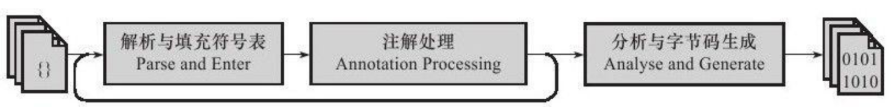
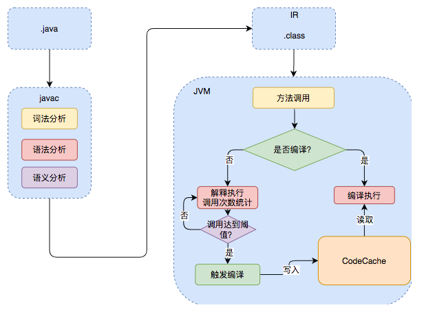
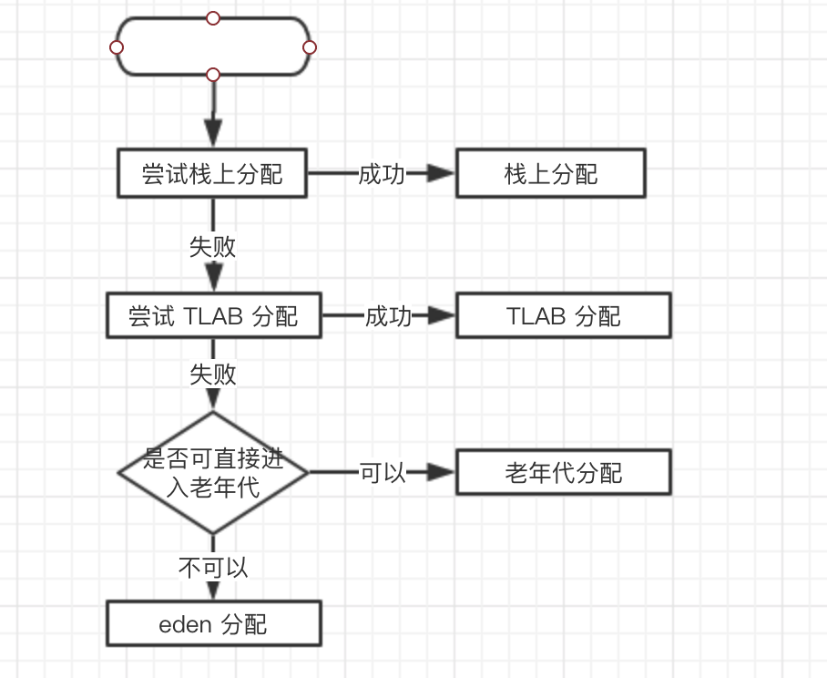

JVM（HotSpot）在哪些阶段能对开发者写的代码进行优化？在Java中的三种编译方式中：前端编译（Javac）、即时编译（Just In Time）、提前编译（Ahead Of Time）。

Java的执行过程整体可以分为两个部分，在第一步步中由javac将源码编译成字节码，在这个过程中会进行词法分析、语法分析、语义分析，编译原理中这部分的编译称为前端编译。即.java成功编译为.class的过程。

## 前端编译

前端编译器 Javac（是Java语言写的） ，编译过程如下图。前期编译优化代码主要分为**编译过程**和**语法糖**的优化。



### 解析与填充符号表

- 词法语法分析：源代码的字符流 ==> 标记token集合
  - 如 int a = b + 2;  ⇒  int , a , = , b , + , 2
- 根据token序列构造**抽象语法树**
- 此后，编译器基本上不会再操作源代码，而是操作抽象语法树
- 填充符号表：由一组符号地址和符号信息构成

### 注解处理

JDK1.5后Java开始支持注解，JDK1.6中提供了一组**插件式注解处理器**的标准API，可以自定义注解处理器来干预编译器的行为。原理是干预生成的字节码的文件。

可以把注解处理器看作是编译器的插件，在编译期间对注解进行处理，可以对语法树进行读取、修改、添加任意元素；但如果有注解处理器修改了语法树（AST），编译器将返回解析及填充符号表的过程，重新处理，直到没有注解处理器修改为止，每一次重新处理循环称为一个Round。

### 语法分析与字节码生成

对结构上正确的代码进行检查：类型检查、代码逻辑检查。

解析语法糖：语法糖是指在计算机语言中添加的某种语法，这种语法对语言的功能没有影响，但是更方便程序员的使用。JVM是不支持语法糖的语法的，所以需要前端编译器将其还原为简单的基础语法结构。常见的有如下解析（以下证明可通过字节码反编译过来查看）：

#### 泛型与类型擦除

```java
List<String> list = new ArrayList<>(); 
//擦除后
List list = new ArrayList();
```

如果有类中有以下泛型重载的两个方法，类型擦除后还能编译通过吗？

```java
public class GenericType {
    public static void method(List<String> list){
        System.out.print("invoke method(List<String> list)");
    } 
 
    public static void method(List<Integer> list){
        System.out.print("invoke method(List<Integer> list)");
    }
}
```

编译不通过，不允许泛型重载。

#### 自动拆装箱

装箱：基本类型变为包装类型。例如：Integer n = 1;

拆箱：包装类型变为基本类型。例如：int i = n;

```java
List<Integer> list = Arrays.asList(1,2,3);
// JDK1.7 编译后
List<Integer> list = [1, 2, 3, 4]
// JDK1.8 编译后
List<Integer> list = Arrays.asList(new Integer[] {
    Integer.valueOf(1),Integer.valueOf(2),Integer.valueOf(3)
}); 
```

#### 遍历循环转迭代器

```java
int sum = 0;
for (Integer i : list) {
    sum += i;
}
// 编译后
int sum = 0;
for (Iterator localIterator = list.iterator();localIterator.hasNext();){
    int i = ((Integer) localIterator.next()).intValue();
    sum += i;
}
```

#### 条件编译擦除不成立的分支

```java
if (true) {
    System.out.println("hello");
} else {
    System.out.println("mrdjun");
}
// 编译后
System.out.println("hello");
```

#### 可变长参数封装成数组参数

JDK1.5新特性。

```java
public static int sum(int a, int... args) {
    for (int i : args) {
        a += i;
    }
    return a;
}
// 编译后
public static int sum(int a, int... args) {
    int[] var2 = args;
    int var3 = args.length;
    for(int var4 = 0; var4 < var3; ++var4) {
        int i = var2[var4];
        a += i;
    }
    return a;
}
```

字节码生成：字节码是IR码，IR码大致可以理解为需要再转一次才能让机器识别。

## 即时编译

运行期编译器（JIT）的代码优化，简单来说就是一句话：将热点代码直接编译成机器码进行执行和逃逸分析。

JVM中集成了两种编译器：Client Compiler、Server Compiler，通常将前者称为C1编译器，后者称为C2编译器。Client Compiler注重启动速度和局部的优化，Server Compiler则更加关注全局的优化，性能会更好，但由于会进行更多的全局分析，所以启动速度会变慢。两种编译器有着不同的应用场景，在虚拟机中同时发挥作用。

### “将热点代码直接编译成机器码进行执行”是什么意思？

常见的编译型语言如C++，通常会把代码直接编译成CPU所能理解的机器码来运行。而Java为了实现“一次编译，处处运行”的特性，把编译的过程分成两部分，首先它会先由javac编译成通用的中间形式——字节码（IR码），然后再由解释器逐条将字节码解释为机器码来执行。所以在性能上，Java通常不如C++这类编译型语言。

为了优化Java的性能 ，JVM在解释器之外引入了即时（Just In Time）编译器：当程序运行时，解释器首先发挥作用，代码可以直接执行。随着时间推移，即时编译器逐渐发挥作用，把越来越多的代码编译优化成本地代码，来获取更高的执行效率。解释器这时可以作为编译运行的降级手段，在一些不可靠的编译优化出现问题时，再切换回解释执行，保证程序可以正常运行。

即时编译器（JIT）极大地提高了Java程序的运行速度，而且跟静态编译相比，即时编译器可以选择性地编译热点代码，省去了很多编译时间，也节省很多的空间。目前，即时编译器已经非常成熟了，在性能层面甚至可以和编译型语言相比。不过在这个领域，大家依然在不断探索如何结合不同的编译方式，使用更加智能的手段来提升程序的运行速度。

### 怎么样才会被认为是热点代码呢？

JVM中会设置一个阈值，当方法或者代码块的在一定时间内的调用次数超过这个阈值时就会被编译，存入codeCache中。当下次执行时，再遇到这段代码，就会从codeCache中读取机器码，直接执行，以此来提升程序运行的性能。整体的执行过程大致如下图所示：



### 逃逸分析

先解释一下什么是逃逸分析。假如你要跑，我要分析你为什么要跑，要跑到哪里去。这个分析的过程就叫逃逸分析。

逃逸分析的目的也很明确：判断对象的作用域是否超出函数体，即判断是否逃逸出函数体。

`-XX:+DoEscapeAnalysis` 启用逃逸分析（JDK1.8默认开启）。

#### 栈上分配

对那些作用于不会逃逸出方法的对象，在分配内存时，不在将对象分配在堆内存中，而是将对象属性打散后分配在线程私有栈内存上，这样随着方法调用结束，栈上分配打散的对象也被回收掉，不在增加 GC 额外压力。

栈上分配速度快，但栈空间小，大对象无法实现栈上分配。

```java
// 栈上分配示例
public void build(){
    User u = new User();
    u.setAge(25);
    u.setName("mrdjun");
}
```

那么现在就可以回答一个问题了：在Java中创建的对象一定在堆中吗？

对象分配流程如下图所示：



#### 标量替换

当一个方法中的对象未发生逃逸时，会将这个对象的属性拆分为多个变量。例如下面有这样一个对象：

```java
@Data@AllArgsConstructor
public class Point {
    private int x;
    private int y;
}
```

在方法中使用

```java
public void hello(){
    Point point = new Point(1, 2);
    System.out.println(point.getX() + "," + point.getY());
}
```

当 point 对象在后面的执行过程中未用到时，经过编译后，代码会变成下面这个结构：

```java
public void hello(){
    int x = 1;
    int y = 2;
    System.out.println(x + "," + y);
}
```

简单地说，就是用标量替换聚合量。这样做的好处是如果创建的对象并未用到其中的全部变量，则可以节省一定的内存。对于代码执行而言，无需去找对象的引用，也会更快。

- 标量是指不可分割的量，如java中基本数据类型和reference类型，相对的一个数据可以继续分解，称为聚合量；

- 如果把一个对象拆散，将其成员变量恢复到基本类型来访问就叫做标量替换；

- 如果逃逸分析发现一个对象不会被外部访问，并且该对象可以被拆散，那么经过优化之后，并不直接生成该对象，而是在栈上创建若干个成员变量；

`-XX:+EliminateAllocations` 启用标量替换（JDK1.8默认开启）。

`-XX:+PrintEliminateAllocations` 查看标量替换的情况。

#### 同步省略

也就是“锁消除”。在逃逸分析过程中，如果一个对象被发现只能从一个线程被访问到，那么对于这个对象的操作无需考虑同步。

```java
public void f() {
    Object mrjdun = new Object();
    synchronized(mrjdun) {
        System.out.println(mrjdun);
    }
}
```

代码中对`mrjdun`这个对象进行加锁，但是`mrjdun`对象的生命周期只在f()方法中，并不会被其他线程所访问的情况，JIT编译阶段就会优化成以下代码：

```java
public void f() {
    Object mrjdun = new Object();
    System.out.println(mrjdun);
}
```

## 提前编译

静态提前编译器（AOT）：直接把程序编译成与目标机器指令集相关的二进制代码的过程。

目前有两种主要的实现方式：

与传统C、C++编译器类似，在程序运行之前把程序代码编译成机器码的静态翻译工作
把原本即时编译器在运行时要做的编译工作提前做好并保存下来，下次运行到这些代码（譬如公共库代码在被同一台机器其他Java进程使用）时直接把它加载进来使用
第一种实现方式在Java中的存在价值直指即时编译的最大弱点：即时编译要占用程序运行时间和运算资源。例如最耗时的优化措施之一：过程见分析，必须在全程序范围内做大量耗时的计算工作，如果是在程序运行之前进行的静态编译，这些耗时操作就可以大胆的进行。

对于第二种方式，本质上是给即时编译器做缓存加速，去改善Java程序的启动时间，以及需要一段时间预热之后才能达到最高性能的问题。这种提前编译被称为动态提前编译或者直接叫即时编译缓存。HotSpot运行时可以直接加载这些编译结果，实现快速程序启动速度，减少程序达到全速运行状态所需要的时间。

但是即时编译相比于提前编译也有很多优点：

性能分析制导优化。解释器和客户端编译器在运行期间会不断收集性能监控信息，这些信息一般无法在静态分析是获得，或者不一定存在唯一的解，但在动态运行时很容易得到
基金预测性优化。静态优化无论何时都必须保证优化后的所有程序外部可见影响（不仅仅是执行结果）与优化前必须是一致的。即时编译的策略就可以不必那么保守，如果性能监控信息能够支持它做出一些正确的可能很大但是无法保证绝对正确的预测判断，就可以进行大胆的优化，大不了退回到低级i按一起甚至解释器上运行。而这样的优化往往能够大幅度降低目标程序的复杂度，输出运行速度非常高的代码
链接时优化。由于Java天生是动态连接的，所以提前编译无法做到链接后的优化。

