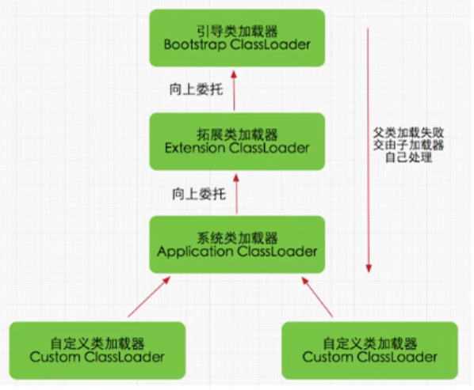
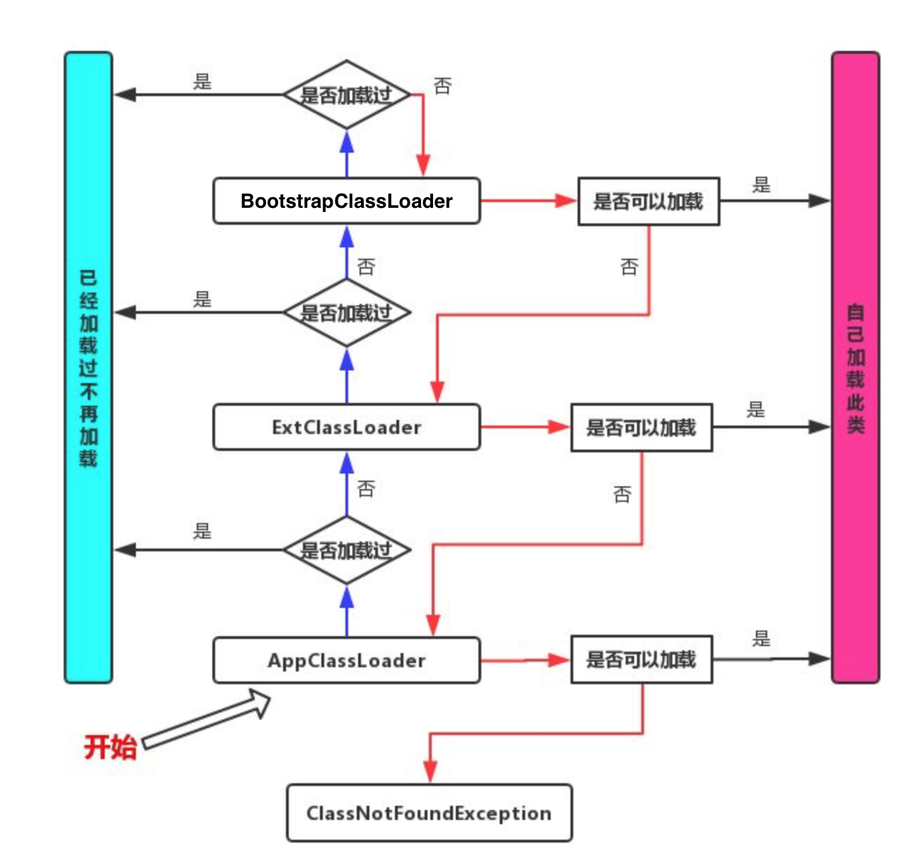

Java虚拟机对class文件采用的是**按需加载**的方式，也就是说当需要使用该类时才会将它的class文件加载到内存生成class对象。而且加载某个类的class文件时，Java虚拟机采用的是**双亲委派模式**，即把请求交由父类处理，它是一种任务委派模式。

> Tips：如果在工程目录的src下新建一个名为 java.lang 的包，在其中新建一个类名String的类，这个类能够正常运行吗？

程序代码如下：

```java
package java.lang;

public class String {
    static {
        System.out.println("能够初始化我吗？");
    }
}
```

```java
public class Application {
    public static void main(String[] args) {
        java.lang.String str = new java.lang.String();
        System.out.println("hello,world");
    }
}
```

执行结果：

```
hello,world
```

说明并未初始化在java.lang包下自定义的String类。这是双亲委派机制保护了我们系统核心API不容易被破坏。

## 原理

1、如果一个类加载器收到了类加载请求，它并不会自己先去加载，而是把这个请求委托给父类的加载器去执行。

2、如果父类加载器还存在其父类加载器，则进一步向上委托，依次递归请求最终将到达顶层的启动类加载器。

3、如果父类加载器可以完成类加载任务，就成功返回，倘若父类加载器无法完成此加载任务，子加载器才会尝试自己去加载，这就是双亲委派模式。



在 java.lang 包下的 ClassLoader 类中的 loadClass 方法，源码如下：

```java
public Class<?> loadClass(String name) throws ClassNotFoundException {
    return loadClass(name, false);
}

protected Class<?> loadClass(String name, boolean resolve)
    throws ClassNotFoundException {
    // 首先，检查是否已经被类加载器加载过
    Class<?> c = findLoadedClass(name);
    if (c == null) {
        try {
            // 存在父加载器，递归的交由父加载器
            if (parent != null) {
                c = parent.loadClass(name, false);
            } else {
                // 直到最上面的Bootstrap类加载器
                c = findBootstrapClassOrNull(name);
            }
        } catch (ClassNotFoundException e) {
            // ClassNotFoundException thrown if class not found
            // from the non-null parent class loader
        }

        if (c == null) {
            // If still not found, then invoke findClass in order
            // to find the class.
            c = findClass(name);
        }
    }
    return c;
}
```

其实这段代码已经很好的解释了双亲委派机制，在结合下图加深理解



## 为什么要设计这种机制

1、保护程序安全，防止核心API被随意篡改。在java.lang包下，开发者自定义的类中的main方法不允许执行，防止恶意代码对程序产生破坏。

2、避免类的重复加载。一个类只会被加载一次。

## 沙箱安全机制

自定义string类，但是在加载自定义String类的时候会率先使用引导类加载器加载，而引导类加载器在加载的过程中会先加载jdk自带的文件(rt. jar包中java\lang\String.class)，报错信息说没有main方法，就是因为加载的是rt. jar包中的String类。这样可以保证对java核心源代码的保护，这就是**沙箱安全机制**。

## 补充内容

> 在JVM中表示两个class对象是否是同一个类的两个必要条件

1、类的完整路径一直（包名+类名）。

2、加载这个类的ClassLoader必须相同。

换句话说，在JVM中， 即使这两个类对象(class对象)来源同一个Class文件，被同一个虚拟机所加载，但只要加载它们的ClassLoader实例对象不同，那么这两个类对象也是不相等的。

> 对类加载器的引用

JVM必须知道--个类型是由启动加载器加载的还是由用户类加载
器加载的。如果一个类型是由用户类加载器加载的，那么JVM会将这个类加载器的一个引用作为类型信息的一部分保存在方法区中。当解析一个类型到另一个类型的引用的时候，JVM需要保证这两个类型的类加载器是相同的。

> Java程序对类的使用方式分为：主动使用、被动使用两种方式

 主动使用，又分为七种情况:

1、创建类的实例

2、访问某个类或者接口的静态变量,或者对该静态变量赋值

3、反射( 比如:Class.forName(“java.lang.String)))

4、初始化一个类的子类

5、java虚拟机启动时被标明为启动类的类

6、java 7开始提供的动态语言支持

除了以上七种情况,其他使用Java类的方式都被看作是对类的被动使用都不会导致类的初始化。
