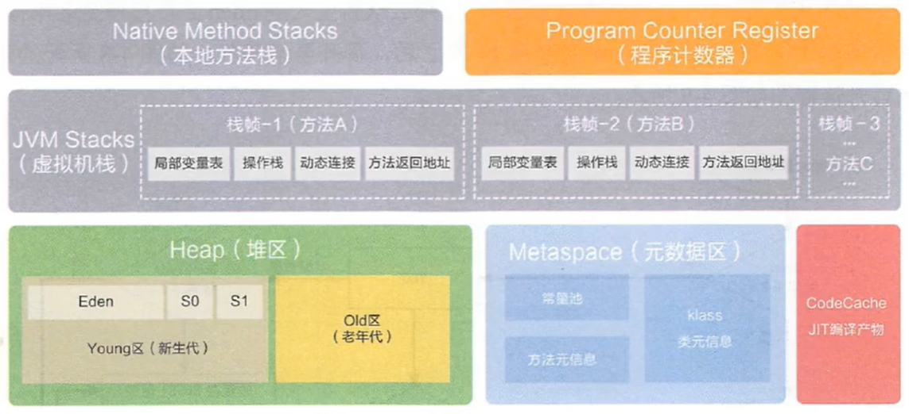
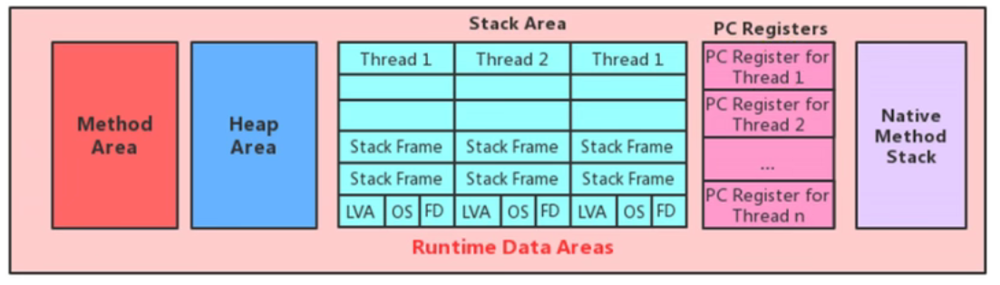

## 运行时数据区

Java虚拟机定义了一系列逻辑数据区域，有些是随着虚拟机的启动而创建，虚拟机的关闭而销毁。还有一部分是随着线程生命周期创建销毁的。

我们有必要深入了解这块的内容，因为它将决定服务器性能，首先我们需要对整个运行时区域由整体的认识并且了解了每个区域的生命周期以及作用之后才能通过相应的调参来提升系统性能。除此之外还有助于快速定位虚拟机的相关Error.

## 程序计数器（PC寄存器）

JVM中的程序计数寄存器(Program Counter Register) 中，Register 的命名源于CPU的寄存器，寄存器存储指令相关的现场信息。CPU只 有把数据装载到寄存器才能够运行。

这里，并非是广义上所指的物理寄存器，或许将其翻译为PC计数器(或指令计数器)会更加贴切(也称为程序钩子)，并且也不容易引起- -些不必要的误会。JVM中的PC寄存器是对物理PC寄存器的一-种抽象模拟。

- 程序计数器是一块很小的内存空间，几乎可以忽略不计，也是速度最快的存储区域
- 在JVM规范中，每个线程都有他自己的程序计数器，是线程私有的，生命周期与线程的生命周期保持一致
- 任何时候一个线程都只有一个方法在执行，也就是所谓的当前方法。程序计数器会存储当前线程正在执行的Java方法的JVM指令的地址；或者如果在执行的是native方法，则是未指定值（undefind）
- 他是程序控制流的指示器，分支，循环，跳转，异常处理，线程恢复等基础功能都是需要依赖这个计数器来完成。
- 字节码解释器工作时就是通过改变这个计数器的值来选取下一条需要执行的字节码指令
- 唯一一个在Java虚拟机规范中没有规定任何OutMemoryError情况的区域

> 使用PC寄存器存储字节码指令地址有什么用？

因为CPU需要不停的切换各个线程，这时候切换回来以后，就得知道接着从哪里开始继续执行

> 为什么使用PC寄存器记录当前线程的执行地址？

JVM的字节码解释器就需要通过改变PC寄存器的值来明确下一条应该执行什么样的字节码。

> PC寄存器为什么会被设定为线程私有的？

为了能够准确地记录各个线程正在执行的当前字节码指令地址，最好的办法自然是为每一个线程都分配一个PC寄存器

由于CPU时间片轮流限制，众多线程在并发执行过程中，任何一个确定的时刻，一个处理器或者多核处理器中的一个内核，只会执行某一个线程中的一条指令，这样必然导致经常中断或恢复，如何保证分毫不差呢？每个线程在创建后，都会产生自己的程序计数器和栈帧，程序计数器在各个线程之间互不影响。

