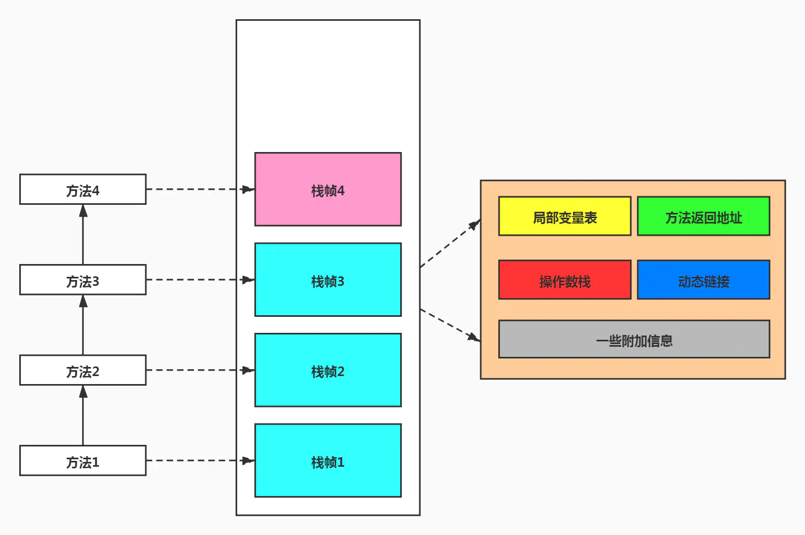
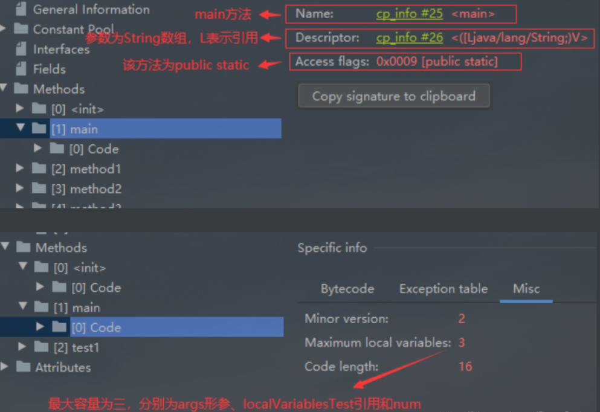
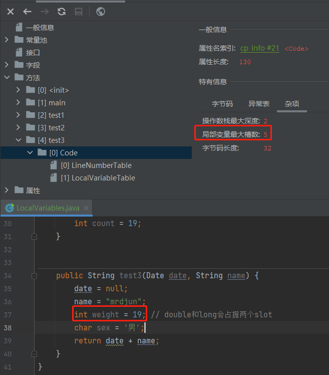
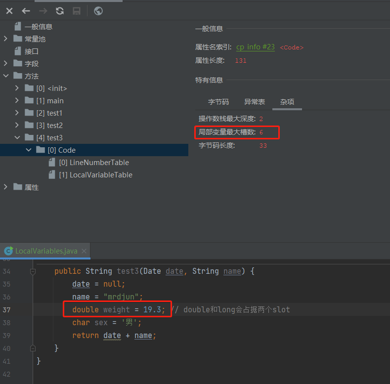
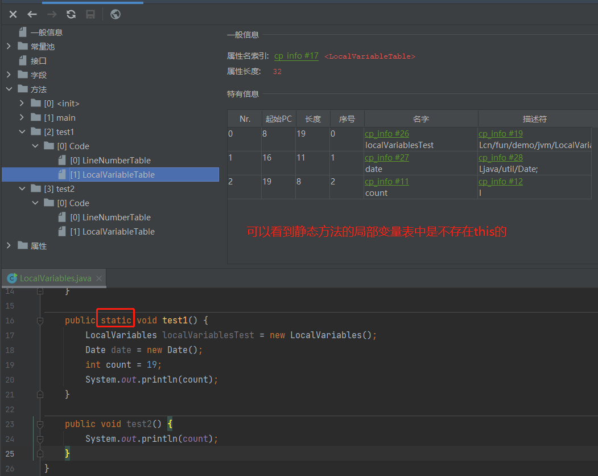
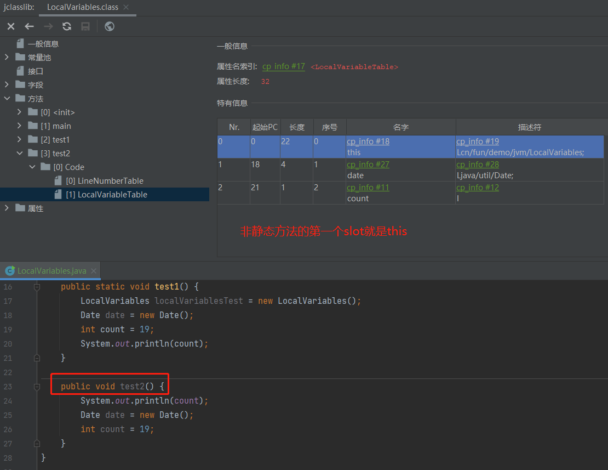
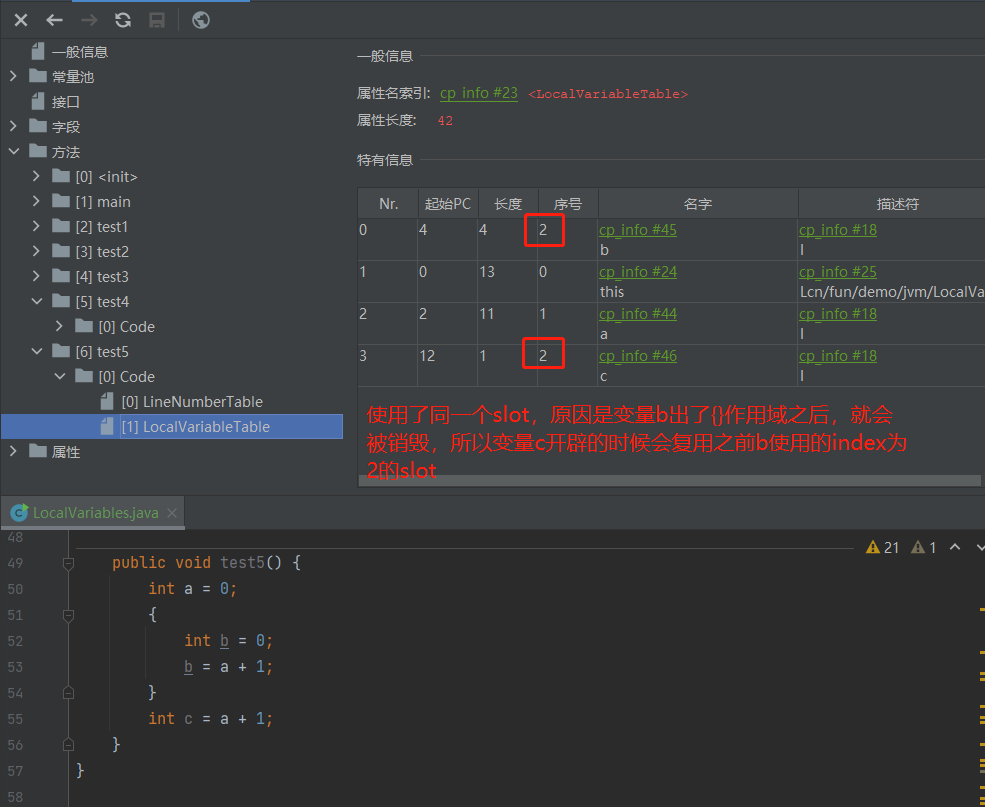

## 基础概念

### 是什么？

Java虚拟机栈(Java virtual Machine stack) ，早期也叫Java栈。每个线程在创建时都会创建一个虚拟机栈,其内部保存一个个的栈帧(stack Frame) ,对应着一次次的Java方法调用，每个方法被调用执行的时候，Java虚拟机都会同步创建一个栈帧（Stack Frame）。

### 生命周期

回顾一下：方法区（保存类信息、常量、静态变量等）和堆内存（保存对象的实例等）是线程共享的。栈、程序计数器、本地方法栈是线程独享的。所以说虚拟机栈它的生命周期与线程相同。

### 作用

主管Java程序的运行，它保存方法的局部变量（8中基本数据类型）、部分结果，并参与方法的调用和返回。

### 优点

- 栈是一种快速有效的额分配存储方式，访问速度仅次于程序计数器
- JVM 直接对 Java 栈的操作只有两个
  - 每个方法执行，伴随着进栈（入栈、压栈）
  - 执行结束后的出栈工作
- 对栈来说不存在垃圾回收问题（可能会溢出）

### 栈中可能的异常

Java 虚拟机规范允许 Java 栈的大小是动态的或者是固定不变的。

- 如果采用固定大小的 Java 虚拟机栈，那每一个线程的 Java 虚拟机栈容量可以在线程创建的时候独立选定。如果线程请求分配的栈容量超过 Java虚拟机栈允许的最大容量，Java 虚拟机将会抛出一个 `StackOverflowError` 异常。
- 如果 Java 虚拟机栈可以动态扩展，并且在尝试扩展的时候无法申请到足够的内存，或者在创建新的线程时没有足够的内存去创建对应的虚拟机栈，那 Java 虚拟机会抛出一个 `OutOfMemoryError` 异常。

### 设置程序运行时栈内存大小

官方文档地址：https://docs.oracle.com/javase/8/docs/technotes/tools/windows/java.html#BGBCIEFC

使用参数 -Xss 设置线程的最大栈空间，栈的大小直接决定了函数调用的最大可达深度。

```shell
-Xss1m
-Xss1024k
-Xss1048576
```

### 栈运行原理

- JVM 直接对 Java 栈的操作只有两个，就是对栈帧的压栈和出栈，遵循“先进先出”或“后进先出”的原则
- 在一条活动线程中，一个时间点上，只会有一个活动的栈帧。即只有当前正在执行的方法的栈帧（栈顶栈帧）是有效的，这个栈帧被称为当前栈帧（Current Frame），与当前栈帧相对应的方法就是当前方法（Current Method），定义这个方法的类就是当前类（Current Class）
- 执行引擎运行的所有字节码指令只针对当前栈帧进行操作
- 如果在该方法中调用了其他方法，对应的新的栈帧会被创建出来，放在栈的顶端，称为新的当前帧
- 不同线程中所包含的栈帧是不允许相互引用的，即不可能在一个栈帧之中引用另外一个线程的栈帧
- 如果当前方法调用了其他方法，方法返回之际，当前栈帧会传回此方法的执行结果给前一个栈帧，接着，虚拟机会丢弃当前栈帧，使得前一个栈帧重新称为当前栈帧
- Java 方法有两种返回函数的方式，一种是正常的函数返回，使用 return，另一种是抛出异常，不管使用哪种，都会导致栈帧被弹出。

## 栈帧的内部结构

每个栈帧包含5个组成部分：局部变量表（Local Variables）、操作数栈（Operand Stack）、动态链接（Dynamic Linking）、方法返回地址（Return Address）和一些附加信息。



### 局部变量表（Local Variables）

- 局部变量表也被称为局部变量数组或本地变量表。
- 定义为一个数字数组，主要用于存储方法参数和定义在方法体内的局部变量，这些数据类型包括各类基本数据类型、对象引用（reference），以及returnAddress 类型
- 由于局部变量表是建立在线程的栈上，是线程私有的数据，因此不存在数据安全问题
- 局部变量表所需的容量大小是在编译期确定的，并保存在方法的Code 属性的 maximum local variables 数据项中。在方法运行期间是不会改变局部变量表的大小的
- **方法嵌套调用的次数由栈的大小来决定，一般来说栈越大，方法嵌套调用次数越多。**对一个函数而言，它的参数和局部变量越多，使得局部变量表膨胀，它的栈帧就越大，以满足方法调用所需传递的信息增大的需求。进而函数调用就会占用更多的栈空间，导致其嵌套调用的次数就会减少。
- **局部变量表中的变量只在当前方法调用中有效。**在方法执行时，虚拟机通过使用局部变量表完成参数值到参数变量列表的传递过程。**当方法调用结束后，随着方法栈帧的销毁，局部变量表也会随之销毁。**

```java
public class LocalVariablesTest {
    private int count  = 0;
    public static void main(String[] args) {
        LocalVariablesTest localVariablesTest = new LocalVariablesTest();
        localVariablesTest.test1();
        int num = 10;
    }
    public void test1() {
        Date date = new Date();
    }
}
```



> #### 关于Slot的理解

- 参数值的存放总是在局部变量数组的index0开始，到数组长度-1的索引结束。

- 局部变量表，**最基本的存储单元是slot（变量槽）。**

- 局部变量表中存放编译期可知的各种基本数据类型(8种)，引用类型(reference)，returnAddress类型的变量。

- 在局部变量表里，**32位以内的类型只占用一个slot（包括returnAddress类型），64位的类型（long和double)占用两个slot。**

  - byte 、 short 、 char在存储前被转换为int，boolean也被转换为int，0表示false ，非0表示true。
  - long和double则占据两个slot。

  



- JVM会为局部变量表中的每一个Slot都分配一个访问索引，通过这个索引即可成功访问到局部变量表中指定的局部变量值。

- 当一个实例方法被调用的时候，它的方法参数和方法体内部定义的局部变量将会按照顺序被复制到局部变量表中的每一个slot上。

- 如果需要访问局部变量表中一个64bit的局部变量值时，只需要使用前一个索引即可。（比如:访问long或double类型变量）
- 如果当前帧是由构造方法或者实例方法创建的，那么该对象引用**this** 将会存放在index为0的slot处，其余的参数按照参数表顺序继续排列。





> #### Tips：Slot的重复利用

栈帧中的局部变量表中的Slot（槽位）是可以复用的，如果一个局部变量过了其作用域，那么在其作用域之后申明的新的局部变量就很有可能会复用过期局部变量的槽位，从而达到节省资源的目的。

下面看一个案例，下面这个方法的局部变量表的长度大小不难看出是4。

```java
public void test4() {
    int a = 0;
    int b = 0;
    b = a + 1;
    int c = a + 1;
}
```

下面这个案例呢？实际上是长度是3。这里就存在一个slot复用的概念。

```java
public void test4() {
    int a = 0;
    {
        int b = 0;
        b = a + 1;
    }
    int c = a + 1;
}
```



> #### Tips：静态变量与局部变量的对比

按照数据类型分：① 基本数据类型 ② 引用数据类型

按照在类中声明的位置分：

 ① 成员变量：在使用前，都经历过默认初始化赋值。

- 类变量（静态的成员变量）

Linking 的 prepare 阶段：给类变量默认赋值。

initial阶段：给类变量显式赋值即静态代码块赋值。

- 实例变量（非静态的成员变量）：随着对象的创建，会在堆空间中分配实例变量空间，并进行默认赋值

② 局部变量：在使用前，必须要进行显式赋值的！否则，编译不通过。

在栈帧中，与性能调优关系最为密切的部分就是前面提到的局部变量表。在方法执行时，虚拟机使用局部变量表完成方法的传递。

局部变量表中的变量也是重要的垃圾回收根节点，只要被局部变量表中直接或间接引用的对象都不会被回收。

### 操作数栈（Operand Stack）

每一个独立的栈帧中除了包含局部变量表以外，还包含一个后进先出（Last-In-First-Out）的操作数栈，也可以称为表达式栈（Expression Stack）

操作数栈，在方法执行过程中，根据字节码指令，往栈中写入数据或提取数据即入栈（push）出栈（pop）

- 某些字节码指令将值压入操作数栈，其余的字节码指令将操作数取出栈。使用它们后再把结果压入栈。
- 比如：执行赋值、交换、求和等操作。

如果被调用的方法带有返回值的话，其返回值将会被压入当前栈帧的操作数栈中，并更新 PC 寄存器中下一条需要执行的字节码指令。

操作数栈中元素的数据类型必须与字节码指令的序列严格匹配，这由编译器在编译期间进行验证，同时在类加载的过程中的类检验阶段的数据流分析阶段要再次验证

另外，Java 虚拟机的解释引擎是基于栈的执行引擎，其中的栈指的是操作数栈。

操作数栈，主要用于保存计算过程中的中间结果，同时作为计算过程中变量临时的存储空间。

操作数栈就是 JVM 执行引擎的一个工作区，当一个方法刚开始执行的时候，一个新的栈帧也会随之被创建出来，这个方法的操作数栈是空的。

每一个操作数栈都会拥有一个明确的栈深度用于存储数值，其所需要的最大深度在编译器就定义好了，保存在方法的 code 属性里，是 max_stack 的值

栈中的任何一个元素都是可以任意的 Java 数据类型

- 32 bit 的类型占用一个栈单位深度
- 64 bit 的类型占用两个栈单位深度

操作数栈并非采用访问索引的方式来进行数据访问的，而是只能通过标准的入栈（push）和出栈（pop）操作来完成一次数据访问。

> **栈顶缓存技术**

基于栈式架构的虚拟机所使用的零地址指令更加紧凑，但完成一项操作的时候必然需要更多的入栈和出栈指令，这同时也就意味着需要使用更多分派指令（instruction dispatch）次数和内存读写次数。

由于操作数是存储在内存中的，因此频繁执行内存读写操作必然会影响执行速度。为了解决这个问题，HotSpot JVM 的设计者提出了栈顶缓存（ToS，Top-of-Stack Cashing）技术，将栈顶元素全部缓存在物理 CPU 的寄存器中，来降低内存的读写次数，提升执行引擎的效率。

### 动态链接（Dynamic Linking）

每一个栈帧内部都包含一个指向运行时常量池中**该栈帧所属方法的引用**。包含这个 引用的目的就是为了支持当前方法的代码能够实现动态链接。比如：invokedynamic指令。

在 Java 源文件被编译到字节码文件中时，所有的变量和方法引用都作为符号引用（Symbolic Reference）保存在 class 文件的常量池里。比如：描述一个方法调用了其他方法时，就是通过常量池中指向方法的符号引用来表示的，那么动态链接的作用就是为了将这些符号引用转换为调用方法的直接引用。

> #### 为什么需要常量池？

常量池的作用：为了提供一些符号和常量，便于指令的识别。

> #### 方法的调用（动态分派和静态分派）

在 JVM 中，将符号引用转换为调用方法的直接引用与方法的绑定机制相关。

**静态链接**

当一个字节码文件被装载进 JVM 内部时，如果被调用的**目标方法在编译器可知**，且运行期保持不变时，这种情况下将调用方法的符号引用转换为直接引用的过程称为静态链接。

**动态链接**

如果被调用方法在编译器无法被确定下来，也就是说，只能够在程序运行期将调用方法的符号引用转换为直接引用，由于这种引用转换过程中具备动态性，因此也就被称为动态链接。

> #### 方法的绑定机制

对应的方法的绑定机制为：早起绑定（Early Binding）和晚期绑定（Late Binding）。绑定是一个字段、方法或者类在符号引用被替换为直接引用的过程，这仅仅发生一次。

**早期绑定**

和静态链接对应。

早起绑定就是指被调用的目标方法如果在编译期可知，且运行期保持不变时，即可将这个方法与所属的类型进行绑定，这样一来，由于明确了被调用的目标方法究竟是哪一个，因此也就可以使用静态链接的方式将符号引用转换为直接引用。

**晚期绑定**

和动态链接对应。

如果被调用的方法在编译器无法被确定下来，只能够在程序运行期根据实际的类型绑定相关的方法，这种绑定方式也就被称之为晚期绑定。例如多态。

> #### 虚方法和非虚方法

如果方法在编译期就确定了具体的调用版本，这个版本在运行时是不可变的。这样的方法称为非虚方法。

静态方法、私有方法、final方法、实例构造器、父类方法都是非虚方法，其他方法称为虚方法。

子类对象的多态的使用前提：

- 类的继承关系
- 方法的重写

虚拟机中提供了以下几条方法调用指令：

1、普通调用指令

- invokestatic：调用静态方法，解析阶段确定唯一方法版本。它对应的是非虚方法。

- invokespecial：调用\<init\>方法、私有及父类方法，解析阶段确定唯一方法版本。它对应的是非虚方法。

- invokevirtual：调用所有虚方法。final 修饰的方法是非虚方法。final 修饰除外的方法是虚方法。

- invokeinterface：调用接口方法。它对应的是虚方法。

2、动态调用指令

- invokedynamic：动态解析出需要调用的方法，然后执行。

- 前四条指令固化在虚拟机内部，方法的调用执行不可人为干预，而 invokedynamic 指令则支持由用户确定方法版本。其中 invokestatic 指令 和invokespecial 指令调用的方法称为非虚方法，其余的（final修饰的除外）称为虚方法。

> #### 动态类型语言和静态类型语言

动态类型语言和静态类型语言两者的区别在于对类型的检查是在编译期还是在运行期。

- 静态类型语言满足前者
- 动态类型语言满足后者

例如在Java中，String info = “hello,world”;正常运行，但是使用 String info  = 10;就会报错，说明Java是在编译期检查的。

在Python 中, info = 100; 在运行时才能判断info是一个数值类型。

> #### 关于 `invokeDynamic` 指令

为了更好的支持动态类型语言，Java7通过JSR292给JVM增加了一条新的字节码指令：invokedynamic。之后，JVM上面的一些动态类型语言，比如Groovy（2.0+）和JRuby（1.7.0+）都开始支持invokedynamic。为动态语言量身定制的invokedynamic指令，也被用到了Java8的Lambda表达式（JSR335）实现上。

下面这个方法，编译后打开字节码文件可以看到 `invokeDynamic` 指令。

```java
public class InvokeDynamicTest {
    public static void main(String[] args) {
        Runnable x = () -> {
            //System.out.println("Hello, World!"); 
        };
    }
}
```

> #### 方法重写的本质

- 找到操作数栈顶的第一个元素所执行的对象的实际类型记作C。

- 如果在类型C中找到与常量中的描述符号简单名称都相符的方法，则进行访问权限校验，如果校验通过，则返回这个方法的直接引用，查找过程结束；如果不通过，则返回 `java.lang.IllegalAccessError` 异常。

- 否则，按照继承关系从下往上依次对C的各个父类进行第2步的搜索和验证过程。

- 如果始终没有找到合适的方法，则抛出 `java.lang.AbstractMethodError` 异常。`IllegalAccessError`：

  程序试图访问或修改一个属性或调用一个方法，这个属性或方法，你没有权限访问。一般的这个会引擎编译器异常，这个错误如果发生在运行时，就说明一个类发生了不兼容的改变。

> #### 虚方法表

- 在面向对象的编程中，会很频繁的使用到动态分派，如果在每次动态分派的过程中都要重新在类的方法元数据中搜索合适的目标的话就可能影响到执行效率。因此，为了提高性能，JVM采用在类的方法区建立一个虚方法表(virtual method table) (非虚方法不会出现在表中)来实现。使用索引表来代替查找。

- 每个类中都有一个虚方法表，表中存放着各个方法的实际入口。
- 那么虚方法表什么时候被创建？

虚方法表会在类加载的链接阶段被创建和开始初始化，类的变量初始值准备完成以后，JVM会把类的方法表也初始化完毕。

回顾一下链接阶段：链接阶段分为验证、准备、解析三个阶段，在解析阶段时，会将常量池内的符号引用转换为直接引用的过程。

### 方法返回地址（`Return Address`）

方法返回地址、动态链接、一些附加信息统称为帧数据区。

- 存放调用该方法的 pc 寄存器的值（PC寄存器存放的是下一条要执行的值）
- 一个方法的结束，有两种方式：
  - 正常执行完成
  - 出现未处理的异常，非正常退出
- 无论通过哪种方式退出，在方法退出后都返回到该方法被调用的位置。方法正常退出时，调用者的 pc 计数器的值作为返回地址，即调用该方法的指令的下一条指令的地址。而通过异常退出的，返回地址是要通过异常表来确定，栈帧中一般不会保存这部分信息。
- 本质上，方法的退出就是当前栈帧出栈的过程。此时，需要恢复上层方法的局部变量表、操作数栈、将返回值压入调用者栈帧的操作数栈、设置 PC 寄存器值等，让调用者方法继续执行下去。
- 正常完成退出和异常退出的区别在于：通过异常完成出口退出的不会给他的上层调用者产生任何的返回值

### 一些附加信息（可选）

栈帧中还允许携带与JVM实现相关的一些附加信息，例如对程序调试支持的信息。

## 栈的相关面试题

### 举例栈溢出的情况（StackOverflowError）

通过 -Xss 设置栈的大小后，例如一个方法递归调用，能调多少次就取决于栈的大小。栈空间不足时，就会出现OOM。调整栈大小，就能保证不出现溢出吗。

### 调整栈大小，就能保证不出现溢出吗

不能。如果是死循环，不管栈的大小是多少都会出现溢出。

### 分配的栈内存越大越好吗

不是。整个虚拟机的内存空间是有限的，栈变大了，内存中的剩余空间会变小，甚至出现OOM。

### 垃圾回收是否会涉及到虚拟机栈

不会。虚拟机栈是个栈结构，只存在进栈和出栈两个操作。

| 结构名称   | 可能Error | 可能GC |
| ---------- | --------- | ------ |
| 程序计数器 | x         | x      |
| 本地方法栈 | x         | √      |
| 虚拟机栈   | √         | x      |
