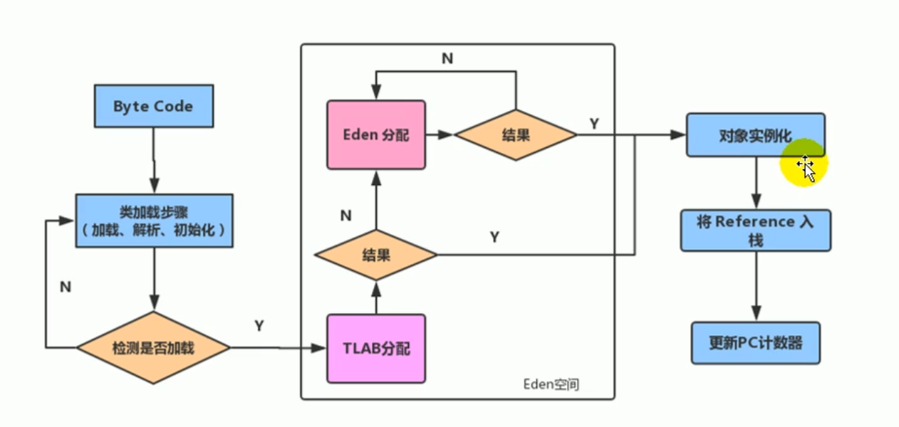

## 基本概念

堆区是一块线程共享区域，非线程安全。如果需要保证线程安全，需要借助锁，但会影响内存的分配速度。

多线程同时分配内存时，使用 TLAB 可以避免一系列的非线程安全问题，同时还能提升内存分配的吞吐量，因此我们可以将这种内存分配方式称之为**快速分配策略**。

## 什么是TLAB？

从内存模型的角度，在Eden区中划分的一个区域叫做TLAB（TLAB 全称 Thread Local Allocation Buffer），本地分配缓存区，是JVM为每个线程分配了一个私有的缓存区域，占用内存是整个Eden的1%，占用空间非常小。

## 实际应用TLAB

尽管不是所有对象实例都能够在TLAB中成功分配内存（因为TLAB内存很小），但JVM确实是将TLAB作为内存分配的首选。

当然，也可以通过参数 `-XX:TLABWasteTargetPercent`来设置TLAB空间所占用 Eden 空间的百分比大小。

一旦对象在TLAB空间分配失败时（例如空间不足），JVM就会尝试通过使用加锁机制来确保数据操作的原子性，从而直接在Eden空间中分配内存。

现在new一个对象，然后TLAB分配，如果TLAB空间够用，那么就对象实例化，如果不够用就只能用Eden公共的部分，如果还不够用，那么就会触发GC。
