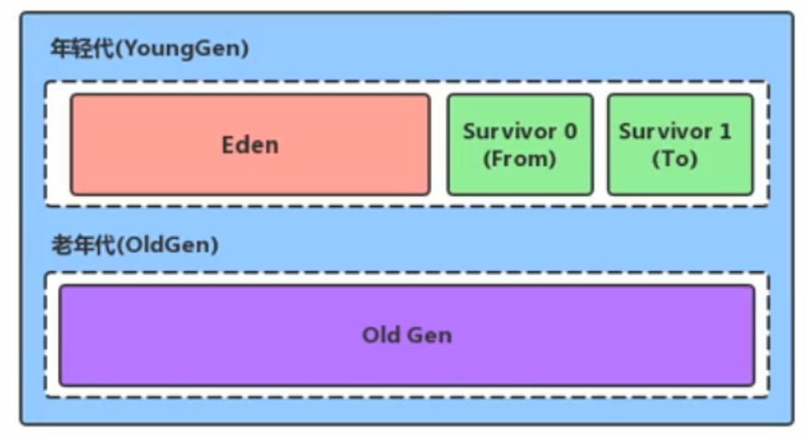
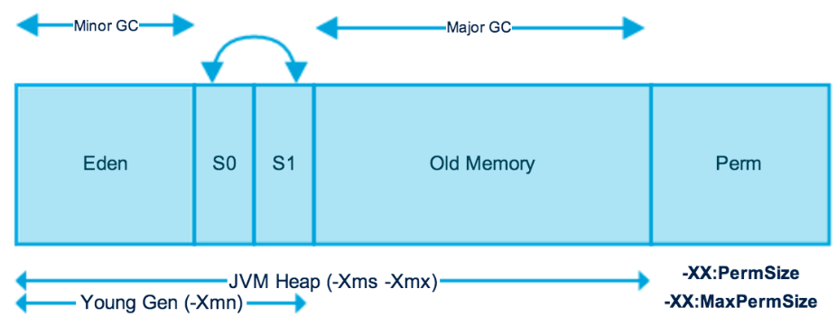

## 堆区划分

Java堆区分为年轻代（Young Gen）与老年代（Old Gen）。存储在JVM中的Java对象可以被分为两类：

1、生命周期较短的瞬时对象，这类对象的创建和消亡都非常迅速（如软引用对象，一旦GC就会被回收）。

2、生命周期较长，在某些极端的情况下还能够与JVM的生命周期保持一直。

其中年轻代又可以划分为Eden区、Survivor0区（from区）、Survivor1区（to区）。



## 参数调配



配置新生代与老年代在堆结构的占比：

1、默认 `-XX:NewRatio=2`，表示新生代占 1，老年代占 2，新生代占整个堆的 1/2。

如何知道默认是1:2 的呢，可以通过JVM官网查这个指令，也可以通过命令来查看：

```bash
jps
jinfo -flag NewRatio [进程ID]
```

2、可以修改 `-XX:NewRatio=4`，表示新生代占1，老年代占4，新生代占整个堆的 1/5。

> 一般来说，是不会调动新生代和老年代的比例，那么什么时候会调这个比例呢？

明确知道大多数对象的生命周期比较长时，就建议将老年代调大一些，可以多存储一些对象。

## 关于Eden、S0与S1的空间比例问题

1、在 HotSpot 中，Eden空间和另外两个 Survivor 空间缺省所占的比例是 8:1:1。

> 在实际应用中，`Eden:S0:S1=8:1:1`是真的吗？

查看默认的比例：

```bash
jps
jinfo -flag SurvivorRatio [进程ID]
# 查询结果为 -XX:SurvivorRatio=8
```

查询结果确实是8:1:1，但通过 `jvisualvm` 查看到的实际情况却是 6:1:1 ，原因是因为JVM有自适应的内存分配策略，通过设置参数 `-XX:-UseAdaptiveSizePolicy -XX:SurvivorRatio=8` 来关闭自适应策略，并调整空间比例为8:1:1。

2、几乎所有的Java对象都是在Eden区被new出来的，如果对象非常大，以至于Eden装不下，就会在老年代new出来。

3、绝大部分的Java对象的销毁都是在Eden区（新生代）进行，IBM公司的专门研究表明，新生代中80%的对象都是“朝生夕死”的。

4、可以使用选项“-Xmn” 设置Eden区（新生代）的最大内存大小，这个参数一般使用默认值就可以了。

