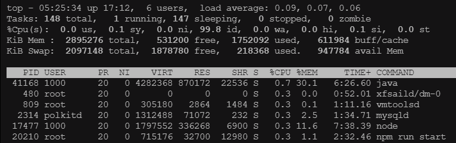

## 内容含义

使用`top`命令后，`top` 会以全屏模式显示当前系统的实时运行信息：



### 顶部区域

顶部区域显示一些系统概览信息：

```bash
top - 05:25:34 up 17:12,  6 users,  load average: 0.09, 0.07, 0.06
```

- **当前时间**：显示系统当前的时间。
- **运行时间**：显示系统自上次启动以来的运行时间。
- **用户数量**：显示当前登录系统的用户数量。
- **系统负载平均值**：显示系统在过去 1 分钟、5 分钟和 15 分钟内的平均负载。这些值越低，说明系统越空闲。一般来说，当 1 分钟平均负载值接近系统的 CPU 核心数时，系统可能开始出现性能瓶颈。

### 中间区域

中间区域显示系统资源的使用情况。

任务（进程）数量：显示当前系统中运行的进程总数以及处于运行、睡眠、停止、僵尸状态的进程数量。

```bash
Tasks: 148 total,   1 running, 147 sleeping,   0 stopped,   0 zombie
```

#### CPU的使用率

```bash
%Cpu(s):  0.0 us,  0.1 sy,  0.0 ni, 99.8 id,  0.0 wa,  0.0 hi,  0.1 si,  0.0 st
```

| 参数名 | 解释                                               |
| ------ | -------------------------------------------------- |
| us     | 用户空间占用CPU百分比                              |
| sy     | 内核空间占用CPU百分比                              |
| ni     | 用户进程空间内改变过优先级的进程占用CPU百分比      |
| id     | 空闲CPU百分比                                      |
| wa     | 等待输入输出的CPU时间百分比                        |
| hi     | 硬中断（Hardware IRQ）占用CPU的百分比              |
| si     | 软中断（Software Interrupts）占用CPU的百分比       |
| st     | 用于有虚拟cpu的情况，用来指示被虚拟机偷掉的cpu时间 |

#### 内存使用情况

```bash
KiB Mem :  2895276 total,   531200 free,  1752092 used,   611984 buff/cache
```

| 参数名  | 解释                 |
| ------- | -------------------- |
| total   | 内存总量             |
| used    | 已使用内存           |
| free    | 内存空闲量           |
| buffers | 用作内核缓存的内存量 |

#### 交换使用情况

交换空间是磁盘上的一块区域，当系统的物理内存（RAM）不足时，系统会将一些不常用的内存页面移动到交换空间中，以释放物理内存供其他进程使用。

```bash
KiB Swap:  2097148 total,  1878780 free,   218368 used.   947784 avail Mem
```

| 参数名    | 解释                     |
| --------- | ------------------------ |
| total     | 系统分配的总交换空间大小 |
| free      | 当前未使用的交换空间大小 |
| used      | 已使用的空间大小         |
| avail Mem | 当前可用的物理内存大小   |

### 进程列表区域

列表中的进程是按照CPU的占用量来排序。

```bash
  PID USER      PR  NI    VIRT    RES    SHR S  %CPU %MEM     TIME+ COMMAND
 41168 1000      20   0 4282368 870172  22536 S   0.7 30.1   6:26.60 java
   480 root      20   0       0      0      0 S   0.3  0.0   0:52.01 xfsaild/dm-0
```

| 列名    | 含义                                                         |
| ------- | ------------------------------------------------------------ |
| PID     | 进程ID                                                       |
| USER    | 进程所有者的用户名                                           |
| PR      | 优先级                                                       |
| NI      | nice值。负值表示高优先级，正值表示低优先级                   |
| VIRT    | 进程使用的虚拟内存总量，单位kb。VIRT=SWAP+RES                |
| RES     | 进程使用的、未被换出的物理内存大小，单位kb。RES=CODE+DATA    |
| SHR     | 共享内存大小，单位kb。                                       |
| S       | 进程状态。D=不可中断的睡眠状态 R=运行 S=睡眠 T=跟踪/停止 Z=僵尸进程 |
| %CPU    | 上次更新到现在的CPU时间占用百分比                            |
| %MEM    | 进程使用的物理内存百分比                                     |
| TIME+   | 进程使用的CPU时间总计，单位1/100秒                           |
| COMMAND | 命令名/命令行                                                |

## 常用功能和快捷键

| 功能                        | 快捷键     | 描述                                                     |
| :-------------------------- | :--------- | :------------------------------------------------------- |
| 按 CPU 使用率排序           | `P`        | 按 CPU 使用率降序排序，快速找到占用 CPU 资源最多的进程。 |
| 按内存使用率排序            | `M`        | 按内存使用率降序排序，快速找到占用内存最多的进程。       |
| 显示完整命令行              | `c`        | 切换显示完整的命令行，查看进程的详细命令行信息。         |
| 终止进程                    | `k`        | 终止指定的进程，输入进程 ID 后可以选择发送不同的信号。   |
| 调整进程优先级              | `r`        | 调整指定进程的优先级（nice 值），优化进程的运行优先级。  |
| 显示每个 CPU 核心的使用情况 | `1`        | 显示每个 CPU 核心的使用情况，了解多核系统的负载分布。    |
| 按用户过滤进程              | `u`        | 按用户过滤进程，只显示指定用户运行的进程。               |
| 显示帮助信息                | `h` 或 `?` | 显示所有可用的快捷键及其功能，帮助用户更好地使用 `top`。 |
| 显示所有进程的详细信息      | `A`        | 显示所有进程的详细信息，确保不会遗漏任何重要信息。       |
| 退出 `top`                  | `q`        | 退出 `top`，返回到终端。                                 |

### 排查 CPU 使用率过高

1. 启动 `top`。
2. 按下 `P` 键，按 CPU 使用率降序排序。
3. 查找占用 CPU 资源最多的进程。
4. 如果需要，可以按下 `c` 键查看完整命令行，确认具体运行的脚本或参数。
5. 如果需要终止该进程，可以按下 `k` 键，输入进程 ID 并确认。

### 排查内存不足

1. 启动 `top`。
2. 按下 `M` 键，按内存使用率降序排序。
3. 查找占用内存最多的进程。
4. 如果需要，可以按下 `c` 键查看完整命令行，确认具体运行的脚本或参数。
5. 如果需要终止该进程，可以按下 `k` 键，输入进程 ID 并确认。

### 监控特定用户的进程

1. 启动 `top`。
2. 按下 `u` 键，输入用户名。
3. 查看该用户运行的进程及其资源使用情况。
4. 如果需要，可以按下 `c` 键查看完整命令行，确认具体运行的脚本或参数。
