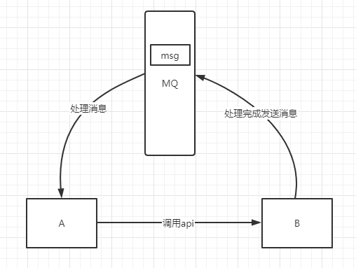

## 什么是MQ？

MQ(messagequeue)，从字面意思上看，本质是个队列，FIFO先入先出，只不过队列中存放的内容是message而已，还是一种跨进程的通信机制，用于上下游传递消息。在互联网架构中，MQ是一种非常常见的上下游“逻辑解耦+物理解耦”的消息通信服务。使用了MQ之后，消息发送上游只需要依赖MQ，不用依赖其他服务。

消息中间件接受并转发消息。你可以把它当做一个快递站点，当你要发送一个包裹时，你把你的包裹放到快递站，快递员最终会把你的快递送到收件人那里，按照这种逻辑消息中间件就是一个快递站，一个快递员帮你传递快件。它与快递站的主要区别在于，它不处理快件而是接收，存储和转发消息数据。

## 应用场景

1、用户注册的案例。用户注册 -> 注册信息写入数据库成功(需50ms) -> 发送邮件(需50ms) -> 发送短信(需50ms) ，这整个操作同步执行的话，那么响应需要150ms；如果改为异步执行，发送邮件和短信多线程去执行，开启线程的时间需要50ms，那么响应时间就需要100ms，且发送是否成功是不好去直接判断的；如果使用消息队列，用户注册 -> 注册信息写入数据库成功(需50ms)  -> 写入消息队列(5ms) -> 异步发送邮件和短信，整个响应时间只需要55ms，其他服务在从消息队列拿到用户注册成功的消息，随后发送邮件和短信。

2、应用解耦。以下订单为例，用户下了一个订单后，订单系统会调用库存系统进行减库存，下订单时传了3个参数，调用库存系统API时传了5个参数，这个参数不变还好，但是订单系统和库存系统经常会升级，减库存的接口会经常发生变化，那么订单系统就必须来修改对应调用代码并进行重新部署。这样会非常的麻烦，引入消息队之后，订单系统只需要把含有"谁买了多少个什么商品"写入消息队列即可，不用关心库存系统的接口，库存系统实时订阅消息队列，只要有消息，库存系统就会收到这个消息，完成业务逻辑。

3、流量控制（削峰）。以秒杀商品为例，在开启秒杀的一瞬间假设有100万个请求，就算服务器能够接收这么多请求，要执行下订单等一系列业务代码，后台就会非常慢，导致请求一直阻塞直到服务器宕机。使用消息队列之后，大量请求进来后，全部写入消息队列，写入成功之后直接响应用户，其它服务再挨个挨个的从消息队列中取出消息后执行业务代码，就算后台处理能力只有1s处理一个，大不了花费100万秒就行了，永远不会让机器宕机。

4、异步处理。有些服务间调用是异步的，例如A调用B，B需要花费很长时间执行，但是A需要知道B什么时候可以执行完，以前一般有两种方式，A过一段时间去调用B的查询api查询。或者A提供一个callback api，B执行完之后调用api通知A服务。这两种方式都不是很优雅，使用消息总线，可以很方便解决这个问题，A调用B服务后，只需要监听B处理完成的消息，当B处理完成后，会发送一条消息给MQ，MQ会将此消息转发给A服务。这样A服务既不用循环调用B的查询api，也不用提供callback api。同样B服务也不用做这些操作。A服务还能及时的得到异步处理成功的消息。

## MQ是消息通信的模型

实现MQ的大致有两种主流方式：AMQP、JMS。

## AMQP

AMQP高级消息队列协议，是一个**进程间传递异步消息的网络协议**，更准确的说是一种binary wire-level protocol（链接协议）。这是其和JMS的本质差别，AMQP不从API层进行限定，而是直接定义网络交换的数据格式。

## JMS

JMS即Java消息服务（JavaMessage Service）应用程序接口，是一个Java平台中关于面向消息中间件（MOM）的API，用于在两个应用程序之间，或分布式系统中发送消息，进行异步通信。

## AMQP 与 JMS 区别

JMS是定义了统一的接口，来对消息操作进行统一；AMQP是通过规定协议来统一数据交互的格式。

JMS限定了必须使用Java语言；AMQP只是协议，不规定实现方式，因此是跨语言的。

JMS规定了两种消息模式；而AMQP的消息模式更加丰富。

