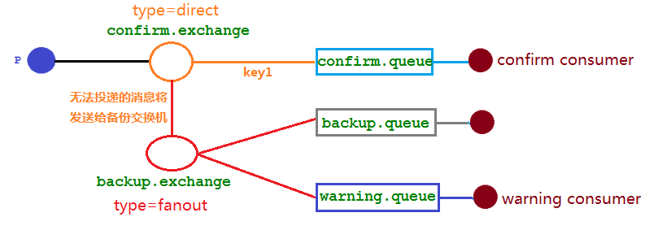

​		通过消息回退机制和mandatory参数，可以处理交换机投递失败的消息。

​		消息回退到生产者后，有时候并不知道该如何处理这些无法路由的消息，最多就是打个日志，存到缓存定时投递，超出投递失败次数进行报警，再手动处理，手动的通病就是麻烦易出错。此外，生产者不止一台机器，那么每台都需要写处理这些回退消息的逻辑代码，反而增加了生产者的复杂性。

> **那么既不丢失消息，又不增加生产者的复杂性，该怎么做？**

​		可以为队列设置死信交换机来存储投递失败的消息，可是这些不可路由消息根本没有机会进入到队列，因此无法使用死信队列来保存消息。在 RabbitMQ 中，有一种备份交换机的机制存在，可以很好的应对这个问题。

## 备份交换机

​		备份交换机可以理解为 RabbitMQ 中交换机的“备胎”，当我们为某一个交换机声明一个对应的备份交换机时，就是为它创建一个备胎，当交换机接收到一条不可路由消息时，将会把这条消息转发到备份交换机中，由备份交换机来进行转发和处理，通常备份交换机的类型为 Fanout ，这样就能把所有消息都投递到与其绑定的队列中，然后我们在备份交换机下绑定一个队列，这样所有那些原交换机无法被路由的消息，就会都进入这个队列了。 当然，还可以建立一个报警队列，用独立的消费者来进行监测和报警。

## 代码实现

​		新增一个备份交换机，绑定在 confirm.exchange 上，当 confirm.exchange 投递消息到队列失败后，将交给备份交换机来投递消息，设置交换机类型为 fanout，有两个队列 backup.queue，还有一个报警队列用来告知我们存在异常情况。



ConfirmConfig 新增配置

修改 confirm.exchange 的代码，绑定上备份交换机，声明其它组件。

```java
/**
 * 发布确认机制-示例使用
 */
public static final String CONFIRM_QUEUE_NAME = "confirm.queue";
public static final String CONFIRM_EXCHANGE_NAME = "confirm.exchange";
public static final String ROUTING_KEY_CONFIRM = "confirm.routing";
/** 备份交换机常量 */
public static final  String CONFIRM_BACKUP_EXCHANGE = "backup.exchange";
public static final  String CONFIRM_BACKUP_QUEUE_NAME = "backup.queue";
public static final  String CONFIRM_WARNING_QUEUE_NAME = "warning.queue";

@Bean(CONFIRM_EXCHANGE_NAME)
public DirectExchange confirmExchange() {
    return ExchangeBuilder.directExchange(CONFIRM_EXCHANGE_NAME)
        .durable(true)
        // 设置备份交换机
        .alternate(CONFIRM_BACKUP_EXCHANGE)
        .build();
}

/**
 * 备份交换机
 */
@Bean(CONFIRM_BACKUP_EXCHANGE)
public FanoutExchange backupExchange() {
    return new FanoutExchange(CONFIRM_BACKUP_EXCHANGE);
}

/**
 * 声明备份队列
 */
@Bean(CONFIRM_BACKUP_QUEUE_NAME)
public Queue backupQueue() {
    return QueueBuilder.durable(CONFIRM_BACKUP_QUEUE_NAME).build();
}

/**
 * 声明警告队列
 */
@Bean(CONFIRM_WARNING_QUEUE_NAME)
public Queue warnQueue() {
    return QueueBuilder.durable(CONFIRM_WARNING_QUEUE_NAME).build();
}

/**
 * 备份队列绑定备份交换机
 */
@Bean
public Binding backupQueueBindingExchange(@Qualifier(CONFIRM_BACKUP_QUEUE_NAME) Queue queue,
                                          @Qualifier(CONFIRM_BACKUP_EXCHANGE) FanoutExchange exchange) {
    return BindingBuilder.bind(queue).to(exchange);
}

/**
 * 报警队列绑定备份交换机
 */
@Bean
public Binding warnQueueBindingExchange(@Qualifier(CONFIRM_WARNING_QUEUE_NAME) Queue queue,
                                        @Qualifier(CONFIRM_BACKUP_EXCHANGE) FanoutExchange exchange) {
    return BindingBuilder.bind(queue).to(exchange);
}
```

生产者新增测试方法

```java
/**
 * 发送消息到交换机失败，由备份交换机投递消息.
 * NoSuchRoutingKey 是一个不存在的路由键
 */
@GetMapping("/sendFailMsg/{msg}")
public void sendFailMsg(@PathVariable("msg") String msg) {
    CorrelationData correlationData = new CorrelationData(UUID.randomUUID().toString());
    rabbitTemplate.convertAndSend(MqConstant.CONFIRM_EXCHANGE_NAME, "NoSuchRoutingKey", msg, correlationData);
    log.info("发送消息成功，消息内容：{}", msg);
}
```

消费者，消费备份队列的消息、消费警告队列的消息。

```java
@RabbitListener(queues = {CONFIRM_BACKUP_QUEUE_NAME})
public void receiveBackupMessage(Message message, Channel channel){
    log.info("接收到无法投递的消息为：{}", new String(message.getBody()));
}

@RabbitListener(queues = {CONFIRM_WARNING_QUEUE_NAME})
public void receiveWarnMessage(Message message, Channel channel){
    log.warn("接收到无法投递的消息为：{}", new String(message.getBody()));
}
```

执行结果

```shell
----------------------------- 生产者日志 --------------------------------
2021-06-26 17:31:30.126  INFO 156 --- [nio-8005-exec-1] c.f.t.r.p.boot.ConfirmMessageProducer    : 发送消息成功，消息内容：hello
2021-06-26 17:31:30.131  INFO 156 --- [nectionFactory1] c.f.t.r.p.boot.ConfirmMessageCallback    : 交换机已收到 id=1ef4f524-81e2-4f43-a8e1-d2b0969da0c1 的消息
----------------------------- 消费者日志 ------------------------------
2021-06-26 17:31:30.132  WARN 21284 --- [ntContainer] c.f.t.r.c.boot.ConfirmMessageConsumer    : 接收到无法投递的消息为：hello
2021-06-26 17:31:30.132  INFO 21284 --- [ntContainer] c.f.t.r.c.boot.ConfirmMessageConsumer    : 接收到无法投递的消息为：hello
```

**日志中缺少了回退方法中的日志打印，为什么之前配置的回退方法没有回调？**

mandatory 参数与备份交换机可以一起使用的时候，如果两者同时开启，备份交换机的优先级更高。  
