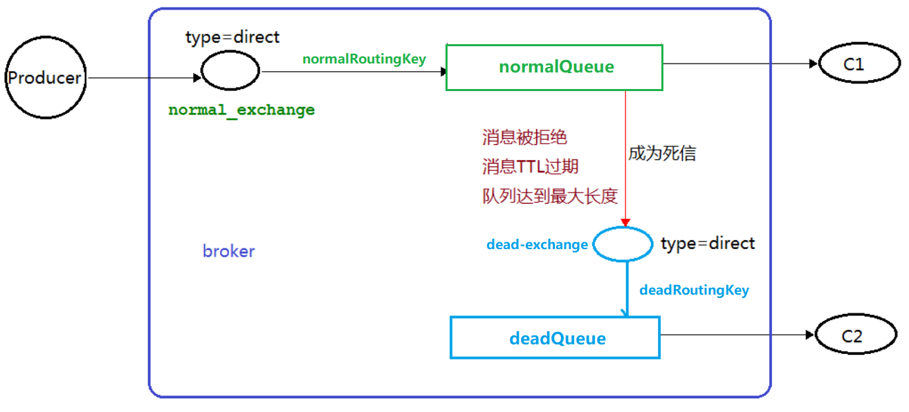

## 死信的概念

死信，顾名思义就是无法被消费的消息，字面意思可以这样理解，一般来说，producer 将消息投递到 broker 或者直接到 queue 里了，consumer 从 queue 取出消息进行消费，但某些时候由于特定的**原因导致** **queue** **中的某些消息无法被消费**，这样的消息如果没有后续的处理，就变成了死信，有死信自然就有了死信队列。

​		应用场景：为了保证订单业务的消息数据不丢失，需要使用到 RabbitMQ 的死信队列机制，当消息消费发生异常时，将消息投入死信队列中。还有比如说：用户在商城下单成功并点击去支付后在指定时间未支付时自动失效。

## 死信的来源

1、消息 TTL 过期。

2、队列达到最大长度(队列满了，无法再添加数据到 mq 中)。

3、消息被拒绝(basic.reject 或 basic.nack)并且 消息不重新放回对垒（requeue=false）。

##  代码示例

​		生产者将消息发送到 normal_Exchange交换机，交换机根据 normalRoutingKey 路由键发送到 normalQueue 队列，当消息在队列中 ttl 超过10s后，消息称为死信，转发到dead-exchange 交换机，交换机根据 deadRoutingKey 路由键发送到 deadQueue 队列。

​		消费者1负责消费消息正常的队列，首先开启创建出交换机、队列之间的关系，之后关闭该消费者，随后运行生产者，观察RabbitMQ图形化界面正常的消息 ttl 过期后进入死信队列。

​		消费者2只负责消费死信队列。



### 情况1：消息TTL过期

应用场景如订单过期，订单在10分钟内未支付后取消订单。10分钟ttl过期的消息转为死信，让专门消费死信队列的消费者去处理这些过期的订单。

**消费者1**

```java
public class MessageDeadConsumer1 {
    static final String NORMAL_QUEUE_NAME = "normal";
    static final String NORMAL_EXCHANGE_NAME = "normalExchange";
    static final String ROUTING_KEY_NORMAL = "normalRouting";

    static final String DEAD_QUEUE_NAME = "dead";
    static final String DEAD_EXCHANGE_NAME = "deadExchange";
    static final  String ROUTING_KEY_DEAD = "deadRouting";

    public static void main(String[] args) throws Exception {
        ConnectionFactory connectionFactory = new ConnectionFactory();
        connectionFactory.setHost("192.168.19.128");
        connectionFactory.setPort(5672);
        connectionFactory.setUsername("admin");
        connectionFactory.setPassword("admin");
        Connection connection = connectionFactory.newConnection();
        Channel channel = connection.createChannel();
        // 绑定交换机
        channel.exchangeDeclare(NORMAL_EXCHANGE_NAME, BuiltinExchangeType.DIRECT);
        channel.exchangeDeclare(DEAD_EXCHANGE_NAME, BuiltinExchangeType.DIRECT);
        // 添加死信队列参数
        Map<String, Object> arguments = new HashMap<>(4);
        arguments.put("x-dead-letter-exchange", DEAD_EXCHANGE_NAME);
        arguments.put("x-dead-letter-routing-key", ROUTING_KEY_DEAD);
        // 绑定队列
        channel.queueDeclare(DEAD_QUEUE_NAME, false, false, false, null);
        // 正常队列将异常消息（ttl失效、消息被拒绝、队列达到最大长度）转到死信队列
        channel.queueDeclare(NORMAL_QUEUE_NAME, false, false, false, arguments);
        // 队列绑定交换机和路由键
        channel.queueBind(DEAD_QUEUE_NAME, DEAD_EXCHANGE_NAME, ROUTING_KEY_DEAD);
        channel.queueBind(NORMAL_QUEUE_NAME, NORMAL_EXCHANGE_NAME, ROUTING_KEY_NORMAL);
        System.out.println("等待接收消息...");
        // 接收到消息后触发回调
        DeliverCallback deliverCallback = (consumerTag, delivery) -> {
            byte[] msgBytes = delivery.getBody();
            System.out.println("接收到消息：消息ID=" + consumerTag + "===>" + new String(msgBytes));
        };
        // 消息消费被中断（取消）
        CancelCallback cancelCallback = consumerTag -> {
            System.out.println("消息被中断：消息ID=" + consumerTag);
        };
        channel.basicConsume(NORMAL_QUEUE_NAME, true, deliverCallback, cancelCallback);
    }
}
```

**生产者**

生产者决定消息一发出去多久转为死信。

```java
public class MessageDeadProducer {
    static final String NORMAL_EXCHANGE_NAME = "normalExchange";
    static final String ROUTING_KEY_NORMAL = "normalRouting";

    public static void main(String[] args) throws Exception {
        ConnectionFactory connectionFactory = new ConnectionFactory();
        connectionFactory.setHost("192.168.19.128");
        connectionFactory.setPort(5672);
        connectionFactory.setUsername("admin");
        connectionFactory.setPassword("admin");
        Connection connection = connectionFactory.newConnection();
        Channel channel = connection.createChannel();

        // 如果在10s内，消费者不接收则转发到死信队列中
        AMQP.BasicProperties properties = new AMQP.BasicProperties()
            .builder()
            // 单位ms
            .expiration("10000")
            .build();

        for (int i = 0; i < 10; i++) {
            String msg = "message_" + i;
            channel.basicPublish(NORMAL_EXCHANGE_NAME, ROUTING_KEY_NORMAL, properties, (msg).getBytes(StandardCharsets.UTF_8));
            System.out.println("消息[" + msg + "]发送完成");
        }
        channel.close();
        connection.close();
    }
}
```

**消费者2**

```java
public class MessageDeadConsumer2 {
    static final String QUEUE_NAME = DEAD_QUEUE_NAME;

    public static void main(String[] args) throws Exception {
        ConnectionFactory connectionFactory = new ConnectionFactory();
        connectionFactory.setHost("192.168.19.128");
        connectionFactory.setPort(5672);
        connectionFactory.setUsername("admin");
        connectionFactory.setPassword("admin");
        Connection connection = connectionFactory.newConnection();
        Channel channel = connection.createChannel();
        channel.queueDeclare(QUEUE_NAME, false, false, false, null);

        channel.basicConsume(QUEUE_NAME, true, (consumerTag, delivery) -> {
            byte[] msgBytes = delivery.getBody();
            System.out.println("接收到消息：消息ID=" + consumerTag + "===>" + new String(msgBytes));
        }, consumerTag -> {
            System.out.println("消息被中断：消息ID=" + consumerTag);
        });
    }
}
```

### 情况2：队列达到最大长度

消费者1代码修改新增参数接收最大队列的参数值为5，注意此时需要把原先队列删除，因为参数改变了。

```java
// 修改消费者1的参数代码
Map<String, Object> arguments = new HashMap<>(4);
arguments.put("x-dead-letter-exchange", DEAD_EXCHANGE_NAME);
arguments.put("x-dead-letter-routing-key", ROUTING_KEY_DEAD);
// 情况2：队列达到最大长度(队列满了，无法再添加数据到 mq 中)
// 设置最大长度为6，注意此时需要把原先队列删除，因为参数改变了。
arguments.put("x-max-length", 5);
```

### 情况3：消息被拒绝

在消费者1中调用 channel.basicReject() 方法拒绝消息。

```java
public static void main(String[] args) throws Exception {
    ConnectionFactory connectionFactory = new ConnectionFactory();
    connectionFactory.setHost("192.168.19.128");	
    connectionFactory.setPort(5672);
    connectionFactory.setUsername("admin");
    connectionFactory.setPassword("admin");
    Connection connection = connectionFactory.newConnection();
    Channel channel = connection.createChannel();
    // 绑定交换机
    channel.exchangeDeclare(NORMAL_EXCHANGE_NAME, BuiltinExchangeType.DIRECT);
    channel.exchangeDeclare(DEAD_EXCHANGE_NAME, BuiltinExchangeType.DIRECT);
    // 添加死信队列参数
    Map<String, Object> arguments = new HashMap<>(4);
    arguments.put("x-dead-letter-exchange", DEAD_EXCHANGE_NAME);
    arguments.put("x-dead-letter-routing-key", ROUTING_KEY_DEAD);
    // 情况2：队列达到最大长度(队列满了，无法再添加数据到 mq 中)
    // 设置最大长度为6，注意此时需要把原先队列删除，因为参数改变了。
    // arguments.put("x-max-length", 5);

    // 绑定队列
    channel.queueDeclare(DEAD_QUEUE_NAME, false, false, false, null);
    // 正常队列将异常消息（ttl失效、消息被拒绝、队列达到最大长度）转到死信队列
    channel.queueDeclare(NORMAL_QUEUE_NAME, false, false, false, arguments);
    // 队列绑定交换机和路由键
    channel.queueBind(DEAD_QUEUE_NAME, DEAD_EXCHANGE_NAME, ROUTING_KEY_DEAD);
    channel.queueBind(NORMAL_QUEUE_NAME, NORMAL_EXCHANGE_NAME, ROUTING_KEY_NORMAL);
    System.out.println("等待接收消息...");

    // 接收到消息后触发回调
    DeliverCallback deliverCallback = (consumerTag, delivery) -> {
        byte[] msgBytes = delivery.getBody();
        String msg = new String(msgBytes);
        long deliveryTag = delivery.getEnvelope().getDeliveryTag();
        // 情况3：拒绝消息
        if (msg.equals("message_5")) {
            // 是否重新放回队列
            boolean requeue = false;
            channel.basicReject(deliveryTag, requeue);
        } else {
            System.out.println("接收到消息：消息ID=" + consumerTag + "===>" + msg);
            channel.basicAck(deliveryTag, false);
        }
    };

    // 情况3：开启手动应答
    channel.basicConsume(NORMAL_QUEUE_NAME, false, deliverCallback, consumerTag -> {
        System.out.println("消息被中断：消息ID=" + consumerTag);
    });
}
```

