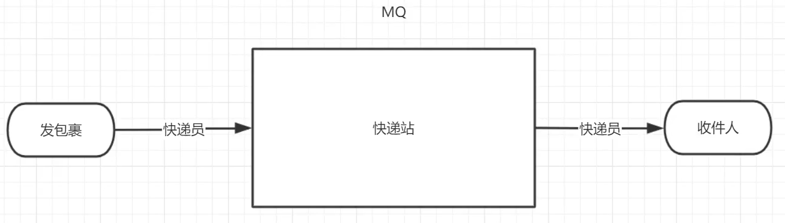
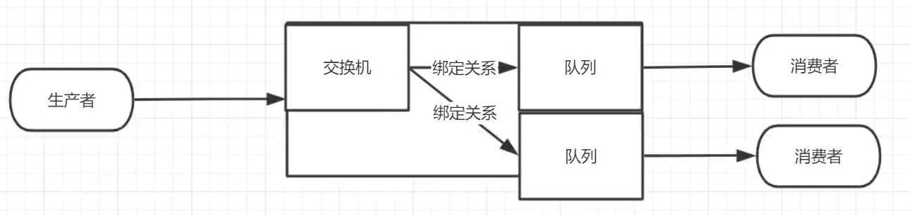
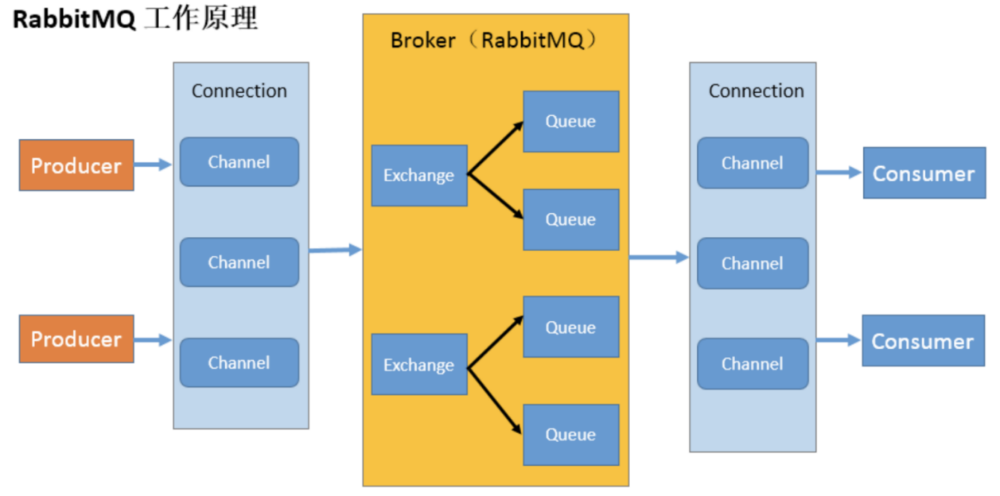

**生产者，交换机，队列，消费者**。四大核心类似于以下的协同关系。

四大核心的相互关联。

**生产者**

产生数据发送消息的程序是生产者

**交换机**

交换机是 RabbitMQ 非常重要的一个部件，一方面它接收来自生产者的消息，另一方面它将消息推送到队列中。交换机必须确切知道如何处理它接收到的消息，是将这些消息推送到特定队列还是推送到多个队列，亦或者是把消息丢弃，这个得有交换机类型决定。

**队列**

队列是 RabbitMQ 内部使用的一种数据结构，尽管消息流经 RabbitMQ 和应用程序，但它们只能存储在队列中。队列仅受主机的内存和磁盘限制的约束，本质上是一个大的消息缓冲区。许多生产者可以将消息发送到一个队列，许多消费者可以尝试从一个队列接收数据。这就是我们使用队列的方式。

**消费者**

消费与接收具有相似的含义。消费者大多时候是一个等待接收消息的程序。请注意生产者，消费者和消息中间件很多时候并不在同一机器上。同一个应用程序既可以是生产者又是可以是消费者。

**各个名词介绍**

**Broker**

接收和分发消息的应用，RabbitMQ Server就是Message Broker 

**Virtual host**

出于多租户和安全因素设计的，把AMQP 的基本组件划分到一个虚拟的分组中，类似于网络中的namespace概念。当多个不同的用户使用同一个RabbitMQserver提供的服务时，可以划分出多个vhost，每个用户在自己的vhost 创建exchange／queue 等。

**Connection**

publisher／consumer和broker之间的TCP连接 

**Channel**

如果每一次访问 RabbitMQ 都建立一个Connection，在消息量大的时候建立TCP  Connection的开销将是巨大的，效率也较低。Channel是在connection内部建立的逻辑连接，如果应用程序支持多线程，通常每个thread创建单独的channel进行通讯，AMQP method包含了channel id 帮助客户端和 message broker 识别channel，所以channel之间是完全隔离的。Channel作为轻量级的Connection极大减少了操作系统建立TCP connection的开销。

**Exchange**

message 到达broker 的第一站，根据分发规则，匹配查询表中的routing key，分发消息到queue 中去。常用的类型有：direct (point-to-point), topic (publish-subscribe) and fanout  (multicast)。

即使使用的是简单模式，生产者将消息发送给RabbitMQ默认的交换机。

**Queue**

消息最终被送到这里等待consumer取走。

**Binding**

exchange和queue之间的虚拟连接，binding中可以包含routing key，Binding信息被保存到exchange中的查询表中，用于message的分发依据。

