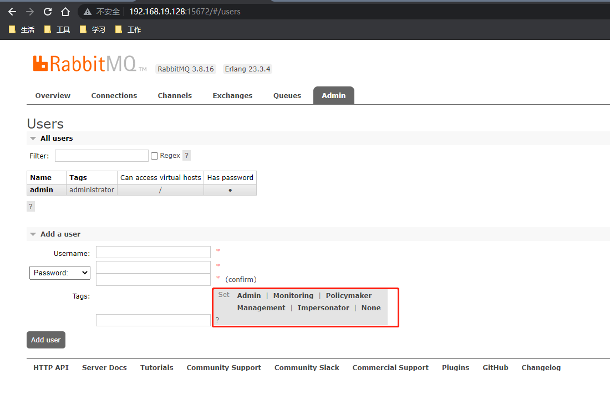
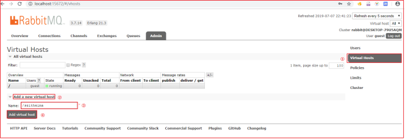
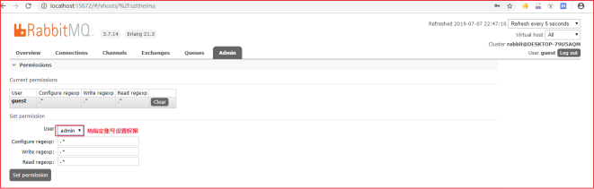

[RabbitMQ官网](https://www.rabbitmq.com)

## 安装RabbitMQ

```shell
docker run -d --restart=always -p 5672:5672 -p 15672:15672 --name rabbitmq -v ${RABBITMQ_DIR}/data:/mydata/rabbitmq  -e RABBITMQ_DEFAULT_USER=admin -e RABBITMQ_DEFAULT_PASS=admin rabbitmq:management
```

访问 ip:15672（如 127.0.0.1:15672）



### 超级管理员(administrator)

可登陆管理控制台，可查看所有的信息，并且可以对用户，策略(policy)进行操作。

### 监控者(monitoring)

可登陆管理控制台，同时可以查看rabbitmq节点的相关信息(进程数，内存使用情况，磁盘使用情况等)

### 策略制定者(policymaker)

可登陆管理控制台, 同时可以对policy进行管理。但无法查看节点的相关信息(上图红框标识的部分)。

### 普通管理者(management)

仅可登陆管理控制台，无法看到节点信息，也无法对策略进行管理。

### 其他

无法登陆管理控制台，通常就是普通的生产者和消费者。

## Virtual Hosts配置

像mysql拥有数据库的概念并且可以指定用户对库和表等操作的权限。RabbitMQ也有类似的权限管理；在RabbitMQ中可以虚拟消息服务器Virtual Host，每个Virtual Hosts相当于一个相对独立的RabbitMQ服务器，每个VirtualHost之间是相互隔离的。exchange、queue、message不能互通。 相当于mysql的db。Virtual Name一般以/开头。

### 创建Virtual Hosts



### 设置Virtual Hosts权限




user：用户名

configure ：一个正则表达式，用户对符合该正则表达式的所有资源拥有 configure 操作的权限

write：一个正则表达式，用户对符合该正则表达式的所有资源拥有 write 操作的权限

read：一个正则表达式，用户对符合该正则表达式的所有资源拥有 read 操作的权限

