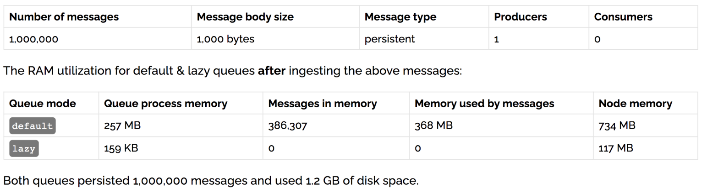

## 什么是惰性队列

​		惰性队列会尽可能的将任何消息存入磁盘，这样可以减少了内存的消耗，当消费者消费到相应的消息时才会被加载到内存，会增加I/O的使用。

下面看一组100万数据的内存开销：



​		在发送 1 百万条消息，每条消息大概占 1KB 的情况下，普通队列占用内存是 1.2GB，而惰性队列仅仅占用 1.5MB 。

## 应用场景

（1）支持存储大量消息的长队列。  

（2）消息大量积压的时候，消费速度太慢，到了消息大爆发的时候，MQ服务器会撑不住，机会影响其它队列的消息收发。那么消息就可以写入磁盘，需要的时候再加载到内存。

（3）当消费者由于各种各样的原因（比如消费者下线、宕机亦或者是由于维护而关闭等）而致使长时间内不能消费消息造成堆积时，惰性队列就很有必要了。

## 惰性队列

​		惰性队列有两种模式：default和lazy。默认default模式，在3.6.0之前的版本无需做任何变更。lazy是惰性队列的模式，可以通过调用channel.queueDeclare方法的时候在参数中设置，也可以通过Policy的方式设置，如果一个队列同时使用这两种方式设置的话，那么Policy的方式具备更高的优先级。如果要通过声明的方式改变已有队列的模式的话，那么只能先删除队列，然后再重新声明一个新的。

在队列声明的时候可以通过“x-queue-mode”参数来设置队列的模式，取值为“default”和“lazy”。下面示例中演示了一个惰性队列的声明细节：

```java
Map<String, Object> args = new HashMap<String, Object>();
args.put("x-queue-mode", "lazy");
// 消息到底需不需要持久化？
boolean durable = true;
channel.queueDeclare("myqueue", durable, false, false, args);  
```

lazy queue 消息不持久化 ， 但是这种模式还是会把消息放到硬盘里，RAM的使用率会一直很稳定，但是重启后一样会丢失消息

lazy queue 消息持久化，这种方式无疑是最佳搭配，消息放到硬盘并且不会因为服务器重启而丢失，面对高并发也是从容不已。

