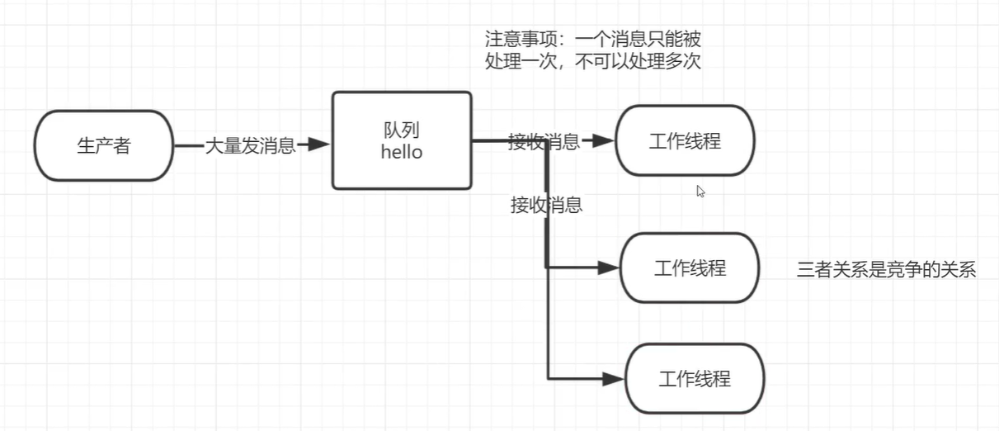

## 场景

消费者完成一个任务可能需要一段时间，如果其中一个消费者处理一个长的任务并仅只完成了部分突然它挂掉了，会发生什么情况？RabbitMQ 一旦向消费者传递了一条消息，便立即将该消息标记为删除。在这种情况下，突然有个消费者挂掉了，我们将丢失正在处理的消息。以及后续发送给该消费这的消息，因为它无法接收到。

为了保证消息在发送过程中不丢失，rabbitmq 引入消息应答机制，消息应答就是：**消费者在接收到消息并且处理该消息之后，告诉 rabbitmq 它已经处理了，rabbitmq 可以把该消息删除了。**



## 自动应答

消费者接收到生产者发送的消息后，就会进行TCP协议的ACK应答，表示已经传送成功，这种模式需要在**高吞吐量和数据传输安全性方面做权衡**，因为这种模式如果消息在接收到之前，消费者那边出现连接或者 channel 关闭，那么消息就丢失了。

另一方面这种模式消费者那边可以传递过载的消息，**没有对传递的消息数量进行限制**，当然这样有可能使得消费者这边由于接收太多还来不及处理的消息，导致这些消息的积压，最终使得内存耗尽，最终这些消费者线程被操作系统杀死，**所以这种模式仅适用在消费者可以高效并以某种速率能够处理这些消息的情况下使用**。

## 消息应答的方法

- Channel.basicAck(用于肯定确认)，RabbitMQ 已知道该消息并且成功的处理消息，可以将其丢弃了。
- Channel.basicNack(用于否定确认) 
- Channel.basicReject(用于否定确认) 与 Channel.basicNack() 相比少一个参数，不处理该消息了直接拒绝，可以将其丢弃了

## Multiple(批量)

手动应答的好处是可以批量应答并且减少网络拥堵。

```java
/**
 * @param multiple true to acknowledge all messages up to and
 * including the supplied delivery tag; false to acknowledge just 
 * the supplied delivery tag.
 */
void basicAck(long deliveryTag, boolean multiple) throws IOException;
```

multiple 的 true 和 false 代表不同意思：

- true 代表批量应答 channel 上未应答的消息，比如说 channel 上有传送 tag 的消息 5,6,7,8 当前 tag 是 8 那么此时 5-8 的这些还未应答的消息都会被确认收到消息应答。

- false 同上面相比只会应答 tag=8 的消息 5,6,7 这三个消息依然不会被确认收到消息应答。

建议没有特殊要求都设置为 false。

## 如何避免内存耗尽？

通过设置Channel的QOS来限制客户端接受消息最大数量。

```java
channel.BasicQos(0,1,false);
```

## 消息自动重新入队

如果消费者由于某些原因失去连接(其通道已关闭，连接已关闭或 TCP 连接丢失)，导致消息未发送 ACK 确认，RabbitMQ 将了解到消息未完全处理，并将对其重新排队。如果此时其他消费者可以处理，它将很快将其重新分发给另一个消费者。这样，即使某个消费者偶尔死亡，也可以确保不会丢失任何消息。


## 消息手动应答注意事项

手动应答就是手动控制什么时候进行ACK应答。默认消息采用的是自动应答，所以要想实现消息消费过程中不丢失，需要把自动应答修改为手动应答。

**代码示例**

```java
public class MessageConfirmProducer {
    static final String QUEUE_NAME = ACK_QUEUE_NAME;

    public static void main(String[] args) throws Exception {
        ConnectionFactory connectionFactory = new ConnectionFactory();
        connectionFactory.setHost("192.168.19.128");
        connectionFactory.setPort(5672);
        connectionFactory.setUsername("admin");
        connectionFactory.setPassword("admin");
        // 建立连接
        Connection connection = connectionFactory.newConnection();
        // 创建一个连接中的channel
        Channel channel = connection.createChannel();
        channel.queueDeclare(QUEUE_NAME, false, false, false, null);

        for (int i = 0; i < 10; i++) {
            String msg = "message_" + i;
            channel.basicPublish("", QUEUE_NAME, null, (msg).getBytes(StandardCharsets.UTF_8));
            System.out.println("消息[" + msg + "]发送完成");
            Thread.sleep(1000);
        }

        channel.close();
        connection.close();
    }
}
```

消费者1、2、3代码

```java
public class MessageConfirmConsumer1 {
    static final String QUEUE_NAME = ACK_QUEUE_NAME;

    public static void main(String[] args) throws Exception {
        ConnectionFactory connectionFactory = new ConnectionFactory();
        connectionFactory.setHost("192.168.19.128");
        connectionFactory.setPort(5672);
        connectionFactory.setUsername("admin");
        connectionFactory.setPassword("admin");

        Connection connection = connectionFactory.newConnection();
        Channel channel = connection.createChannel();
        // 声明队列-channel.queueDeclare(名称，是否持久化，是否独占本连接,是否自动删除,附加参数)
        channel.queueDeclare(QUEUE_NAME, false, false, false, null);

        Consumer callback = new DefaultConsumer(channel) {
            /**
             * @param consumerTag 消费者标签，在channel.basicConsume时候可以指定
             * @param envelope 消息包的内容，可从中获取消息id，消息routingkey，交换机，消息和重传标志(收到消息失败后是否需要重新发送)
             * @param properties  属性信息(生产者的发送时指定)
             * @param body 消息内容
             * @throws IOException e
             */
            @Override
            public void handleDelivery(String consumerTag, Envelope envelope, AMQP.BasicProperties properties, byte[] body) throws IOException {
                //路由的key
                String routingKey = envelope.getRoutingKey();
                //获取交换机信息
                String exchange = envelope.getExchange();
                //获取消息ID
                long deliveryTag = envelope.getDeliveryTag();
                //获取消息信息
                String message = new String(body, StandardCharsets.UTF_8);
                System.out.println("routingKey:" + routingKey +
                        ",exchange:" + exchange +
                        ",deliveryTag:" + deliveryTag +
                        ",message:" + message);
                // 设置为不批量应答
                boolean multiple = false;
                // deliveryTag是消息标记tag
                channel.basicAck(deliveryTag, multiple);
            }
        };

        // 使用手动应答
        boolean autoAck = false;
        channel.basicConsume(QUEUE_NAME, autoAck, callback);
    }
}
```

