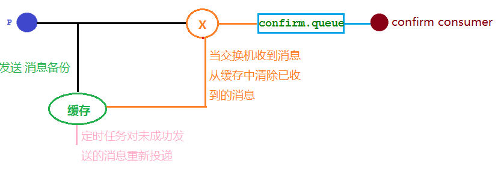

## 确认机制方案

​		在生产环境中由于一些不明原因，导致rabbitmq重启，在RabbitMQ重启期间生产者消息投递失败，导致消息丢失，需要手动处理和恢复。于是，我们开始思考，如何才能进行RabbitMQ的消息可靠投递呢？特别是在这样比较极端的情况，RabbitMQ集群不可用的时候，无法投递的消息该如何处理呢？

```shell
应用[xxx]在[08-1516:36:04]发生[错误日志异常]，alertId=[xxx]。由[org.springframework.amqp.rabbit.listener.BlockingQueueConsumer:start:620]触发。
应用xxx可能原因如下
服务名为：xxx
异常为：org.springframework.amqp.rabbit.listener.BlockingQueueConsumer:start:620,
产生原因如下:1.org.springframework.amqp.rabbit.listener.QueuesNotAvailableException:
Cannotpreparequeueforlistener.Eitherthequeuedoesn'texistorthebrokerwillnot
allowustouseit.||Consumerreceivedfatal=falseexceptiononstartup:
```

结合下面的一种确认机制方案再一起分析一下消息丢失应该如何处理：



​		通过两个异常来看能够确定 RabbitMQ 服务器已经宕机了。生产者将消息发送到RabbitMQ 中的交换机X，随后转发给绑定了该路由键的队列，此时当RabbitMQ宕机了，无论此时的交换机是否存在，那么消息都将直接丢失了。无论交换机是否存在，只要消息没发出去，就可以存放在缓存中，但是存在一个问题，生产者发送消息到交换机或者交换机投递消息到队列，都是不知道消息有没有发送成功的，交换机投递失败的消息是不能确定的，所以无法使用缓存，但生产者有发布确认的机制。

​		对于生产者投递失败的消息处理方案是开启确认机制，生产者将没有发送成功的消息保存到缓存，在写个定时任务重发缓存中的消息。那么交换机投递失败的消息应该如何处理？

先写一个简单实现下面这个确认发布的场景：


结合SpringBoot对这些组件进行注册和绑定：

```java
@Configuration
public class ConfirmConfig {

    @Bean(CONFIRM_EXCHANGE_NAME)
    public DirectExchange confirmExchange(){
        return new DirectExchange(CONFIRM_EXCHANGE_NAME);
    }

    @Bean(CONFIRM_QUEUE_NAME)
    public Queue confirmQueue(){
        return QueueBuilder.durable(CONFIRM_QUEUE_NAME).build();
    }

    @Bean
    public Binding confirmQueueBinDingExchange(@Qualifier(CONFIRM_QUEUE_NAME) Queue queue,
                                  @Qualifier(CONFIRM_EXCHANGE_NAME) DirectExchange exchange){
        return BindingBuilder.bind(queue).to(exchange).with(ROUTING_KEY_CONFIRM);
    }
}
```

生产者

```java
@Slf4j
@RestController
@RequestMapping("/confirm")
public class ConfirmMessageProducer {
    @Autowired
    private RabbitTemplate rabbitTemplate;

    /**
     * 正常接收消息的情况
     */
    @GetMapping("/sendMsg/{msg}")
    public void confirm(@PathVariable("msg") String msg) {
        rabbitTemplate.convertAndSend(MqConstant.CONFIRM_EXCHANGE_NAME, MqConstant.ROUTING_KEY_CONFIRM, msg);
        log.info("发送消息成功，消息内容：{}", msg);
    }
}
```

消费者

```java
@Slf4j
@Component
public class ConfirmMessageConsumer {
    /**
     * 正常发送消息的情况
     */
    @RabbitListener(queues = {CONFIRM_QUEUE_NAME})
    public void receiveConfirmMessage(Message message, Channel channel) {
        log.info("接收到队列：{}的消息为：{}", CONFIRM_QUEUE_NAME, new String(message.getBody()));
    }
}
```

​		上面是正常收发消息的情况。那么当消费者给交换机发送消息时，此时交换机正处于异常状态（重启、断网等各种情况），应该如何处理？利用RabbitMQ提供的回调接口来处理异常情况。

## 回调消息

### publisher-confirm-type

​		首先需要在 properties.yml 中开启发布确认模式的配置：

```yaml
spring:
  rabbitmq:
    publisher-confirm-type: correlated
```

publisher-confirm-type属性有三个可选值：

- none（默认）：关闭发布确认模式。
- correlated：消息从生产者发送到交换机后触发回调方法。
- simple：会触发回调方法，相当于单个确认（发一条确认一条）。在发布消息成功后使用rabbitTemplate调用waitForConfirms或waitForConfirmsOrDie方法等待broker节点返回发送结果，根据返回结果来判定下一步的逻辑，要注意的点是 waitForConfirmsOrDie方法如果返回false则会关闭channel，则接下来无法发送消息到broker。

### 代码实现

​		实现 RabbitMQTemplate.ConfirmCallBack 接口，实现接口中的 confirm 方法，即可获得消息发送成功还是发送失败的状态。

```java
@Slf4j
public class ConfirmMessageCallback implements RabbitTemplate.ConfirmCallback {
    /**
     * 交换机无论是否收到消息的回调方法
     *
     * @param correlationData 消息相关数据
     * @param ack             交换机是否收到消息
     * @param cause           原因
     */
    @Override
    public void confirm(@Nullable CorrelationData correlationData, boolean ack, @Nullable String cause) {
        String id = correlationData != null ? correlationData.getId() : "";
        if (ack) {
            log.info("交换机已收到 id={} 的消息", id);
        } else {
            log.info("交换机未收到 id={} 的消息，原因:{}", id, cause);
        }
    }
}
```

在 ConfirmConfig 中加入配置，给 RabbitMQTemplate 配置其内部属性 ConfirmCallback。

```java
@Autowired
public void setConfirmCallback(RabbitTemplate rabbitTemplate){
    rabbitTemplate.setConfirmCallback(new ConfirmMessageCallback());
}
```

生产者新增测试接口，调用另外一个发送消息的方法。

```java
@GetMapping("/sendMsgCallback/{msg}")
public void confirmed(@PathVariable("msg") String msg) {
    String id = UUID.randomUUID().toString();
    // 该对象将在回调时携带到回调方法中
    CorrelationData correlationData = new CorrelationData(id);

    rabbitTemplate.convertAndSend(MqConstant.CONFIRM_EXCHANGE_NAME,
                                  MqConstant.ROUTING_KEY_CONFIRM, msg, correlationData);
    log.info("发送消息成功，消息id={}，内容：{}", id, msg);
}
```

​		现在解决了消费者给交换机发送消息时，交换机正处于异常状态的情况，但是当交换机可用，而队列丢失而收不到消息的情况应该如何处理？进行消息回退。

## 回退消息

​		在生产者开启发布确认机制后，能够确保消息从生产者到达交换机，但是无法确保交换机将消息发送给队列不丢失。解决这个问题：在生产者开启消息回退的配置后，当交换机无法正常投递时，会触发消息回退的回调方法，让生产者能够知道哪些消息回退后去重新处理这些消息。

开启回退消息的配置

```yml
spring:
  rabbitmq:
    publisher-confirm-type: correlated
    publisher-returns: true
    template:
      # true：交换机无法将消息进行路由时，会将该消息返回给生产者（回调消息回退接口）
      # false：如果发现消息无法进行路由，则直接丢弃
      mandatory: true  
```

实现 RabbitTemplate 内部的 ReturnsCallback 接口

```java
@Slf4j
public class ConfirmMessageReturnCallback implements RabbitTemplate.ReturnsCallback {
    @Override
    public void returnedMessage(@NonNull ReturnedMessage message) {
        log.info("消息 {} 退回，退回原因{},交换机{},路由键{}", new String(message.getMessage().getBody()),
                 message.getReplyText(), message.getExchange(), message.getRoutingKey());
    }
}
```

在ConfirmConfig中将回退接口配置到 RabbitMQTemplate

```java
@Autowired
public void setConfirmCallback(RabbitTemplate rabbitTemplate){
    
    rabbitTemplate.setConfirmCallback(new ConfirmMessageCallback());
    rabbitTemplate.setReturnsCallback(new ConfirmMessageReturnCallback());
}
```

生产者新增接口

```java
/**
 * 利用交换机投递消息失败的回调方法，来处理消息投递失败的情况
 */
@GetMapping("/sendMsgReturnBack/{msg}")
public void sendMsgReturnBack(@PathVariable("msg") String msg){
    // 投递到一个不存在的队列，测试消息是否回调成功
    CorrelationData correlationData = new CorrelationData(UUID.randomUUID().toString());
    rabbitTemplate.convertAndSend(MqConstant.CONFIRM_EXCHANGE_NAME, "NoSuchRoutingKey", msg, correlationData);
}
```

## 总结

确保消息发送成功：

1、开启发布确认机制并且实现发送消息的回调接口来确保生产者发送消息到RabbitMQ成功。

2、开启消息回退机制和mandatory参数，让无法路由的消息进行回调，并且实现回退接口来确保生产者发送消息到交换机后，交换机投递消息失败的接口。
