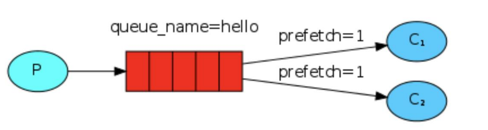
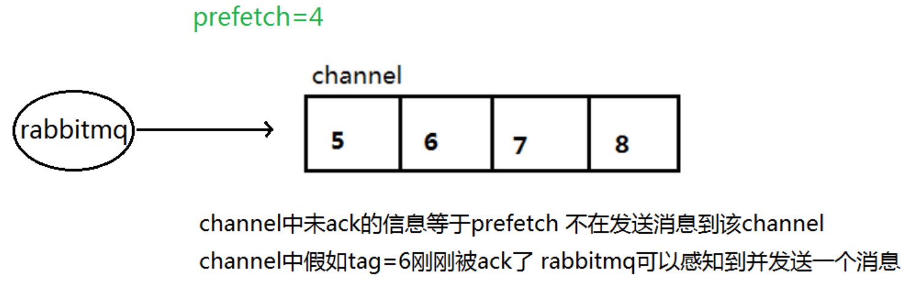

在最开始的时候我们学习到 RabbitMQ 分发消息采用的轮询分发，但是在某种场景下这种策略并不是很好，比方说有两个消费者在处理任务，其中有个消费者 1 处理任务的速度非常快，而另外一个消费者 2 处理速度却很慢，这个时候我们还是采用轮训分发的化就会到这处理速度快的这个消费者很大一部分时间处于空闲状态，而处理慢的那个消费者一直在干活，这种分配方式在这种情况下其实就不太好，但是RabbitMQ 并不知道这种情况它依然很公平的进行分发。

为了避免上述情况，强烈建议使用不公平分发（能者多劳），生产者和消费者都需要设置参数 channel.basicQos(1);



意思就是如果这个任务我还没有处理完或者我还没有应答你，你先别分配给我，我目前只能处理一个任务，然后rabbitmq就会把该任务分配给没有那么忙的那个空闲消费者，当然如果所有的消费者都没有完成手上任务，队列还在不停的添加新任务，队列有可能就会遇到队列被撑满的情况，这个时候就只能添加新的worker或者改变其他存储任务的策略。

**示例代码**

```java
public class MessageQosProducer {
    static final String QUEUE_NAME = QOS_QUEUE_NAME;

    public static void main(String[] args) throws Exception {
        ConnectionFactory connectionFactory = new ConnectionFactory();
        connectionFactory.setHost("192.168.19.128");
        connectionFactory.setPort(5672);
        connectionFactory.setUsername("admin");
        connectionFactory.setPassword("admin");
        Connection connection = connectionFactory.newConnection();
        Channel channel = connection.createChannel();
        // 设置为不公平分发
        channel.basicQos(1);
        // 队列持久化
        channel.queueDeclare(QUEUE_NAME, true, false, false, null);

        for (int i = 0; i < 10; i++) {
            String msg = "message_" + i;
            // 消息持久化
            channel.basicPublish("", QUEUE_NAME, MessageProperties.PERSISTENT_TEXT_PLAIN, (msg).getBytes(StandardCharsets.UTF_8));
            System.out.println("消息[" + msg + "]发送完成");
        }

        channel.close();
        connection.close();
    }
}
```

 消费者1处理任务时间为5s，消费者2处理任务时间为1s，所以2处理的任务比1更多。

```java
public class MessageQosConsumer1 {
    static final String QUEUE_NAME = QOS_QUEUE_NAME;

    public static void main(String[] args) throws Exception {
        ConnectionFactory connectionFactory = new ConnectionFactory();
        connectionFactory.setHost("192.168.19.128");
        connectionFactory.setPort(5672);
        connectionFactory.setUsername("admin");
        connectionFactory.setPassword("admin");
        Connection connection = connectionFactory.newConnection();
        Channel channel = connection.createChannel();
        // 设置持久化
        channel.queueDeclare(QUEUE_NAME, true, false, false, null);
        channel.basicQos(1);
        Consumer callback = new DefaultConsumer(channel) {
            @SneakyThrows
            @Override
            public void handleDelivery(String consumerTag, Envelope envelope, AMQP.BasicProperties properties, byte[] body) throws IOException {
                //路由的key
                String routingKey = envelope.getRoutingKey();
                //获取交换机信息
                String exchange = envelope.getExchange();
                //获取消息ID
                long deliveryTag = envelope.getDeliveryTag();
                //获取消息信息
                String message = new String(body, StandardCharsets.UTF_8);
                System.out.println("routingKey:" + routingKey +
                        ",exchange:" + exchange +
                        ",deliveryTag:" + deliveryTag +
                        ",message:" + message);

                // 模拟处理任务的时间
                // 消费者1设置为5s，消费者2设置为1s
                TimeUnit.SECONDS.sleep(5);

                // deliveryTag是消息标记tag ,设置为不批量应答
                channel.basicAck(deliveryTag, false);
            }
        };

        // 使用手动应答
        channel.basicConsume(QUEUE_NAME, false, callback);
    }
}
```

## 预取值（prefetchCount）

在上面案例中通过设置生产者和消费者的 channel.basicQos(1) 来实现消息的不公平分发。那么这个1是什么含义呢？这个就是当前消费者理论上获取的消息条数。

```java
    /**
     * Request a specific prefetchCount "quality of service" settings
     * for this channel.
     * Note the prefetch count must be between 0 and 65535 (unsigned short in AMQP 0-9-1).
     *
     * @param prefetchCount maximum number of messages that the server
     *                      will deliver, 0 if unlimited
     * @throws java.io.IOException if an error is encountered
     * @see #basicQos(int, int, boolean)
     */
    void basicQos(int prefetchCount) throws IOException;
```

本身消息的发送就是异步发送的，所以在任何时候，channel 上肯定不止只有一个消息另外来自消费者的手动确认本质上也是异步的。因此这里就存在一个未确认的消息缓冲区，因此希望开发人员能**限制此缓冲区的大小，以避免缓冲区里面无限制的未确认消息问题**。这个时候就可以通过使用 basic.qos 方法设置“预取计数”值来完成的。**该值定义通道上允许的未确认消息的最大数量**。一旦数量达到配置的数量，RabbitMQ 将停止在通道上传递更多消息，除非至少有一个未处理的消息被确认，例如，假设在通道上有未确认的消息 5、6、7，8，并且通道的预取计数设置为 4，此时 RabbitMQ 将不会在该通道上再传递任何消息，除非至少有一个未应答的消息被 ack。比方说 tag=6 这个消息刚刚被确认 ACK，RabbitMQ 将会感知这个情况到并再发送一条消息。消息应答和 QoS 预取值对用户吞吐量有重大影响。通常，增加预取将提高向消费者传递消息的速度。**虽然自动应答传输消息速率是最佳的，但是，在这种情况下已传递但尚未处理的消息的数量也会增加，从而增加了消费者的RAM** **消耗**(随机存取存储器)应该小心使用具有无限预处理的自动确认模式或手动确认模式，消费者消费了大量的消息如果没有确认的话，会导致消费者连接节点的内存消耗变大，所以找到合适的预取值是一个反复试验的过程，不同的负载该值取值也不同 100 到 300 范围内的值通常可提供最佳的吞吐量，并且不会给消费者带来太大的风险。预取值为 1 是最保守的。当然这将使吞吐量变得很低，特别是消费者连接延迟很严重的情况下，特别是在消费者连接等待时间较长的环境中。对于大多数应用来说，稍微高一点的值将是最佳的。


