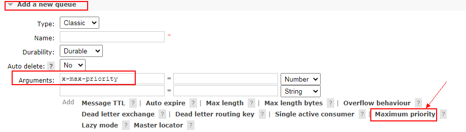

在优先级队列中，针对生产者给消息设置的优先级进行排序，优先级越大的越先被消费者消费。如果在消费者的消费速度大于生产者的速度，且Broker中没有消息堆积的情况下，对发送的消息设置优先级没有意义。

在生产者，按如下方式给消息设置 priority 属性

```java
AMQP.BasicProperties properties = new AMQP.BasicProperties().builder()
    			// 设置当前消息的优先级
                .priority(5).build();
```

在消费者，按如下方式声明优先级队列，优先级的取值范围是0-255，推荐使用 10。

```java
Map<String,Object> arguments = new HashMap<>(1);
arguments.put("x-max-priority",10);
channel.queueDeclare("queue_name", true, false, false, arguments);
```

**在RabbitMQ的控制台添加优先级队列**



**代码示例**

生产者

```java
public class MessagePriorityProducer {
    static final String QUEUE_NAME = "priority";

    public static void main(String[] args) throws Exception {
        ConnectionFactory connectionFactory = new ConnectionFactory();
        connectionFactory.setHost("192.168.19.128");
        connectionFactory.setPort(5672);
        connectionFactory.setUsername("admin");
        connectionFactory.setPassword("admin");
        Connection connection = connectionFactory.newConnection();
        Channel channel = connection.createChannel();

        // 设置当前消息的优先级
        AMQP.BasicProperties properties1 = new AMQP.BasicProperties()
            .builder()
            .priority(5)
            .build();
        // 证明是优先级越大越先被消费
        AMQP.BasicProperties properties2 = new AMQP.BasicProperties()
            .builder()
            .priority(3)
            .build();

        for (int i = 1; i <= 10; i++) {
            String message = "message_" + i;
            // i=5的消息优先处理
            if (i == 5) {
                channel.basicPublish("", QUEUE_NAME, properties1, message.getBytes());
            } else if (i == 7) {
                channel.basicPublish("", QUEUE_NAME, properties2, message.getBytes());
            } else {
                channel.basicPublish("", QUEUE_NAME, null, message.getBytes());
            }
            System.out.println("发送消息完成:" + message);
        }
    }
}
```

消费者

```java
public class MessagePriorityConsumer {
    static final String QUEUE_NAME = "priority";

    public static void main(String[] args) throws Exception {
        ConnectionFactory connectionFactory = new ConnectionFactory();
        connectionFactory.setHost("192.168.19.128");
        connectionFactory.setPort(5672);
        connectionFactory.setUsername("admin");
        connectionFactory.setPassword("admin");
        Connection connection = connectionFactory.newConnection();
        Channel channel = connection.createChannel();

        // 设置优先级最大值，取值范围为0-255
        Map<String,Object> arguments = new HashMap<>(1);
        arguments.put("x-max-priority",10);
        // 声明优先级队列
        channel.queueDeclare(QUEUE_NAME, true, false, false, arguments);

        System.out.println("等待接收消息...");
        channel.basicConsume(QUEUE_NAME, true, (consumerTag, delivery) -> {
            byte[] msgBytes = delivery.getBody();
            System.out.println("接收到消息：消息ID=" + consumerTag + "===>" + new String(msgBytes));
        }, consumerTag -> {
            System.out.println("消息被中断：消息ID=" + consumerTag);
        });
    }
}
```

