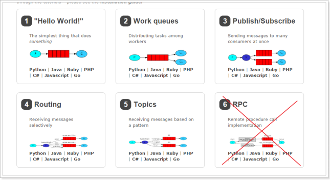
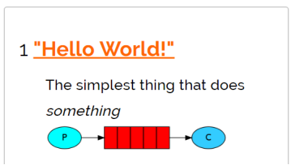
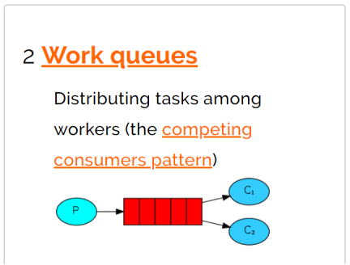
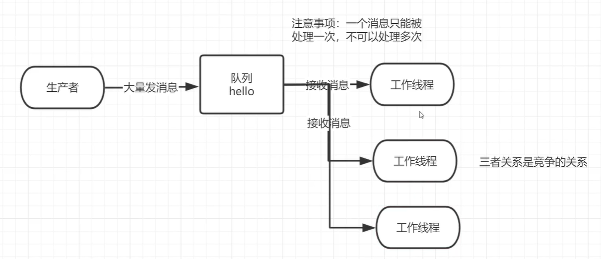
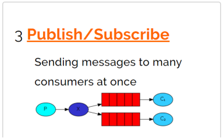
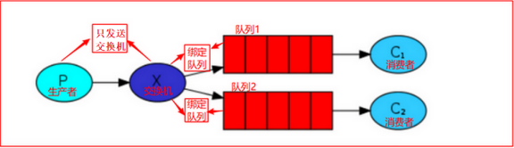
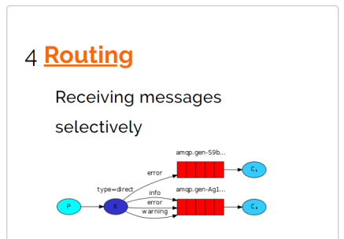
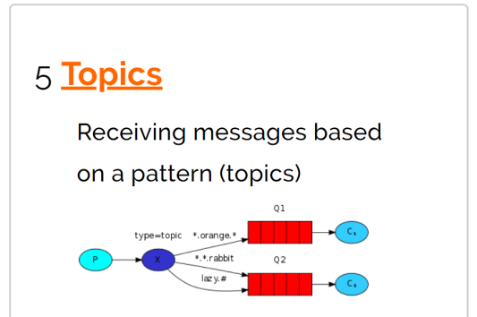

[官网链接](https://www.rabbitmq.com/getstarted.html)

简单模式，work模式，Publish/Subscribe发布与订阅模式，Routing路由模式，Topics主题模式，RPC远程调用模式（远程调用，不太算MQ；不作介绍）；



## 简单模式（Simple）



```java
public class SimpleProducer {
    String SIMPLE_QUEUE_NAME = "hello";
    public static void main(String[] args) throws Exception {
        ConnectionFactory connectionFactory = new ConnectionFactory();
        connectionFactory.setHost("192.168.19.128");
        connectionFactory.setPort(5672);
        connectionFactory.setUsername("admin");
        connectionFactory.setPassword("admin");
        // 建立连接
        Connection connection = connectionFactory.newConnection();
        // 创建一个连接中的channel
        Channel channel = connection.createChannel();

        /**
         * Declare a queue
         * @see com.rabbitmq.client.AMQP.Queue.Declare
         * @see com.rabbitmq.client.AMQP.Queue.DeclareOk
         * @param queue the name of the queue
         * @param durable true if we are declaring a durable queue (the queue will survive a server restart)
         * @param exclusive 该队列是否只供一个消费者进行消费，是否进行消息共享，true-多个消费者消费，false - 只能一个消费者消费
         *                  true if we are declaring an exclusive queue (restricted to this connection)
         * @param autoDelete 最后一个消费者断开连接以后，该队列是否自动删除
         *                  true if we are declaring an autodelete queue (server will delete it when no longer in use)
         * @param arguments other properties (construction arguments) for the queue
         * @return a declaration-confirm method to indicate the queue was successfully declared
         * @throws java.io.IOException if an error is encountered
         *
         * queueDeclare(String queue, boolean durable, boolean exclusive, boolean autoDelete,Map<String, Object> arguments)
         **/
        channel.queueDeclare(SIMPLE_QUEUE_NAME, false, false, false, null);
        /**
         * Publish a message.
         *
         * Publishing to a non-existent exchange will result in a channel-level
         * protocol exception, which closes the channel.
         *
         * Invocations of <code>Channel#basicPublish</code> will eventually block if a
         * <a href="https://www.rabbitmq.com/alarms.html">resource-driven alarm</a> is in effect.
         *
         * @see com.rabbitmq.client.AMQP.Basic.Publish
         * @see <a href="https://www.rabbitmq.com/alarms.html">Resource-driven alarms</a>
         * @param exchange the exchange to publish the message to
         * @param routingKey the routing key
         * @param props other properties for the message - routing headers etc
         * @param body the message body
         * @throws java.io.IOException if an error is encountered
         */
        channel.basicPublish("", SIMPLE_QUEUE_NAME, null, "hello,world!".getBytes(StandardCharsets.UTF_8));

        System.out.println("消息发送完成");
    }
}
```

```java
public class SimpleConsumer {
    String SIMPLE_QUEUE_NAME = "hello";
    public static void main(String[] args) throws Exception {
        ConnectionFactory connectionFactory = new ConnectionFactory();
        connectionFactory.setHost("192.168.19.128");
        connectionFactory.setPort(5672);
        connectionFactory.setUsername("admin");
        connectionFactory.setPassword("admin");
        Connection connection = connectionFactory.newConnection();

        Channel channel = connection.createChannel();
        /**
         * Start a non-nolocal, non-exclusive consumer, with
         * a server-generated consumerTag.
         * Provide access only to <code>basic.deliver</code> and
         * <code>basic.cancel</code> AMQP methods (which is sufficient
         * for most cases). See methods with a {@link Consumer} argument
         * to have access to all the application callbacks.
         * @param queue the name of the queue
         * @param autoAck 自动应答，接收到消息就回复服务端 true if the server should consider messages
         * acknowledged once delivered; false if the server should expect
         * explicit acknowledgements
         * @param deliverCallback callback when a message is delivered
         * @param cancelCallback callback when the consumer is cancelled
         * @return the consumerTag generated by the server
         * String basicConsume(String queue, boolean autoAck, DeliverCallback deliverCallback, CancelCallback cancelCallback)
         */
        channel.basicConsume(SIMPLE_QUEUE_NAME, true,
                // 消息传递监听，接收到消息时触发
                (consumerTag, message) -> {
                    byte[] msgBytes = message.getBody();
                    System.out.println("接收到消息：" + new String(msgBytes));
                },
                // 取消消息时的回调
                consumerTag -> {
                    System.out.println("消息消费被中断");
                });
    }
}
```

## 工作队列模式（Work Queues）



工作队列（Work Queues）与入门程序的简单模式相比，多了一个或一些消费端，多个消费端共同消费同一个队列中的消息。工作队列（又称为任务队列）的主要思想是避免立即执行资源密集型任务，而不得不等待它完成。相反我们安排任务在之后执行。我们把任务封装为消息并将其发送到队列。在后台运行的工作进程将弹出任务并最终执行作业。当有多个工作线程时，这些工作线程将一起处理这些任务。

**应用场景**：对于任务过重或任务较多情况（消息积压），使用工作队列模式使用多个消费者可以提高任务处理的速度。

### **轮询分发消息**

一个消息只能被处理一次，不可以被处理多次。



创建一个生产者，每一秒发送一次消息

```java
public class WorkQueueProducer {
    public static void main(String[] args) throws Exception {
        ConnectionFactory connectionFactory = new ConnectionFactory();
        connectionFactory.setHost("192.168.19.128");
        connectionFactory.setPort(5672);
        connectionFactory.setUsername("admin");
        connectionFactory.setPassword("admin");
        // 建立连接
        Connection connection = connectionFactory.newConnection();
        // 创建一个连接中的channel
        Channel channel = connection.createChannel();

        channel.queueDeclare(WORK_QUEUE_NAME, false, false, false, null);

        for (int i = 0; i < 100; i++) {
            String msg = "message_" + i;
            channel.basicPublish("", WORK_QUEUE_NAME, null, (msg).getBytes(StandardCharsets.UTF_8));
            System.out.println("消息[" + msg + "]发送完成");
            Thread.sleep(1000);
        }
    }
}
```

消费者1、消费者2、消费者3的代码一样。

```java
public class WorkQueueConsumer1 {
    public static void main(String[] args) throws IOException, TimeoutException {
        ConnectionFactory connectionFactory = new ConnectionFactory();
        connectionFactory.setHost("192.168.19.128");
        connectionFactory.setPort(5672);
        connectionFactory.setUsername("admin");
        connectionFactory.setPassword("admin");
        Connection connection = connectionFactory.newConnection();

        Channel channel = connection.createChannel();
        channel.basicConsume(WORK_QUEUE_NAME, true,
                // 消息传递通知
                (consumerTag, message) -> {
                    byte[] msgBytes = message.getBody();
                    System.out.println("接收到消息：" + new String(msgBytes));
                },
                // 取消消息时的回调
                consumerTag -> {
                    System.out.println("消息消费被中断");
                });
    }
}
```

## 发布订阅模式（Publish subscribe）



在发布订阅模型中，多了一个x(exchange)角色，而且过程略有变化。

**P**：生产者，也就是要发送消息的程序，但是不再发送到队列中，而是发给X（交换机）

**C**：消费者，消息的接受者，会一直监听消息到来。

**Queue**：消息队列，接收消息、缓存消息。

**Exchange**：交换机，图中的X。一方面，接收生产者发送的消息。另一方面，知道如何处理消息，例如递交给某个特别队列、递交给所有队列、或是将消息丢弃。到底如何操作，取决于Exchange的类型。Exchange有常见以下3种类型：

- Fanout：广播，将消息交给所有绑定到交换机的队列

- Direct：定向，把消息交给符合指定routing key 的队列

- Topic：通配符，把消息交给符合routing pattern（路由模式） 的队列

**Exchange（交换机）只负责转发消息，不具备存储消息的能力**，因此如果没有任何队列与Exchange**绑定**，或者没有符合路由规则的队列，那么消息会丢失！



### **代码实现**

生产者将消息发给交换机

```java
public class FanoutProducer {
    String FANOUT_QUEUE_NAME = "fanout";
    String FANOUT_EXCHANGE_NAME = "fanoutExchange";

    public static void main(String[] args) throws Exception {
        ConnectionFactory connectionFactory = new ConnectionFactory();
        connectionFactory.setHost("192.168.19.128");
        connectionFactory.setPort(5672);
        connectionFactory.setUsername("admin");
        connectionFactory.setPassword("admin");
        // 建立连接
        Connection connection = connectionFactory.newConnection();
        // 创建一个连接中的channel
        Channel channel = connection.createChannel();
        // 声明交换机 - channel.exchangeDeclare(交换机名字,交换机类型)
        channel.exchangeDeclare(FANOUT_EXCHANGE_NAME, BuiltinExchangeType.FANOUT);

        for (int i = 0; i < 10; i++) {
            String msg = "message_" + i;
            // 消息发送-channel.basicPublish(交换机[默认Default Exchage],路由key[简单模式可以传递队列名称],消息其它属性,消息内容)
            channel.basicPublish(FANOUT_EXCHANGE_NAME, "", null, (msg).getBytes(StandardCharsets.UTF_8));
            System.out.println("消息[" + msg + "]发送完成");
        }
        // 关闭资源-channel.close();connection.close()
        channel.close();
        connection.close();
    }
}
```

消费者1、消费者2、消费者3代码均一致。消费者需要绑定队列，队列绑定交换机。

```java
public class FanoutConsumer1 {
    String FANOUT_QUEUE_NAME = "fanout";
    String FANOUT_EXCHANGE_NAME = "fanoutExchange";

    public static void main(String[] args) throws Exception {
        ConnectionFactory connectionFactory = new ConnectionFactory();
        connectionFactory.setHost("192.168.19.128");
        connectionFactory.setPort(5672);
        connectionFactory.setUsername("admin");
        connectionFactory.setPassword("admin");
        Connection connection = connectionFactory.newConnection();

        Channel channel = connection.createChannel();
        // 声明队列-channel.queueDeclare(名称，是否持久化，是否独占本连接,是否自动删除,附加参数)
        channel.queueDeclare(FANOUT_QUEUE_NAME, true, false, false, null);
        // 队列绑定交换机-channel.queueBind(队列名, 交换机名, 路由key[广播消息设置为空串])
        channel.queueBind(FANOUT_QUEUE_NAME, FANOUT_EXCHANGE_NAME, "");
        channel.basicConsume(FANOUT_QUEUE_NAME, true,
                (consumerTag, message) -> {
                    byte[] msgBytes = message.getBody();
                    System.out.println("接收到消息：" + new String(msgBytes));
                },
                consumerTag -> {
                    System.out.println("消息消费被中断");
                });
    }
}
```

## 路由模式（Routing）

1.队列与交换机的绑定，不能是任意绑定了，而是要指定一个RoutingKey（路由key）。

2.消息的发送放在向 Exchange发送消息时，也必须指定消息的 RoutingKey。

3.Exchange不再把消息交给每一个绑定的队列，而是根据消息的Routing Key进行判断，只有队列的Routingkey与消息的 Routing key完全一致，才会接收到消息。



P：生产者，向Exchange发送消息，发送消息时，会指定一个routing key。

X：Exchange（交换机），接收生产者的消息，然后把消息递交给 与routing key完全匹配的队列。

C1：消费者，其所在队列指定了需要routing key 为 error 的消息

C2：消费者，其所在队列指定了需要routing key 为 info、error、warning 的消息

### 代码实现

生产者将消息发送给交换机之前，需要给消息设置上路由键，交换机会根据路由键发送给指定队列，消费者根据自己的路由键获取指定队列中的消息。

```java
public class RoutingProducer {
    String ROUTING_QUEUE_NAME = "routing";
    String ROUTING_EXCHANGE_NAME = "routingExchange";
    /**  路由键1 */
    String ROUTING_KEY_ERROR = "log.error";
    /** 路由键2 */
    String ROUTING_KEY_INFO = "log.info";
    /** 路由键3 */
    String ROUTING_KEY_WARNING = "log.warning";

    public static void main(String[] args) throws Exception {
        ConnectionFactory connectionFactory = new ConnectionFactory();
        connectionFactory.setHost("192.168.19.128");
        connectionFactory.setPort(5672);
        connectionFactory.setUsername("admin");
        connectionFactory.setPassword("admin");
        // 建立连接
        Connection connection = connectionFactory.newConnection();
        // 创建一个连接中的channel
        Channel channel = connection.createChannel();
        // 声明交换机 - channel.exchangeDeclare(交换机名字,交换机类型)
        channel.exchangeDeclare(ROUTING_EXCHANGE_NAME, BuiltinExchangeType.DIRECT);

        for (int i = 0; i < 10; i++) {
            // 发送消息的时候根据相关逻辑指定相应的routing key。
            String routingKey = "";
            switch (i / 3) {
                default:
                    break;
                //假设i=0，为error消息
                case 0:
                    routingKey = ROUTING_KEY_ERROR;
                    break;
                //假设i=1，为info消息
                case 1:
                    routingKey = ROUTING_KEY_INFO;
                    break;
                //假设i=2，为warning消息
                case 2:
                    routingKey = ROUTING_KEY_WARNING;
                    break;
            }
            String msg = "message_" + i;
            // 消息发送-channel.basicPublish(交换机[默认Default Exchage],路由key[简单模式可以传递队列名称],消息其它属性,消息内容)
            channel.basicPublish(ROUTING_EXCHANGE_NAME, routingKey, null, (msg).getBytes(StandardCharsets.UTF_8));
            System.out.println("消息[" + msg + "]发送完成");
        }

        // 关闭资源-channel.close();connection.close()
        channel.close();
        connection.close();
    }
}
```

消费者1、2、3代码均一致。

```java
public class RoutingConsumer1 {
    public static void main(String[] args) throws Exception {
        ConnectionFactory connectionFactory = new ConnectionFactory();
        connectionFactory.setHost("192.168.19.128");
        connectionFactory.setPort(5672);
        connectionFactory.setUsername("admin");
        connectionFactory.setPassword("admin");
        Connection connection = connectionFactory.newConnection();

        Channel channel = connection.createChannel();
        // 声明队列-channel.queueDeclare(名称，是否持久化，是否独占本连接,是否自动删除,附加参数)
        channel.queueDeclare(ROUTING_QUEUE_NAME, true, false, false, null);
        // 队列绑定交换机-channel.queueBind(队列名, 交换机名, 路由key[广播消息设置为空串])
        channel.queueBind(ROUTING_QUEUE_NAME, ROUTING_EXCHANGE_NAME, ROUTING_KEY_ERROR);
        // autoAck 是否自动应答，true为自动应答[mq接收到回复会删除消息]
        channel.basicConsume(ROUTING_QUEUE_NAME, true,
                (consumerTag, message) -> {
                    byte[] msgBytes = message.getBody();
                    System.out.println("接收到消息：消息ID=" + consumerTag + "===>" + new String(msgBytes));
                },
                consumerTag -> {
                    System.out.println("消息消费被中断");
                });
    }
}
```

## Topic 通配符模式

Topic类型与Direct相比，都是可以根据RoutingKey把消息路由到不同的队列。只不过Topic类型Exchange可以让队列在绑定Routing key的时候使用通配符。



Routingkey 一般都是有一个或多个单词组成，多个单词之间以“ . ”分割，例如： item.insert、item.insert.abc。

通配符规则：

- \#：匹配一个或多个词

- *：只匹配1个词

举例：

item.#：能够匹配 item.insert.abc 或者 item.insert

item.*：只能匹配 item.insert


红色Queue：绑定的是usa.# ，因此凡是以 usa.开头的routing key 都会被匹配到。

黄色Queue：绑定的是#.news ，因此凡是以 .news结尾的 routing key 都会被匹配。

还有一种RPC的模式，不常用，此处省略。

## RabbitMQ工作模式总结

### 简单模式 HelloWorld

一个生产者、一个消费者，不需要设置交换机（使用默认的交换机）

### 工作队列模式 Work Queue

一个生产者、多个消费者（竞争关系），不需要设置交换机（使用默认的交换机）

### 发布订阅模式 Publish/subscribe

需要设置类型为fanout的交换机，并且交换机和队列进行绑定，当发送消息到交换机后，交换机会将消息发送到绑定的队列

### 路由模式 Routing

需要设置类型为direct的交换机，交换机和队列进行绑定，并且指定routing key，当发送消息到交换机后，交换机会根据routing key将消息发送到对应的队列

### 通配符模式 Topic

需要设置类型为topic的交换机，交换机和队列进行绑定，并且指定通配符方式的routing key，当发送消息到交换机后，交换机会根据routing key将消息发送到对应的队列

