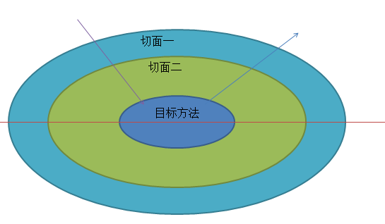

## 单个切面类

### @Before、@After、@AfterReturning、@AfterThrowing执行顺序

1. Spring 4.x

- 正常情况：@Before —-> 目标方法 —-> @After —-> @AfterReturning
- 异常情况：@Before —-> 目标方法 —-> @After —-> @AfterThrowing

2. Spring 5.x

- 正常情况：@Before —-> 目标方法 —-> @AfterReturning —-> @After
- 异常情况：@Before —-> 目标方法 —-> @AfterThrowing —-> @After

```java
@Service
public class BookService {

    public int add(int i,int j) {
        int result=i+j;
        System.out.println("目标方法执行");
        //System.out.println(1/0);
        return result;
    }
}


@Aspect
@Component
public class BookServiceProxy {

    @Pointcut(value = "execution(* com.orz.spring.aop.BookService.add(..))")
    public void myPointCut(){}

    @Before(value = "myPointCut()")
    public void before() {
        System.out.println("@Before");
    }

    @After(value = "myPointCut()")
    public void after() {
        System.out.println("@After");
    }
    
    @AfterReturning(value = "myPointCut()")
    public void afterReturning() {
        System.out.println("@AfterReturning");
    }
    
    @AfterThrowing(value = "myPointCut()")
    public void afterThrowing() {
        System.out.println("@AfterThrowing");
    }
}

@Test
public void test2() {
    ApplicationContext applicationContext=new ClassPathXmlApplicationContext("bean2.xml");
    BookService bookService = applicationContext.getBean("bookService", BookService.class);
    bookService.add(1,2);
}
```

执行结果

1. Spring 4.x

```bas
正常情况
@Before
目标方法执行
@After
@AfterReturning

异常情况
@Before
目标方法执行
@After
@AfterThrowing
```

2. Spring 5.x

```bash
正常情况
@Before
目标方法执行
@AfterReturning
@After

异常情况
@Before
目标方法执行
@AfterThrowing
@After
```

### @Around的执行顺序

```java
@Around(value = "myPointCut()")
public Object myAround(ProceedingJoinPoint proceedingJoinPoint) {
    Object[] args = proceedingJoinPoint.getArgs();
    Object result=null;
    try {
        //前置通知@Before
        System.out.println("环绕前置通知");
        //目标方法执行
        result = proceedingJoinPoint.proceed(args);
        //环绕返回通知@AfterReturning
        System.out.println("环绕返回通知");
    } catch (Throwable throwable) {
        //环绕异常通知@AfterThrowing
        System.out.println("环绕异常通知");
        throw new RuntimeException(throwable);
    } finally {
        //最终通知@After
        System.out.println("环绕最终通知");
    }
    return result;
}
```

1. Spring 4.x

- 正常情况：环绕前置 —-> 目标方法执行 —-> 环绕返回 —-> 环绕最终
- 异常情况：环绕前置 —-> 目标方法执行 —-> 环绕异常 —-> 环绕最终

2. Spring 5.x

- 正常情况：环绕前置 —-> 目标方法执行 —-> 环绕返回 —-> 环绕最终
- 异常情况：环绕前置 —-> 目标方法执行 —-> 环绕异常 —-> 环绕最终

### 五大通知执行顺序

1. Spring4.x

- 正常情况：环绕前置 —-> @Before —-> 目标方法执行 —-> 环绕返回 —-> 环绕最终 —-> @After —-> @AfterReturning

- 异常情况：环绕前置 —-> @Before —-> 目标方法执行 —->  环绕异常 —-> 环绕最终 —-> @After —-> @AfterThrowing

2. Spring5.x

- 正常情况：环绕前置 —-> @Before —-> 目标方法执行 —-> @AfterReturning —-> @After —-> 环绕返回 —-> 环绕最终

- 异常情况：环绕前置 —-> @Before —-> 目标方法执行 —-> @AfterThrowing —-> @After —-> 环绕异常 —-> 环绕最终

```java
@Service
public class BookService {

    public int add(int i,int j) {
        int result=i+j;
        System.out.println("目标方法执行");
        //System.out.println(1/0);
        return result;
    }
}

@Aspect
@Component
public class BookServiceProxy {

    @Pointcut(value = "execution(* com.orz.spring.aop.BookService.add(..))")
    public void myPointCut(){}

    @Before(value = "myPointCut()")
    public void before() {
        System.out.println("@Before");
    }

    @After(value = "myPointCut()")
    public void after() {
        System.out.println("@After");
    }
    
    @AfterReturning(value = "myPointCut()")
    public void afterReturning() {
        System.out.println("@AfterReturning");
    }
    
    @AfterThrowing(value = "myPointCut()")
    public void afterThrowing() {
        System.out.println("@AfterThrowing");
    }

    @Around(value = "myPointCut()")
    public Object myAround(ProceedingJoinPoint proceedingJoinPoint) {
        Object[] args = proceedingJoinPoint.getArgs();
        Object result=null;
        try {
            //前置通知@Before
            System.out.println("环绕前置通知");
            //目标方法执行
            result = proceedingJoinPoint.proceed(args);
            //环绕返回通知@AfterReturning
            System.out.println("环绕返回通知");
        } catch (Throwable throwable) {
            //环绕异常通知@AfterThrowing
            System.out.println("环绕异常通知");
            throw new RuntimeException(throwable);
        } finally {
            //最终通知@After
            System.out.println("环绕最终通知");
        }
        return result;
    }
}

@Test
public void test2() {
    ApplicationContext applicationContext=new ClassPathXmlApplicationContext("bean2.xml");
    BookService bookService = applicationContext.getBean("bookService", BookService.class);
    bookService.add(1,2);
}
```

执行结果

1. Spring 4.x

```bas
正常情况
环绕前置通知
@Before
目标方法执行
环绕返回通知
环绕最终通知
@After
@AfterReturning

异常情况
环绕前置通知
@Before
目标方法执行
环绕异常通知
环绕最终通知
@After
@AfterThrowing
```

2. Spring 5.x

```bash
正常情况
环绕前置通知
@Before
目标方法执行
@AfterReturning
@After
环绕返回通知
环绕最终通知

异常情况
环绕前置通知
@Before
目标方法执行
@AfterThrowing
@After
环绕异常通知
环绕最终通知
```

## 多个切面



1. Spring 4.x

- 正常情况：切面1环绕前置 ——-> 切面1@Before —-> 切面2环绕前置 —-> 切面2@Before —-> 目标方法执行 —-> 切面2环绕返回 —-> 切面2环绕最终 —-> 切面2@After —-> 切面2@AfterReturning —-> 切面1环绕返回 —-> 切面1环绕最终 —-> 切面1@After —-> 切面1@AfterThrowing

- 异常情况：切面1环绕前置 —-> 切面1@Before —-> 切面2环绕前置 —-> 切面2@Before —-> 目标方法执行 —-> 切面2环绕异常 —-> 切面2环绕最终 —-> 切面2@After —-> 切面2@AfteThrowing —-> 切面1环绕异常 —-> 切面1环绕最终 —-> 切面1@After —-> 切面1@AfterThrowing

2. Spring 5.x

- 正常情况：切面1环绕前置 —-> 切面1@Before —-> 切面2环绕前置 —-> 切面2@Before —-> 目标方法执行 —-> 切面2@AfterReturning —-> 切面2@After —-> 切面2环绕返回 —-> 切面2环绕最终 —-> 切面1@AfterReturning —-> 切面1@After —-> 切面1环绕返回 —-> 切面1环绕最终

- 异常情况：切面1环绕前置 —-> 切面1@Before —-> 切面2环绕前置 —-> 切面2@Before —-> 目标方法执行 —-> 切面2@AfterThrowing —-> 切面2@After —-> 切面2环绕异常 —-> 切面2环绕最终 —-> 切面1@AfterThrowing —-> 切面1@After —-> 切面1环绕异常 —-> 切面1环绕最终

```java
@Service
public class BookService {

    public int add(int i,int j) {
        int result=i+j;
        System.out.println("目标方法执行");
        //System.out.println(1/0);
        return result;
    }
}

@Aspect
@Component
public class BookServiceProxy {

    @Pointcut(value = "execution(* com.orz.spring.aop.BookService.add(..))")
    public void myPointCut(){}

    @Before(value = "myPointCut()")
    public void before() {
        System.out.println("切面一：@Before");
    }

    @After(value = "myPointCut()")
    public void after() {
        System.out.println("切面一：@After");
    }
    
    @AfterReturning(value = "myPointCut()")
    public void afterReturning() {
        System.out.println("切面一：@AfterReturning");
    }
    
    @AfterThrowing(value = "myPointCut()")
    public void afterThrowing() {
        System.out.println("切面一：@AfterThrowing");
    }

    @Around(value = "myPointCut()")
    public Object myAround(ProceedingJoinPoint proceedingJoinPoint) {
        Object[] args = proceedingJoinPoint.getArgs();
        Object result=null;
        try {
            //前置通知@Before
            System.out.println("切面一：环绕前置通知");
            //目标方法执行
            result = proceedingJoinPoint.proceed(args);
            //环绕返回通知@AfterReturning
            System.out.println("切面一：环绕返回通知");
        } catch (Throwable throwable) {
            //环绕异常通知@AfterThrowing
            System.out.println("切面一：环绕异常通知");
            throw new RuntimeException(throwable);
        } finally {
            //最终通知@After
            System.out.println("切面一：环绕最终通知");
        }
        return result;
    }
}

@Test
public void test2() {
    ApplicationContext applicationContext=new ClassPathXmlApplicationContext("bean2.xml");
    BookService bookService = applicationContext.getBean("bookService", BookService.class);
    bookService.add(1,2);
}
```

执行结果

1. Spring 4.x

```bash
正常情况
切面一：环绕前置通知
切面一：@Before
切面二：环绕前置通知
切面二：@Before
目标方法执行
切面二：环绕返回通知
切面二：环绕最终通知
切面二：@After
切面二：@AfterReturning
切面一：环绕返回通知
切面一：环绕最终通知
切面一：@After
切面一：@AfterReturning

异常情况
切面一：环绕前置通知
切面一：@Before
切面二：环绕前置通知
切面二：@Before
目标方法执行
切面二：环绕异常通知
切面二：环绕最终通知
切面二：@After
切面二：@AfterThrowing
切面一：环绕异常通知
切面一：环绕最终通知
切面一：@After
切面一：@AfterThrowing
```

2. Spring 5.x

```bash
正常情况
切面一：环绕前置通知
切面一：@Before
切面二：环绕前置通知
切面二：@Before
目标方法执行
切面二：@AfterReturning
切面二：@After
切面二：环绕返回通知
切面二：环绕最终通知
切面一：@AfterReturning
切面一：@After
切面一：环绕返回通知
切面一：环绕最终通知

异常情况
切面一：环绕前置通知
切面一：@Before
切面二：环绕前置通知
切面二：@Before
目标方法执行
切面二：@AfterThrowing
切面二：@After
切面二：环绕异常通知
切面二：环绕最终通知
切面一：@AfterThrowing
切面一：@After
切面一：环绕异常通知
切面一：环绕最终通知
```

可以使用@Order注解指定先后顺序，数字越小，优先级越高，先进后出

```java
@Order(value = 1)
@Aspect
@Component
public class BookServiceProxy {}
 
@Order(value = 0)
@Aspect
@Component
public class BookServiceProxy2 {}
```

```bash
切面二：环绕前置通知
切面二：@Before
切面一：环绕前置通知
切面一：@Before
目标方法执行
切面一：@AfterReturning
切面一：@After
切面一：环绕返回通知
切面一：环绕最终通知
切面二：@AfterReturning
切面二：@After
切面二：环绕返回通知
切面二：环绕最终通知
```

