## 回顾Spring AOP的使用

新建一个SpringBoot项目，SpringBoot版本为2.4.0，引入如下两个依赖：

```xml
<dependencies>
    <dependency>
        <groupId>org.springframework.boot</groupId>
        <artifactId>spring-boot-starter</artifactId>
    </dependency>
    <dependency>
        <groupId>org.springframework.boot</groupId>
        <artifactId>spring-boot-starter-aop</artifactId>
    </dependency>
</dependencies>
```

然后创建一个目标类TatgetClass，包含待会需要被AOP代理增强的方法test：

```java
@Component
public class TargetClass {

    public String test(String value) {
        System.out.println("目标方法test被执行");
        if (!StringUtils.hasLength(value)) {
            throw new RuntimeException("value不能为空");
        }
        return value;
    }
}
```

编写切面类MyAspect：

```java
@Aspect
@Component
public class MyAspect {

    @Pointcut("execution(public * cc.mrbird..*.TargetClass.test(..))")
    public void pointcut() {

    }

    @Before("pointcut()")
    public void onBefore(JoinPoint joinPoint) {
        System.out.println("onBefore：" + joinPoint.getSignature().getName() + "方法开始执行，参数："
                + Arrays.asList(joinPoint.getArgs()));
    }

    @After("pointcut()")
    public void onAfter(JoinPoint joinPoint) {
        System.out.println("onAfter：" + joinPoint.getSignature().getName() + "方法执行结束，参数："
                + Arrays.asList(joinPoint.getArgs()));
    }

    @AfterReturning(value = "pointcut()", returning = "result")
    public void afterReturning(JoinPoint joinPoint, Object result) {
        System.out.println("afterReturning：" + joinPoint.getSignature().getName() + "方法执行结束返回，参数："
                + Arrays.asList(joinPoint.getArgs()) + "，返回值：" + result);
    }

    @AfterThrowing(value = "pointcut()", throwing = "exception")
    public void afterThrowing(JoinPoint joinPoint, Exception exception) {
        System.out.println("afterThrowing：" + joinPoint.getSignature().getName() + "方法执行出错，参数："
                + Arrays.asList(joinPoint.getArgs()) + "，异常：" + exception);
    }

}
```

该切面包含了4个通知方法：

- 前置通知（@Before）：在目标方法被调用之前调用通知功能；
- 后置通知（@After）：在目标方法完成之后调用通知，此时不会关心方法的输出是什么；
- 返回通知（@AfterReturning）：在目标方法成功执行之后调用通知；
- 异常通知（@AfterThrowing）：在目标方法抛出异常后调用通知。

这几个通知的顺序在不同的Spring版本中有所不同（具体可参考文章[SpringAop的通知执行顺序](./2349c725.html)）：

1. Spring4.x
   - 正常情况：@Before —-> 目标方法 —-> @After —-> @AfterReturning
   - 异常情况：@Before —-> 目标方法 —-> @After —-> @AfterThrowing
2. Spring5.x
   - 正常情况：@Before —-> 目标方法 —-> @AfterReturning —-> @After
   - 异常情况：@Before —-> 目标方法 —-> @AfterThrowing —-> @After

在SpringBoot入口类测试AOP结果：

```java
@SpringBootApplication
public class AopApplication {

    public static void main(String[] args) {
        ConfigurableApplicationContext context = SpringApplication.run(AopApplication.class, args);
        TargetClass targetClass = context.getBean(TargetClass.class);
        targetClass.test("aop");
    }
}
```

主要逻辑为从IOC容器中获取TargetClass Bean，然后调用其test方法，程序运行结果如下：

```bash
onBefore：test方法开始执行，参数：[aop]
目标方法test被执行
afterReturning：test方法执行结束返回，参数：[aop]，返回值：aop
onAfter：test方法执行结束，参数：[aop]
```

`test`方法参数为空时，程序运行结果如下：

```bash
onBefore：test方法开始执行，参数：[]
目标方法test被执行
afterThrowing：test方法执行出错，参数：[]，异常：java.lang.RuntimeException: value不能为空
onAfter：test方法执行结束，参数：[]
```

可以看到，我们成功通过Spring AOP将各个通知方法织入到了目标方法的各个执行阶段，下面我们就来深入探究Spring AOP的实现原理。

## @EnableAspectJAutoProxy

前面我们引入了Spring AOP开箱即用的starter`spring-boot-starter-aop`，@Enable模块驱动注解`EnableAspectJAutoProxy`用于开启AspectJ自动代理，源码如下所示：

```java
@Target({ElementType.TYPE})
@Retention(RetentionPolicy.RUNTIME)
@Documented
@Import({AspectJAutoProxyRegistrar.class})
public @interface EnableAspectJAutoProxy {
    boolean proxyTargetClass() default false;

    boolean exposeProxy() default false;
}
```

该注解类上通过@Import导入了`AspectJAutoProxyRegistrar`AspectJ自动代理注册器（对@Import不了解的读者可以参考 [深入学习Spring组件注册](./4bb4364.html))），查看`AspectJAutoProxyRegistrar`的源码：

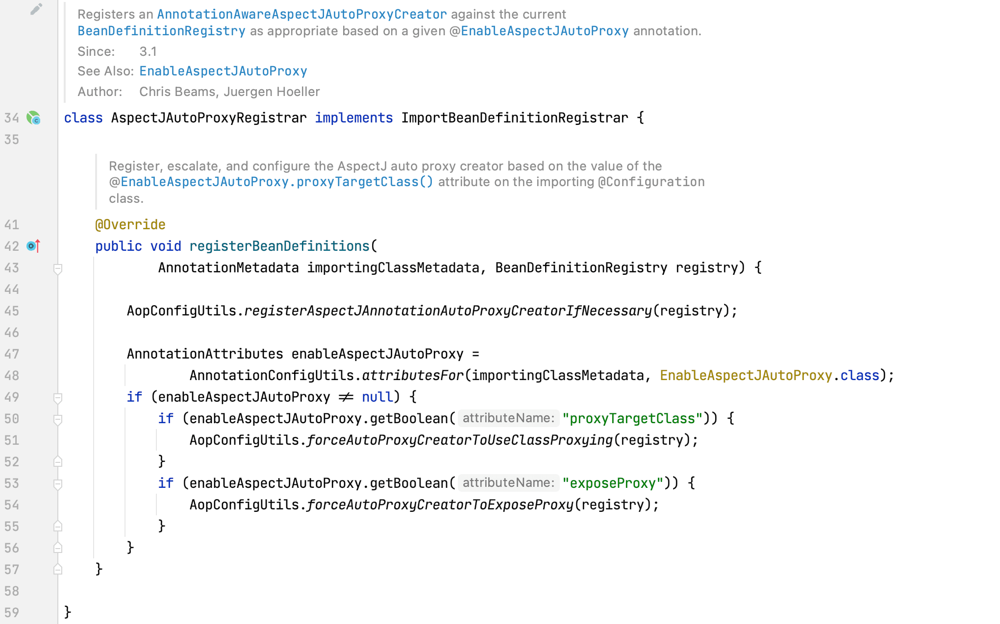

通过注释我们大体可以知道，该注册器的作用是往IOC容器里注册了一个类型为`AnnotationAwareAspectJAutoProxyCreator`（注解驱动的AspectJ自动代理创建器）的Bean。该类的`registerBeanDefinitions`方法主要关注：

```java
AopConfigUtils.registerAspectJAnnotationAutoProxyCreatorIfNecessary(registry);
```

查看其源码：

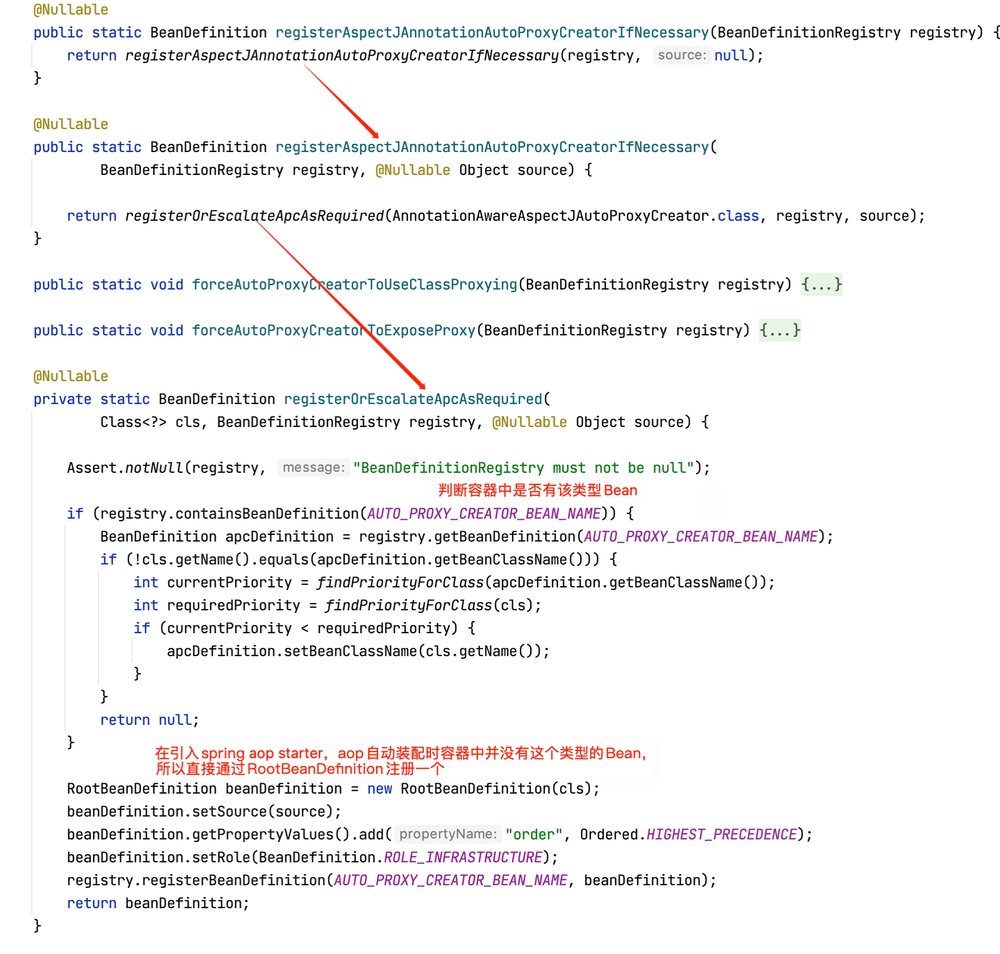

可以看到，核心逻辑为通过`RootBeanDefinition`往IOC注册了名称为`AUTO_PROXY_CREATOR_BEAN_NAME`（常量，值为org.springframework.aop.config.internalAutoProxyCreator），类型为AnnotationAwareAspectJAutoProxyCreator的Bean（对这种通过ImportBeanDefinitionRegistrar往IOC注册Bean方式不了解的读者可以参考[深入学习Spring组件注册](./4bb4364.html))）。

> 总结：`@EnableAspectJAutoProxy`模块驱动注解往IOC容器中注册了类型为AnnotationAwareAspectJAutoProxyCreator的Bean，Bean名称为org.springframework.aop.config.internalAutoProxyCreator。

## AnnotationAwareAspectJAutoProxyCreator class hierarchy

通过前面的分析，我们的目光聚焦在`AnnotationAwareAspectJAutoProxyCreator`类上，为了搞清楚这个类的作用，我们先捋清类的层级关系：

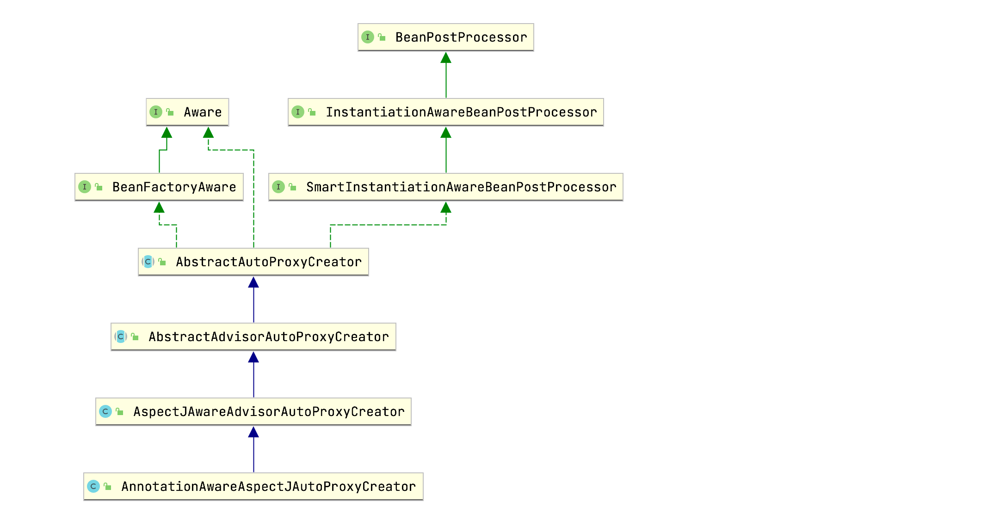

可以看到AnnotationAwareAspectJAutoProxyCreator的父类AbstractAutoProxyCreator实现了SmartInstantiationAwareBeanPostProcessor和BeanFactoryAware接口。实现BeanFactoryAware用于在Bean初始化时注入BeanFactory，而SmartInstantiationAwareBeanPostProcessor接口的父类为InstantiationAwareBeanPostProcessor接口，该接口继承自BeanPostProcessor接口。

通过[深入理解Spring BeanPostProcessor & InstantiationAwareBeanPostProcessor](./52652e7c.html)一节的学习，我们知道BeanPostProcessor接口和InstantiationAwareBeanPostProcessor接口包含一些用于Bean实例化初始化前后进行自定义操作的方法，所以我们大体可以猜测出目标Bean的代理是在这些接口方法里实现的。

通过查看AnnotationAwareAspectJAutoProxyCreator及其各个层级父类源码可以发现，AbstractAutoProxyCreator类实现了InstantiationAwareBeanPostProcessor接口的postProcessBeforeInstantiation方法（自定义Bean实例化前操作逻辑），实现了BeanPostProcessor的postProcessAfterInitialization方法（自定义Bean初始化后操作逻辑），所以我们在这两个方法上打个断点，用于后续debug：

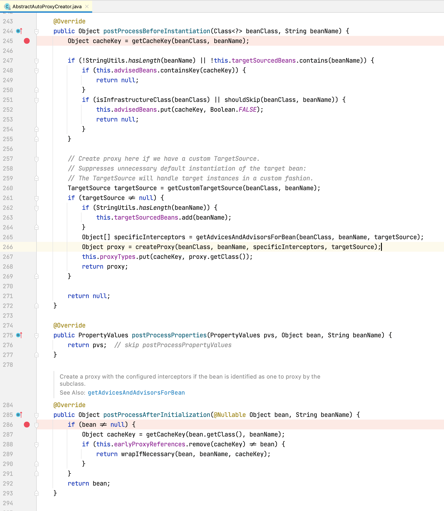

## AOP代理创建过程

我们以debug的方式启动前面的AOP例子，因为后置处理器对所有Bean都生效，所以每个Bean创建时都会进入我们刚刚打断点的那两个方法中。但我们只关心Spring AOP是怎样增强我们定义的目标类TargetClass的，所以如果Bean类型不是TargetClass，我们都直接点击Resume Program按钮跳过，直到Bean类型是TargetClass：

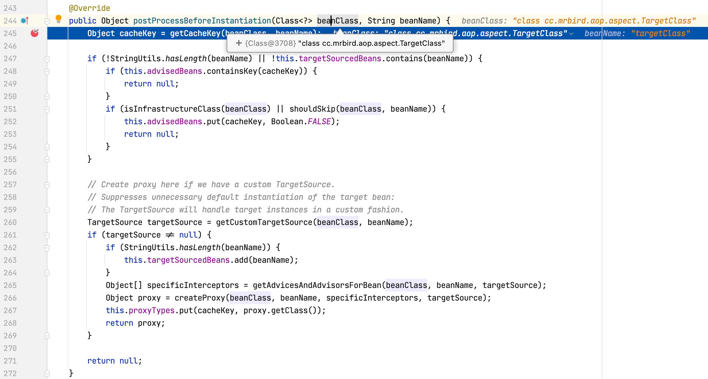

postProcessBeforeInstantiation方法主要包含以下几个核心步骤：

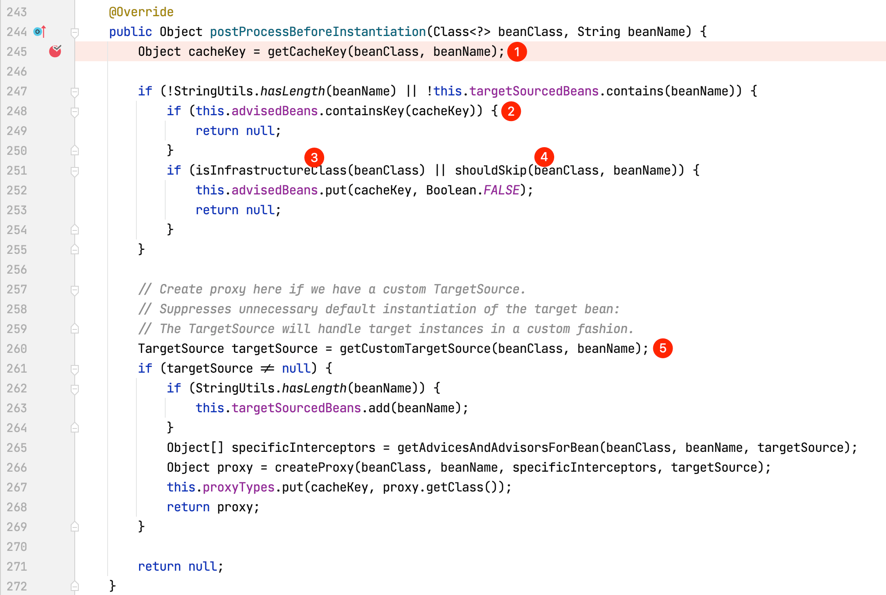

通过Bean名称和Bean类型获取该Bean的唯一缓存键名，getCacheKey方法源码如下所示：

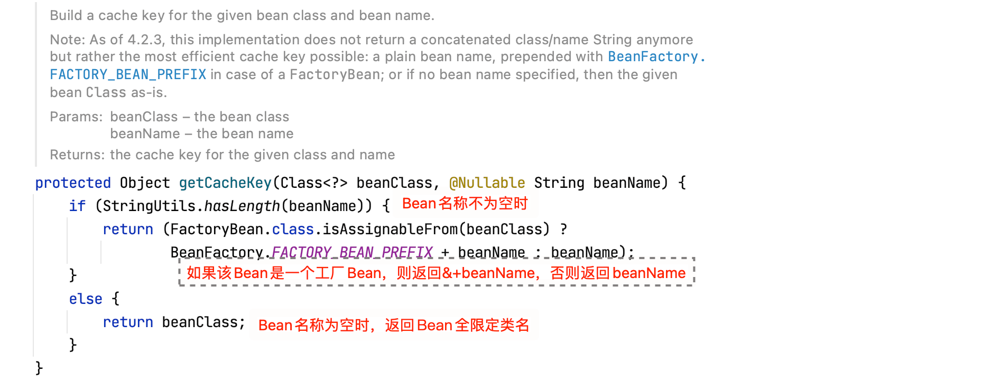

1. 在这里，cacheKey的值为targetClass。
2. 判断当前Bean（TargetClass）是否包含在advisedBeans集合中（AbstractAutoProxyCreator的成员变量`private final Map<Object, Boolean> advisedBeans = new ConcurrentHashMap<>(256)`，用于存放所有Bean是否需要增强标识，键为每个Bean的cacheKey，值为布尔类型，true表示需要增强，false表示不需要增强），此时TargetClass还未实例化，所以自然不在该集合中。
3. 判断当前Bean（TargetClass）是否是基础类，查看isInfrastructureClass方法源码：

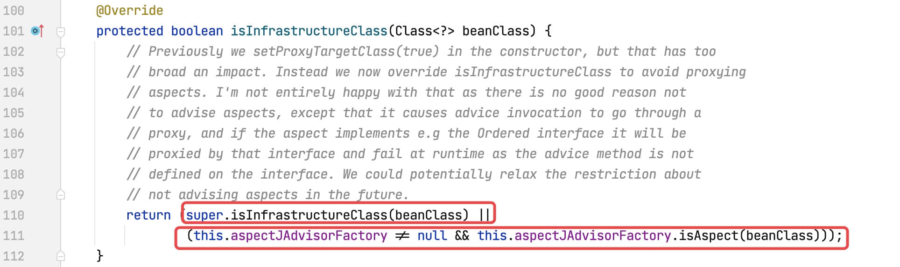

方法调用了父类的isInfrastructureClass方法：

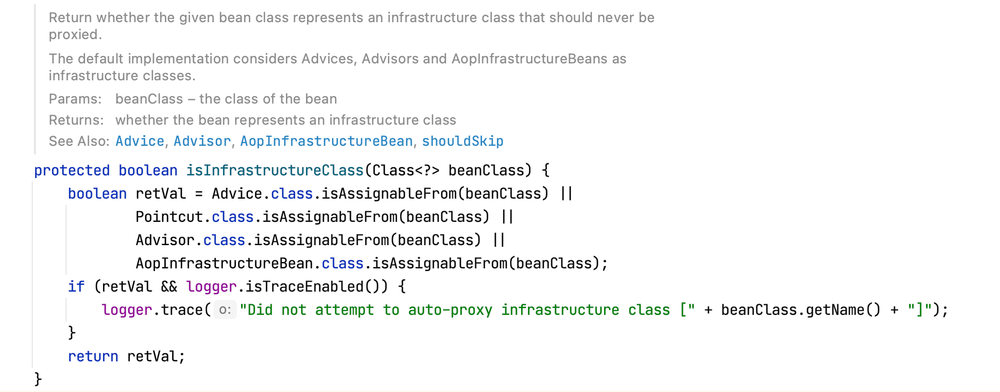

this.aspectJAdvisorFactory.isAspect方法源码如下所示：

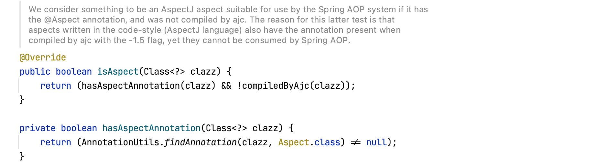

所以这一步逻辑为：判断当前Bean（TargetClass）是否是Advice，Pointcut，Advisor，AopInfrastructureBean的子类或者是否为切面类（@Aspect注解标注）。

4. 判断是否需要跳过：

shouldSkip源码如下所示：

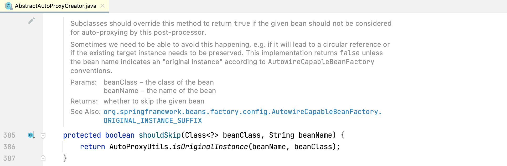

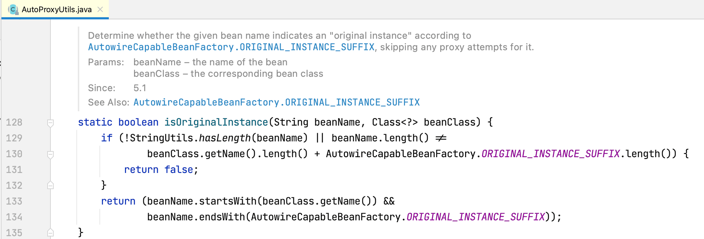

通过Bean名称判断是否以AutowireCapableBeanFactory.ORIGINAL_INSTANCE_SUFFIX（.ORIGINAL）结尾，是的话返回true表示跳过代理。

很明显我们的TargetClass不符合3和4，所以继续走第5步。

5. 如果我们自定义了TargetSource，则在此处创建Bean代理，以取代目标Bean的后续默认实例化方式。我们并没有自定义TargetSource，所以直接跳过。

经过以上这些步骤，就TargetClass这个Bean而言，postProcessBeforeInstantiation方法最终返回null。Bean实例化前置处理到此完毕，点击Resume Program，继续Bean的后续生命周期处理逻辑，程序跳转到Bean初始化后置处理方法postProcessAfterInitialization：

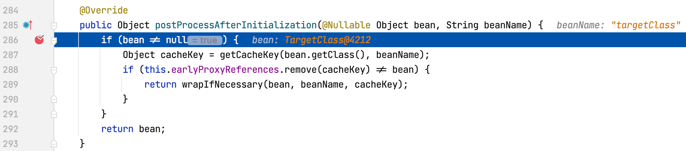

该方法重点关注wrapIfNecessary方法，查看wrapIfNecessary方法源码：

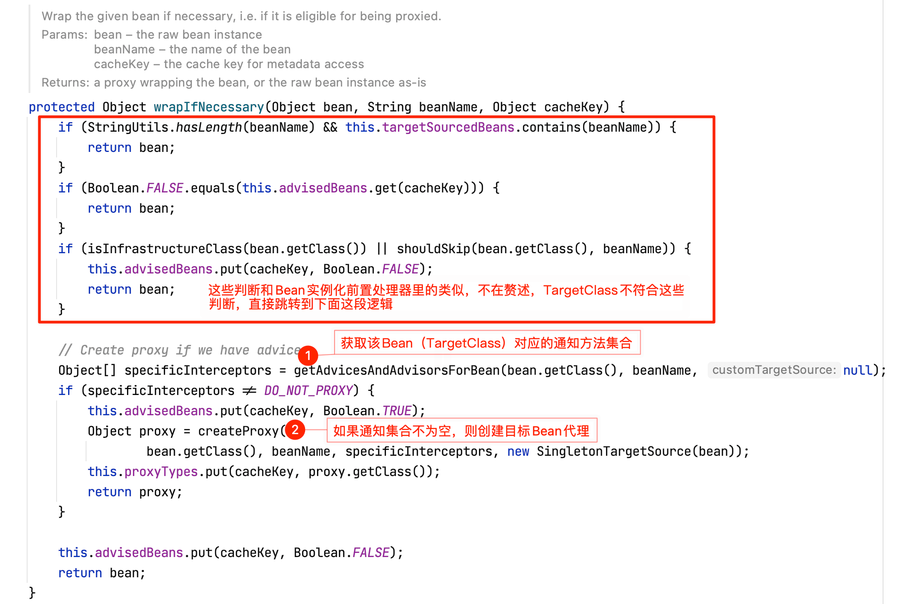

1. getAdvicesAndAdvisorsForBean 方法内部主要包含以下这些逻辑（有兴趣自己debug查看具体判断逻辑实现，这里不再贴图，只做总结）：

- 获取所有的通知方法（切面里定义的各个方法）；
- 通过切点表达式判断这些通知方法是否可为当前Bean所用；
- 如果有符合的通知方法，则对它们进行排序（排序规则不同版本Spring有所不同，上面已经提及过）。

在前面的AOP例子中，切面MyAspect里的通知方法就是为了增强TargetClass所设的（根据切点表达式）。

2. 如果该Bean的通知方法集合不为空的话，则创建该Bean的代理对象，具体查看createProxy方法源码：

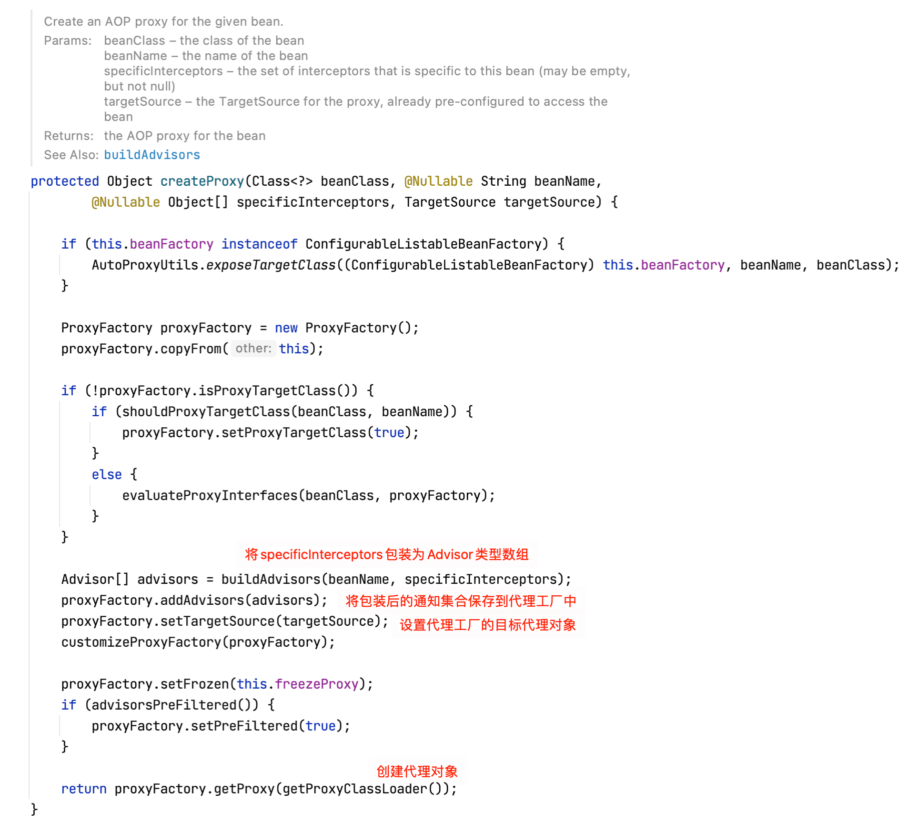

继续跟踪proxyFactory.getProxy(getProxyClassLoader())源码：

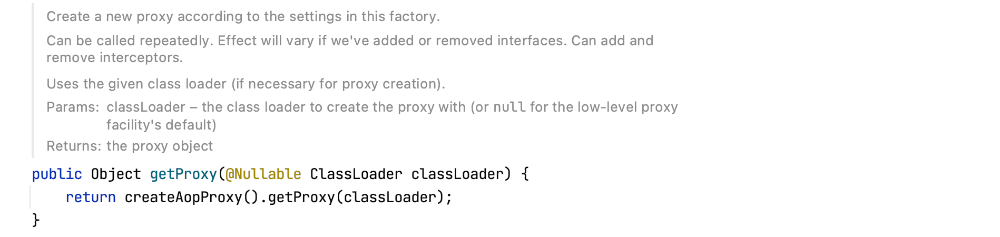

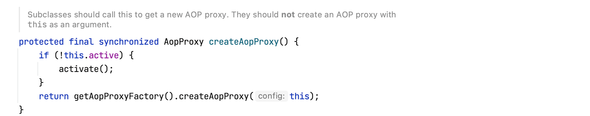

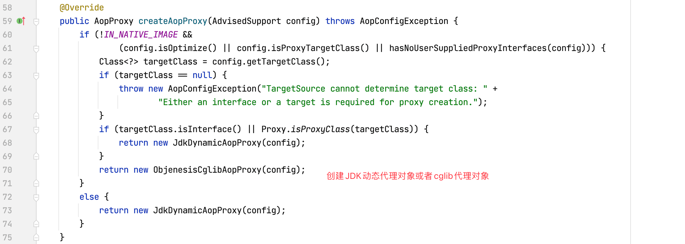

Spring会判断当前使用哪种代理对象（一般来说当Bean有实现接口时，使用JDK动态代理，当Bean没有实现接口时，使用cglib代理，在Boot中，我们可以通过`spring.aop.proxy-target-class=true`配置来强制使用cglib代理）。

通过Bean初始化后置代理方法postProcessBeforeInstantiation处理后，TargetClass被包装为了cglib代理的增强Bean，注册到IOC容器中。

## 生成拦截器链MethodInterceptor

未完待续…
