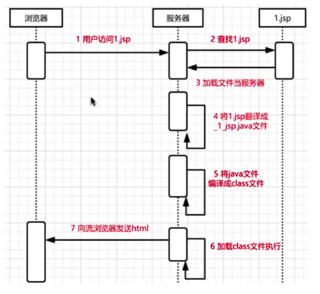
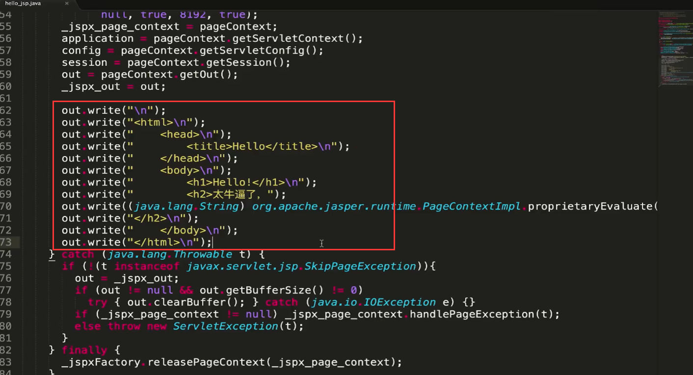
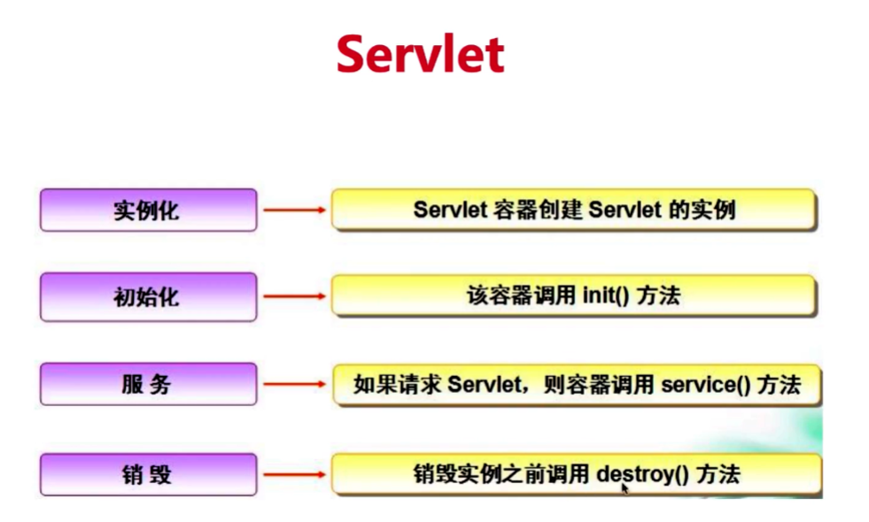

## JSP运行原理

1. 客户端通过浏览器向服务器发出请求，在该请求中包含了请求的资源的路径，这样当服务器接收到该请求后就可以知道被请求的内容。
2. 服务器根据接收到的客户端的请求来加载相应的JSP文件。
3. Web服务器中的JSP引擎会将被加载的JSP文件转化为Servlet文件(.java)。
4. JSP引擎将生成的Servlet代码编译成Class文件。
5. 服务器执行这个Class文件。
6. 最后服务器将执行结果发送给浏览器进行显示。

## Servlet 的生命周期

在Servlet中，init 方法只会在容器启动时执行一次。

在使用Servlet编写业务代码时，无论是按照页面分，还是业务区分，都无法避免Servlet和web.xml过多的问题。而且这种结构还不利于团队开发。

Spring MVC 仅通过DispatherServlet 进行请求派发，通过以下三点减少Servlet的数量：

- 拦截所有请求
- 解析请求
- 派发给对应的Controller里面的方法进行处理

## Spring的作用域

- singleton：在spring IOC容器中仅存在一个Bean实例,Bean以单实例的方式存在。

- prototype：每次从容器中调用Bean时,都返回一个新的实例,即每次调用getBean()时,相当于执行new XxxBean()的操作。

- request：每次HTTP请求都会创建一个新的Bean,该作用域仅适用于webApplicationContext环境。

- session：同一个HTTP session共享一个Bean,不同HTTP session使用不同的Bean,该作用域仅适用于webApplicationContext环境。

- globalsession：同一个全局session共享一个Bean,一般用于portlet应用环境,该作用域仅适用于webApplicationContext环境。

