## 事务例子回顾

新建SpringBoot项目，Boot版本2.4.0，然后引入如下依赖：

```xml
<dependencies>
    <dependency>
        <groupId>org.springframework.boot</groupId>
        <artifactId>spring-boot-starter</artifactId>
    </dependency>
    <dependency>
        <groupId>org.springframework.boot</groupId>
        <artifactId>spring-boot-starter-jdbc</artifactId>
    </dependency>
    <dependency>
        <groupId>mysql</groupId>
        <artifactId>mysql-connector-java</artifactId>
    </dependency>
    <dependency>
        <groupId>org.mybatis.spring.boot</groupId>
        <artifactId>mybatis-spring-boot-starter</artifactId>
        <version>2.1.2</version>
    </dependency>
</dependencies>
```


引入了JDBC、MySQL驱动和mybatis等依赖。

然后在Spring入口类上加上`@EnableTransactionManagement`注解，以开启事务：

```java
@EnableTransactionManagement
@SpringBootApplication
public class TransactionApplication {

    public static void main(String[] args) throws Exception {
        SpringApplication.run(TransactionApplication.class, args);
    }
}
```

接着新建名称为test的MySQL数据库，并创建USER表：

```sql
CREATE TABLE `USER` (
  `USER_ID` varchar(10) NOT NULL COMMENT '用户ID',
  `USERNAME` varchar(10) DEFAULT NULL COMMENT '用户名',
  `AGE` varchar(3) DEFAULT NULL COMMENT '用户年龄',
  PRIMARY KEY (`USER_ID`)
) ENGINE=InnoDB DEFAULT CHARSET=utf8;
```

其中USER_ID字段非空。

在application.properties配置中添加数据库相关配置：

```properties
spring.datasource.driver-class-name=com.mysql.cj.jdbc.Driver
spring.datasource.username=root
spring.datasource.password=root
spring.datasource.url=jdbc:mysql://127.0.0.1:3306/test?useUnicode=true&characterEncoding=UTF-8&useJDBCCompliantTimezoneShift=true&useLegacyDatetimeCode=false&serverTimezone=GMT%2b8
```

创建USER表对应实体类User：

```java
@Getter@Setter
public class User implements Serializable {

    private String userId;
    private String username;
    private String age;

    public User(String userId, String username, String age) {
        this.userId = userId;
        this.username = username;
        this.age = age;
    }

    public User() {
    }
}
```

创建UserMapper：

```java
@Mapper
public interface UserMapper {

    @Insert("insert into user(user_id,username,age) values(#{userId},#{username},#{age})")
    void save(User user);
}
```

包含一个新增用户的方法save。

创建Service接口UserService：

```java
public interface UserService {

    void saveUser(User user);

}
```

其实现类UserServiceImpl：

```java
@Service
public class UserServiceImpl implements UserService {

    private final UserMapper userMapper;

    public UserServiceImpl(UserMapper userMapper) {
        this.userMapper = userMapper;
    }

    @Transactional
    @Override
    public void saveUser(User user) {
        userMapper.save(user);
        // 测试事务回滚
        if (!StringUtils.hasText(user.getUsername())) {
            throw new RuntimeException("username不能为空");
        }
    }
}
```

在SpringBoot的入口类中测试一波：

```java
@EnableTransactionManagement
@SpringBootApplication
public class TransactionApplication {

    public static void main(String[] args) {
        ConfigurableApplicationContext context = SpringApplication.run(TransactionApplication.class, args);
        UserService userService = context.getBean(UserService.class);
        User user = new User("1", null, "18");
        userService.saveUser(user);
    }
}
```

如果事务生效的话，这条数据将不会被插入到数据库中，运行程序后，查看库表：

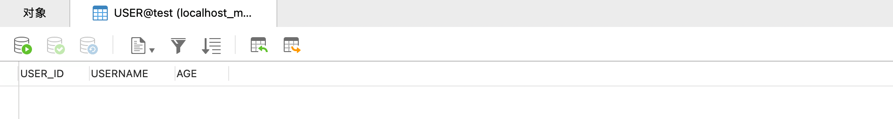

可以看到数据并没有被插入，说明事务控制成功。

我们注释掉UserServiceImpl的saveUser方法上的`@Transactional`注解，重新运行程序，查看库表：

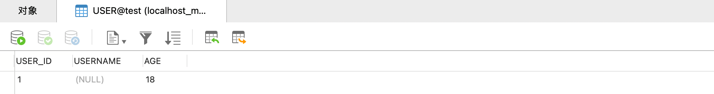

可以看到数据被插入到数据库中了，事务控制失效。

## 事务原理

### @EnableTransactionManagement

上面例子中，我们通过模块驱动注解`@EnableTransactionManagement`开启了事务管理功能，查看其源码：

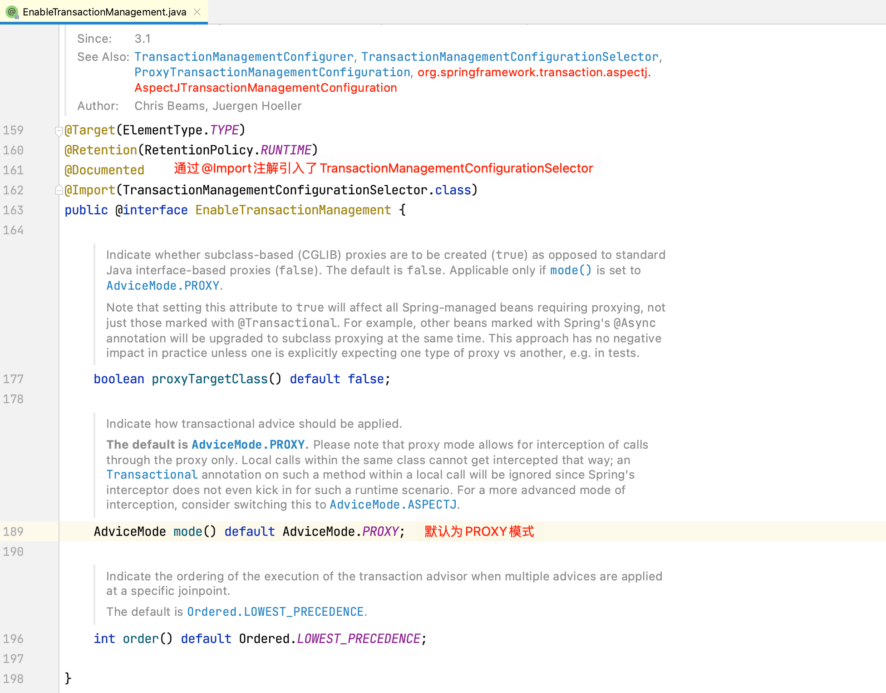

接着查看TransactionManagementConfigurationSelector的源码：

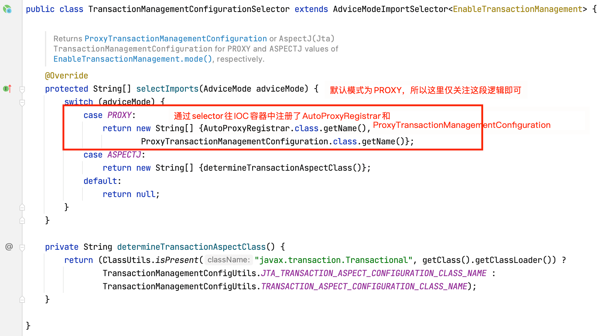

接下来我们重点关注AutoProxyRegistrar和ProxyTransactionManagementConfiguration的逻辑即可。

### AutoProxyRegistrar

查看AutoProxyRegistrar的源码：

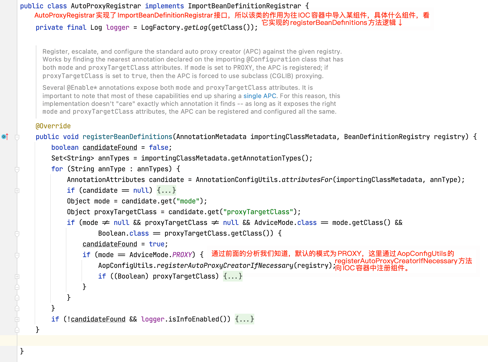

查看`AopConfigUtils.registerAutoProxyCreatorIfNecessary(registry)`源码：

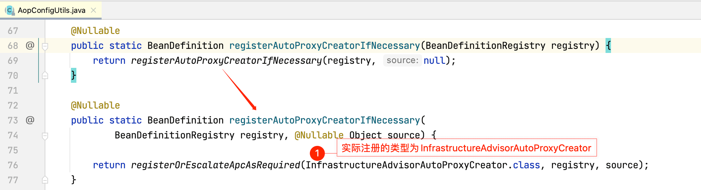

查看`InfrastructureAdvisorAutoProxyCreator`的层级关系图：

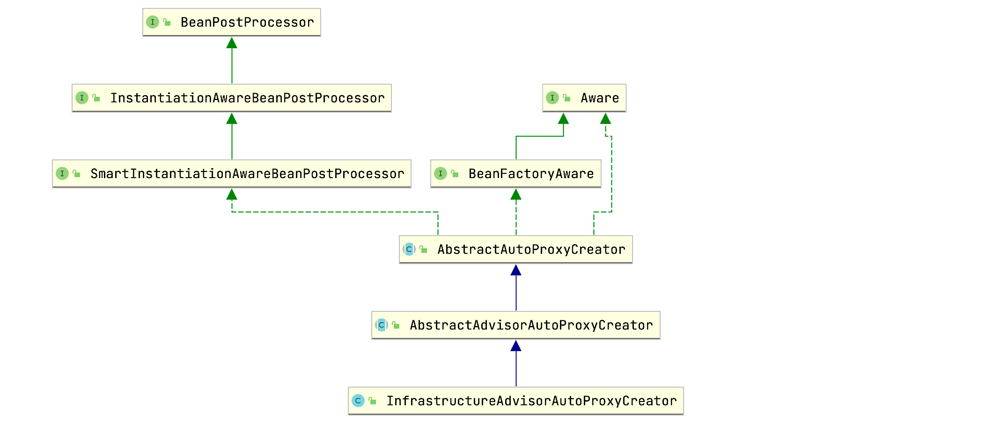

这和[深入理解Spring-AOP原理](https://mrbird.cc/深入理解Spring-AOP原理.html)一文中的AnnotationAwareAspectJAutoProxyCreator的层级关系图一致，所以我们可以推断出InfrastructureAdvisorAutoProxyCreator的作用为：为目标Service创建代理对象，增强目标Service方法，用于事务控制。

### ProxyTransactionManagementConfiguration

查看ProxyTransactionManagementConfiguration源码：

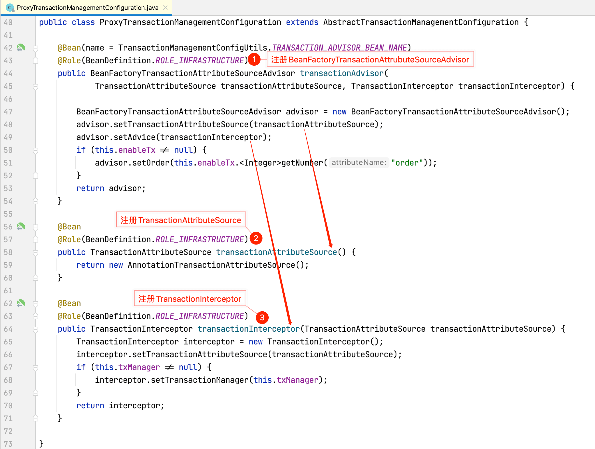

1. 注册BeanFactoryTransactionAttributeSourceAdvisor增强器，该增强器需要如下两个Bean：
   - TransactionAttributeSource
   - TransactionInterceptor
2. 注册TransactionAttributeSource：

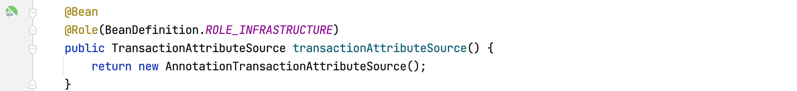

方法体内部创建了一个类型为AnnotationTransactionAttributeSource的Bean，查看其源码：

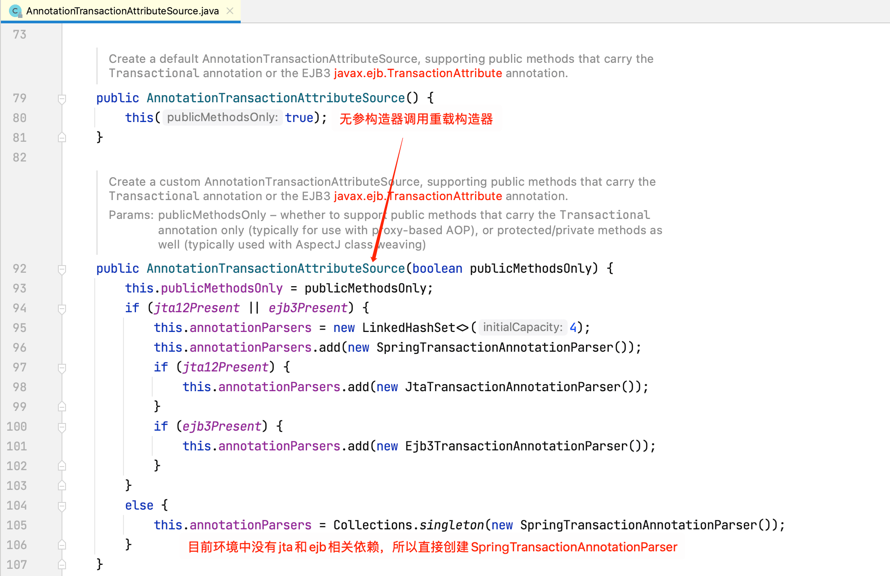

查看SpringTransactionAnnotationParser源码：

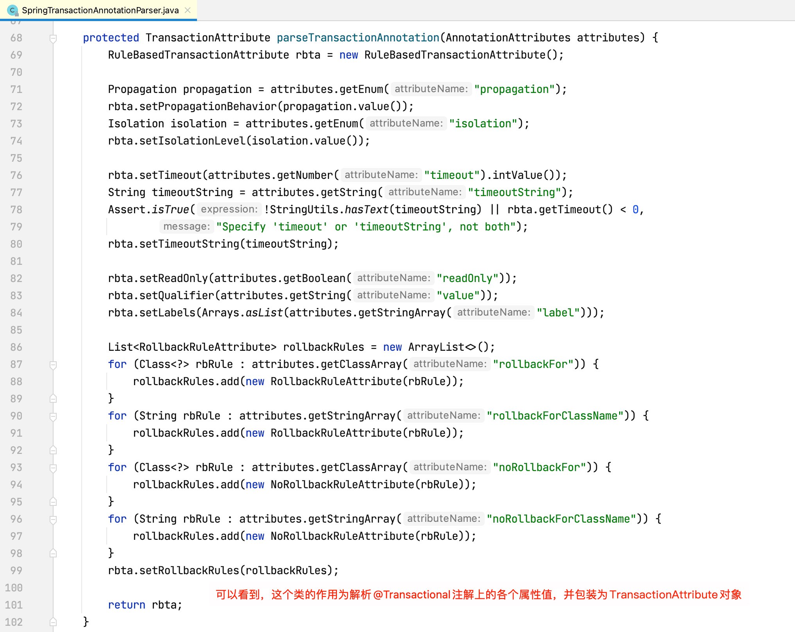

注册TransactionInterceptor事务拦截器：

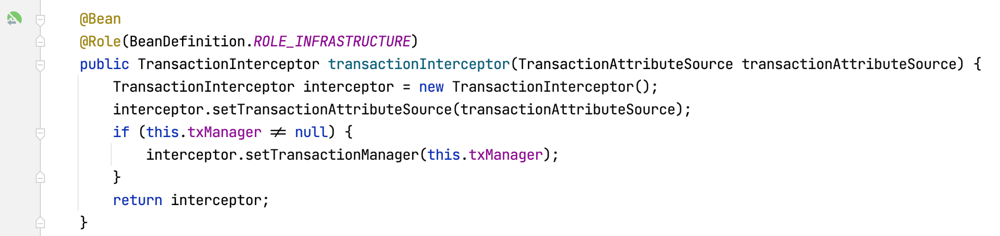

查看TransactionInterceptor源码，其实现了MethodInterceptor方法拦截器接口，在深入理解Spring-AOP原理一文中曾介绍过，MethodBeforeAdviceInterceptor、AspectJAfterAdvice、AfterReturningAdviceInterceptor和AspectJAfterThrowingAdvice等增强器都是MethodInterceptor的实现类，目标方法执行的时候，对应拦截器的invoke方法会被执行，所以重点关注TransactionInterceptor实现的invoke方法：
